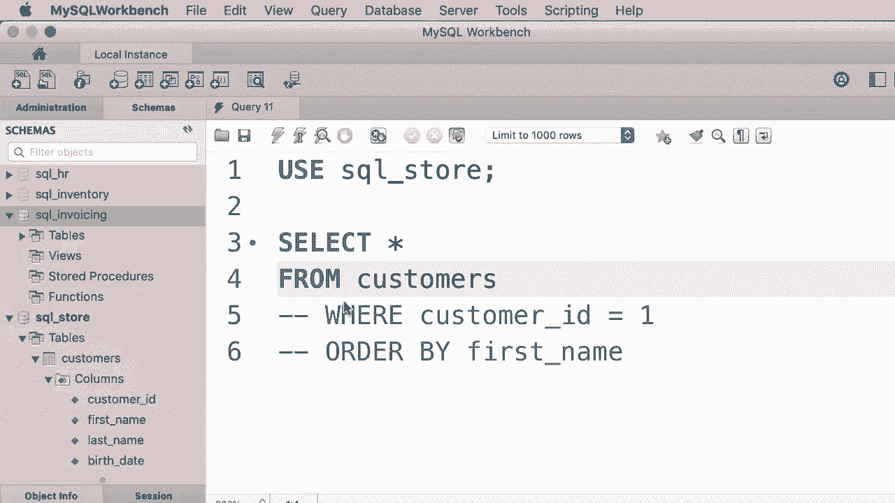

# SQL常用知识点合辑——P7：L7- SELECT 语句 📖


在本教程中，我们将学习如何从数据库的单个表中检索数据。这是使用SQL进行数据操作的基础。

## 概述

本节课我们将要学习SELECT语句的基本用法，包括如何选择数据库、编写查询语句，以及使用SELECT、FROM、WHERE和ORDER BY等核心子句来获取和整理数据。

## 选择数据库

编写查询的第一步是选择一个目标数据库。在导航面板中，未被选中的数据库会以批量方式显示。我们需要先指定查询将在哪个数据库上执行。

在这个演示中，我们将使用名为“SQL在线商店”的数据库。我们可以使用`USE`语句来选择它。

```sql
USE sql_store;
```

`USE`是SQL中的一个关键字。SQL语言不区分大小写，但最佳实践是将SQL关键字大写，其他内容小写。

执行上述查询后，“SQL在线商店”数据库就会被选中。在工作区中，你也可以通过双击数据库名称来快速选择它。

## 编写第一个SELECT查询

选择了数据库后，我们就可以编写查询来检索数据了。最基本的查询是使用`SELECT`语句从表中获取所有数据。

以下是`SELECT`语句的基本结构：

```sql
SELECT *
FROM customers;
```

在这个例子中：
*   `SELECT`子句指定要检索的列。`*`代表所有列。
*   `FROM`子句指定要查询的表，这里是`customers`表。

当有多个SQL语句时，需要用分号`;`终止每个语句，否则会引发语法错误。

## 使用其他子句过滤和排序

`SELECT`语句除了`SELECT`和`FROM`子句，还可以使用`WHERE`和`ORDER BY`等子句来进一步控制结果。

### WHERE子句

`WHERE`子句用于过滤数据，只返回满足指定条件的记录。

例如，以下查询只获取`customer_id`为1的客户：

```sql
SELECT *
FROM customers
WHERE customer_id = 1;
```

### ORDER BY子句

`ORDER BY`子句用于对结果集进行排序。

例如，以下查询获取所有客户，并按照他们的`first_name`进行排序：

```sql
SELECT *
FROM customers
ORDER BY first_name;
```

如果同时使用`WHERE`和`ORDER BY`，`WHERE`子句必须写在`ORDER BY`子句之前。

## 子句的可选性与顺序

需要理解的重要概念是：
*   `FROM`、`WHERE`和`ORDER BY`子句都是可选的。一个最简单的`SELECT`语句可以只包含`SELECT`子句，例如`SELECT 1, 2;`，它会返回两列固定值。
*   这些子句的顺序是固定的，不能随意更改。必须遵循 `SELECT` -> `FROM` -> `WHERE` -> `ORDER BY` 的顺序。改变顺序会导致语法错误。

## 代码格式

SQL会忽略语句中的换行、空格和制表符。因此，你可以将所有代码写在一行：

```sql
SELECT * FROM customers;
```

但对于复杂的查询，为了提高可读性，建议将每个子句放在新的一行上。

## 总结



本节课我们一起学习了`SELECT`语句的基础知识。我们掌握了如何选择数据库，以及使用`SELECT`、`FROM`、`WHERE`和`ORDER BY`子句从表中检索、过滤和排序数据。记住子句的顺序（`SELECT` -> `FROM` -> `WHERE` -> `ORDER BY`）和良好的代码格式对于编写清晰、正确的SQL语句至关重要。在接下来的教程中，我们将更详细地探讨每个子句。


