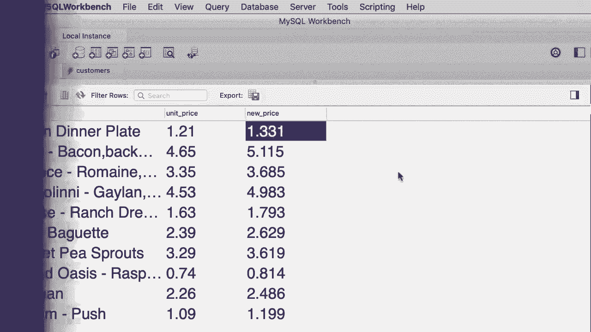

# SQL常用知识点合辑——P8：L8- SELECT 用法 🎯

在本教程中，我们将详细学习 `SELECT` 子句的用法。我们将学习如何选择特定列、使用算术表达式、为列设置别名以及如何去除重复的结果。

## 概述

在本节课中，我们将要学习 `SELECT` 语句的核心功能，包括如何精确选择数据列、进行数学计算、重命名输出列以及确保结果集的唯一性。掌握这些是编写高效、清晰SQL查询的基础。

## 选择特定列

在上一个教程中，你学到了使用星号（`*`）可以返回所有列。然而，在实际查询中，明确指定所需的列是更佳实践。当表包含许多列或大量数据时，只选择必要的列可以减轻数据库服务器和网络的负担。

以下是选择特定列的方法：

*   **选择名字和姓氏**：`SELECT first_name, last_name FROM customers;`
*   **改变列的顺序**：`SELECT last_name, first_name FROM customers;`

通过明确指定列名，我们可以控制返回数据的列及其顺序。

## 使用算术表达式

在 `SELECT` 子句中，我们可以使用算术表达式对列值进行计算。这在生成衍生数据（如计算折扣、税费或增长率）时非常有用。

以下是算术表达式的示例：

*   **加法**：`SELECT points, points + 10 FROM customers;`
*   **复杂运算**：`SELECT points, points * 10 + 100 FROM customers;`

运算符的优先级遵循数学规则：乘法和除法优先于加法和减法。我们可以使用括号 `()` 来改变运算顺序或提高代码可读性。

## 为列设置别名

默认情况下，使用表达式生成的列名可能难以理解。我们可以使用 `AS` 关键字为列设置一个更具描述性的别名。

以下是设置别名的示例：

*   **基本别名**：`SELECT points * 10 + 100 AS discount_factor FROM customers;`
*   **别名包含空格**：`SELECT points * 10 + 100 AS “discount factor” FROM customers;`

给列起一个清晰的别名，能让查询结果更易于理解。

## 去除重复结果（DISTINCT）

有时，查询结果中可能包含重复的行。如果我们只关心唯一的值，可以使用 `DISTINCT` 关键字来去除重复项。

以下是使用 `DISTINCT` 的示例：

*   **获取唯一的州列表**：`SELECT DISTINCT state FROM customers;`

`DISTINCT` 关键字会应用于 `SELECT` 子句中指定的所有列，确保返回的组合结果是唯一的。

## 练习与解决方案

现在，让我们通过一个练习来巩固所学知识。

**练习**：编写一个SQL查询，返回数据库中所有产品的名称、单价以及一个名为“新价格”的列。新价格的计算方式是将单价提高10%（即单价乘以1.1）。

以下是解决方案：

```sql
SELECT
    name,
    unit_price,
    unit_price * 1.1 AS “new price”
FROM products;
```


这个查询从 `products` 表中选择三列，并通过算术表达式计算出涨价10%后的新价格，同时为其设置了清晰的别名。

## 总结

本节课中，我们一起学习了 `SELECT` 子句的几个核心用法：

1.  **选择特定列**：通过指定列名而非使用 `*`，可以编写更高效、目标明确的查询。
2.  **使用算术表达式**：可以在查询中直接对数据进行数学计算，生成新的数据列。
3.  **设置列别名**：使用 `AS` 关键字可以为列或表达式结果赋予易于理解的名称。
4.  **确保结果唯一性**：使用 `DISTINCT` 关键字可以过滤掉查询结果中的重复行。



熟练掌握这些技巧，将帮助你构建出更强大、更灵活的SQL查询。