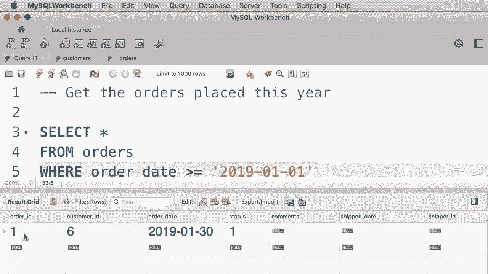

# SQL常用知识点合辑——P9：L9- WHERE 子句用法 🔍


在本教程中，我们将学习SQL中的`WHERE`子句。`WHERE`子句用于过滤数据，它允许我们从数据库表中筛选出满足特定条件的记录。

## 概述

本节课我们将要学习`WHERE`子句的基本语法和用法，包括如何使用比较运算符来过滤数值、文本和日期类型的数据。通过具体的例子，你将掌握如何编写条件查询来获取所需的数据子集。

## `WHERE`子句的基本语法

`WHERE`子句跟在`SELECT`语句的`FROM`子句之后，其基本结构如下：
```sql
SELECT 列名
FROM 表名
WHERE 条件;
```
当执行带有`WHERE`子句的查询时，数据库引擎会遍历表中的每一行记录，并评估`WHERE`后面指定的条件。只有当条件为真时，该行才会被包含在最终的结果集中。

## 比较运算符

`WHERE`子句中的条件通常使用比较运算符来构建。SQL提供了一系列标准的比较运算符。

以下是SQL中常用的比较运算符列表：
*   **大于**： `>`
*   **大于等于**： `>=`
*   **小于**： `<`
*   **小于等于**： `<=`
*   **等于**： `=`
*   **不等于**： `!=` 或 `<>`

## 运算符使用示例

上一节我们介绍了比较运算符，本节中我们来看看如何在实际查询中应用它们。

### 1. 过滤数值数据

假设我们有一个`customers`（客户）表，其中包含一个`points`（积分）列。要获取积分大于3000的客户，查询语句如下：
```sql
SELECT *
FROM customers
WHERE points > 3000;
```
执行此查询，将只返回积分大于3000的客户记录。

### 2. 过滤文本数据

如果想获取位于“Virginia”（弗吉尼亚州）的客户，我们需要处理文本数据。在SQL中，文本字符串（一串字符）需要用引号括起来。
```sql
SELECT *
FROM customers
WHERE state = ‘VA’;
```
**注意**：字符串值必须用单引号（`‘’`）或双引号（`“”`）包裹，通常习惯使用单引号。SQL对字符串的大小写不敏感，因此`‘VA’`和`‘va’`是等效的。

如果要获取所有不在弗吉尼亚州的客户，可以使用不等于运算符：
```sql
SELECT *
FROM customers
WHERE state != ‘VA’;
-- 或者
SELECT *
FROM customers
WHERE state <> ‘VA’;
```

### 3. 过滤日期数据

比较运算符同样适用于日期。假设我们想获取在1990年1月1日之后出生的客户，`birth_date`是日期类型的列。
```sql
SELECT *
FROM customers
WHERE birth_date > ‘1990-01-01’;
```
**注意**：在SQL语句中书写日期值时，也需要用引号包裹。日期的标准格式通常是`‘YYYY-MM-DD’`（年-月-日）。

## 练习与实践

在学习了`WHERE`子句和比较运算符后，让我们通过一个练习来巩固知识。

以下是本次的练习任务：请编写一个查询，从`orders`（订单）表中获取今年（以2019年为例）下的所有订单。订单表包含一个`order_date`（订单日期）列。

一种解决方案是：
```sql
SELECT *
FROM orders
WHERE order_date >= ‘2019-01-01’;
```
执行这个查询，将返回所有订单日期在2019年1月1日及之后的订单。需要注意的是，这个查询的日期是硬编码的，明年它将不再返回“今年”的订单。在后续课程中，我们会学习如何动态地获取当前年份的订单。




## 总结


本节课中我们一起学习了SQL `WHERE`子句的核心用法。我们了解到`WHERE`子句用于过滤数据，并通过实例掌握了如何使用`>`、`>=`、`<`、`<=`、`=`、`!=`和`<>`这些比较运算符来筛选数值、文本和日期类型的字段。记住，处理文本和日期时，必须用引号将值括起来。在下一教程中，我们将学习如何组合多个条件来进行更复杂的数据过滤。