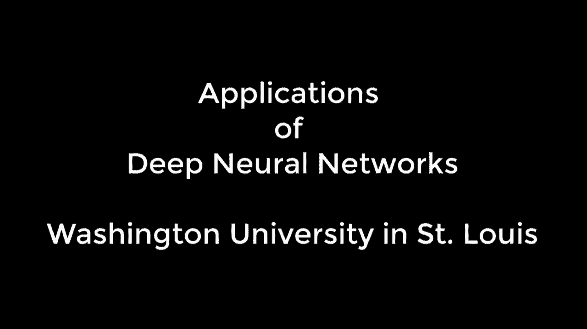
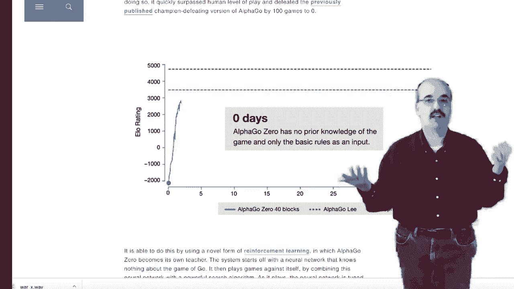
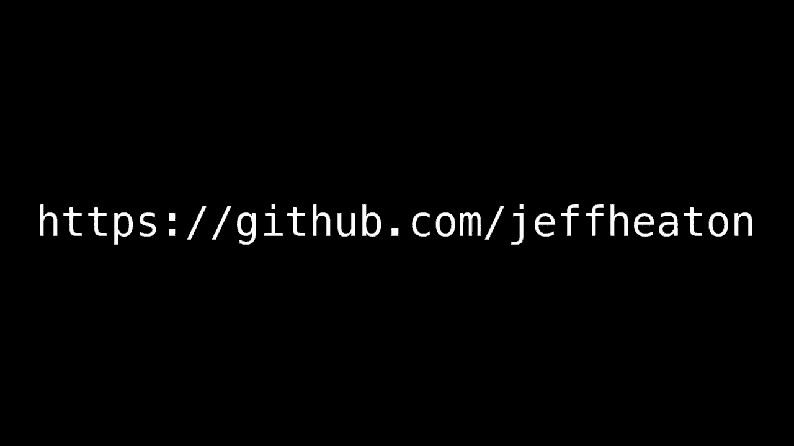

# T81-558 ｜ 深度神经网络应用-P1：Python、Keras与TensorFlow深度学习课程概述 🧠

在本节课中，我们将要学习深度神经网络的基本概念及其广泛的应用领域。深度神经网络是一种强大的技术，能够处理多种格式的输入数据，并输出相应的决策或同类型的数据。

## 深度神经网络的通用性

深度神经网络之所以强大，是因为它们可以接受几乎任何格式的输入，包括**表格数据**、**图像**、**文本**，甚至**音频**。它们通过一系列数学运算处理这些信息，最终输出决策、评分，或者与输入类型相同的数据。

## 课程教学方式

本课程中的所有内容都通过 **Python 的 Jupyter Notebooks** 进行教授。这种方式允许你将代码与课程信息交织在一起，并在运行程序时实时查看结果。

某些涉及视频游戏的应用需要在 Jupyter Notebook 外部直接从 Python 运行。课程内容确保与 **Google Colab** 兼容，这意味着你可以使用免费的 GPU 资源来运行代码，这能显著节省模型训练时间。

## 核心神经网络类型与应用

上一节我们介绍了课程的教学方式，本节中我们来看看本课程将涵盖的一些核心神经网络类型及其应用。

### 生成对抗网络

**生成对抗网络** 是我们在这门课程中要研究的一种重要神经网络。**GAN** 通常用于生成逼真的图像，例如人脸，尽管它们可以生成任何类型的合成数据。

一个 GAN 通过两个神经网络协同工作：
*   **生成器**：其本质是将随机数字（噪声）生成为目标数据（如面孔）。公式可表示为：`G(z) -> x_fake`，其中 `z` 是随机噪声，`x_fake` 是生成的数据。
*   **判别器**：其本质是判断输入数据是真实的还是生成器生成的假数据。公式可表示为：`D(x) -> probability(x is real)`。

这两个网络交替训练，进行一场“对抗性”的竞争。训练完成后，生成器就能持续接收不同的随机输入并生成相当逼真的数据。

### 强化学习

**强化学习**，特别是与深度学习结合时，是一种非常强大的技术。它使得如 Google AlphaZero 这样的程序能在短时间内掌握国际象棋等复杂游戏。

在本课程中，我们将利用 **OpenAI Gym** 环境来查看 Atari 视频游戏，并创建能够通过观察游戏画面（视频图像）来学习如何玩这些游戏的智能体。就像训练宠物一样，当你使用强化学习时，你会为神经网络提供**奖励信号**，以鼓励其产生有利的行为或结果。

### 多模态输入与图像描述

还记得我们说神经网络可以接受任何类型的输入吗？它们实际上可以**同时接受多种类型的输入**。图像描述（Image Captioning）就是这样一个应用。

为了创建一个能够为图像编写标题的神经网络，你需要构建一个能接受两种输入的模型：一个是**图像**，另一个是代表单词序列的**文本**。模型从一个起始标记和空序列开始，逐步输出描述该图像的词汇。

### 实时目标检测

**YOLO** 是一项高效的实时目标检测技术。它的核心思想是“只看一次”，就能在图像中同时定位和分类多个对象。

我们将学习如何将这项技术集成到你的 Python 程序中，从而获取图像中物体的实际**坐标**和**类别**信息。

## 课程涵盖主题列表

以上只是本课程的部分亮点。以下是我们将要覆盖的一些其他主题的完整列表：

*   卷积神经网络在图像识别中的应用。
*   循环神经网络与长短期记忆网络处理序列数据。
*   自然语言处理基础，如词嵌入与情感分析。
*   神经网络的部署与优化实践。

## 总结与资源

本节课中，我们一起学习了深度神经网络的通用性、本课程基于 Jupyter Notebook 和 Google Colab 的实践教学方式，并概述了生成对抗网络、强化学习、多模态学习及目标检测等核心应用主题。

所有课程资料、代码和更新信息都可以在相关的播放列表和 GitHub 仓库中找到。如果你对这门课程有任何问题，欢迎提出。