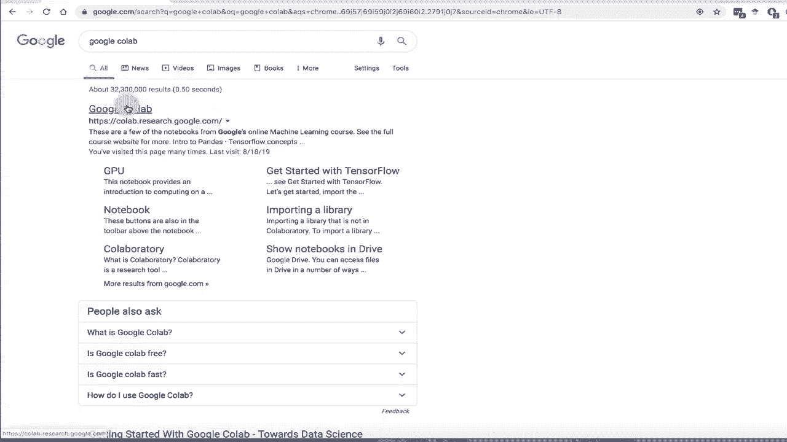
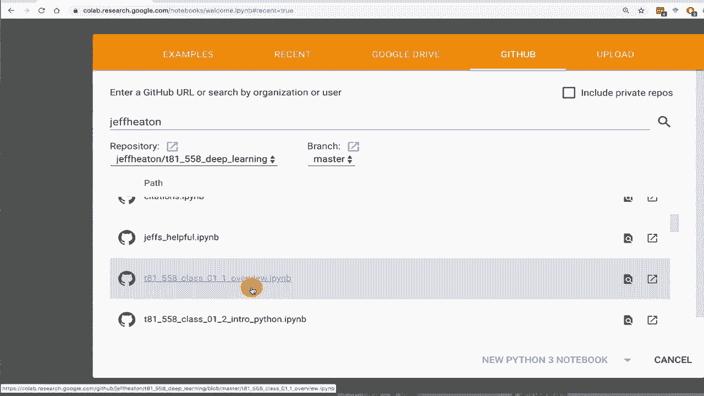
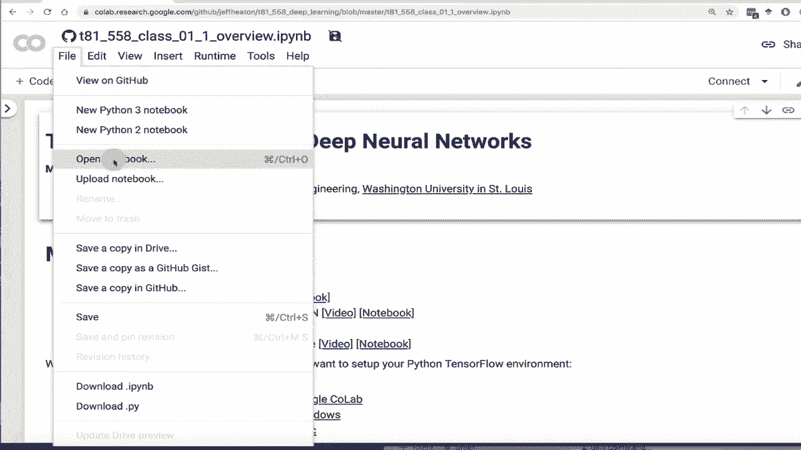
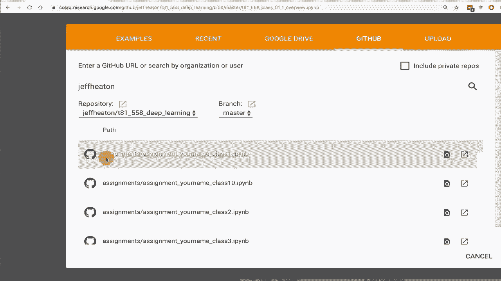
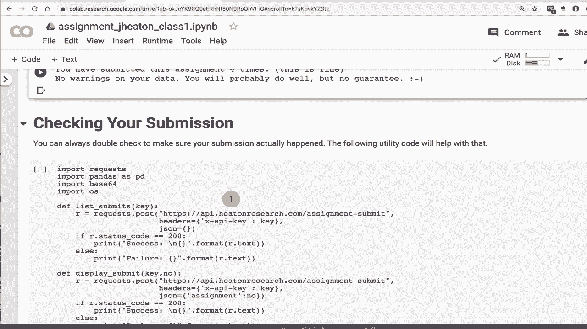

# T81-558 ｜ 深度神经网络应用 - P10：使用 Google Colab 🚀

在本节课中，我们将学习如何使用 Google Colab 来运行本课程的代码模块并提交作业。Google Colab 是一个基于云的免费 Jupyter 笔记本环境，特别适合深度学习和数据科学项目，因为它提供了免费的 GPU 资源。

## 概述


Google Colab 是本课程推荐的运行环境之一。它允许你在云端直接运行 Python 代码，无需在本地安装复杂的软件和库。本教程将引导你完成访问课程材料、设置 GPU 加速以及提交作业的完整流程。

## 访问 Google Colab

首先，你需要访问 Google Colab。建议在搜索引擎中直接搜索 “Google Colab” 进入其官网。你也可以在课程网站上找到相关链接。



进入 Google Colab 后，你会看到自己的笔记本列表。所有你使用过的笔记本都会存储在 Google Drive 的 “Colab Notebooks” 目录中。

## 获取课程笔记本

上一节我们介绍了如何访问 Colab，本节中我们来看看如何获取本课程的第一个模块笔记本。

以下是具体步骤：

1.  在 Colab 界面中，点击 “文件” -> “打开笔记本”。
2.  在弹出的窗口中，选择 “GitHub” 选项卡。
3.  在搜索框中输入我的 GitHub 用户名：`Jeff Heaton`。
4.  在显示的代码库列表中，找到名为 `t81_558_deep_learning` 的仓库，这是本课程的代码库。
5.  在仓库中，找到并打开第一个模块的第一个课程笔记本（例如 `1_intro_python.ipynb`）。

首次连接 GitHub 时，Colab 可能会请求 API 访问授权。请务必授权，以确保能正常访问课程材料。



打开笔记本后，它尚未保存到你的 Google Drive。为了后续使用和提交作业，你需要将其复制到自己的 Drive 中。

以下是保存副本的步骤：

1.  点击 “文件” -> “在云端硬盘中保存副本”。
2.  副本将自动保存到你的 Google Drive 的 “Colab Notebooks” 文件夹中。
3.  建议将副本重命名，例如加上你的姓名和作业编号，以便于识别。

## 配置运行时环境

笔记本成功保存后，接下来我们需要配置运行时环境，特别是启用 GPU 加速以提升代码运行速度。

在 Colab 中，点击顶部菜单栏的 “运行时” -> “更改运行时类型”。在弹出的对话框中，将 “硬件加速器” 从 “无” 更改为 **`GPU`**，然后点击 “保存”。





更改后，你可以运行以下代码来验证 TensorFlow 版本和 GPU 是否可用：

```python
import tensorflow as tf
print(f"TensorFlow 版本: {tf.__version__}")
print(f"GPU 可用: {tf.config.list_physical_devices('GPU')}")
```

请注意，Colab 提供的 TensorFlow 版本可能不是最新的（例如可能是 1.x 版本）。本课程的代码已确保与 Colab 环境兼容。如果遇到不兼容的情况（少于10%），课程中会给出相应说明。

## 提交作业流程

现在我们已经知道如何获取和运行课程材料，本节将重点介绍如何使用 Colab 完成并提交作业。

每个作业都是一个独立的 Jupyter 笔记本。你需要像获取课程笔记本一样，从课程 GitHub 仓库中找到对应的作业文件（通常以 `assignment` 开头），并将其保存副本到你的 Google Drive。

为了在 Colab 中访问 Google Drive 中的文件以及提交作业，你需要先运行一个特定的代码单元来挂载 Google Drive 并设置提交功能。

以下是关键步骤：

1.  在作业笔记本中，找到并运行用于挂载 Google Drive 的代码单元。这通常涉及一个授权流程，你需要点击生成的链接，登录 Google 账户并复制授权码到笔记本中。
2.  挂载成功后，你的 Drive 文件将位于 `/content/drive/MyDrive/` 路径下。
3.  接下来，找到并运行设置提交功能的代码单元。该功能由课程提供，用于将你的作业结果发送到评分系统。
4.  在提交前，**务必修改提交代码单元中的笔记本文件名**，将其改为你当前作业副本的实际文件名（例如 `your_name_assignment_1.ipynb`）。

一个常见的提交代码结构如下，你需要修改 `file_path` 变量：

```python
# 示例：修改文件路径为你自己的作业文件名
file_path = "/content/drive/MyDrive/Colab Notebooks/your_name_assignment_1.ipynb"
submit_assignment(file_path, student_key="YOUR_STUDENT_KEY")
```

5.  运行提交单元。如果成功，你将看到“提交成功”的确认信息。
6.  提交后，你可以运行提供的“检查提交状态”代码来确认作业已被系统接收。

**重要提示**：
*   **API密钥**：你需要使用课程分发的个人 API 密钥（`student_key`）进行提交。视频中演示的密钥仅为示例。
*   **截止日期**：作业有严格的每周截止日期，迟交会导致扣分甚至零分。
*   **警告信息**：提交后若系统返回任何警告或错误信息，请务必根据提示进行修复，否则可能影响成绩。
*   **结果差异**：自动评分系统可能会指出你的结果与预期有微小数值差异（如 0.01），这通常是可接受的，但最终成绩以教师批改为准。

## 总结

本节课中我们一起学习了如何利用 Google Colab 进行深度神经网络课程的学习和实践。我们涵盖了从访问平台、获取课程笔记本、配置 GPU 运行时环境，到完成并提交作业的完整工作流程。



使用 Colab 的优势在于其开箱即用的环境和对免费 GPU 资源的支持，这能让你更专注于学习本身，而无需纠结于本地环境的复杂配置。请确保遵循作业提交的步骤和注意事项，按时完成每周的学习任务。