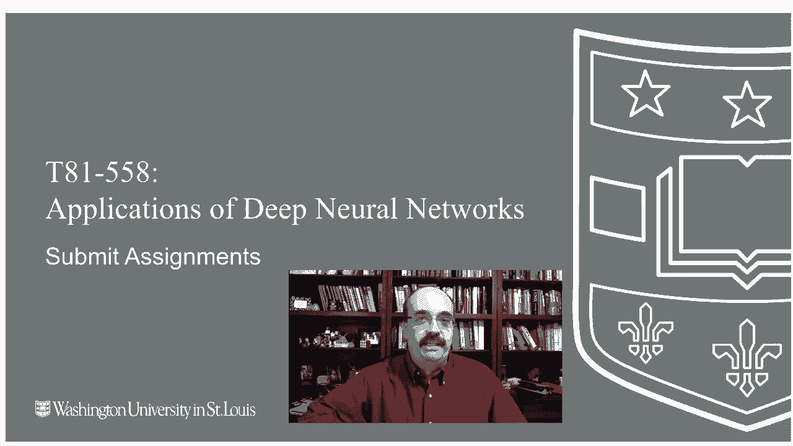
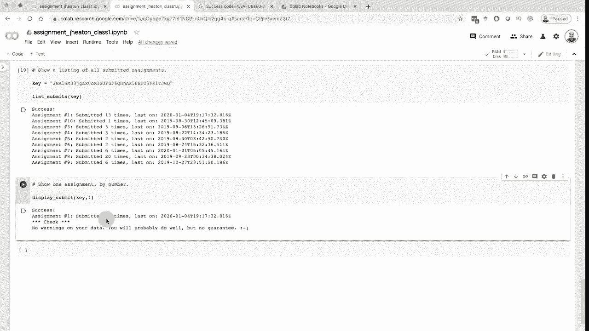
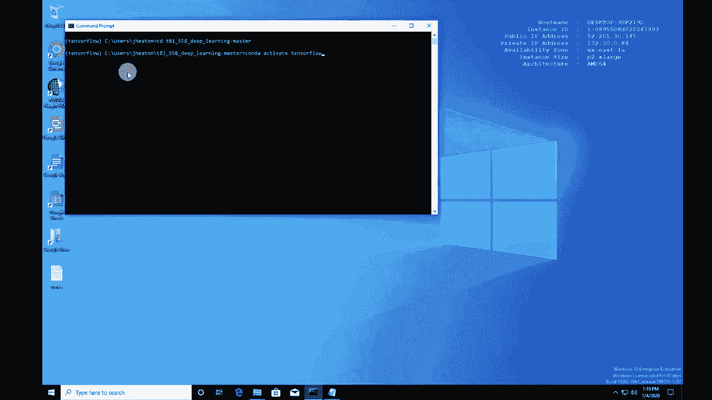
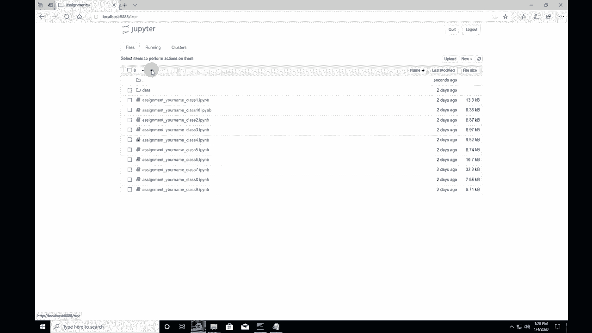
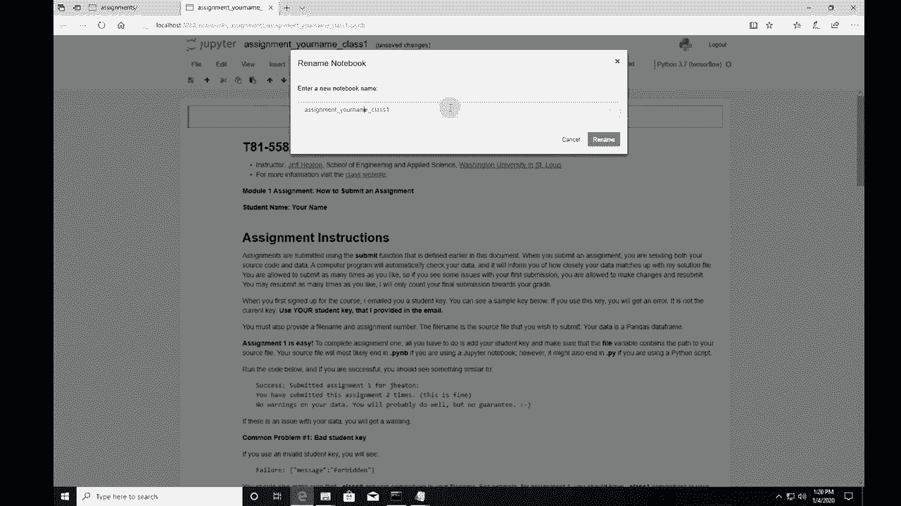
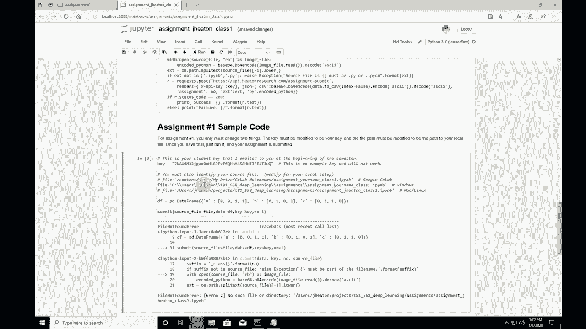
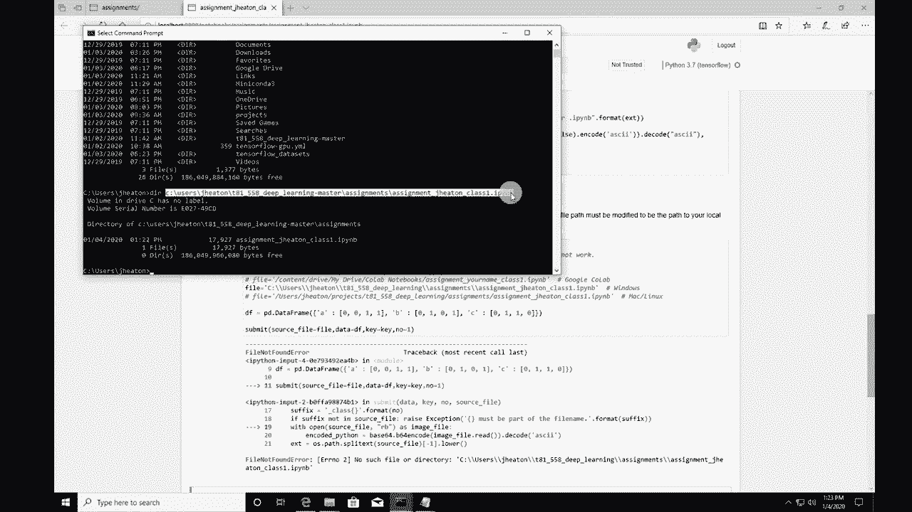
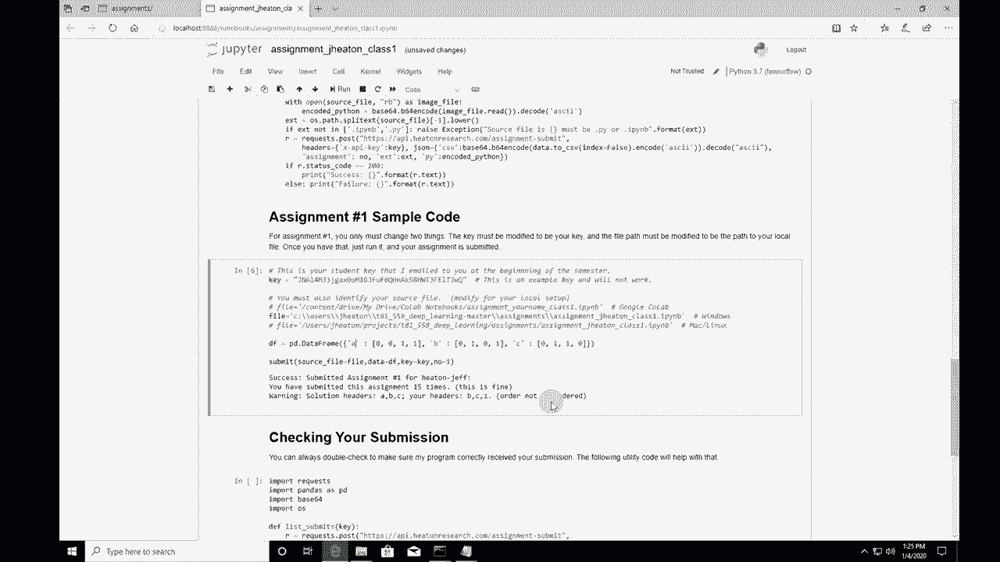

# T81-558 ｜ 深度神经网络应用 - P11：[教程] 如何提交深度学习应用作业 📤

在本节课中，我们将学习如何为《深度神经网络应用》课程提交作业。课程包含10个模块作业，你需要通过提交Python代码来展示对每个模块内容的理解。提交后，一个自动检查程序会运行并提供反馈，让你有机会在最终评分前修正错误。

## 概述

提交作业的核心是使用一个API。华盛顿大学的注册学生会收到专属的API密钥。非在校学生也可以通过特定渠道获取使用自动检查功能的权限。我们将重点介绍两种主要的提交方式：在Google Colab环境中提交和在本地Windows环境中提交。



---

## 获取与准备API密钥 🔑

上一节我们介绍了作业提交的基本流程，本节中我们来看看如何获取和使用你的身份凭证——API密钥。

*   华盛顿大学的注册学生应从课程讲师Jeff Heaton处获取API密钥。通常会在课程开始前一周通过邮件发送。
*   非华盛顿大学的学生，可以访问讲师YouTube频道简介页面的Patreon链接，在相应层级获取使用自动评分服务的权限。

**请妥善保管你的API密钥，它用于在提交作业时识别你的身份。**

---

## 方法一：在Google Colab中提交作业 💻

现在，让我们看看最常用的提交方式——通过Google Colab。这是一种在云端运行代码的便捷方法。

### 1. 打开并复制作业笔记本

首先，你需要访问课程的GitHub仓库，找到对应的作业（例如作业1）。每个作业笔记本都包含一个“在Colab中打开”的链接。

以下是操作步骤：
1.  点击链接，在Google Colab中打开作业笔记本。
2.  在Colab界面，选择“文件” -> “在云端硬盘中保存一份副本”。
3.  将副本重命名，建议包含你的姓名以便识别，例如 `作业1_你的姓名.ipynb`。
4.  **重要**：保存后，请确认Google云端硬盘中的文件名已更新。有时同步会有延迟，可以等待几分钟或重新保存。

### 2. 设置Colab环境

在笔记本中，你需要运行初始设置代码来连接Colab和你的Google云端硬盘。

```python
# 这段代码将挂载你的Google Drive到Colab环境
from google.colab import drive
drive.mount('/content/drive')
```
运行此单元格后，系统会提示你授权访问，点击“允许”即可。这个过程在学期中可能需要重复多次。

### 3. 填写API密钥并提交

在作业笔记本的指定位置，填入你的API密钥。

```python
# 在此处填入你的API密钥
API_KEY = "你的_API_密钥_字符串"
```
然后，找到提交作业的代码单元格。你需要确保提交的文件路径与你在云端硬盘中保存的笔记本文件名**完全一致**。

```python
# 示例：提交作业的函数调用
submit(API_KEY, "/content/drive/MyDrive/Colab Notebooks/作业1_你的姓名.ipynb")
```
运行提交单元格。系统会将你的作业发送到评分服务器并进行自动检查。你会立即收到反馈，指出是否存在问题（如数据列名错误）。

**核心提示**：你可以多次提交，直到作业完美无误。最终成绩将以最后一次成功提交为准。

---

## 方法二：在本地Windows环境中提交作业 🖥️

上一节我们介绍了在Colab中提交的流程，本节中我们来看看如何在本地Windows电脑上完成提交。

### 1. 准备本地环境

确保你已在本地激活了适合的运行环境（例如TensorFlow环境），并通过Jupyter Notebook打开了作业文件。

### 2. 修改并运行提交代码

在本地运行作业笔记本时，需要忽略或删除专为Colab设计的代码（例如`drive.mount`）。直接找到定义`submit`函数和填写API密钥的部分。

你需要修改文件路径，使其指向你本地机器上的作业文件。



```python
# 在Windows系统中，文件路径可能如下所示：
submit(API_KEY, r"C:\Users\你的用户名\T81-558\assignments\assignment1_你的姓名.ipynb")
```
**注意**：在Windows路径字符串前加 `r` 可以避免反斜杠`\`被误解析。务必逐级检查路径中的每个文件夹和文件名是否正确。

### 3. 执行提交

运行包含`submit`函数的单元格。与Colab方式类似，作业会被发送并接受自动检查。请根据返回的警告信息调整你的代码。

---





## 常见问题与检查 ✅



无论采用哪种提交方式，都可能遇到一些常见问题。以下是排查步骤：

1.  **文件未找到错误**：检查提交代码中的文件路径是否与文件的实际位置和名称**完全匹配**。在Colab中可以使用`!ls`命令列出目录内容来确认。
2.  **无成绩反馈**：提交后，自动检查器会给出“数据无警告”或具体错误提示。但这**不是**最终成绩。最终成绩将由讲师或自动化流程录入Canvas系统。
3.  **延迟提交**：务必在截止日期前提交。逾期提交可能会被扣分，超过一周可能记为零分。
4.  **查看提交历史**：你可以使用课程提供的特定代码（通常在作业1中），配合你的API密钥查询所有作业的提交状态和历史警告。

---





## 成绩发布与后续 📬

本节课中我们一起学习了两种提交作业的方法。最后，我们来了解一下提交后的流程。

*   自动检查器提供即时反馈，帮助修正错误。
*   最终的官方成绩会发布在华盛顿大学的Canvas学习管理系统（仅限在校生访问）。
*   讲师通常会定期运行自动化脚本，将检查无误的作业成绩录入Canvas。
*   如果自动检查无法判断或你需要代码审查，可以联系讲师。
*   课程会陆续发布官方解决方案，并在线上会议中进行讨论。

---

## 总结



本节课中，我们详细讲解了为《深度神经网络应用》课程提交作业的完整流程。关键步骤包括：获取API密钥、在Google Colab或本地环境中准备和运行作业笔记本、正确填写密钥与文件路径、以及理解自动检查与最终成绩的关系。请务必注意截止日期，并善用多次提交的机会完善作业。

如果在提交过程中遇到任何问题，请及时联系课程讲师。祝你学习顺利！