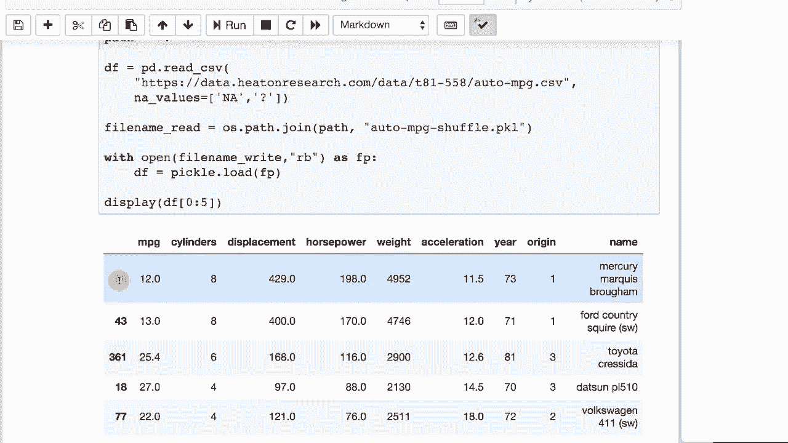

# T81-558 ｜ 深度神经网络应用 - P12：L2.1- 深度学习数据处理工具库Pandas 简介 📊

## 概述
在本节课中，我们将学习一个名为Pandas的Python库，它是处理表格数据（类似于Excel表格）的强大工具。这对于准备输入到神经网络的传统数据集至关重要。


## 表格数据与神经网络
神经网络可以接收多种数据进行预测。一种常见的数据类型是表格数据，这在许多传统数据科学问题和Kaggle竞赛中都很常见。本课程后续会涉及图像、音频和文本处理，但在处理传统数据集时，我们将使用Pandas。

## 读取CSV文件
Pandas对于处理可分为列的数据集非常有用。以下是如何使用Pandas读取CSV文件。

```python
import pandas as pd
df = pd.read_csv('your_file.csv')
print(df.head())
```
我们也可以使用`display`函数来获得更美观的打印输出。

## 数据的基本统计信息
Pandas可以方便地计算数据的基本统计信息，如均值、方差和标准差。

```python
df.describe()
```
上述代码会输出每个数值字段的统计摘要。为了使其更易读，我们可以手动提取并格式化这些信息。

以下是构建一个包含统计信息的字典列表的示例：
```python
fields = []
for column in df.columns:
    if df[column].dtype in ['int64', 'float64']: # 仅处理数值列
        field_info = {
            'name': column,
            'mean': df[column].mean(),
            'variance': df[column].var(),
            'std': df[column].std()
        }
        fields.append(field_info)
```
这个列表的结构类似于数据库表格，也可以直接转换回Pandas DataFrame。

## 处理缺失值
现实中的数据很少是完美的，经常存在缺失值。Pandas提供了处理缺失值的方法。

```python
# 识别缺失值
df.isna().sum()

# 用中位数填充缺失值（中位数对异常值不敏感）
median_value = df['column_name'].median()
df['column_name'].fillna(median_value, inplace=True)

# 或者，直接删除包含缺失值的行
df.dropna(inplace=True)
```

## 处理异常值
异常值是偏离数据集整体模式的极端值。一种常见的处理方法是基于标准差来识别和删除它们。

```python
# 定义异常值（例如，偏离均值2个标准差以上）
mean = df['column_name'].mean()
std = df['column_name'].std()
cut_off = std * 2

# 标记要删除的行
lower, upper = mean - cut_off, mean + cut_off
to_drop = df[(df['column_name'] < lower) | (df['column_name'] > upper)].index

# 删除这些行
df.drop(to_drop, inplace=True, axis=0) # axis=0 表示按行删除
```

## 数据选择与操作
上一节我们介绍了数据清洗，本节中我们来看看如何选择和操作DataFrame中的特定部分。

### 删除列
从DataFrame中删除列非常简单。
```python
df.drop('column_name', axis=1, inplace=True)
```

### 连接列
我们可以将不同的列组合起来创建新的DataFrame，这在特征工程中很有用。
```python
new_df = pd.concat([df['name'], df['horsepower']], axis=1)
print(new_df.head())
```

### 连接行
我们也可以按行连接DataFrame。
```python
first_two = df[0:2]
last_two = df[-2:]
combined = pd.concat([first_two, last_two], axis=0)
```

## 分割训练集与验证集
在机器学习中，通常需要将数据分割为训练集和验证集。

```python
# 创建一个随机掩码，选择80%的数据作为训练集
mask = np.random.rand(len(df)) < 0.8
train = df[mask]
validate = df[~mask] # ~ 取反，得到另外20%的数据

print(f"训练集大小: {len(train)}")
print(f"验证集大小: {len(validate)}")
```

## 转换为NumPy数组
神经网络库（如Keras）通常需要NumPy数组作为输入，而不是Pandas DataFrame。

```python
# 转换整个DataFrame
numpy_matrix = df.values

# 或只转换特定列
features = df[['mpg', 'cylinders', 'horsepower']].values
```
注意，非数值列（如文本）需要单独处理。

## 保存数据
处理完数据后，可以将其保存下来以供后续使用或提交。

### 保存为CSV文件
```python
df.to_csv('processed_data.csv', index=False) # index=False避免保存行索引
```

### 保存为Pickle文件
Pickle是一种二进制格式，可以更精确地保存DataFrame的完整状态和元数据。
```python
df.to_pickle('processed_data.pkl')
# 重新加载
df_loaded = pd.read_pickle('processed_data.pkl')
```
CSV是通用文本格式，而Pickle能保留更多信息（如混乱后的索引），但它是Python特有的。



## 总结
本节课我们一起学习了Pandas库的基础知识。我们了解了如何读取CSV文件、查看数据统计信息、处理缺失值与异常值、进行数据选择和分割，以及如何将数据转换为适合神经网络的格式并保存。掌握Pandas是进行有效数据预处理的关键步骤，为后续构建和训练深度学习模型奠定了坚实的基础。在接下来的模块中，我们将探索Pandas更高级的功能。