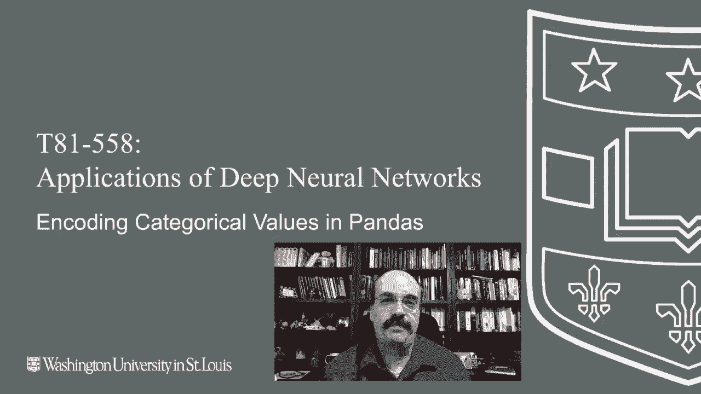
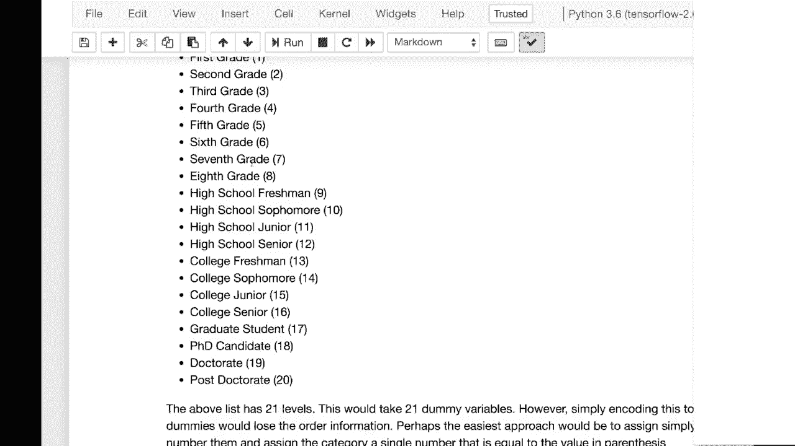

# T81-558 ｜ 深度神经网络应用-P13：L2.2- 使用Pandas为Keras编码类别型数据 📊

在本节课中，我们将学习如何处理和编码数据集中的类别型数据，以便将其输入到神经网络中。我们将探讨连续值的标准化方法，以及针对类别型数据的多种编码技术，包括虚拟变量、目标编码和序数编码。



---

## 数据类型概述 🔍

在开始编码之前，我们首先需要理解常见的数据类型。通常，数据可以分为以下四类：

*   **名义型**：纯粹的分类值，没有特定顺序。例如：颜色（红色、绿色、蓝色）。
*   **序数型**：可以排序的分类值。例如：教育水平（小学、中学、大学）。
*   **区间型**：数值型数据，但没有绝对的零点。例如：温度（摄氏度或华氏度）。
*   **比率型**：数值型数据，有绝对的零点。例如：速度（公里/小时）、年龄。

对于神经网络而言，我们需要将所有数据转换为数值格式。接下来，我们先看看如何处理连续值。

---

## 连续值的标准化：Z分数 📏

上一节我们介绍了数据类型，本节中我们来看看如何对连续数值进行预处理。标准化连续值有时是必要的，因为它能消除不同特征在量纲和范围上的差异，有助于神经网络更高效地学习。

Z分数是一种常见的标准化方法。其公式为：
`Z = (X - μ) / σ`
其中，`X`是原始值，`μ`是均值，`σ`是标准差。Z分数为0表示该值等于均值，-1表示低于均值一个标准差，+1表示高于均值一个标准差。

使用Z分数有以下好处：
*   使数据分布以0为中心，尺度统一。
*   在一定程度上保护数据隐私，因为原始值被转换后不易直接解读。
*   有助于提升某些神经网络的训练效果。

---

## 类别型数据编码方法 🧩

处理完连续值后，我们面临的主要挑战是如何将文本或类别型数据转换为数字。以下是几种核心方法。

### 虚拟变量编码

虚拟变量编码是最经典的方法。其核心思想是为每个类别创建一个新的二进制列（0或1）。

例如，对于一个“区域”列，包含A、B、C、D四个类别。编码后会生成四个新列：“区域_A”、“区域_B”、“区域_C”、“区域_D”。如果某一行数据属于区域B，则“区域_B”列为1，其余为0。

在Pandas中，可以使用 `pd.get_dummies()` 函数轻松实现：
```python
df_encoded = pd.get_dummies(df, columns=[‘区域‘])
```

### 目标编码

目标编码是一种更高级的技术，它使用目标变量的均值来代表每个类别。这种方法在表格数据竞赛中很有效，但需谨慎使用，因为它容易导致过拟合。

其基本步骤是：
1.  计算每个类别对应的目标变量的平均值。
2.  用这个平均值替换该类别下的所有值。

例如，在预测收入的数据中，“职业”为“工程师”的所有样本的平均收入是75000，那么所有“工程师”都会被编码为75000。

**风险**：如果某个类别样本很少（如只有1个“老虎”），其目标均值可能完全由单个样本决定，导致编码信息“泄露”了目标信息，造成严重的过拟合。

**缓解方法**：引入平滑处理。平滑后的编码值由类别内均值与整体目标均值加权得到，样本数少的类别会更倾向于整体均值。公式可表示为：
`平滑编码 = (n * 类别均值 + α * 整体均值) / (n + α)`
其中 `n` 是该类别的样本数，`α` 是控制平滑强度的权重参数。

### 序数编码

如果类别本身具有内在的顺序（序数型数据），则可以使用序数编码。这种方法为每个类别分配一个有序的整数。

例如，教育水平可以编码为：
*   幼儿园：0
*   小学：1
*   中学：2
*   本科：3
*   硕士：4
*   博士：5

与虚拟变量相比，序数编码只用一列数字就保留了顺序信息，更为简洁。在Pandas中，可以手动创建映射字典或使用 `sklearn.preprocessing.OrdinalEncoder`。

---

## 总结 📝

本节课中我们一起学习了为神经网络准备数据的关键步骤，特别是针对类别型数据的编码。



*   我们首先了解了数据的四种基本类型：名义型、序数型、区间型和比率型。
*   对于连续值，我们介绍了使用**Z分数**进行标准化的方法及其优势。
*   对于类别值，我们探讨了三种主要编码技术：
    *   **虚拟变量编码**：简单直接，为每个类别创建二进制列。
    *   **目标编码**：使用目标变量均值进行编码，威力强大但需警惕过拟合，可通过平滑技术缓解。
    *   **序数编码**：适用于有顺序的类别，用单个有序整数列表示，高效且保留顺序信息。

选择正确的编码方式取决于数据的性质、具体任务以及过拟合的风险。在下一节课中，我们将学习如何使用Pandas进行更多的数据预处理操作，例如数据的分组、排序和随机打乱。