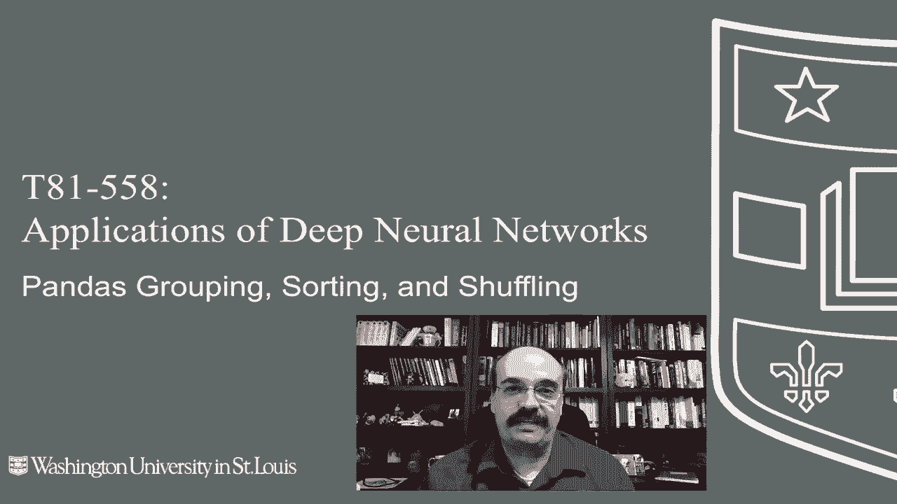
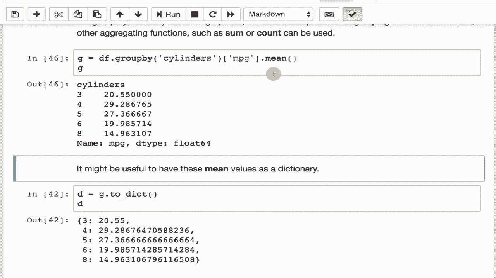

# T81-558 ｜ 深度神经网络应用-P14：L2.3- Python Pandas 中的数据分组、排序和改组 📊

在本节课中，我们将学习如何在 Pandas 中对数据集进行分组、排序和打乱。这些操作对于数据预处理至关重要，能够帮助我们更好地汇总、分析数据，并确保数据在输入神经网络前处于合适的状态。

---

## 数据打乱 🔀



上一节我们介绍了数据预处理的重要性，本节中我们来看看如何对数据进行打乱。打乱数据是一个非常好的做法，它可以防止数据因排序而产生偏差。例如，最糟糕的情况是按目标值对数据集进行排序，然后将其分割为训练集和测试集。这可能导致测试集全是低值，而训练集全是高值。

以下是进行数据打乱的步骤：

1.  使用 `sample` 方法并设置 `frac=1` 来打乱整个数据集。
2.  使用 `reset_index` 方法并设置 `drop=True` 来重置索引，使索引恢复为有序序列。

```python
# 使用种子42进行可重复的打乱
df = df.sample(frac=1, random_state=42).reset_index(drop=True)
```

通过设置 `random_state` 参数，我们可以确保每次打乱的结果一致，这在需要复现实验时非常有用。

---

## 数据排序 🔢

接下来，我们看看如何对数据进行排序。排序可以帮助我们按特定字段查看数据的分布。

例如，我们可以按汽车名称升序排列 `autompg` 数据集：

```python
df_sorted = df.sort_values(by='name', ascending=True)
print(df_sorted['name'].head(1))
# 输出：AMC Ambassador Brougham
```

排序后，数据的原始索引顺序会被打乱。同样，我们可以使用 `reset_index` 来重置索引。

```python
df_sorted = df_sorted.reset_index(drop=True)
```

---

## 数据分组 📈

最后，我们来探讨数据分组。分组功能与 SQL 中的 `GROUP BY` 命令非常相似，它允许我们根据一个分类值对数据进行聚合分析。

例如，我们可以按气缸数对汽车进行分组，并计算每组的平均每加仑行驶里程（MPG）：

```python
grouped = df.groupby('cylinders')['mpg'].mean()
print(grouped)
```

输出结果会显示不同气缸数汽车的平均 MPG。我们还可以计算每个分组中的车辆数量：

```python
counts = df.groupby('cylinders').size()
print(counts)
```

分组结果可以转换为字典，方便快速查询：

```python
mean_dict = grouped.to_dict()
print(mean_dict.get(6))  # 查询6缸汽车的平均MPG
```

在特征工程中，分组非常有用。例如，当数据存在缺失的 MPG 值时，与其用整个数据集的平均值填充，不如根据汽车的气缸数，用该组的中位数或平均值进行填充，这样更为精确。

---



## 总结 ✨

本节课中我们一起学习了 Pandas 中三个核心的数据操作：
1.  **数据打乱**：使用 `sample(frac=1)` 和 `reset_index(drop=True)` 来随机化数据顺序，避免偏差。
2.  **数据排序**：使用 `sort_values` 按指定列排序数据，并可重置索引。
3.  **数据分组**：使用 `groupby` 对数据进行分类聚合，例如计算均值或计数，这在数据分析和特征工程中极为常用。

掌握这些操作，能帮助你更有效地为神经网络准备和探索数据。在下一个视频中，我们将学习如何使用 `apply` 和 `map` 方法，对 Pandas DataFrame 进行更复杂的转换。