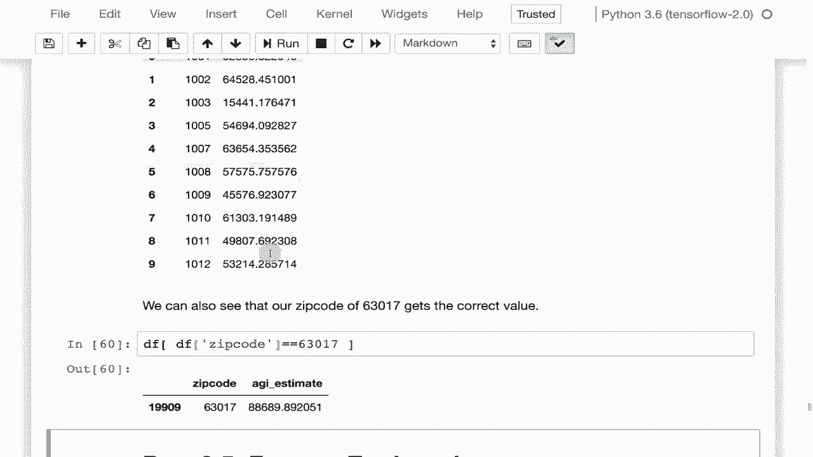

# T81-558 ｜ 深度神经网络应用 - P15：L2.4 - 在 Pandas 中使用 Apply 和 Map 🛠️

在本节课中，我们将学习 Pandas 库中两个强大的函数：`apply` 和 `map`。它们允许我们对 DataFrame 执行复杂的转换，这对于特征工程至关重要，能帮助我们将数据以更有利于神经网络进行预测的方式呈现。


## 概述

`apply` 和 `map` 是 Pandas DataFrame 提供的两个核心函数。它们允许你编写函数（通常是 lambda 函数）并将其应用于整个数据集，从而高效地完成数据转换和特征工程任务。

## 1. 使用 `map` 进行值映射 🔄

`map` 函数常用于将数据框中的值根据一个映射关系进行替换，类似于 SQL 中的 `DECODE` 操作。这是一种常见的数据清洗和转换方法。

以下是使用 `map` 的一个典型场景：

```python
# 假设有一个表示汽车产地的列 ‘origin’，其值为 1, 2, 3
# 我们希望将其映射为更具可读性的地区名称
origin_map = {1: ‘北美‘, 2: ‘欧洲‘, 3: ‘亚洲‘}
df[‘origin_name‘] = df[‘origin‘].map(origin_map)
```

运行上述代码后，DataFrame 中会新增一列 `origin_name`，其中的数字被替换为对应的地区名称。这种方法非常适用于将分类代码转换为有意义的标签，或者将多个值汇总到同一个类别下（例如，将美国各州映射到其所属的地区）。

## 2. 使用 `apply` 进行行或列计算 ➕

`apply` 函数则更为灵活，它可以将一个函数应用到 DataFrame 的每一行或每一列上。这对于基于现有列创建新特征非常有用。

上一节我们介绍了如何使用 `map` 进行简单的值替换，本节中我们来看看如何使用 `apply` 进行更复杂的计算。

例如，我们可以计算一个衡量汽车“效率”的新特征，即每单位排量所产生的马力：

```python
# 使用 apply 和 lambda 函数为每一行计算新特征
df[‘efficiency‘] = df.apply(lambda row: row[‘horsepower‘] / row[‘displacement‘], axis=1)
```

这里，`axis=1` 参数表示函数会应用于每一行。通过这种方式，我们可以基于数据集中多个字段的交互来构建新的特征。

## 3. 综合案例：估算邮政编码平均收入 💰

现在，让我们看一个结合了 `map`、`apply` 和分组操作的更复杂案例，这来自一个实际的项目作业。目标是处理一个包含美国各邮政编码收入分布的数据集，并估算每个邮政编码的平均调整后总收入。

以下是实现该目标的关键步骤：

1.  **数据加载与清洗**：首先加载数据集，并过滤掉无效的邮政编码（如 0 或 99999）。
2.  **使用 `map` 转换收入区间**：数据中的收入被分为 6 个区间（AGI Stub）。我们为每个区间定义一个中位数值，并使用 `map` 函数将区间代码替换为对应的中位数收入。
    ```python
    income_median_map = {1: 12500, 2: 37500, 3: 62500, 4: 87500, 5: 112500, 6: 200000}
    df[‘agi_median‘] = df[‘agi_stub‘].map(income_median_map)
    ```
3.  **使用 `apply` 进行分组加权计算**：接着，我们按邮政编码分组。对于每个分组，使用 `apply` 函数计算加权平均收入。公式如下：
    **加权平均收入 = Σ(每个区间的人数 * 该区间收入中位数) / 总人数**
    ```python
    def calc_weighted_avg(group):
        total_income = (group[‘n1‘] * group[‘agi_median‘]).sum()
        total_people = group[‘n1‘].sum()
        return total_income / total_people

    avg_income_by_zip = df.groupby(‘zipcode‘).apply(calc_weighted_avg)
    ```
4.  **整理结果**：最后，重置索引并重命名列，即可得到一个清晰的、包含每个邮政编码估算平均收入的数据集。

通过这个案例，我们可以看到如何将 `map`、`apply` 和分组操作串联起来，解决一个实际的特征工程问题。

## 总结

本节课中，我们一起学习了 Pandas 中 `apply` 和 `map` 函数的使用。

*   `map` 函数主要用于根据一个映射关系对序列中的值进行一对一的替换，非常适合数据编码和归类。
*   `apply` 函数则更加灵活，允许你将自定义函数应用到 DataFrame 的行或列上，是进行复杂特征计算和转换的利器。



熟练掌握这两个工具，能极大地提升你进行数据预处理和特征工程的能力，为构建高效的神经网络模型打下坚实的基础。在接下来的课程中，我们将继续深入探讨如何使用 Pandas 进行更高级的特征工程。