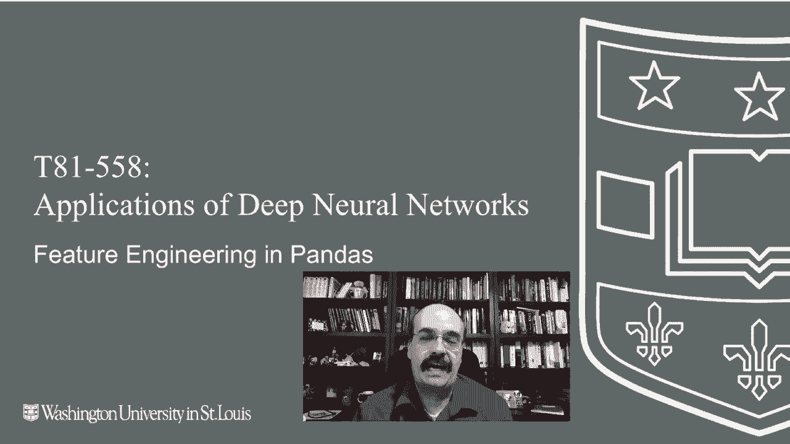
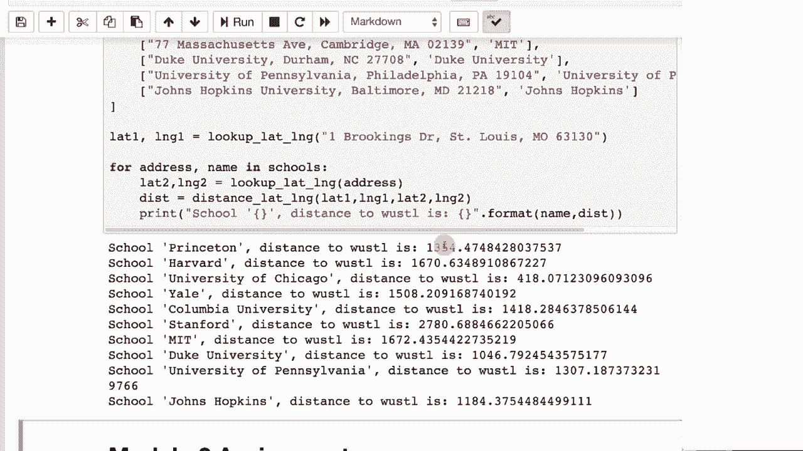

# T81-558 ｜ 深度神经网络应用 - P16：L2.5 - 使用Pandas进行Keras深度学习的特征工程 🛠️

在本节课中，我们将学习如何使用Python的Pandas库为深度学习模型进行特征工程。特征工程是数据准备的关键步骤，它能将原始表格数据转换为对神经网络更友好、更具预测性的格式。本节课不涉及图像、音频或文本数据的处理，而是专注于结构化数据的列操作。

## 概述

特征工程是提升模型性能的有效方法之一。通过创造新的特征或转换现有特征，我们可以为神经网络提供更丰富的信息。本节将介绍两种常见的特征工程技术：创建计算字段和使用外部API进行数据增强。

## 创建计算字段


上一节我们介绍了数据的基本处理，本节中我们来看看如何通过计算创建新的特征。计算字段是指通过对现有列进行数学运算而生成的新列。



例如，假设数据集中有一个以磅为单位的重量列 `weight_lbs`，我们可以创建一个以千克为单位的新列。

以下是创建计算字段的代码示例：

```python
# 假设df是一个Pandas DataFrame，包含‘weight_lbs’列
df['weight_kg'] = df['weight_lbs'] * 0.453592
```

运行这段代码后，你将得到一个新的 `weight_kg` 列。虽然这个新特征可能与原始特征高度相关，但它演示了创建计算字段的过程。在实际应用中，你可能会进行更复杂的运算，例如将重量与其他数值相除，或进行某种归一化处理。

## 使用外部API进行数据增强

除了内部计算，我们还可以从外部来源获取数据来丰富我们的数据集，这个过程称为数据增强。外部数据可能提供额外的预测能力。

一个常见的应用是利用地理编码API将地址转换为经纬度坐标。例如，我们可以使用Google Geocoding API。

**注意**：使用此类API通常需要有效的API密钥，并且可能产生费用。**切勿将你的私钥上传到公共代码仓库（如GitHub）**，以免造成经济损失。

以下是使用API增强地址数据的步骤：

1.  获取一个有效的Google Geocoding API密钥。
2.  构建一个包含地址的DataFrame。
3.  向API发送请求，解析返回的JSON数据以提取经纬度。

以下是获取地址经纬度的代码框架：

```python
import pandas as pd
import requests

# 你的API密钥（此处仅为示例，实际使用时请妥善保管）
API_KEY = 'YOUR_API_KEY_HERE'
def get_lat_lon(address):
    base_url = "https://maps.googleapis.com/maps/api/geocode/json"
    params = {'address': address, 'key': API_KEY}
    response = requests.get(base_url, params=params).json()
    if response['status'] == 'OK':
        location = response['results'][0]['geometry']['location']
        return location['lat'], location['lng']
    return None, None

# 应用函数到DataFrame的地址列
df['latitude'], df['longitude'] = zip(*df['address'].apply(get_lat_lon))
```

获取经纬度后，这些坐标本身就可以作为特征使用。例如，地理位置可能与某些行为高度相关（如不同地区的吸烟率差异）。

此外，你还可以利用经纬度计算两个地点之间的距离。这可以用于衡量用户距离商业中心的远近，或计算配送成本。

计算球面两点间距离的公式（哈弗辛公式）如下：

```python
from math import radians, sin, cos, sqrt, atan2

def haversine_distance(lat1, lon1, lat2, lon2):
    R = 6371  # 地球半径，单位：公里
    lat1, lon1, lat2, lon2 = map(radians, [lat1, lon1, lat2, lon2])
    dlat = lat2 - lat1
    dlon = lon2 - lon1
    a = sin(dlat/2)**2 + cos(lat1) * cos(lat2) * sin(dlon/2)**2
    c = 2 * atan2(sqrt(a), sqrt(1-a))
    distance = R * c
    return distance

# 计算两个地点间的距离
distance_km = haversine_distance(df1_lat, df1_lon, df2_lat, df2_lon)
```



通过这种方式，我们将难以直接处理的地址信息，转换成了可以量化并输入模型的数值特征。

## 总结

本节课中我们一起学习了使用Pandas进行特征工程的两种核心方法。我们首先介绍了如何通过数学运算创建**计算字段**来生成新特征。接着，我们探讨了如何利用**外部API进行数据增强**，以地理编码为例，将地址转换为经纬度坐标，并进一步计算距离。这些技术能够有效地从原始数据中提取更多信息，为构建更强大的Keras深度学习模型打下坚实的基础。本课程的前两个模块至此结束，接下来的内容将深入TensorFlow和Keras框架本身。