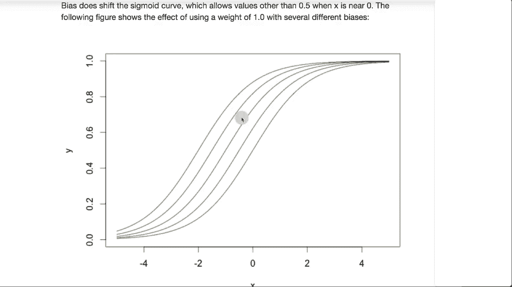

# T81-558 ｜ 深度神经网络应用-P17：L3.1- Keras深度学习和神经网络编程介绍 🧠

在本节课中，我们将对深度神经网络进行一般性介绍，并解释其基本概念和工作原理。这将帮助我们在之前学习的Python基础上，构建出能够应用于实际项目和最新AI进展的神经网络。

## 概述 📋

神经网络已经存在了一段时间。深度学习指的是训练非常深的神经网络的能力。你可能接触过其他机器学习模型，例如支持向量机、梯度提升、XGBoost和LightGBM。神经网络可以作为这些模型的替代方案。

神经网络接收数据，并输出分类结果或回归预测值。然而，神经网络的真正强大之处在于其处理复杂数据（如图像）并生成新数据的能力，这超出了传统分类和回归模型的范畴。

## 神经网络的输入与输出 🔄

在其他模型中，输入通常是一个一维向量（一组预测变量）。而神经网络可以接收二维矩阵（例如像素网格图像），甚至三维张量（例如彩色图像）。神经网络能够识别输入数据中元素之间的空间关系（如图像中相邻像素的相关性），这是其他模型不具备的能力。

神经网络的输出可以是传统的回归值或分类类别。例如，在保险领域，一个回归神经网络可以预测个人的最大保额，而一个分类神经网络可以将保险申请分为“优选”、“次标准”或“拒绝”等类别。

神经网络甚至可以同时进行回归和分类，或者生成比这更复杂的输出。

## 神经网络的结构 🏗️

神经网络由多层结构组成。对于处理表格数据的神经网络，其结构类似于Excel的行列。

以下是神经网络的主要组成部分：

*   **输入层**：接收输入数据的神经元。
*   **隐藏层**：位于输入层和输出层之间的神经元层。深度学习网络可以包含很多隐藏层。
*   **输出层**：产生神经网络最终输出的神经元。
*   **偏置神经元**：不直接接收外部输入，用于增强网络的预测能力，类似于线性方程中的截距。

神经网络中的神经元主要有四种类型：

1.  **输入神经元**：接收来自外部的输入。
2.  **隐藏神经元**：位于输入和输出神经元之间。
3.  **输出神经元**：产生网络的输出。
4.  **上下文神经元**：在时间序列和递归神经网络中用于保持状态（本课暂不深入）。
5.  **偏置神经元**：提供网络输出的基线偏移。

## 神经网络的计算原理 ⚙️

上一节我们介绍了神经网络的结构，本节中我们来看看其内部是如何计算的。神经网络的计算并不复杂，本质上是一个加权和，再经过一个激活函数。

计算一个神经元输出的公式如下：

**`输出 = φ( Σ (θ_i * x_i) )`**

其中：
*   `x_i` 是输入值。
*   `θ_i` 是连接权重。
*   `Σ` 表示求和。
*   `φ` 是激活函数。

这个过程在网络中逐层重复，以计算每个隐藏神经元和输出神经元的值。偏置神经元通常被表示为输入值恒为1的神经元，其连接权重即为偏置值。

## 激活函数 🔧

激活函数为神经网络引入了非线性，使其能够学习复杂模式。以下是两种常见的激活函数：

*   **修正线性单元**：这是目前最流行的激活函数之一。其公式为：
    **`ReLU(x) = max(0, x)`**
*   **Softmax**：通常用于分类网络的输出层，确保所有输出神经元的值之和为1，可以解释为概率。其公式为：
    **`Softmax(x_i) = exp(x_i) / Σ exp(x_j)`**

在深度学习兴起之前，常用的激活函数是Sigmoid和双曲正切。然而，Sigmoid函数在梯度下降优化中存在“梯度消失”问题，即其导数在两端会迅速趋近于0，导致深层网络训练困难。ReLU函数在一定程度上缓解了这个问题。

## 偏置神经元的作用 🎯

偏置神经元的作用类似于线性方程 `y = mx + b` 中的截距 `b`。

如果没有偏置，仅调整权重（相当于斜率 `m`），神经元输出的直线必须经过原点。这限制了模型的表达能力。加入偏置后，网络可以自由地平移输出直线，从而能够拟合更复杂的函数。权重和偏置共同作用，使得神经网络能够以叠加的方式逼近各种函数。

## 总结 🎓

本节课中，我们一起学习了深度神经网络的基本介绍。我们了解了神经网络的输入输出特性、多层结构、核心的计算原理（加权和与激活函数），以及偏置神经元的重要作用。我们还对比了ReLU和Sigmoid等激活函数的优劣。

现在，我们已经对深度神经网络有了一个概括性的认识，为后续学习如何在Python中使用TensorFlow和Keras等框架实现这些网络打下了基础。人工智能领域发展迅速，请持续关注以获取最新知识。