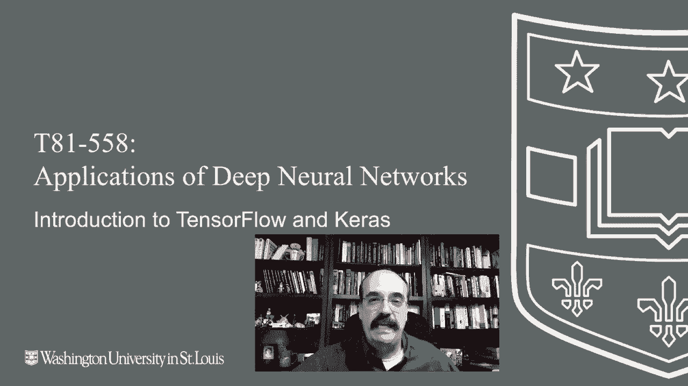
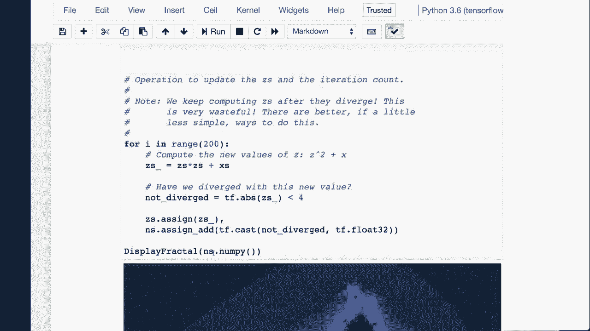
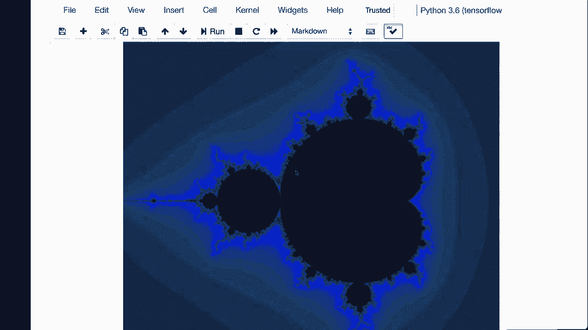
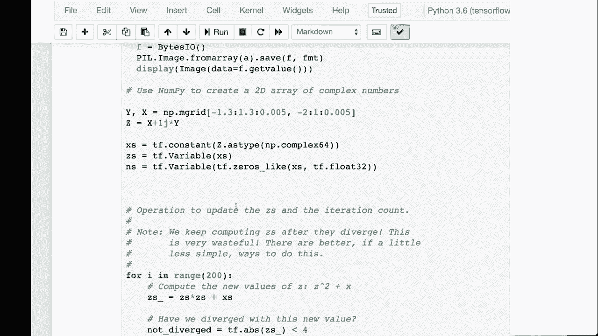
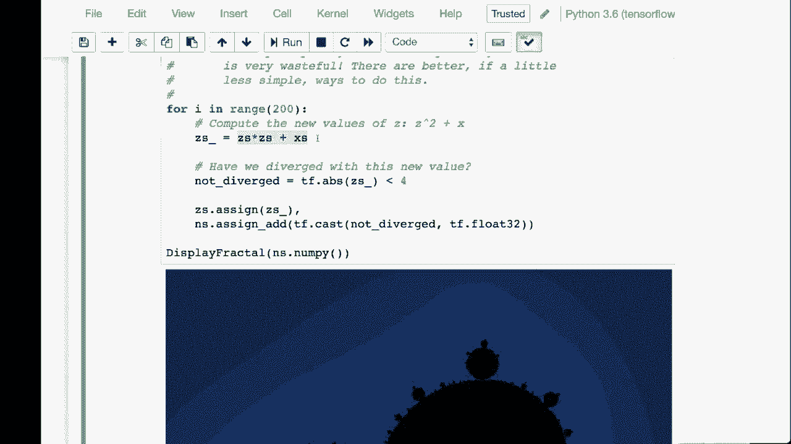
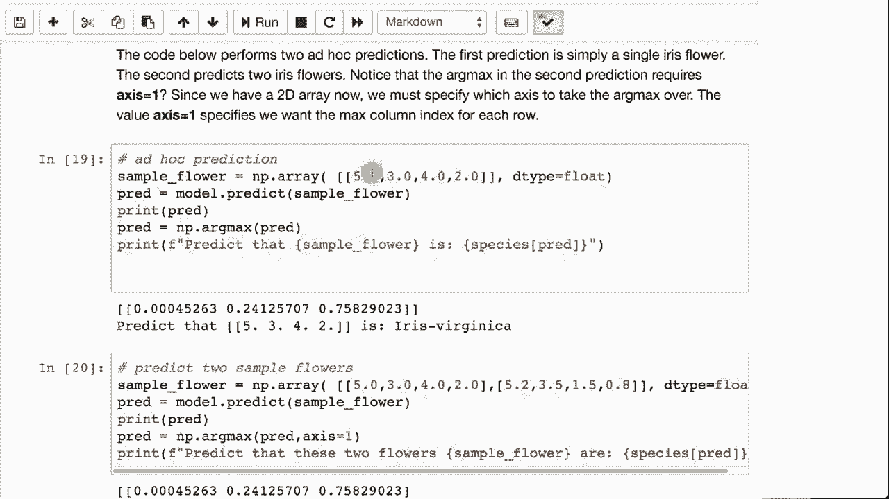

# T81-558 ｜ 深度神经网络应用 - P18：L3.2 - 深度学习工具库TensorFlow和Keras简介 🧠

在本节课中，我们将学习深度学习领域两个核心工具库：TensorFlow和Keras。我们将了解它们各自的定位、基本使用方法，并通过简单的代码示例来直观感受如何用它们构建神经网络。

## 概述



TensorFlow是一个底层的数学计算库，能够利用CPU、GPU等硬件进行高效运算。Keras则是一个构建在TensorFlow之上的高级神经网络API，它简化了神经网络的构建过程。本节课将首先介绍这两个库的基本概念和版本注意事项，然后通过直接使用TensorFlow进行数学计算和利用Keras构建回归与分类模型的实例，带你快速入门。

## TensorFlow与Keras简介

TensorFlow是一个低级数学库，它允许你访问CPU、GPU和分布式计算资源。Keras是一个高级抽象，它让你能够将这些数学结构视为神经网络层来构建模型。

以下是处理TensorFlow和Keras的一些有用资源链接。

你需要了解的第一点是，TensorFlow存在许多不同的版本。

谷歌在重大变更方面可能做得很好，也可能不尽如人意，这取决于具体情况。许多聪明的人在TensorFlow上工作，他们对API设计有明确的看法。随着不同理念的竞争，API会发生重大变化。重大变更意味着新版本会导致为旧版本编写的代码无法运行。

他们会更改名称、更改大小写。存在许多小的、有时只是令人烦恼的、有时是大的结构性变化。因此，确保你使用本课程指定的TensorFlow版本非常重要。本视频录制于TensorFlow 2.0开发阶段。

但只要你有2.0或更高版本，我会更新课程内容。如果因TensorFlow更新导致某些内容出现问题，我会更新视频。因此，你只需运行以下代码来查看你的版本。

```python
import tensorflow as tf
print(tf.__version__)
```

关于安装TensorFlow，我有完整的视频专门讲解如何在Windows上安装，还有关于Mac的视频。这些视频涉及安装CPU版本的TensorFlow以获得良好性能。如果你需要使用GPU，你的GPU需要是合适的型号。在课堂上运行的一些作业和示例将需要在CPU上运行，但这会很慢。安装GPU并非世界上最简单的事情。

我可能会制作一个相关视频。我个人主要在云端运行GPU深度学习，这样我就不需要安装所有硬件和驱动程序，但这确实是可行的。我建议需要GPU来完成本课程作业和部分内容的同学使用Google Colab。

Google Colab是基于云的，你无需安装Python或其他任何东西。它完全准备就绪。我有一个视频链接在第一个模块中，介绍如何在本课程中使用Google Colab，我们可能在第一次课堂会议中讨论过。因此，这可能是运行所有示例和完成作业的推荐方式。

它是一个强大的实例：双核，12GB内存，配备一块GPU。你无法超越它。这就是我推荐的学习此课程的途径。

至于我为什么为本课程选择TensorFlow，TensorFlow得到谷歌的支持，在Google Cloud中有出色的支持。它拥有良好的CPU和GPU支持，并且是用Python编写的。Python正迅速成为机器学习和AI的高级语言。因此，学习Python并通过Keras学习深度学习是非常有利的。

现在，你可以直接使用TensorFlow。如果你正在编写非常自定义的机器学习模型，那可能是最佳选择。但总体而言，更常用的访问方式是通过Keras。这使得深度学习变得更加简单。实际上没有太多缺点，除非你确实需要对底层神经网络计算拥有完全控制，那时你才需要直接使用TensorFlow。

还有其他深度学习工具。我这里列出了几个。如果你特别喜欢Java，Deeplearning4j绝对值得关注，H2O也是。在TensorFlow的旧版本中，计算图是静态的，采用延迟执行模式。TensorFlow 2.0的一个重要特点是即时执行。现在，他们进行了很多更改。因此，如果你之前没有使用过TensorFlow，不用担心，它已经完全改变了。这将让你为最新版本做好准备。

这只是展示了TensorBoard，它可以帮助你可视化你创建的神经网络。

## 直接使用TensorFlow进行计算

上一节我们介绍了TensorFlow和Keras的基本概念。本节中，我们来看看如何直接使用TensorFlow进行数学计算。我们只在这个视频中进行这个部分，其他视频将完全使用Keras。

以下代码生成一个叫做曼德尔布罗特集的图形，你可以在这里看到它。

如果你之前接触过曼德尔布罗特集，你一定会认出那幅经典的图。实际上，这是一组非常简单的方程生成的。



你可以继续放大这个区域，在复杂的景观中几乎是无限的，你可以深入探索。



在这里，我写了代码来绘制曼德尔布罗特集。现在你可以看到这非常简单。那是生成曼德尔布罗特集的代码。显示分形的函数在完全渲染后使用，我们在TensorFlow中做的实际上是定义计算。基本上，它涉及一个复平面，你在整个平面上绘制曼德尔布罗特集。


我不会深入曼德尔布罗特集的实际数学原理，但有很多关于这一点的教程。




我们基本上是在这个平面上进行全面的扫描。我们进行了200次迭代。所以每次绘制时，图像都会变得越来越精细。这是一个非常迭代的过程。每次迭代时，计算都会发送到TensorFlow进行处理。如果你愿意，可以使用GPU。

速度快得令人难以置信，但你真的不需要实际的GPU。仅用CPU就可以做到。这是用于绘制曼德尔布罗特图像的计算方程。




如果你运行这个，你会看到它实际上运行得非常快。

现在为了更精确地观察发生了什么，这里也是直接使用TensorFlow。我在这里创建了两个矩阵。所以这些实际上是向量。或者，你可以称它为行矩阵，这个是列矩阵。因为这个是横着的。

这是两个值叠在一起，我们要对矩阵1和矩阵2进行矩阵乘法，然后打印出来。正如你所看到的，结果是12。现在我把它转换为浮点数，以便你不会看到所有的张量装饰。这是两个常量，所以是常量乘以常量。


你可以看出这一切都是非常线性代数导向的。

现在我们在处理两个变量，我们要从一个常量中减去一个变量。我们这样做后，可以看到结果是 `[-2, -1]` 的行矩阵。我们现在可以重新赋值X，因为X是一个变量，所以我们重新赋值，并能够基本上重新计算上面的计算，得到不同的值。

所以，这些是构建神经网络的基础模块。

## 使用Keras构建回归神经网络

了解了TensorFlow的基础计算后，我们来看看如何使用高级API Keras来构建神经网络。本节我们将构建一个回归模型，预测汽车的每加仑英里数（MPG）。

我们将使用一个经典的数据集，即汽车MPG数据集。该数据集提供了各种汽车及其MPG的统计数据。目标是建立一个模型，利用气缸数、排量、马力、重量、加速度、年份和产地等特征来预测MPG。

以下是构建和训练模型的主要步骤：

1.  **数据准备**：读取数据，处理缺失值（例如用中位数填充马力），并分离特征（X）和目标变量（y）。
2.  **模型构建**：使用Keras的`Sequential`模型，按顺序添加层。
3.  **模型编译**：指定损失函数（回归问题常用均方误差`mse`）和优化器（如`adam`）。
4.  **模型训练**：使用`fit`方法在数据上训练模型一定周期（epoch）。
5.  **模型评估**：计算均方根误差（RMSE）等指标来评估模型性能。

```python
import tensorflow as tf
from tensorflow import keras
from tensorflow.keras import layers
import pandas as pd
import numpy as np

# 1. 加载并准备数据
url = ‘http://archive.ics.uci.edu/ml/machine-learning-databases/auto-mpg/auto-mpg.data‘
column_names = [‘MPG‘, ‘Cylinders‘, ‘Displacement‘, ‘Horsepower‘, ‘Weight‘, ‘Acceleration‘, ‘Model Year‘, ‘Origin‘]
raw_dataset = pd.read_csv(url, names=column_names, na_values=‘?‘, comment=‘\t‘, sep=‘ ‘, skipinitialspace=True)
dataset = raw_dataset.copy()
dataset = dataset.dropna() # 简单处理，删除缺失值行（实际可能用中位数填充）

# 分离特征和目标
X = dataset[[‘Cylinders‘, ‘Displacement‘, ‘Horsepower‘, ‘Weight‘, ‘Acceleration‘, ‘Model Year‘, ‘Origin‘]]
y = dataset[‘MPG‘]

# 2. 构建模型
model = keras.Sequential([
    layers.Dense(25, activation=‘relu‘, input_shape=[X.shape[1]]),
    layers.Dense(10, activation=‘relu‘),
    layers.Dense(1) # 输出层，一个神经元，用于回归
])

# 3. 编译模型
model.compile(loss=‘mse‘, optimizer=‘adam‘)

# 4. 训练模型
history = model.fit(X, y, epochs=100, verbose=1)

# 5. 评估模型 (示例：计算训练集上的RMSE)
y_pred = model.predict(X)
rmse = np.sqrt(np.mean((y - y_pred.flatten())**2))
print(f"Root Mean Squared Error: {rmse}")
```

训练过程中，损失（MSE）应随着周期增加而下降。这里的表现（RMSE约为2-3）对于MPG的范围来说是可以接受的。你可以通过增加训练周期、调整网络结构或使用更高级的技术来改进模型。

## 使用Keras构建分类神经网络

上一节我们构建了一个回归模型。本节中，我们来看看如何使用Keras解决分类问题，以经典的鸢尾花（Iris）数据集为例。

鸢尾花数据集包含四个特征（花萼长度、花萼宽度、花瓣长度、花瓣宽度），用于预测三种鸢尾花类型。这是一个多类分类问题。

以下是构建分类神经网络的关键步骤：

1.  **数据准备**：加载数据，将文本标签（如‘setosa‘）转换为独热编码（one-hot encoding）或整数标签。
2.  **模型构建**：输入层有4个神经元。对于多类分类，输出层神经元数量等于类别数（3），并使用`softmax`激活函数，它将输出转换为概率分布。
3.  **模型编译**：损失函数使用分类交叉熵（`categorical_crossentropy`），优化器同样可以使用`adam`。同时监控`accuracy`指标。
4.  **模型训练与评估**：在训练集上训练，在测试集上评估准确率。

```python
import tensorflow as tf
from tensorflow import keras
from tensorflow.keras import layers
import numpy as np
from sklearn.datasets import load_iris
from sklearn.model_selection import train_test_split
from sklearn.preprocessing import StandardScaler, LabelEncoder

# 1. 加载并准备数据
iris = load_iris()
X = iris.data
y = iris.target

# 将整数标签转换为独热编码（Keras内部处理时，使用sparse_categorical_crossentropy损失可跳过此步）
# y = tf.keras.utils.to_categorical(y, num_classes=3)

# 划分训练集和测试集
X_train, X_test, y_train, y_test = train_test_split(X, y, test_size=0.2, random_state=42)

# 标准化特征（可选但推荐）
scaler = StandardScaler()
X_train = scaler.fit_transform(X_train)
X_test = scaler.transform(X_test)

# 2. 构建模型
model = keras.Sequential([
    layers.Dense(10, activation=‘relu‘, input_shape=[X.shape[1]]),
    layers.Dense(10, activation=‘relu‘),
    layers.Dense(3, activation=‘softmax‘) # 3个输出，使用softmax
])

# 3. 编译模型
# 如果y是整数标签，使用‘sparse_categorical_crossentropy‘
model.compile(loss=‘sparse_categorical_crossentropy‘,
              optimizer=‘adam‘,
              metrics=[‘accuracy‘])

# 4. 训练模型
history = model.fit(X_train, y_train, epochs=50, verbose=1, validation_split=0.2)

# 5. 评估模型
test_loss, test_acc = model.evaluate(X_test, y_test, verbose=2)
print(f‘\nTest accuracy: {test_acc}‘)

# 6. 进行预测
predictions = model.predict(X_test[:2])
print(‘Predictions (probability distribution):‘, predictions)
print(‘Predicted class (index):‘, np.argmax(predictions, axis=1))
print(‘True class:‘, y_test[:2])
# 如果需要类别名称
# class_names = iris.target_names
# print(‘Predicted class name:‘, class_names[np.argmax(predictions, axis=1)])
```

训练后，模型在测试集上的准确率通常很高（如98%）。`softmax`层的输出是三个概率值，最大概率对应的索引即为预测的类别。你也可以输入新的测量值来预测其类别。



## 总结


本节课中，我们一起学习了深度学习工具库TensorFlow和Keras。

*   **TensorFlow**是一个强大的底层数值计算库，支持硬件加速，可直接用于复杂的数学运算。
*   **Keras**是构建在TensorFlow之上的高级神经网络API，它通过简洁的接口大大简化了神经网络的构建、训练和评估过程。
*   我们通过实例演示了如何用Keras构建**回归模型**（预测MPG）和**分类模型**（识别鸢尾花），涵盖了模型构建、编译、训练和预测的基本流程。

理解TensorFlow和Keras的关系及其基本用法，是进入深度学习实践的重要第一步。在接下来的课程中，我们将学习如何保存和加载这些训练好的模型。