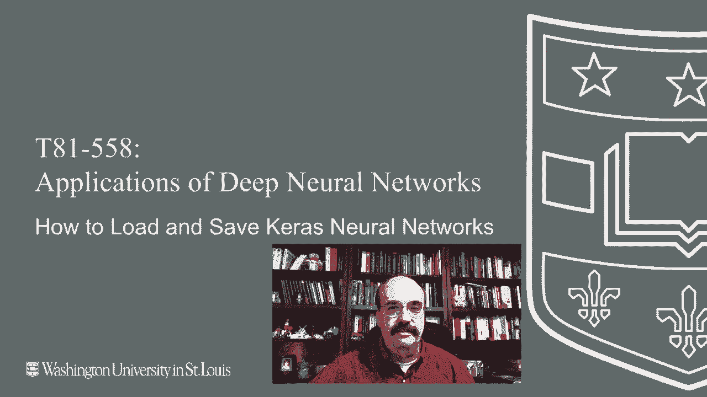
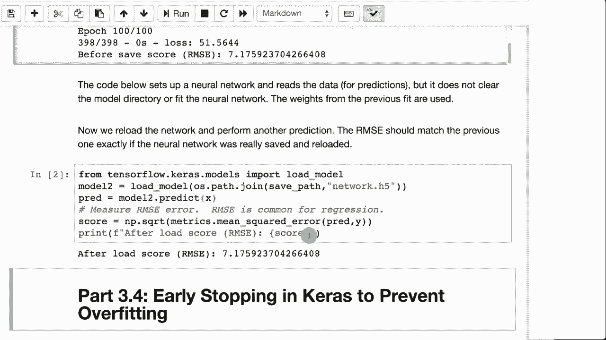

# T81-558 ｜ 深度神经网络应用 - P19：L3.3 - 保存和加载Keras神经网络模型 💾

在本节课中，我们将学习如何保存和加载Keras神经网络模型。训练一个神经网络通常需要花费大量时间和计算资源，因此保存训练好的模型至关重要。这不仅便于后续复用，也是将模型部署到Web应用或网络服务中的必要步骤。

## 概述

我们将探讨Keras提供的几种模型保存与加载格式，并通过一个具体的汽车MPG数据集示例来演示整个过程。理解这些操作能帮助你有效地管理模型，并在后续课程中应用“早停法”等高级技巧。

---



## 模型保存格式选择

当你保存Keras神经网络时，可以选择几种不同的文件格式。其中两种是文本格式，便于人类阅读；另一种是二进制格式，更适合保存完整的模型状态。

以下是几种主要的格式：

*   **JSON格式**： 这是一种文本格式，使用JSON（JavaScript Object Notation）存储神经网络的**结构**（即架构），但**不包含训练好的权重**。很多编程工具都能方便地读写JSON文件。
*   **YAML格式**： 与JSON类似，YAML也是一种文本格式，仅用于保存神经网络的**结构**，**不保存权重**。
*   **HDF5格式**： 这是一种二进制格式（文件扩展名通常为 `.h5` 或 `.hdf5`）。它是保存Keras模型的**推荐格式**，因为它能同时保存模型的**完整结构**和**训练好的所有权重**。

> **注意**： HDF5 不要与 HDFS（Hadoop分布式文件系统）混淆。

由于前两种格式（JSON和YAML）不保存权重，因此在实际部署完整模型时较少使用。HDF5格式因其完整性而成为最常用的选择。

---

## 实践：保存与加载模型

接下来，我们通过一个具体的代码示例来演示如何保存和加载模型。我们将使用汽车MPG数据集构建一个神经网络。

首先，我们构建并训练一个简单的神经网络模型，用于预测汽车油耗（MPG）。训练完成后，我们会计算其均方根误差（RMSE）作为性能评估。

```python
# 示例代码：构建、训练并评估模型
model = create_model() # 假设的模型创建函数
model.fit(x_train, y_train, epochs=10)
predictions = model.predict(x_test)
rmse = calculate_rmse(y_test, predictions)
print(f"训练后模型RMSE: {rmse}")
```

运行上述代码后，假设我们得到的RMSE约为7.17。每次训练由于随机性可能会得到略有不同的结果。

现在，我们将这个训练好的模型以三种格式保存到磁盘。

```python
# 保存模型为JSON格式（仅结构）
model_json = model.to_json()
with open("model_structure.json", "w") as json_file:
    json_file.write(model_json)

# 保存模型为YAML格式（仅结构）
model_yaml = model.to_yaml()
with open("model_structure.yaml", "w") as yaml_file:
    yaml_file.write(model_yaml)

# 保存整个模型为HDF5格式（结构+权重）
model.save("my_complete_model.h5")
```

保存完成后，我们可以从磁盘重新加载模型，特别是加载完整的HDF5模型。

```python
# 从HDF5文件加载完整模型
from tensorflow.keras.models import load_model
loaded_model = load_model("my_complete_model.h5")

# 使用加载的模型进行预测并计算RMSE
loaded_predictions = loaded_model.predict(x_test)
loaded_rmse = calculate_rmse(y_test, loaded_predictions)
print(f"加载后模型RMSE: {loaded_rmse}")
```

如果操作正确，从文件加载的模型计算出的RMSE应与保存前一模一样（例如7.17）。这证明了模型被完整无误地保存和恢复了。如果重新训练一个新模型，得到的RMSE值很可能不同，这反衬出加载旧模型的价值。

---

## 应用场景与课程关联

掌握模型保存与加载的技术在本课程中非常重要，它将在两个关键环节发挥作用：

1.  **早停法（Early Stopping）**： 在接下来的课程中，我们将学习使用“早停法”。这种方法可以监控验证集性能，当模型性能不再提升时自动停止训练，并**自动保存当前最优的模型权重**。之后，你可以重新加载这个最优状态的模型进行预测或部署。
2.  **模型部署**： 在本课程后期，我们将探讨如何将训练好的神经网络部署到Web应用程序或网络服务中。**能够保存模型是部署的前提**，你可以将保存好的模型文件（如 `.h5` 文件）上传到云端服务器，供应用程序调用。

---



## 总结

本节课中，我们一起学习了Keras神经网络模型的保存与加载。

*   我们了解了**JSON**、**YAML**和**HDF5**三种格式的区别，其中**HDF5**是保存完整模型（结构+权重）的推荐格式。
*   我们通过代码实践了如何使用 `model.save()` 保存模型，以及使用 `load_model()` 加载模型，并验证了加载后的模型性能与保存前一致。
*   我们探讨了这项技术的核心应用场景：配合**早停法**保存最佳模型快照，以及为后续的**模型部署**做好准备。

下一节课，我们将详细讲解如何使用“早停法”来防止神经网络过拟合，届时你会看到模型保存功能如何在该流程中起到关键作用。