# T81-558 ｜ 深度神经网络应用 - P2：L1.1 课程概述 🎯

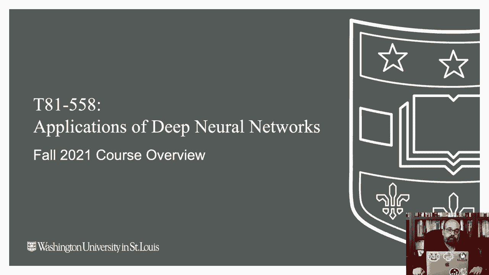

在本节课中，我们将对《深度神经网络应用》这门课程进行全面的概述。我们将介绍课程的基本信息、学习方式、所需工具、核心概念以及评估方式，帮助你为后续的学习做好准备。

## 课程基本信息与学习方式

我是 Jeff Heaton，欢迎来到华盛顿大学的深度神经网络应用课程。本课程在 2021 年秋季学期开设。

课程提供在线和混合两种形式。混合形式的学生将在校园参加部分课程，其余时间远程学习。纯在线版本的学生将观看预录视频，也可选择参加直播。通过 YouTube 观看的观众可以访问所有内容，但无法提交作业或获得个别指导。

上学期课程完全在线进行。本学期计划在华盛顿大学丹佛校区举行四次线下会议，同时通过 Zoom 进行直播并提供录制视频。课程不强制要求线下出席，具体安排将在第一次会议中详细说明。

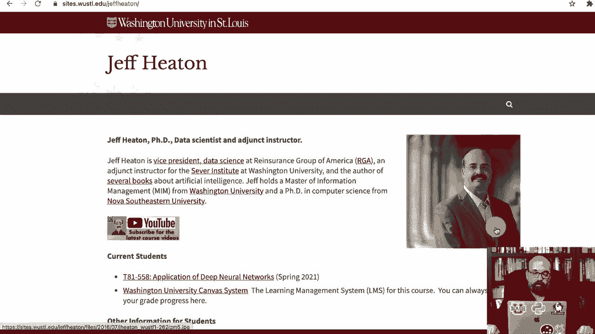

所有课程信息可通过华盛顿大学的 Canvas 系统获取，主要内容存储在我的 GitHub 仓库中。

## 课程平台与资源访问

如果你通过 Canvas 系统访问课程，界面将如下所示。所有视频可通过 YouTube 或 Kaltura 观看，内容完全相同。

Kaltura 平台提供字幕和视频内容搜索功能，并支持调整播放速度。

课程阅读材料和作业也通过 Canvas 链接。点击阅读材料将跳转至 GitHub 页面。本课程的所有内容均以 Jupyter Notebook 形式提供，这是进行深度学习的有效方式。

## 硬件与软件环境配置

虽然并非必需，但拥有 GPU 将显著提升本课程部分内容的学习体验。我使用的电脑配备了高端 GPU。

目前，配备 M1 芯片的新款 Mac 也能利用其加速器进行深度学习所需的高速数学计算。我提供了专门视频，展示如何为 M1 Mac 设置本课程所需的环境。

对于 Linux 或 Windows 用户，需要使用 NVIDIA GPU 以支持本课程将使用的 TensorFlow Keras 框架。

如果你的系统没有 GPU，我强烈推荐使用 Google Colab。本课程提供的所有 Jupyter Notebook 顶部都包含“在 Colab 中打开”的链接，点击即可在 Colab 环境中启动。

我使用 Google Colab Pro，但本课程并不强制要求。在后续的 Kaggle 比赛中，它可能提供一些优势。Kaggle 平台本身也会提供可用的 GPU。

以下是环境检查的示例代码，用于验证 GPU 是否可用及 TensorFlow 版本：

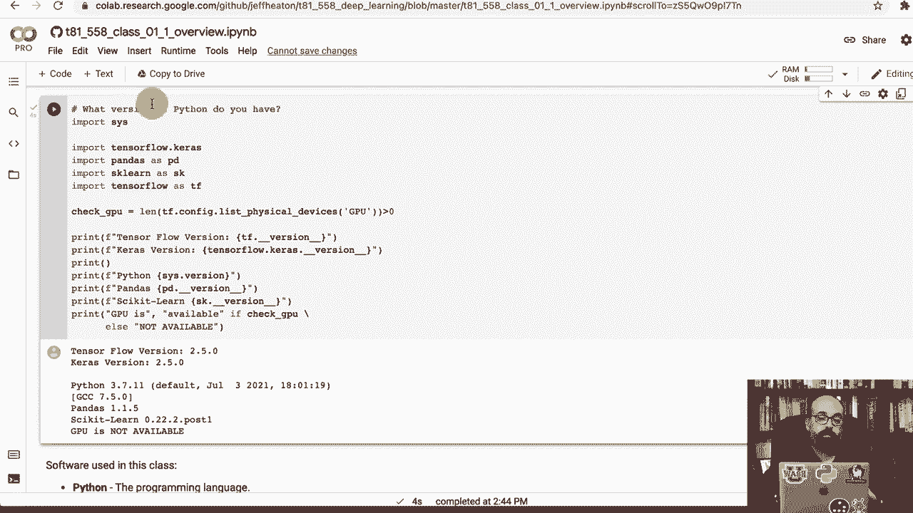

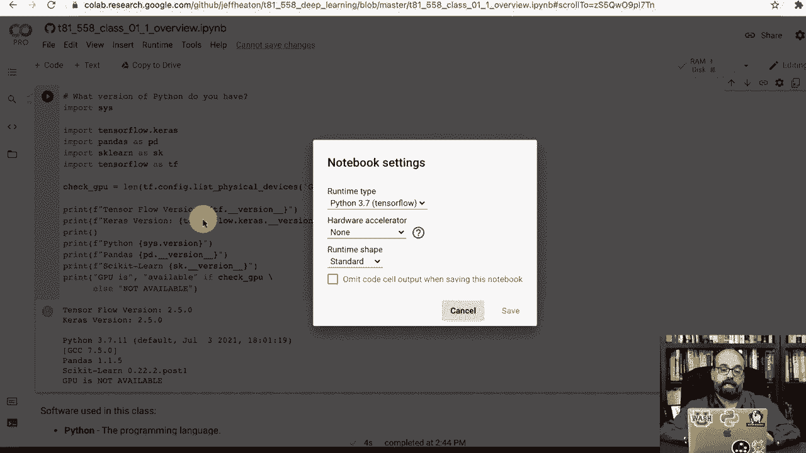

```python
import tensorflow as tf
print("TensorFlow 版本:", tf.__version__)
print("GPU 可用:", tf.config.list_physical_devices('GPU'))
```

在 Colab 中，如果 GPU 不可用，你需要在菜单中更改运行时类型以启用 GPU，然后重启环境。

仅使用 CPU 大约可以完成 90% 的课程内容。Mac M1 的支持较新，目前约 95% 的课程材料可在其上运行。一个例外是涉及 StyleGAN 生成计算机生成面孔的部分，该代码专为 NVIDIA CUDA 设计。对于这部分，可以参考关于 Colab 的入门视频。

大约 70% 到 80% 的学生使用 Colab。我也提供了在 Intel Mac 上设置的说明视频，虽然无法获得加速，但至少可以运行部分代码。

## 课程作业与评估方式

课程作业包括一个“破冰”活动，你需要向同学介绍自己。我会阅读每一个介绍，并对提出的问题或评论进行回复。

课程成绩的 50% 来自每周到期的小程序作业，这些作业旨在测试你对材料的理解。每个作业可能需要半小时到数小时完成。

第一个作业很简单，只需运行提供的 Python 代码以证明环境配置成功，并提交结果。

我使用自动评分和反馈系统。当你提交作业时，系统会使用我提供的 API 密钥自动评分。该系统结合了神经网络和正则表达式等工具，虽然评分可能不完全精确，但会提供反馈。你可以多次提交作业，直到获得满意的分数。

## 团队项目与 Kaggle 竞赛

课程包含团队项目。你可以自行组队，队伍可以跨班级的不同部分（在线或线下）组成。

课程的核心部分是 Kaggle 竞赛，你将与班内乃至互联网上的其他参与者竞争。我会对提交结果进行排名，期末时排名前五的团队需要进行展示。

对于完全在线的学生，展示是可选的。如果你是前五名之一，我会联系你安排展示事宜。

Kaggle 竞赛本身没有奖金，但我愿意为表现顶尖的学生撰写有力的 LinkedIn 推荐信。许多往届学生认为这是课程中最有趣的部分。

期末项目是课程的另一项评估。如果你是 Kaggle 竞赛的前五名，则无需完成期末项目。期末项目要求你选择并总结一篇深度学习领域的顶级会议论文（如 ICLR 或 NeurIPS），我提供的备选论文列表包括华盛顿大学学者的作品。

## 关于讲师

我是你们的讲师 Jeff Heaton。我拥有华盛顿大学的信息管理硕士学位和 Nova Southeastern University 的计算机科学博士学位。我是 IEEE 的高级成员。

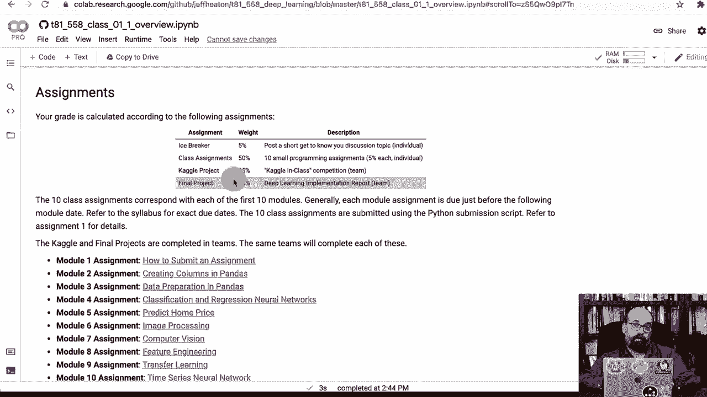

我从未计划成为 YouTuber，但早在学校使用 Kaltura 之前，我就开始上传教学视频。目前我的频道拥有超过 50,000 名订阅者。我鼓励学生订阅我的频道，以获取课程之外更多关于高级主题的内容。

我每周通常会发布一个视频，并每学期更新约 5% 到 10% 的课程材料。

我运营着一个 Discord 服务器供大家讨论，并在华盛顿大学的 Teams 系统中为学生创建了团队。这是一个寻求帮助的好地方。你也可以在 Google Scholar、ResearchGate 和 ORCID 上查看我过往的研究成果。

## 核心工具与机器学习概念

我们将使用 Python 进行编程。推荐使用 Miniconda（Anaconda 的精简版）来管理环境。深度学习框架主要使用 TensorFlow。

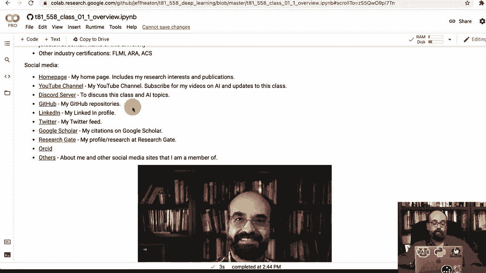

目前，TensorFlow 和 PyTorch 是两大主流框架。本课程始于 2017 年，当时 TensorFlow 是主要选择。虽然 PyTorch 日益流行，特别是在新论文的代码实现中，但 TensorFlow 在工业界仍被广泛使用。课程中也会稍微涉及 PyTorch，特别是在生成对抗网络（GANs）部分。

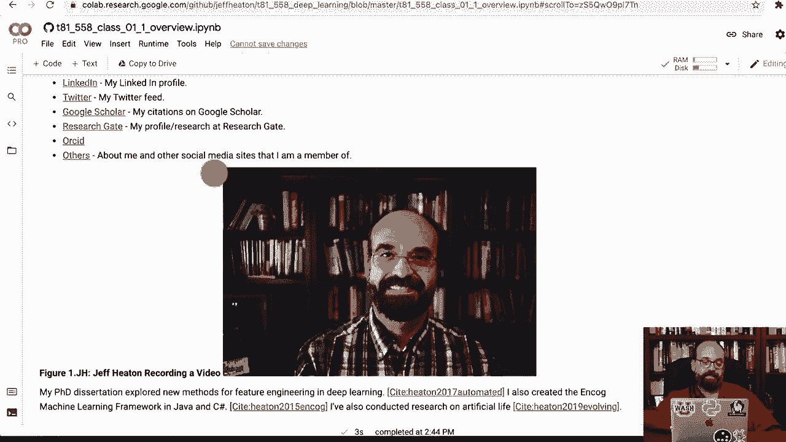

**那么，什么是机器学习？**

机器学习是从数据中学习规律的过程。

*   **传统软件开发**：开发者编写处理输入数据并生成输出的程序代码。
*   **机器学习**：计算机从已知的、带有标签的输入-输出数据对中学习，自动生成“程序代码”，即模型（如神经网络）。这被称为**数据驱动开发**。

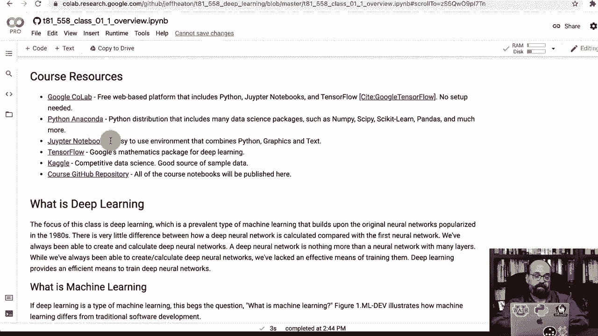

例如，要区分猫和狗的图片，传统编程需要编写复杂的特征识别代码，而机器学习则通过提供大量已标记的“猫”和“狗”图片，让计算机自动学会区分。

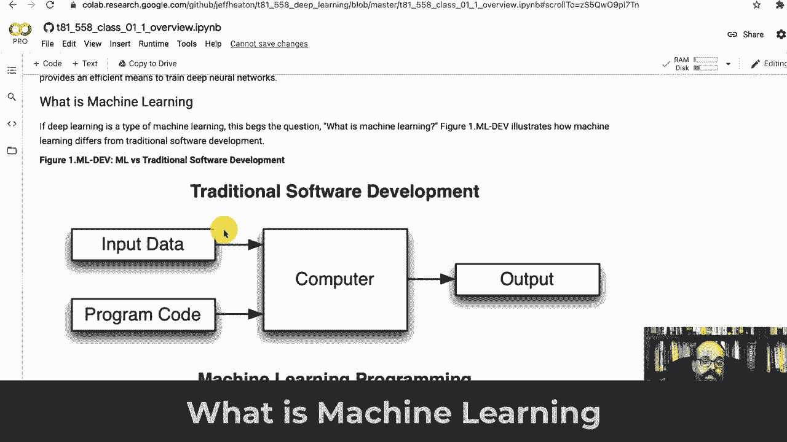

深度学习主要应用于以下几个领域：

1.  **预测建模**：根据已有数据训练模型，对新的、未标记的数据进行预测。
2.  **计算机视觉**：如图像分类（猫 vs. 狗）、自动驾驶等。本学期的 Kaggle 竞赛将是一个具有挑战性的计算机视觉任务。
3.  **时间序列预测**：如股票市场预测。

机器学习任务主要分为两类：
*   **回归**：预测一个连续数值。公式可表示为 `y = f(x)`，其中 `y` 是预测值。
*   **分类**：预测一个离散类别。

**深度神经网络**是经典神经网络的扩展，通过引入卷积层、循环层、变换器（Transformer）、注意力机制等结构，极大地提升了模型的能力，推动了该领域的快速发展。

**为什么选择深度学习？**

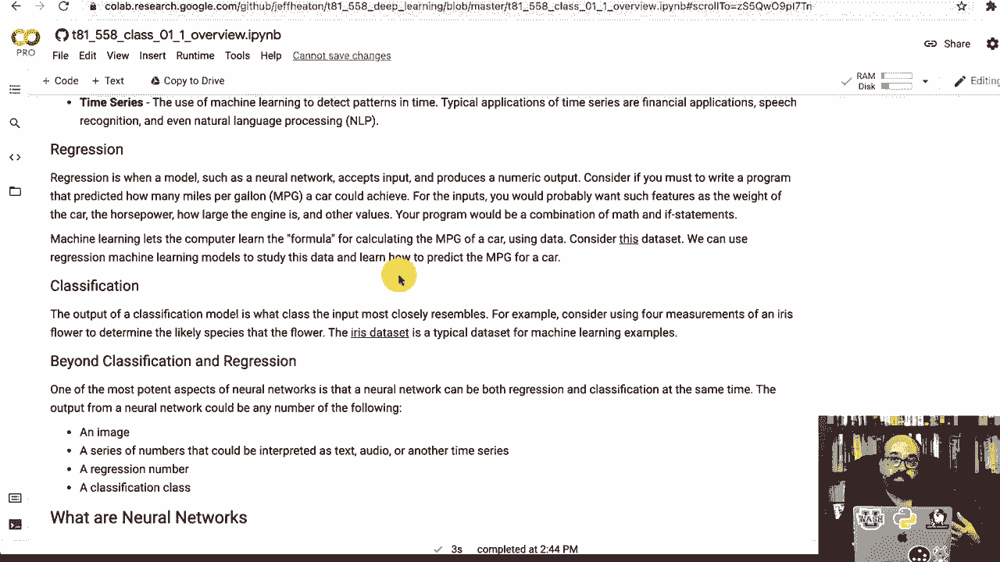

与支持向量机（SVM）、随机森林、梯度提升机等其他机器学习方法相比，神经网络在计算机视觉等领域表现尤为出色，因为它们能够**自动从数据中学习并创建有效的特征**。

传统的计算机视觉方法需要人工设计和提取特征（如颜色、纹理），而深度学习模型可以自动完成这一过程。

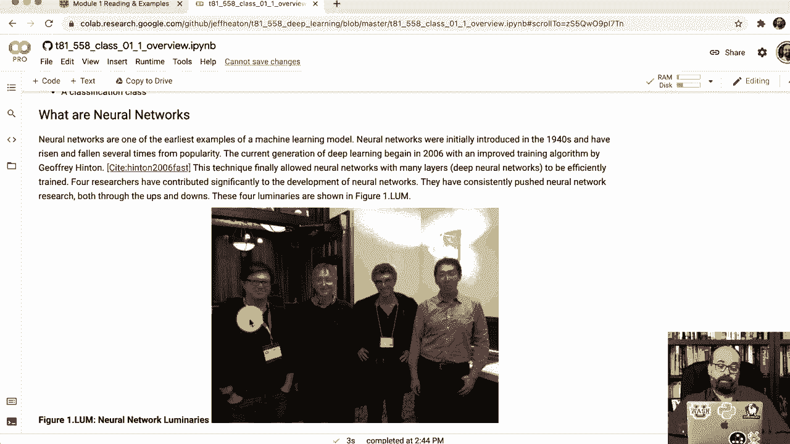

Andrew Ng 有一个生动的比喻：旧算法是学术界已不再重点研究的算法。深度学习和机器学习是当前研究的主流。

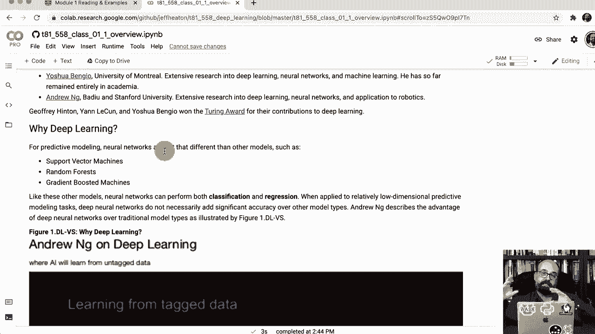

需要注意的是，如果你的数据量较小，传统的“旧”算法性能可能优于深度学习模型。

## 课程教材

我为本课程编写了教材，内容与 GitHub 仓库中的材料基本一致，但以可打印的 PDF 格式呈现，超过 500 页。

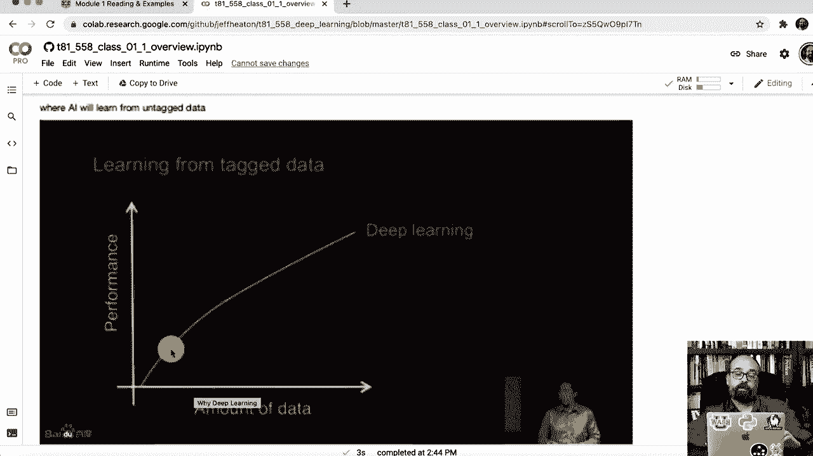

你可以通过提供的链接下载教材。我每个学期都会更新教材，当前版本会标明“2021 年秋季”。未来，我计划将其正式出版。

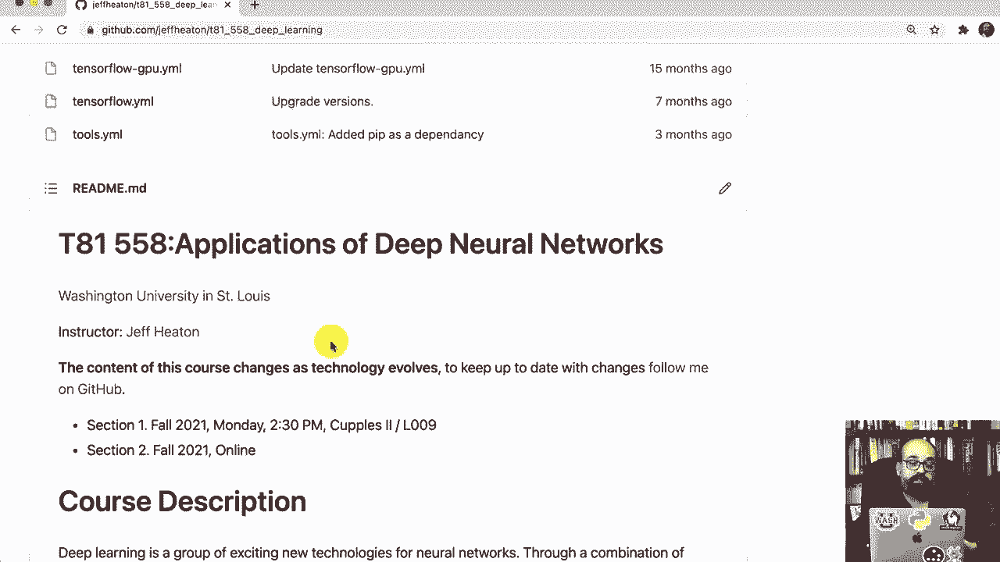

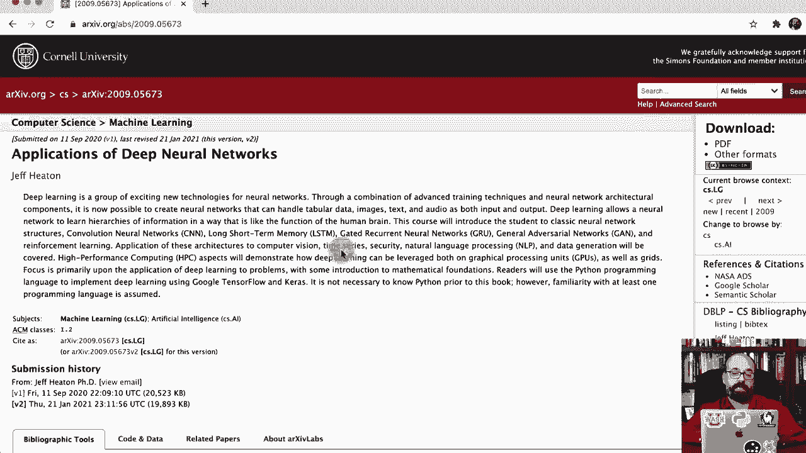

## 总结

本节课中，我们一起学习了《深度神经网络应用》课程的概览。我们介绍了课程的基本信息、学习平台、必需的软硬件环境、作业与评估方式、精彩的 Kaggle 竞赛环节，以及机器学习和深度学习的核心概念。

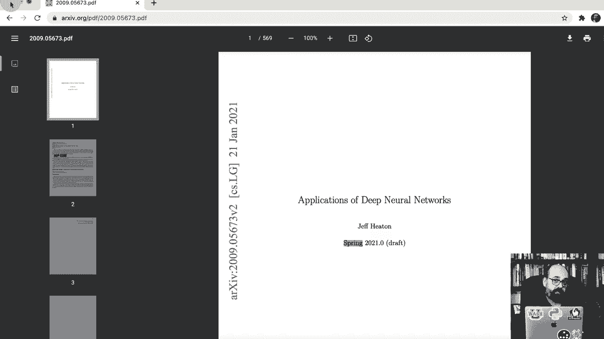

在接下来的课程中，我们将深入具体的安装步骤和作业提交流程。感谢你的观看，祝你学习愉快！