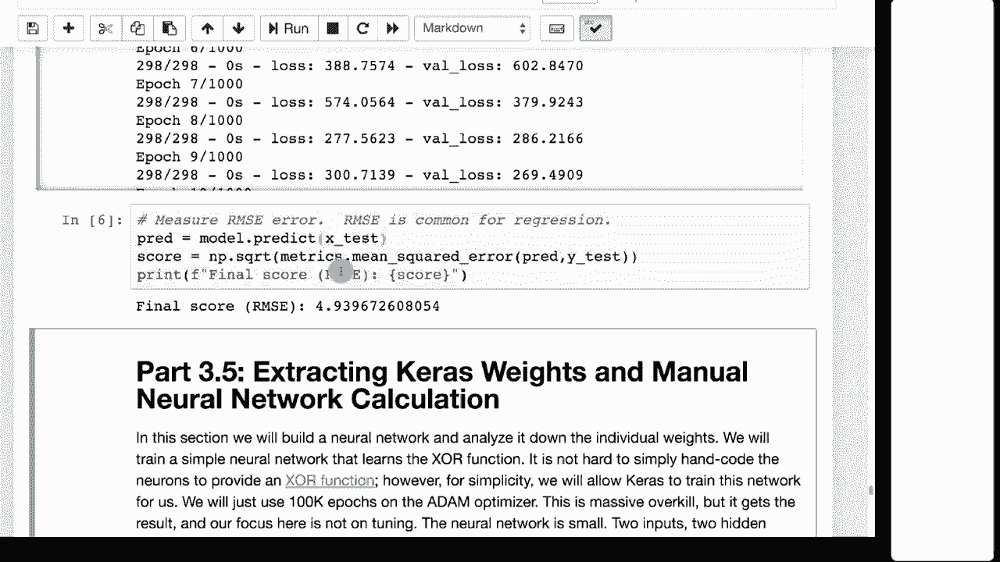

# T81-558 ｜ 深度神经网络应用-P20：L3.4- 在Keras中使用早停法防止过拟合 🛑

在本节课中，我们将学习对抗神经网络过拟合的第一个实用技巧——早停法。我们将了解其原理，并通过分类和回归两个实例，学习如何在Keras中实现它。

## 概述：什么是过拟合与早停法？

过拟合是神经网络训练中的常见问题，指模型在训练数据上表现优异，但在未见过的数据上表现不佳。早停法是一种通过监控验证集性能来提前终止训练，从而防止过拟合的技术。

上一节我们介绍了神经网络训练的基本流程，本节中我们来看看如何利用早停法优化训练过程。

## 早停法的原理 📈

随着训练轮次增加，模型对训练集的拟合会越来越好，训练误差持续下降。然而，验证误差通常会先下降后上升。验证误差开始上升的点，往往就是过拟合开始发生的信号。

早停法的核心思想是：在验证误差不再改善（甚至开始恶化）时，提前停止训练，并恢复到验证误差最低时对应的模型权重。

下图展示了训练过程中训练误差与验证误差的典型变化趋势：
```
训练误差 (Training Loss) ---
验证误差 (Validation Loss) ···
```
随着训练进行，训练误差持续下降，而验证误差在达到最低点后开始回升。早停法旨在在验证误差最低点附近停止训练。

## 数据集的划分 🔀

为了实现早停法，我们需要将原始数据集进行划分。以下是常见的划分方式：

*   **训练集**：用于训练模型、更新权重。
*   **验证集**：用于在训练过程中监控模型性能，决定何时早停。
*   **测试集/最终保留集**：用于在模型训练完成后，最终评估其泛化能力。

需要注意的是，当验证集被用于早停决策时，它实际上已成为训练过程的一部分。因此，拥有一个独立的最终测试集来获得无偏的性能评估是非常重要的。

## 在Keras中实现早停法 ⚙️

在Keras中，早停法通过回调函数 `EarlyStopping` 实现。以下是关键参数的说明：

*   `monitor='val_loss'`：监控验证集损失。
*   `patience=5`：在验证损失不再改善后，等待的轮次数。
*   `restore_best_weights=True`：训练结束时，恢复验证损失最低时的模型权重。

### 示例一：分类任务（鸢尾花数据集）

首先，我们来看一个分类任务的例子。以下是实现步骤的核心代码：

```python
from tensorflow.keras.callbacks import EarlyStopping
from sklearn.model_selection import train_test_split

# 1. 划分数据集
X_train, X_val, y_train, y_val = train_test_split(X, y, test_size=0.25, random_state=42)

# 2. 构建模型
model = Sequential([
    Dense(10, activation='relu', input_shape=(X_train.shape[1],)),
    Dense(3, activation='softmax') # 3个输出类别
])
model.compile(optimizer='adam', loss='categorical_crossentropy', metrics=['accuracy'])

# 3. 定义早停回调
early_stop = EarlyStopping(monitor='val_loss', patience=5, verbose=1, restore_best_weights=True)

# 4. 训练模型，传入验证数据和回调
history = model.fit(X_train, y_train,
                    validation_data=(X_val, y_val),
                    epochs=200,
                    callbacks=[early_stop],
                    verbose=0)
```
运行代码后，训练会在验证损失不再改善时自动停止，并恢复最佳权重，从而避免过度训练。

### 示例二：回归任务（汽车MPG数据集）

对于回归任务，实现方式几乎相同，主要区别在于损失函数和输出层。

```python
# 1. 划分数据集 (同上)
X_train, X_val, y_train, y_val = train_test_split(X, y, test_size=0.25, random_state=42)

# 2. 构建回归模型
model = Sequential([
    Dense(10, activation='relu', input_shape=(X_train.shape[1],)),
    Dense(1) # 单个数值输出
])
model.compile(optimizer='adam', loss='mse') # 使用均方误差损失

# 3. 定义早停回调 (同上)
early_stop = EarlyStopping(monitor='val_loss', patience=5, verbose=1, restore_best_weights=True)

# 4. 训练模型 (同上)
history = model.fit(X_train, y_train,
                    validation_data=(X_val, y_val),
                    epochs=200,
                    callbacks=[early_stop],
                    verbose=0)
```

## 重要注意事项 ⚠️

1.  **随机性**：神经网络权重初始化的随机性会导致每次训练结果存在差异。评估模型时，多次运行取平均值是更可靠的做法。
2.  **耐心值**：`patience` 参数设置越大，训练可能持续越久，以期等待性能再次提升，但训练时间也会更长。
3.  **数据权衡**：划分验证集和测试集意味着用于训练的数据量减少。需要在数据纯净度和模型训练充分性之间做出权衡。

## 总结



本节课中我们一起学习了早停法。我们了解了过拟合的现象，掌握了早停法通过监控验证集性能来提前终止训练的原理。我们通过分类和回归两个实例，详细学习了如何在Keras中使用 `EarlyStopping` 回调函数来实现这一技术，并讨论了相关的注意事项。

早停法是一种简单而有效的正则化技术，能帮助我们自动确定合适的训练轮数，是构建稳健神经网络模型的重要工具之一。在接下来的课程中，我们将继续探索其他防止过拟合和优化模型性能的方法。