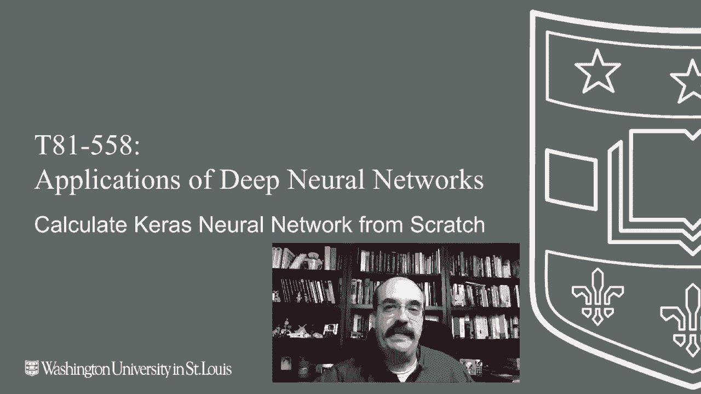
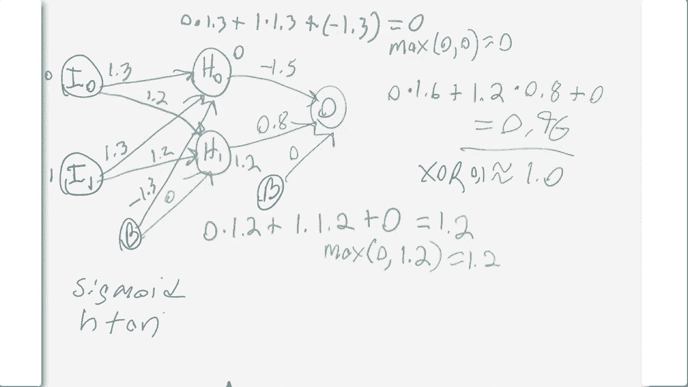

# T81-558 ｜ 深度神经网络应用 - P21：L3.5 - 提取Keras权重并手动进行神经网络计算 🔍🧮

在本节课中，我们将学习如何从Keras构建的神经网络中提取权重，并手动将这些权重代入公式进行计算。通过这个过程，你将清晰地看到神经网络的计算并非“魔法”，而是一系列基于权重和输入的数学运算。

---

## 概述

我们将使用一个简单的异或（XOR）函数神经网络作为示例。这个网络有两个输入、一个包含两个神经元的隐藏层，以及一个输出。我们将提取训练后网络中的权重和偏置，并手动计算给定输入（例如 `[0, 1]`）的输出值，以验证其与Keras预测结果的一致性。



---

## 神经网络结构与XOR问题

首先，我们回顾一下异或（XOR）函数的逻辑。其真值表如下：

| 输入 A | 输入 B | 输出 |
| :----: | :----: | :--: |
|   0    |   0    |  0   |
|   0    |   1    |  1   |
|   1    |   0    |  1   |
|   1    |   1    |  0   |

XOR的核心规则是：当两个输入相同时，输出为0；当两个输入不同时，输出为1。

我们构建一个最小化的神经网络来解决这个问题。它包含：
*   一个输入层（2个神经元）
*   一个隐藏层（2个神经元，使用ReLU激活函数）
*   一个输出层（1个神经元，用于回归输出）

我们使用均方误差（MSE）作为损失函数，并训练了较长时间（例如100,000个周期）以确保权重收敛到一个有效的解。

---

## 提取Keras模型的权重

训练完成后，我们可以从Keras模型中提取每一层的权重和偏置。以下是为我们的XOR网络提取的权重示例（数值为示意，具体值可能因训练而异）：

```
层 [0] 权重:
[[ 1.3, -1.3],
 [-1.2,  1.2]]
层 [0] 偏置:
[0., 0.]

层 [1] 权重:
[[ 1.6],
 [ 0.8]]
层 [1] 偏置:
[0.]
```

**说明**：
*   `层 [0]` 对应从输入层到隐藏层的连接。
*   权重矩阵的每一列对应一个隐藏层神经元，每一行对应一个输入。
*   偏置向量对应每个隐藏层神经元的附加输入。
*   `层 [1]` 对应从隐藏层到输出层的连接。

---

## 手动计算神经网络输出

现在，我们使用提取的权重，手动计算当输入为 `[0, 1]`（期望输出为1）时神经网络的输出。

上一节我们提取了权重，本节中我们来看看如何用它们进行计算。

### 步骤一：计算隐藏层神经元的加权和

隐藏层的每个神经元接收来自两个输入和一个偏置的连接。其输出是输入的加权和，再经过激活函数（本例为ReLU）。

以下是计算第一个隐藏神经元（H0）值的公式：

**H0 = max(0, (I0 * W00) + (I1 * W10) + B0)**

代入我们的值：
*   I0 = 0, I1 = 1
*   W00 = 1.3, W10 = -1.3 （来自层[0]权重的第一列）
*   B0 = 0.0

计算：
H0 = max(0, (0 * 1.3) + (1 * -1.3) + 0) = max(0, -1.3) = **0**

接下来计算第二个隐藏神经元（H1）：

**H1 = max(0, (I0 * W01) + (I1 * W11) + B1)**

代入值：
*   I0 = 0, I1 = 1
*   W01 = -1.2, W11 = 1.2 （来自层[0]权重的第二列）
*   B1 = 0.0

计算：
H1 = max(0, (0 * -1.2) + (1 * 1.2) + 0) = max(0, 1.2) = **1.2**

### 步骤二：计算最终输出层

输出层神经元接收来自两个隐藏神经元和一个偏置的连接。我们直接计算其加权和（本例输出层未使用激活函数，或视为线性激活）。

以下是计算最终输出（O）的公式：

**O = (H0 * W20) + (H1 * W21) + B2**

代入值：
*   H0 = 0, H1 = 1.2
*   W20 = 1.6, W21 = 0.8 （来自层[1]权重）
*   B2 = 0.0

计算：
O = (0 * 1.6) + (1.2 * 0.8) + 0 = **0.96**

---

## 结果分析与总结

我们手动计算出的输出值为 **0.96**。回顾Keras模型对输入 `[0, 1]` 的预测结果，它非常接近1（例如0.999...）。我们手动计算的结果0.96与1的接近程度，主要取决于从模型中提取权重时保留的精度。这个微小的差异源于计算中我们对权重进行了舍入（例如用1.3代替了更精确的1.29...）。



本节课中我们一起学习了：
1.  **提取权重**：如何从训练好的Keras模型中获取权重和偏置矩阵。
2.  **手动前向传播**：如何将这些权重代入神经网络的前向传播公式，一步步计算隐藏层和输出层的值。
3.  **验证理解**：通过手动计算，我们证实了神经网络的工作机制本质上是**一系列加权和与激活函数的组合**，并无神秘之处。

对于这样一个简单的网络，你甚至可以尝试手动编码这些权重。然而，对于更复杂的问题和更深层的网络，依赖框架（如Keras）进行自动化的训练和权重优化是必不可少的。

---
感谢观看本教程。在接下来的课程中，我们将探讨更高级的神经网络训练技巧和评估方法。