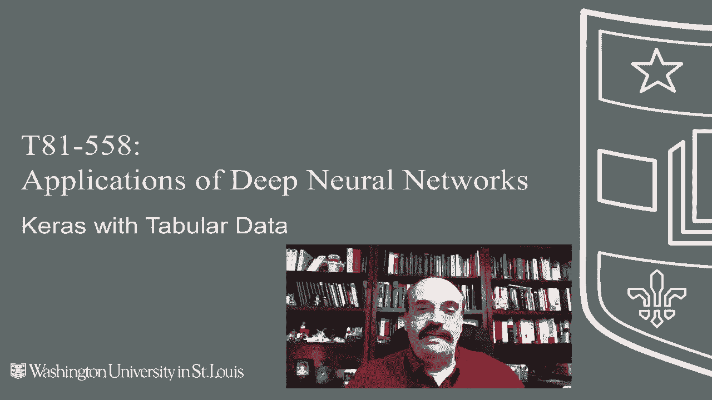
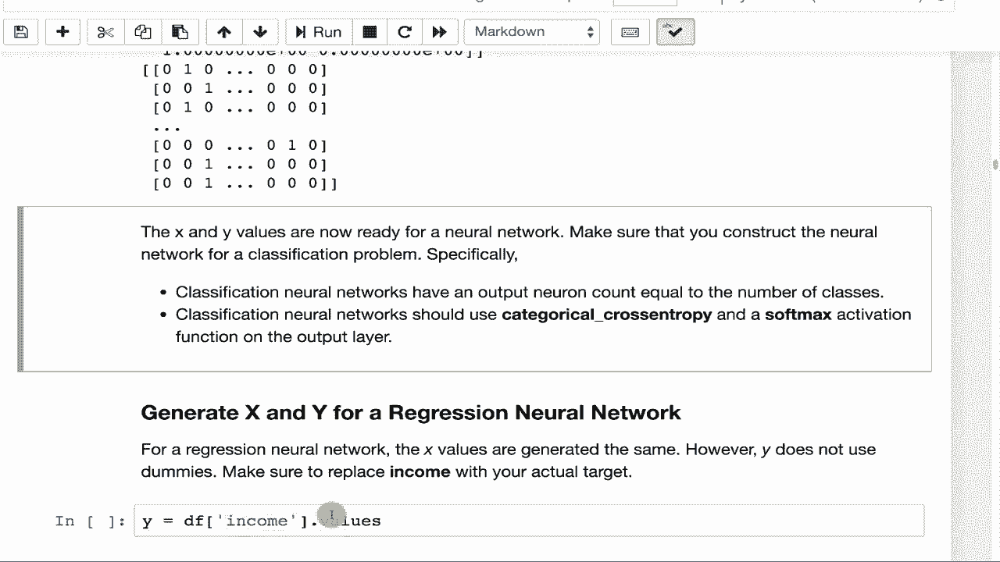

# T81-558 ｜ 深度神经网络应用-P22：L4.1- 为Keras深度学习编码特征向量 🧠

在本节课中，我们将学习如何为深度神经网络准备表格数据。具体来说，我们将探讨如何将包含分类和数值变量的原始数据集，转换成一个纯数字的“特征向量”，以便输入到Keras神经网络中进行训练和预测。

---

## 概述

深度神经网络通常处理图像或音频等复杂数据，但也能处理表格数据。表格数据通常来自类似Excel的文件，包含行和列。我们的目标是基于其他列来预测某一列的值。输入神经网络的所有数据都必须是数字形式，每一行数据在输入时被称为一个“特征向量”。本节课将详细介绍构建这个特征向量的过程。



## 从数据集开始

我们将使用一个示例数据集，其中包含分类变量（如职业、地区）和数值变量（如年龄、收入）。我们试图预测的目标是每个个体购买的产品（A、B、C或D）。


运行程序可以查看数据集的基本构成。数据集中有一个`ID`列对我们预测没有帮助，因此需要移除。此外，许多字段虽然是数字，但仍需进一步处理以优化神经网络性能。

## 处理数值变量

直接将原始数值输入神经网络可能效果不佳，主要因为不同特征的量纲和范围差异很大。例如，收入可能高达数万，而年龄通常在100以内。这种差异会削弱神经网络的预测能力。

以下是两项关键处理步骤：

1.  **范围调整（归一化）**：将不同特征的数值调整到一致的范围（如0到1之间）。这能显著提升网络的训练效率和预测准确性。
2.  **中心化**：将数据调整到均值为0附近，使数据分布包含大致相等的正负值。这也有助于网络学习。

一个快速实现以上两点的方法是计算**Z分数**。Z分数表示一个数值距离均值有多少个标准差，其公式为：
`z = (x - μ) / σ`
其中，`x`是原始值，`μ`是均值，`σ`是标准差。这样处理后的数据均值为0，标准差为1。

## 处理分类变量

分类变量（如“职业”、“地区”）不能直接作为数字输入。我们需要将其转换为虚拟变量（也称为独热编码）。

以下是处理“职业”列的步骤示例：

```python
# 假设 df 是原始数据框，‘Occupation’ 是分类列
occupation_dummies = pd.get_dummies(df['Occupation'], prefix='Job')
```

运行后，原始的“职业”列被扩展为多个列（例如`Job_Engineer`， `Job_Teacher`），每个列用0或1表示该行是否属于该职业。原始数据有2000行，处理后可能得到33个代表职业的虚拟变量列。

接着，我们需要将这些新生成的虚拟变量列合并回主数据集，并删除原始的“职业”列，以避免信息重复。

```python
df = pd.concat([df, occupation_dummies], axis=1)
df = df.drop(columns=['Occupation'])
```

对“地区”列也进行类似操作。为虚拟变量添加前缀（如`Job_`， `Region_`）是一个好习惯，这有助于在后续步骤中清晰追踪每个特征的来源。

## 处理缺失值

数据中可能存在缺失值，例如“收入”列。一个简单的处理方法是使用中位数来填充缺失值。

```python
median_income = df['Income'].median()
df['Income'].fillna(median_income, inplace=True)
```

更复杂的方法可以考虑特征之间的相关性。例如，收入可能与年龄相关，可以先将年龄分组，然后计算每个年龄组的收入中位数，再用对应组的中位数来填充缺失值，这样结果会更合理。

## 构建特征向量 (X) 和目标变量 (Y)

数据预处理完成后，我们需要分离出特征（X）和我们要预测的目标（Y）。

**对于分类任务（预测产品）：**
1.  **特征X**：包含所有用于预测的列，但**必须排除**目标列“产品”和无用的“ID”列。包含目标列会导致“目标泄露”，使神经网络提前知道答案，从而得到虚假的完美分数但毫无实用价值。
2.  **目标Y**：将“产品”列转换为虚拟变量。由于这是唯一的分类目标，我们通常不添加前缀。

```python
# 构建特征矩阵 X
X_columns = df.columns.drop(['Product', 'ID'])  # 移除目标和ID列
X = df[X_columns].values  # 转换为NumPy数组

# 构建目标矩阵 Y
y = pd.get_dummies(df['Product']).values  # 产品列的独热编码
```
此时，`X`是一个纯数值矩阵，行数等于样本数，列数等于特征数。`Y`也是一个矩阵，行数等于样本数，列数等于产品类别数（A, B, C, D）。对于这种多分类问题，在构建神经网络时，输出层应使用`softmax`激活函数，损失函数应使用`categorical_crossentropy`。

**对于回归任务（预测收入）：**
1.  **特征X**：构建方式与分类任务相同，排除“收入”和“ID”列。
2.  **目标Y**：直接使用“收入”列的数值。注意，如果目标列中有缺失值，通常最好直接删除这些行，而不是填充。

```python
# 构建回归任务的目标 Y
y_regression = df['Income'].values  # 应确保已处理缺失值
y_regression = y_regression.reshape(-1, 1)  # 转换为列向量
```

## 总结

本节课我们一起学习了为Keras深度学习模型编码特征向量的完整流程。我们首先了解了处理表格数据的必要性，然后逐步讲解了如何处理数值变量（归一化、中心化）、如何将分类变量转换为虚拟变量、如何用中位数填充缺失值，最后如何正确构建特征矩阵`X`和目标矩阵`Y`，并特别注意避免目标泄露。这些步骤是将原始数据转化为神经网络可接受输入的关键。

现在我们已经准备好了特征向量，在接下来的课程中，我们将学习如何围绕这个特征向量构建神经网络模型、进行训练并生成预测。



