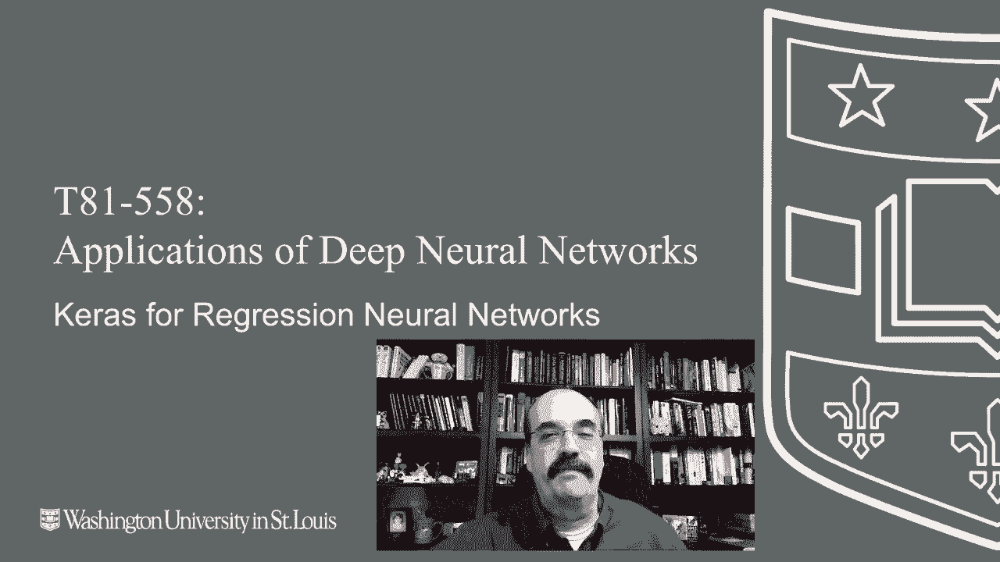
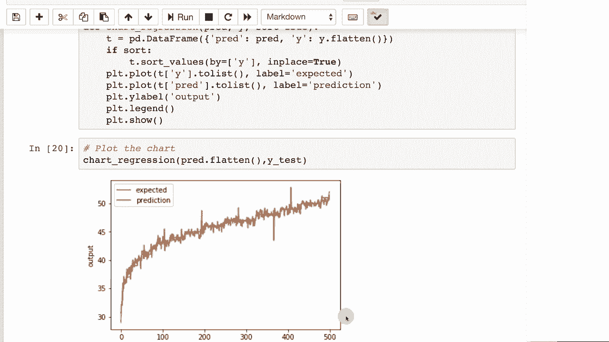

# T81-558 ｜ 深度神经网络应用 - P24：L4.3 - Keras深度神经网络回归建模与RMSE评估 📈

在本节课中，我们将学习如何使用Keras构建一个用于回归任务的深度神经网络。我们将重点介绍如何准备数据、构建模型、训练模型，并使用均方根误差（RMSE）和Ly图来评估模型的预测性能。

---

## 概述



本节课程将演示如何将一个分类问题转化为回归问题，并使用Keras框架构建神经网络模型。我们将使用一个预测个体年龄的示例，涵盖数据预处理、模型构建、训练以及使用RMSE和Ly图进行结果评估的全过程。


---

## 数据准备与特征工程

上一节我们介绍了神经网络的基本概念，本节中我们来看看如何为回归任务准备数据。我们的目标是根据个体的购买产品和其他特征来预测其年龄。

以下是为回归任务准备数据的关键步骤：

*   **处理缺失值**：填充数据集中的缺失数据。
*   **标准化特征**：将不同范围的特征值标准化，使其对神经网络更具预测性。
*   **定义目标变量**：将`年龄`列设置为我们的预测目标`Y`。
*   **划分数据集**：将数据分为训练集和测试集，用于模型训练和评估。

```python
# 示例代码结构
# 假设 df 是原始数据框
# 1. 填充缺失值
df.fillna(method='ffill', inplace=True)
# 2. 标准化特征（例如使用MinMaxScaler）
from sklearn.preprocessing import MinMaxScaler
scaler = MinMaxScaler()
df[feature_columns] = scaler.fit_transform(df[feature_columns])
# 3. 定义特征X和目标Y
X = df.drop(columns=['Age'])
y = df['Age']
# 4. 划分训练集和测试集
from sklearn.model_selection import train_test_split
X_train, X_test, y_train, y_test = train_test_split(X, y, test_size=0.2, random_state=42)
```

---

## 构建与训练回归神经网络

数据准备完成后，接下来我们构建并训练神经网络模型。回归神经网络的核心是使用一个输出神经元来预测连续数值。

以下是构建和训练模型的关键点：

*   **模型结构**：设计一个包含输入层、隐藏层和输出层的神经网络。输出层使用一个神经元（无激活函数）来输出预测值。
*   **损失函数**：对于回归问题，我们使用**均方误差**作为损失函数，其公式为：
    **MSE = (1/n) * Σ(实际值ᵢ - 预测值ᵢ)²**
*   **训练过程**：使用训练数据拟合模型，并观察训练损失和验证损失的变化，以判断模型是否学习良好。

```python
from tensorflow import keras
from tensorflow.keras import layers

# 构建序列模型
model = keras.Sequential([
    layers.Dense(64, activation='relu', input_shape=[X_train.shape[1]]),
    layers.Dense(32, activation='relu'),
    layers.Dense(1) # 输出层，一个神经元，用于回归
])

# 编译模型，指定优化器和损失函数
model.compile(optimizer='adam', loss='mse')

# 训练模型
history = model.fit(X_train, y_train,
                    validation_split=0.2,
                    epochs=50,
                    batch_size=32,
                    verbose=1)
```

---

## 模型评估：RMSE与Ly图

模型训练完成后，我们需要评估其预测性能。单纯使用均方误差（MSE）评估存在单位意义不明确的问题。

因此，我们引入**均方根误差**进行评估，其公式为：
**RMSE = √MSE**

RMSE的单位与原始数据相同，更易于解释。例如，如果RMSE为0.67，意味着预测年龄平均偏离真实年龄约0.67年。

为了更直观地评估模型在整个数据范围内的表现，我们可以使用**Ly图**。生成Ly图的一种常见方法如下：

1.  将测试集的**实际年龄值**按从小到大的顺序排序。
2.  保持**预测值**与实际值的对应关系，并按照实际值的排序顺序排列。
3.  在图表中，X轴代表数据点的索引（0%到100%），Y轴代表年龄值。
4.  绘制两条线：一条是单调递增的实际值线，另一条是对应的预测值线。

在理想的完美预测中，两条线将完全重合。在实际图表中，我们可以观察：
*   预测线是否紧密围绕实际值线。
*   在特定年龄区间（如高年龄段或低年龄段）预测误差是否更大。

下图展示了一个预测效果较好的Ly图示例，预测线基本贴合实际线，但在高年龄段存在一些偏差。




---

## 总结

本节课中我们一起学习了使用Keras进行深度神经网络回归建模的完整流程。我们从数据预处理和特征工程开始，构建了一个以均方误差为损失函数的回归模型，并完成了模型训练。最后，我们引入了**均方根误差**作为更直观的评估指标，并学习了如何使用**Ly图**来可视化模型在整个数据范围内的预测精度分布。掌握这些方法将帮助你有效地构建和评估回归神经网络模型。