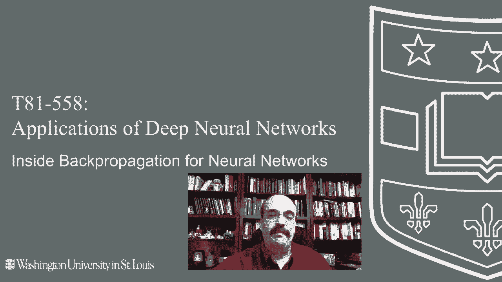
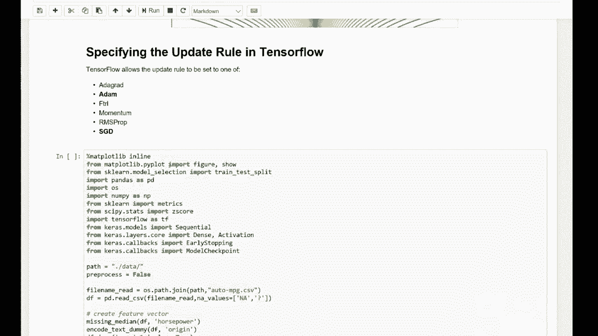

# T81-558 ｜ 深度神经网络应用 - P25：L4.4 - 反向传播、Nesterov动量和ADAM训练 🧠

在本节课中，我们将学习深度神经网络的核心训练算法。我们将深入探讨经典反向传播的工作原理，并了解Nesterov动量、ADAM等现代优化技术如何提升训练效率与效果。



## 概述 📋

反向传播算法是训练神经网络的基础。本节课将解析其内部工作机制，并介绍几种常用的优化技术，包括动量法、随机梯度下降以及自适应矩估计（ADAM）。理解这些概念对于有效设计和训练神经网络至关重要。

## 经典反向传播 🔄

上一节我们介绍了神经网络的基本架构，本节中我们来看看如何通过反向传播来更新网络权重。

反向传播算法已存在多年，Jeffrey Hinton等人对此做出了重要贡献。其核心思想是通过计算损失函数相对于每个权重的梯度，来指导权重的更新方向。

通用的权重更新公式如下：
`θ_t = θ_{t-1} - v_t`
其中：
*   `θ_t` 代表当前时间步 `t` 的权重。
*   `v_t` 是一个向量，表示当前时间步权重的变化量。

单独这个公式信息有限，关键在于如何计算变化量 `v_t`。经典反向传播（即梯度下降）的计算方式为：
`v_t = η * ∇J(θ_{t-1})`
其中：
*   `η` 是**学习率**，控制更新步长，常见值为0.1或0.01。
*   `∇J(θ_{t-1})` 是损失函数 `J` 在上一时间步权重 `θ_{t-1}` 处的梯度。

梯度 `∇J` 是一个偏导数向量。它衡量了当仅微调某一个权重，而保持其他所有权重不变时，损失函数的变化率。我们的目标是沿着梯度反方向（即负梯度方向）更新权重，以减小损失。

学习率的选择至关重要。设置过小，训练速度缓慢；设置过大，可能导致更新步伐过大而无法收敛，甚至在最优值附近震荡。

以下是一个有助于理解反向传播步骤的实用资源链接。

## 动量传播 🚀

经典反向传播容易陷入局部最优解。动量法的引入，旨在赋予优化过程“惯性”，帮助其冲出局部低谷，寻找更好的解。

想象一个球（代表当前权重）滚下山坡。如果没有动量，它可能卡在半山腰的坑里（局部最小值）。动量会给球一个持续的推力，使其有机会滚过小坑，继续寻找更深的山谷（全局最小值）。

动量法的更新公式在梯度下降基础上增加了一项：
`v_t = η * ∇J(θ_{t-1}) + λ * v_{t-1}`
其中：
*   `λ` 是**动量率**，通常设置为较大的值，如0.9。
*   `v_{t-1}` 是上一时间步的更新向量。

新项 `λ * v_{t-1}` 将上一次的更新方向按动量率缩放后累加到本次更新中。当优化方向一致时，动量会不断累积，加速下降；当需要改变方向时，动量也能提供一定的“缓冲”作用，帮助越过障碍。

## 在线、批量与随机梯度下降 📊

在训练神经网络时，我们还需要决定如何利用训练数据来计算梯度。这引出了在线、批量和随机梯度下降的概念。

*   **在线训练**：每计算一个训练样本的梯度，就立即更新一次权重。这种方式更新频繁，路径曲折。
*   **批量训练**：将所有训练样本的梯度累加，求平均后再更新权重。这种方式更稳定，但计算开销大。
*   **小批量随机梯度下降**：这是最常用的方法。它随机抽取一小批（Batch）训练样本（如32或64个），计算其平均梯度并更新权重。它兼具了在线训练的效率和批量训练的稳定性。

“步长”或“迭代”指的是神经网络遍历整个训练集的次数（Epoch）。随机梯度下降通过不断随机采样小批量数据，使得训练过程对噪声更具鲁棒性，并能有效防止过拟合。

## 其他优化技术概览 🧰

除了动量和学习率，研究者们还提出了许多其他优化技术，以解决超参数调优困难、不同权重需要不同学习率等问题。

以下是历史上一些有代表性的方法：
*   **弹性传播**：主要关注梯度符号（更新方向），而非具体数值，无需手动设置学习率和动量。
*   **AdaGrad**：为每个权重维护自适应学习率，但学习率会单调递减至近乎为零。
*   **AdaDelta**：为解决AdaGrad学习率衰减过快的问题而提出。
*   **非梯度方法**：如模拟退火、遗传算法等，适用于损失函数不可导的情况。

## ADAM优化器 ⚙️

ADAM（Adaptive Moment Estimation，自适应矩估计）是一种结合了动量法和自适应学习率思想的流行优化算法。它于2014年被提出，对超参数相对不敏感，通常能取得很好的效果。

ADAM的核心思想是为每个权重计算梯度的一阶矩（均值，提供动量）和二阶矩（未中心化的方差，用于调整学习率），并进行偏差校正。

以下是ADAM算法的简化伪代码描述：
```
初始化：时间步 t = 0，一阶矩估计 m = 0，二阶矩估计 v = 0
循环直到收敛：
    t = t + 1
    计算当前小批量的梯度 g_t
    更新有偏一阶矩估计：m_t = β1 * m_{t-1} + (1 - β1) * g_t
    更新有偏二阶矩估计：v_t = β2 * v_{t-1} + (1 - β2) * g_t^2
    计算偏差校正后的一阶矩估计：m̂_t = m_t / (1 - β1^t)
    计算偏差校正后的二阶矩估计：v̂_t = v_t / (1 - β2^t)
    更新参数：θ_t = θ_{t-1} - α * m̂_t / (sqrt(v̂_t) + ε)
```
其中：
*   `α`：学习率（步长），通常很小（如0.001）。
*   `β1`, `β2`：矩估计的指数衰减率，接近1（如0.9和0.999）。
*   `ε`：一个很小的常数（如10^-8），防止除以零。

ADAM通过自适应地为每个参数调整学习率，并利用动量加速训练，使其在许多任务上表现优异。在Keras/TensorFlow中，可以方便地使用 `tf.keras.optimizers.Adam` 来调用它。

## 优化器对比与选择 🏁

不同的优化器在复杂损失曲面上的“行走”路径和收敛速度差异显著。可视化实验表明，动量法通常能较快积累速度，ADAM等自适应方法也能高效地找到路径。

在实践框架如Keras/TensorFlow中，提供了多种优化器选项，例如 `SGD`, `RMSprop`, `Adagrad`, `Adam` 等。

对于初学者，一个实用的策略是：
1.  通常可以从 **Adam** 优化器开始尝试，因为它对超参数不敏感且收敛速度快。
2.  如果效果不佳，可以尝试 **RMSprop**，尤其在循环神经网络任务中它表现良好。
3.  对于某些问题，使用带动量的 **SGD** 并精心调整学习率衰减计划，可能达到最佳的最终性能。

选择优化器没有绝对标准，需要通过实验根据具体任务和数据集来确定。

## 总结 🎯

本节课中我们一起学习了神经网络训练的核心算法。我们从最基础的**经典反向传播（梯度下降）** 出发，理解了其通过计算梯度来更新权重的原理。为了克服其容易陷入局部最优和训练缓慢的问题，我们引入了**动量法**，它通过累积历史更新方向来加速并稳定训练过程。



接着，我们探讨了利用数据的三种模式：**在线**、**批量**和**小批量随机梯度下降**，其中后者是现代深度学习的主流选择。最后，我们重点介绍了强大的**ADAM优化器**，它巧妙地结合了动量思想和自适应学习率机制，通常能提供快速且稳健的收敛性能。

理解这些优化技术的原理，将帮助你在实际应用中更好地选择、调参并诊断神经网络训练过程中出现的问题。在接下来的课程中，我们将动手实践，深入计算神经网络的内部细节。