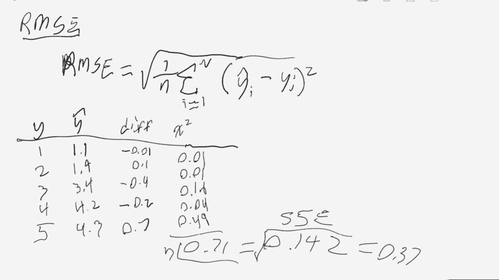

# T81-558 ｜ 深度神经网络应用 - P26：L4.5 - 从头计算神经网络RMSE与对数损失 📊


在本节课中，我们将学习如何手动计算两个关键的神经网络性能评估指标：**均方根误差**和**对数损失**。通过理解这些数值的计算过程，你将能更深入地洞察模型评估的内部机制。

***

## 概述

我们将从回归任务中常用的**均方根误差**开始，然后探讨分类任务中的**对数损失**。我们将逐步拆解它们的计算公式，并通过简单的示例演示手动计算过程，确保你能清晰地理解每一个步骤。

***

## 均方根误差的计算

上一节我们介绍了评估指标的重要性，本节中我们来看看如何计算回归模型的**均方根误差**。

RMSE是回归问题中常用的指标，它衡量的是预测值与真实值之间的偏差。其计算分为几个步骤：首先计算每个预测的误差，然后求平方以消除符号影响，接着计算这些平方误差的平均值，最后取平方根以恢复与原始数据相同的量纲。

以下是计算RMSE的步骤：

1.  **计算误差**：对于数据集中的每一个样本，计算预测值 `y_hat` 与真实值 `y` 之间的差值。
    `error_i = y_hat_i - y_i`

2.  **计算平方误差**：将每个误差值进行平方。
    `squared_error_i = (error_i)^2`

3.  **计算均方误差**：将所有平方误差求和，然后除以样本总数 `n`，得到平均值。
    `MSE = (1/n) * Σ(squared_error_i)`

4.  **计算均方根误差**：对均方误差取平方根。
    `RMSE = sqrt(MSE)`

在代码中，这个过程可以简洁地表示为：
```python
import numpy as np
# 假设 y_true 和 y_pred 是NumPy数组
squared_errors = (y_pred - y_true) ** 2
mse = np.mean(squared_errors)
rmse = np.sqrt(mse)
```

通过手动计算，你可以验证与使用`sklearn.metrics.mean_squared_error`等内置函数得到的结果是否一致。

***

## 对数损失的计算

了解了回归任务的误差计算后，我们转向分类任务的核心评估指标——**对数损失**。它特别适用于评估模型输出为概率的分类器。

对数损失的公式初看可能有些复杂：
`Log Loss = - (1/n) * Σ [ y_i * log(y_hat_i) + (1 - y_i) * log(1 - y_hat_i) ]`

让我们来分解它：
*   `n`：样本数量，用于计算平均损失。
*   `y_i`：第 `i` 个样本的真实标签（通常为0或1）。
*   `y_hat_i`：模型预测第 `i` 个样本为正类（标签为1）的概率。
*   `log`：自然对数。

公式中的负号是为了将结果转换为正数，因为概率的对数值本身为负。核心思想是：**当预测概率接近真实标签时，损失值小；当预测概率远离真实标签时，损失值大，尤其是“自信地预测错误”时，损失会急剧增大**。

为了更好地理解，我们来看一个具体的计算例子。假设我们有以下真实标签和预测概率：

| 样本 | 真实标签 (y_i) | 预测概率 (y_hat_i) |
| :--- | :---: | :---: |
| A | 1 | 0.9 |
| B | 0 | 0.2 |
| C | 1 | 0.1 |

以下是计算每个样本对数损失贡献的步骤：

1.  **对于样本A** (y=1, y_hat=0.9):
    `loss_A = 1 * log(0.9) + (1-1) * log(1-0.9) = log(0.9) + 0 ≈ -0.1054`

2.  **对于样本B** (y=0, y_hat=0.2):
    `loss_B = 0 * log(0.2) + (1-0) * log(1-0.2) = 0 + log(0.8) ≈ -0.2231`

3.  **对于样本C** (y=1, y_hat=0.1):
    `loss_C = 1 * log(0.1) + 0 * log(0.9) = log(0.1) ≈ -2.3026`

4.  **计算总的对数损失**：
    首先求和：`sum_loss = (-0.1054) + (-0.2231) + (-2.3026) = -2.6311`
    然后取平均并加负号：`Log Loss = - (1/3) * (-2.6311) ≈ 0.8770`

在实现时，需要注意**数值稳定性**。例如，应避免对0或1直接取对数，通常会对预测概率进行裁剪（如限制在[1e-15, 1-1e-15]的范围内）。

***

## 总结

本节课中我们一起学习了如何手动计算两个重要的神经网络评估指标。

*   对于**回归模型**，我们通过计算误差、平方、平均、开方四个步骤得到了**均方根误差**，它直观地反映了预测值与真实值的平均偏差程度。
*   对于**分类模型**，我们深入剖析了**对数损失**的公式，理解了它如何通过概率的对数运算来严厉惩罚“自信的错误预测”，并引导模型输出校准良好的概率。



掌握这些指标的手动计算，不仅能帮助你更扎实地理解模型评估，也能在调试模型或实现自定义损失函数时提供坚实的基础。在接下来的课程中，我们将探讨**正则化**技术，它是防止神经网络过拟合的又一利器。

***