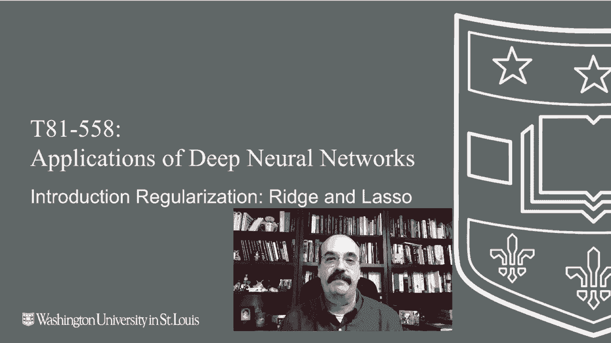
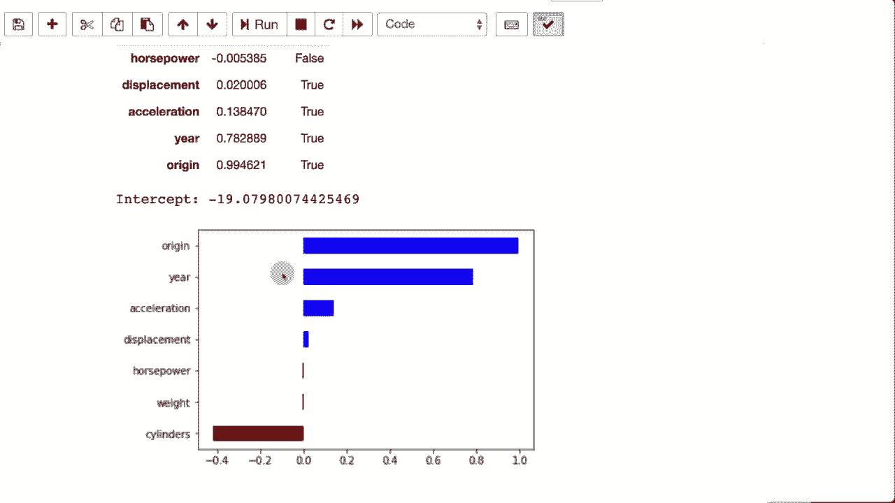

# T81-558 ｜ 深度神经网络应用 - P27：L5.1- 正则化简介：Ridge 和 Lasso 🧠

在本节课中，我们将要学习正则化技术，这是防止神经网络及其他机器学习模型过拟合的重要工具。我们将从线性回归中的两种经典正则化方法——Ridge回归和Lasso回归入手，理解其核心思想，为后续将其应用于神经网络打下基础。

## 概述

正则化是机器学习中用于对抗模型过拟合的技术。许多正则化方法，特别是L1和L2正则化，其起源早于神经网络，可以追溯到线性回归模型。本节我们将通过一个汽车油耗（每加仑英里数，MPG）预测的例子，直观地展示Ridge回归（L2）和Lasso回归（L1）如何工作，以及它们如何通过惩罚模型权重来简化模型、防止过拟合。

## 线性回归基础

在深入正则化之前，我们先回顾标准线性回归。线性回归模型试图找到一组系数（权重），使得预测值与真实值之间的误差最小。模型的公式可以表示为：

**公式：** `y_pred = w1*x1 + w2*x2 + ... + wn*xn + b`

其中，`w` 代表特征 `x` 的系数（权重），`b` 是截距。系数的大小和正负直接反映了该特征对预测目标的重要性。

在我们的例子中，我们使用一个包含汽车气缸数、产地、年份等特征的数据集来预测MPG。通过拟合一个标准线性回归模型，我们可以得到每个特征的系数。例如，气缸数可能呈现强烈的负相关（系数为负），而生产年份可能呈现正相关（系数为正），这意味着年份越新，汽车可能越省油。

## L1正则化：Lasso回归 🎯

上一节我们介绍了标准线性回归，本节中我们来看看Lasso回归。Lasso回归在线性回归的损失函数中增加了L1惩罚项。

L1惩罚项是模型所有权重**绝对值**的总和。这意味着在模型训练时，我们不仅要求预测准确，还要求权重尽可能小。过大的权重会受到惩罚。L1正则化的一个关键特性是它倾向于将一些不重要的特征的权重**完全压缩为零**，从而实现特征选择。

以下是Lasso回归损失函数的核心部分：

**公式：** `Loss = MSE(y_true, y_pred) + alpha * sum(|w_i|)`

其中，`alpha` 是一个超参数，用于控制正则化惩罚的强度。`alpha` 值越大，对权重的惩罚越重，模型会更倾向于选择更少的特征。

运行Lasso回归后，你会发现许多特征的系数变得非常接近或等于零，模型可能只保留了“年份”和“产地”等少数关键特征。尽管使用的特征变少了，但模型的预测得分可能并不会显著下降，这体现了“奥卡姆剃刀”原理：简单的模型往往是更好的。

**注意：** `alpha` 是一个需要调整的超参数。设置过大可能导致模型过于简单而欠拟合，预测误差变大。

## L2正则化：Ridge回归 ⛰️

了解了L1正则化倾向于产生稀疏解后，我们再来看看Ridge回归。Ridge回归使用的是L2正则化。

L2惩罚项是模型所有权重**平方和**。与L1的绝对值惩罚不同，平方惩罚对权大的权重惩罚更重，但不会将其直接设为零，而是让所有权重都均匀地变小。这使得模型的解更加平滑和稳定。

以下是Ridge回归损失函数的核心部分：

**公式：** `Loss = MSE(y_true, y_pred) + alpha * sum(w_i^2)`

同样，`alpha` 控制正则化的强度。当我们运行Ridge回归并设置一个较大的 `alpha` 时，可以观察到所有特征的系数都被不同程度地缩小了，但没有一个被完全消除。这种方法适用于特征之间可能存在共线性，或者我们希望保留所有特征但限制其影响的情况。

## 结合之道：弹性网络（Elastic Net）🕸️

既然L1和L2各有优势，很自然我们会想到能否结合两者。弹性网络（Elastic Net）正则化正是将L1和L2惩罚项结合到同一个损失函数中。

这为我们提供了更大的灵活性。我们可以通过一个参数（通常称为 `l1_ratio`）来调整L1和L2惩罚的混合比例，同时用 `alpha` 控制整体正则化强度。

**公式：** `Loss = MSE(y_true, y_pred) + alpha * [ l1_ratio * sum(|w_i|) + 0.5 * (1 - l1_ratio) * sum(w_i^2) ]`

运行弹性网络模型时，其结果取决于我们设定的 `alpha` 和 `l1_ratio`。它可能同时具备特征选择（来自L1）和稳定权重（来自L2）的优点。这引入了两个需要调优的超参数，在后续课程中，我们将学习如何使用自动化方法（如贝叶斯优化）来高效地寻找这些超参数的最佳组合。

## 总结

本节课中我们一起学习了正则化的基本概念及其在线性回归中的两种经典实现：
*   **Lasso回归（L1正则化）**：通过在损失函数中添加权重的绝对值之和作为惩罚，可以产生稀疏模型，自动进行特征选择。
*   **Ridge回归（L2正则化）**：通过在损失函数中添加权重的平方和作为惩罚，可以使权重整体缩小，获得更平滑、更稳定的模型。
*   **弹性网络**：结合了L1和L2正则化，提供了更灵活的控制能力。

理解这些在线性回归中的正则化技术，为我们下一步在更复杂的深度神经网络中应用Dropout、权重衰减等正则化方法奠定了坚实的基础。在接下来的课程中，我们将探讨如何将这些思想融入神经网络，并使用交叉验证等工具来评估模型性能。