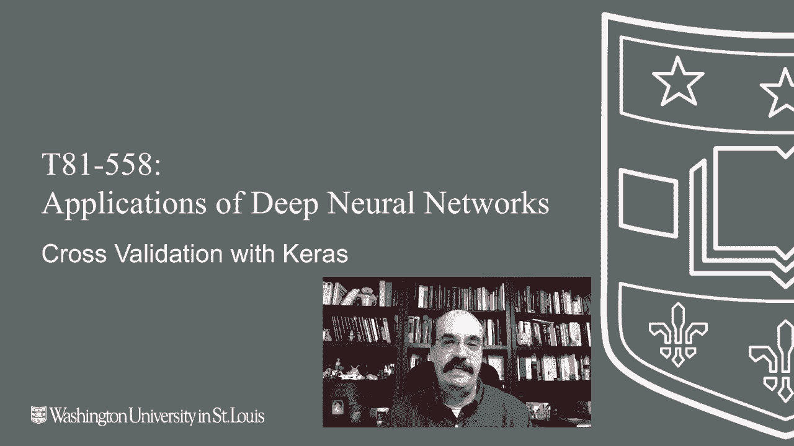
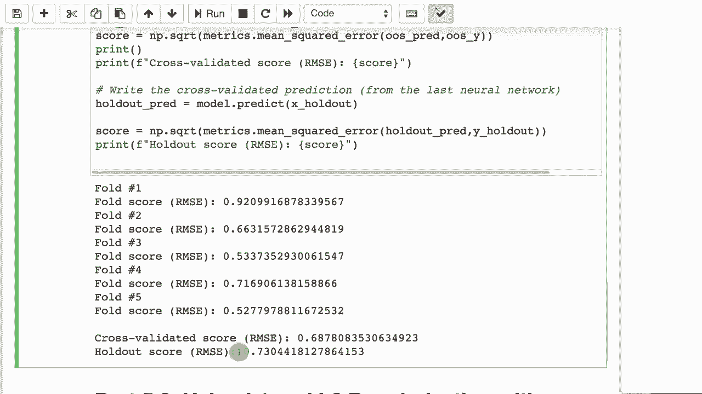

# T81-558 ｜ 深度神经网络应用-P28：L5.2- 在Keras中使用K折交叉验证 📊

## 概述

在本节课中，我们将学习如何使用K折交叉验证来评估深度神经网络在未知数据上的表现。这种方法能帮助我们生成更可靠的样本外预测，并有效评估模型的正则化效果和超参数选择。



---

## 什么是K折交叉验证？🤔

上一节我们介绍了模型评估的基本概念，本节中我们来看看K折交叉验证的具体原理。

K折交叉验证的核心思想是将数据集分成K个大小相似的子集（称为“折”）。然后，模型会被训练K次。在每次训练中，其中一个折被用作验证集，其余K-1个折用作训练集。这样，每个数据点都有机会成为验证集的一部分。

以下是K折交叉验证的基本流程：

1.  **分割数据**：将整个数据集随机打乱，并均匀分成K个折。
2.  **循环训练**：进行K次训练循环。在第i次循环中：
    *   使用第i个折作为验证集。
    *   使用其余所有折作为训练集。
    *   训练模型并在验证集上评估。
3.  **汇总结果**：将K次评估结果（如准确率、均方误差）进行平均，作为模型性能的最终估计。

这种方法的主要优势在于，它充分利用了有限的数据，让每一份数据都参与了训练和验证，从而得到更稳健的性能估计。

---

## K折交叉验证的目标 🎯

K折交叉验证通常用于实现以下几个目标：

*   **生成样本外预测**：通过组合每个折叠作为验证集时的预测结果，可以为整个训练集生成“样本外”预测。这避免了专门划分验证集导致的数据浪费。
*   **确定最佳训练轮次**：当与早停法结合使用时，可以估计出避免过拟合所需的最佳训练周期（epoch）数。
*   **评估超参数**：可以用来测试不同网络结构（如增加隐藏层）或超参数设置的有效性。但由于神经网络的随机性，通常需要进行多次交叉验证（如使用自助法）才能得出可靠结论。

---

## K折交叉验证的工作流程 🔄

理解了目标后，我们来看看其具体的工作流程。假设我们将数据分为5个折。

以下是流程步骤：

1.  **初始化**：准备好5个相同的数据折。
2.  **第一次训练**：选择折1作为验证集，折2、3、4、5合并作为训练集。训练模型A。
3.  **第二次训练**：选择折2作为验证集，折1、3、4、5合并作为训练集。训练模型B。
4.  **后续训练**：重复此过程，直到每个折都充当过一次验证集。最终我们会得到5个训练好的模型（A、B、C、D、E）。
5.  **生成预测**：每个模型在其对应的验证集上做出预测。将所有验证集上的预测结果拼接起来，就得到了针对整个原始数据集的样本外预测。

---

## 如何整合多个模型？ 🧩

训练出多个模型后，我们需要决定如何得到一个最终的模型用于处理新数据。常见的方法有：

*   **选择最佳模型**：选择在验证集上表现最好的那个模型。但需要注意，如果某个模型的得分显著低于其他模型，可能意味着其验证集中包含异常值。
*   **模型平均**：对于新的输入，让所有K个模型都进行预测，然后对它们的输出取平均值（回归任务）或进行投票（分类任务）。这是常用且稳健的方法。
*   **确定训练轮次**：记录每个折叠在早停法触发时所用的训练轮数，计算其平均值（或中位数）。然后用这个轮数，在整个数据集上重新训练一个最终模型。

---

## 代码实践：回归任务中的K折交叉验证 💻

现在，让我们通过代码看看如何在Keras中实现回归任务的K折交叉验证。我们将使用一个预测年龄的简单数据集。

```python
# 导入必要的库
from sklearn.model_selection import KFold
import numpy as np
# ... 其他导入（如TensorFlow/Keras）

# 1. 准备数据 (X, y)
# 假设df是包含特征和目标‘age’的DataFrame
X = df.drop('age', axis=1).values
y = df['age'].values

# 2. 设置交叉验证
kfold = KFold(n_splits=5, shuffle=True, random_state=42)
oos_y = []
oos_pred = []
fold = 0

# 3. 循环遍历每个折叠
for train, test in kfold.split(X):
    fold += 1
    print(f"正在训练折叠 #{fold}")

    # 分割数据
    x_train = X[train]
    y_train = y[train]
    x_test = X[test]
    y_test = y[test]

    # 创建并编译模型
    model = Sequential()
    model.add(Dense(20, input_dim=x_train.shape[1], activation='relu'))
    model.add(Dense(1)) # 回归任务，输出层一个神经元
    model.compile(loss='mean_squared_error', optimizer='adam')

    # 训练模型（这里固定500轮，实际可配合早停）
    model.fit(x_train, y_train, validation_data=(x_test, y_test),
              epochs=500, verbose=0)

    # 在验证集上预测并存储
    pred = model.predict(x_test)
    oos_y.append(y_test)
    oos_pred.append(pred)

    # 打印当前折叠的得分
    score = np.sqrt(metrics.mean_squared_error(y_test, pred))
    print(f"折叠 #{fold} 的RMSE: {score}")

# 4. 汇总最终样本外性能
oos_y = np.concatenate(oos_y)
oos_pred = np.concatenate(oos_pred)
final_score = np.sqrt(metrics.mean_squared_error(oos_y, oos_pred))
print(f="最终的样本外RMSE: {final_score}")
```

**代码说明**：
*   我们使用`KFold`将数据分为5折，并设置`random_state`确保结果可复现。
*   循环中，每次用4折训练，1折验证。
*   存储每次验证集的真实值(`oos_y`)和预测值(`oos_pred`)。
*   循环结束后，拼接所有结果并计算整体的均方根误差(RMSE)作为最终评估。

---

## 代码实践：分类任务中的分层K折交叉验证 🎲

对于分类任务，我们需要特别注意保持每个折中类别比例与原始数据集一致，这称为“分层抽样”。我们将使用`StratifiedKFold`。

```python
# 导入分层K折
from sklearn.model_selection import StratifiedKFold
from tensorflow.keras.utils import to_categorical

# 1. 准备数据
# 假设预测‘product’类别，y_raw是字符串或整数标签
X = df.drop('product', axis=1).values
y_raw = df['product'].values # 原始类别标签
y_cat = to_categorical(y_raw) # 转换为独热编码供神经网络使用

# 2. 设置分层交叉验证
skf = StratifiedKFold(n_splits=5, shuffle=True, random_state=42)
oos_y = []
oos_pred = []
fold = 0

# 3. 循环遍历每个折叠
for train, test in skf.split(X, y_raw): # 注意传入y_raw用于分层
    fold += 1
    print(f"正在训练折叠 #{fold}")

    # 分割数据
    x_train = X[train]
    y_train = y_cat[train] # 训练使用独热编码
    x_test = X[test]
    y_test = y_cat[test]

    # 创建并编译分类模型
    model = Sequential()
    model.add(Dense(20, input_dim=x_train.shape[1], activation='relu'))
    model.add(Dense(y_train.shape[1], activation='softmax')) # 输出层神经元数等于类别数
    model.compile(loss='categorical_crossentropy', optimizer='adam', metrics=['accuracy'])

    # 训练模型
    model.fit(x_train, y_train, validation_data=(x_test, y_test),
              epochs=50, verbose=0)

    # 预测并存储
    pred = model.predict(x_test)
    oos_y.append(y_test)
    oos_pred.append(pred)

    # 评估当前折叠
    score = model.evaluate(x_test, y_test, verbose=0)
    print(f"折叠 #{fold} 的准确率: {score[1]}")

# 4. 汇总最终性能
oos_y = np.concatenate(oos_y)
oos_pred = np.concatenate(oos_pred)
# 将预测概率转换为类别标签
oos_pred_class = np.argmax(oos_pred, axis=1)
oos_y_class = np.argmax(oos_y, axis=1)
final_accuracy = metrics.accuracy_score(oos_y_class, oos_pred_class)
print(f"最终的样本外准确率: {final_accuracy}")
```

**关键区别**：
*   使用`StratifiedKFold`并传入原始类别标签`y_raw`，以确保每个折的类别分布均衡。
*   神经网络输出层使用`softmax`激活函数，损失函数使用`categorical_crossentropy`。
*   评估指标使用准确率(`accuracy`)。

---

## 交叉验证与保留集的结合使用 ⚖️

在实际应用中，可以将K折交叉验证与保留集法结合。具体做法是：先将数据分为训练+验证集（用于K折交叉验证）和最终的测试集（保留集）。

流程如下：
1.  从原始数据中分出一部分作为**最终保留集**，完全不参与交叉验证过程。
2.  对剩余的数据进行**K折交叉验证**，用于模型选择、调参和性能初步估计。
3.  用交叉验证确定的最佳参数或训练轮次，在**整个训练+验证集**上重新训练一个最终模型。
4.  用**最终保留集**对这个模型进行最后一次、也是最公正的评估。

这种方法既充分利用了数据（通过交叉验证），又提供了一个完全独立的测试集来报告模型的泛化能力，结果更为可靠。

---

## 总结



本节课中我们一起学习了K折交叉验证在深度神经网络中的应用。我们了解了它的核心思想、三种主要目标（样本外预测、确定训练轮次、评估超参数）以及具体的工作流程。通过回归和分类任务的代码示例，我们掌握了如何使用`KFold`和`StratifiedKFold`在Keras中实现交叉验证，并了解了如何整合多个模型的结果。最后，我们还探讨了将交叉验证与保留集法结合以获得更稳健评估的策略。掌握这些技巧将帮助你更科学地评估和优化你的神经网络模型。