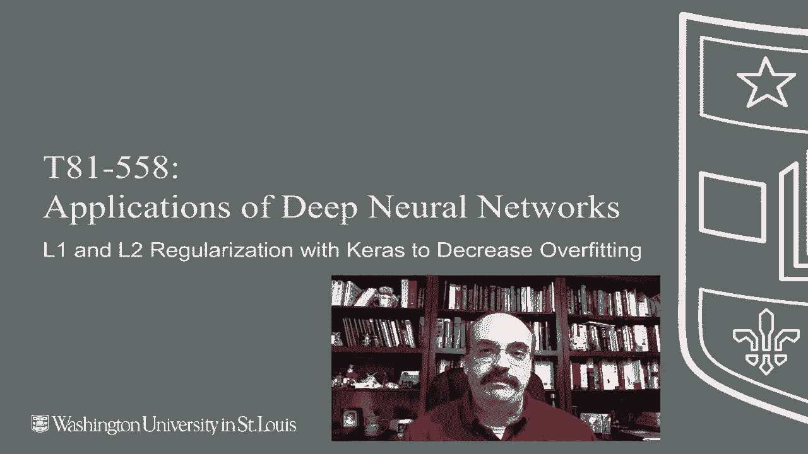
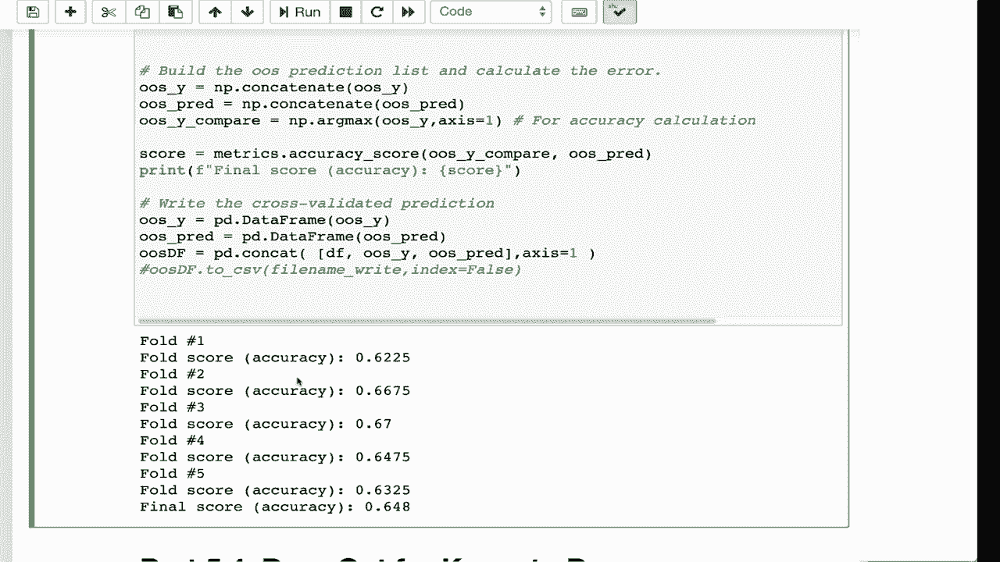

# T81-558 ｜ 深度神经网络应用-P29：L5.3- 在Keras中使用L1和L2正则化来减少过拟合 🛡️

在本节课中，我们将学习如何在Keras框架中应用L1和L2正则化技术，以帮助深度神经网络减少过拟合现象。

## 概述

过拟合是机器学习中常见的问题，它会导致模型在训练数据上表现良好，但在新数据上表现不佳。正则化是一种通过向模型添加约束来防止过拟合的技术。本节课我们将重点介绍两种最常用的正则化方法：L1正则化和L2正则化，并演示如何在Keras中实现它们。

## L1与L2正则化简介

上一节我们介绍了正则化的基本概念，本节中我们来看看L1和L2正则化的具体区别。



L1和L2正则化通过在模型的损失函数中添加一个惩罚项来工作。这个惩罚项基于模型权重的大小。

*   **L1正则化**：在损失函数中添加权重的绝对值之和作为惩罚项。其公式为：
    `L1惩罚项 = λ * Σ|w_i|`
    其中，`λ`是正则化强度系数，`w_i`是模型的权重。L1正则化倾向于产生稀疏的权重矩阵，即它会将一些不重要的特征的权重直接压缩为零，从而实现特征选择。

*   **L2正则化**：在损失函数中添加权重的平方和作为惩罚项。其公式为：
    `L2惩罚项 = λ * Σ(w_i^2)`
    L2正则化会使权重整体变小，但通常不会将它们完全变为零。它更倾向于让所有权重都均匀地变小。

下图直观地展示了L1和L2惩罚项对权重的影响差异：


你可以看到，L1惩罚（绝对值）的图形边缘更尖锐，这解释了为什么它更容易将权重推向零。而L2惩罚（平方）的图形更平滑，它使权重收缩但很少归零。

## 在Keras中应用正则化

理解了L1和L2的基本原理后，我们来看看如何在Keras神经网络中具体应用它们。

在Keras中，正则化可以按层（layer-wise）进行配置。你可以在定义某一层时，通过参数来指定要使用的正则化器及其强度。

以下是配置正则化的核心代码位置：

```python
# 示例：在Dense层上应用L2活动正则化
from keras import regularizers

model.add(Dense(64, activation='relu',
                activity_regularizer=regularizers.l2(0.01)))
```

在上面的代码中：
*   `activity_regularizer` 参数用于对层的**输出（即激活值）** 进行正则化。
*   `kernel_regularizer` 参数（未在示例中显示）用于对层的**权重矩阵**进行正则化。
*   `regularizers.l2(0.01)` 表示使用L2正则化，其中 `0.01` 就是公式中的 `λ` 值，它控制正则化的强度。

**关于活动正则化与内核正则化**：两者的主要区别在于正则化项应用的计算节点不同。活动正则化作用于激活函数之后的值，而内核正则化作用于权重本身。根据经验，对激活值（`activity_regularizer`）应用L2正则化通常效果更好。当然，最佳选择需要通过实验来确定。

## 实践步骤与注意事项

现在，让我们将理论付诸实践，并了解一些关键的实验细节。

我们将使用一个示例数据集进行分类任务。以下是构建和评估带正则化模型的步骤及要点：

1.  **定义正则化参数**：在模型架构中，为你认为需要正则化的层（通常是全连接层）添加 `activity_regularizer` 或 `kernel_regularizer`。你可以自由选择L1、L2或同时使用两者（Elastic Net）。

2.  **调整正则化强度**：`λ` 值（如上面代码中的 `0.01`）是一个重要的超参数。设置为 `0` 意味着不应用正则化。值太大会导致训练不稳定或模型欠拟合。寻找最佳值需要一些优化和试错。

3.  **训练与评估**：像往常一样编译和训练模型。为了公平地比较不同正则化设置的效果，务必在交叉验证中设置固定的随机种子（例如 `random_state=42`），以确保数据划分的一致性。

4.  **处理神经网络的随机性**：需要注意的是，神经网络训练本身具有随机性（如权重初始化），即使使用相同的正则化参数，多次运行的结果也可能有波动。因此，不能仅凭一次运行的结果就断定某个设置更好或更差。更可靠的方法是使用自助法（Bootstrap）等技术多次运行实验，然后取平均结果来进行比较。

5.  **结果分析**：在示例中，我们训练了500个周期（epoch）并进行了交叉验证。观察模型在验证集上的准确率，可以帮助我们判断正则化是否有效防止了过拟合，并提升了模型的泛化能力。

## 总结

本节课中我们一起学习了如何使用L1和L2正则化来改善Keras深度神经网络的性能。

*   我们回顾了L1和L2正则化的数学原理及其对模型权重的不同影响。
*   我们掌握了在Keras中通过 `activity_regularizer` 和 `kernel_regularizer` 参数为网络层添加正则化的方法。
*   我们探讨了在实践中应用正则化时的关键步骤，包括参数调整、设置随机种子以保障可比性，以及理解神经网络输出的固有波动性。

正则化是优化模型、提升其泛化能力的重要工具。在下一个视频中，我们将讨论另一种专门为神经网络设计的强大正则化技术——Dropout。




课程内容会持续更新，请订阅频道以获取关于本课程及其他人工智能主题的最新信息。