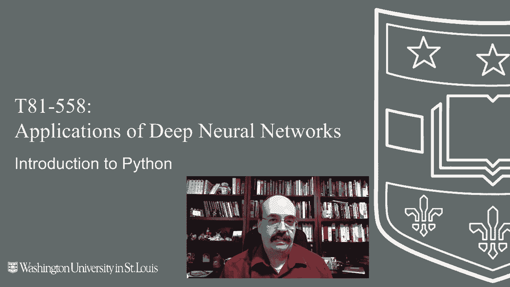
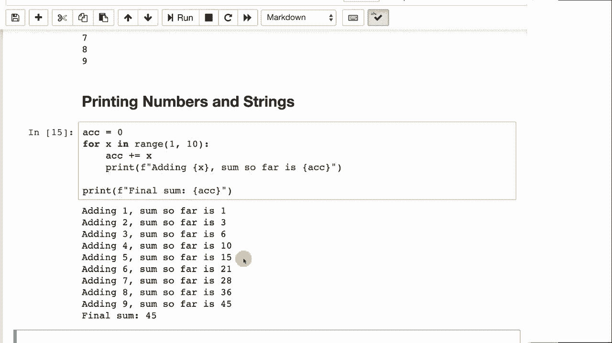

# T81-558 ｜ 深度神经网络应用 - P3：L1.2 - 深度学习 Python 简介 🐍

在本节课中，我们将学习 Python 编程语言的基础知识。这些知识将帮助你顺利完成本学期的课程，并为后续使用 TensorFlow 和 Keras 等深度学习框架打下基础。课程内容从最基本的打印语句开始，逐步介绍变量、循环、条件语句等核心概念。

## 概述



本部分内容面向 Python 初学者。我们将从 Python 编程语言的最基本知识开始，学习如何打印字符串和数字、使用循环和条件语句。如果你已经非常熟悉 Python 基础，可以考虑跳过这一部分。模块 1 的所有内容都是关于 Python 编程语言的介绍，但在后面的部分我们会深入探讨更高级的主题，如 pandas 和 NumPy。

我们使用的是 Python 3 编程语言。请确保你使用 Python 3，因为 Python 2 在语法上存在差异，可能导致代码出现问题。

## 打印语句与注释

像大多数编程语言教程一样，我们将从“Hello World”开始。

在 Python 中，使用 `print()` 函数进行打印。你需要使用开括号和闭括号，并传递一个字符串参数。

```python
print("hello world")
```

在旧版本的 Python（Python 2）中，打印可以不加括号，但这与 Python 的函数处理方式不一致，因此已被弃用。如果你遇到没有括号的 `print` 语句，请确保加上括号。

你可以在 Python 中添加注释。注释很重要，它们可以解释代码的功能，并在你提交作业或调试代码时提供帮助。

```python
# 这是一个单行注释
print("hello world")  # 打印 hello world
```

Python 中的三重引号（三个双引号）允许你创建多行字符串。

```python
print("""这是第一行。
这是第二行。
这是第三行。""")
```

运行上述代码的效果等同于执行三个 `print` 语句，所有换行符都会被自动处理。三重引号有时也用作多行注释，因为如果一个字符串没有被赋值给变量或使用，它不会产生实际效果。

在 Python 中，单引号和双引号可以互换使用。

```python
print('hello world')
print("hello world")
```

选择使用哪种引号时，有时建议用单引号表示更符号化的字符串或字符，用双引号表示人类可读的文本。一个有用的技巧是，如果你想在字符串中包含同种引号，可以使用另一种引号包裹字符串，从而避免使用转义字符。

```python
print("他说：'你好'")
print('名字是 "W"')
```

## 变量与数据类型

数字不需要引号，你可以使用变量。Python 中的变量是动态类型的，你不需要提前声明其类型。

```python
a = 10        # a 是整数
b = "10"      # b 是字符串
print(a)
print(b)
```

变量的值可以改变。

```python
a = 10
a = a + 1     # 现在 a 是 11
```

在 Python 中，你也可以使用 `+=` 运算符。

```python
a = 10
a += 1        # 等同于 a = a + 1，现在 a 是 11
```

请注意，像 `a++` 这样的自增运算符在 Python 中不存在。

## 格式化字符串（F-Strings）

当你想将字符串和变量一起打印时，Python 有多种方法。本课程推荐使用 F-Strings。

F-Strings 以字母 `f` 开头，后面跟着单引号或双引号。你可以在花括号 `{}` 中放入变量或表达式。

```python
a = 10
print(f"a 的值是 {a}")
print(f"a 加 5 等于 {a + 5}")
```

Python 有许多打印数字和字符串组合的方法，但在这门课程中我们将统一使用 F-Strings。其他方法（如 `%` 格式化或 `.format()` 方法）也完全正确，只是风格不同。

```python
# 其他方法示例
a = 5
print("a = %d" % a)          # 类 C 语言的 printf 风格
print("a = {}".format(a))    # .format() 方法
print("a = " + str(a))       # 字符串连接
```

## 条件语句（If-Else）

Python 有 `if` 语句，这对控制程序流程非常有用。这也引出了 Python 一个独特的特性：缩进是语法的一部分。空白字符会影响程序的运行。

代码块结构（如 `if` 语句）由缩进来定义。`if` 语句冒号之后所有缩进的部分都属于该 `if` 语句。

```python
a = 5
if a > 5:
    print("a 大于 5")
    print("这是 if 块内的第二行")
else:
    print("a 不大于 5")
```

你可以使用制表符（Tab）或空格进行缩进，但在同一份代码中必须保持一致。如果混用制表符和空格，会导致错误。通常使用 4 个空格或 1 个制表符作为一级缩进。

我们也可以使用 `elif` 来实现多重条件判断，这类似于其他语言中的 `else if` 或 `switch-case` 语句。

```python
a = 6
if a == 5:
    print("a 是 5")
elif a == 6:
    print("a 是 6")
else:
    print("a 是其他值")
```

请注意，在 Python 中，双等号 `==` 表示“等于”，用于比较；单等号 `=` 表示“赋值”，用于给变量赋值。

## 循环（For Loop）

在 Python 中，我们使用 `for` 循环和 `range()` 函数进行迭代。

```python
for x in range(1, 10):
    print(x)
```

`range(1, 10)` 会生成从 1 到 9 的数字序列（不包括 10）。这是一个常见的混淆点。旧版 Python 2 中有一个 `xrange()` 函数，出于效率考虑，但在 Python 3 中，`range()` 已经具备了相同的特性，所以请使用 `range()`。

你可以在循环中结合使用数字和字符串。

```python
accumulator = 0
for x in range(1, 10):
    accumulator += x
    print(f"添加 {x}，当前总和是 {accumulator}")
```

这个程序会计算 1 到 9 的累加和，并打印出每一步的过程。



## 总结

本节课我们一起学习了 Python 编程语言的基础知识。我们从最简单的打印语句和注释开始，了解了变量和动态类型。然后，我们学习了如何使用 F-Strings 来格式化输出，这是本课程推荐的方法。接着，我们探讨了 Python 中条件语句 `if-elif-else` 的用法，并特别注意了缩进在 Python 语法中的重要性。最后，我们介绍了 `for` 循环和 `range()` 函数，并通过一个累加求和的例子进行了实践。

在下一个视频中，我们将更详细地了解 Python 中的列表、字典和其他数据结构的使用方法。这些是构建更复杂程序的基础。