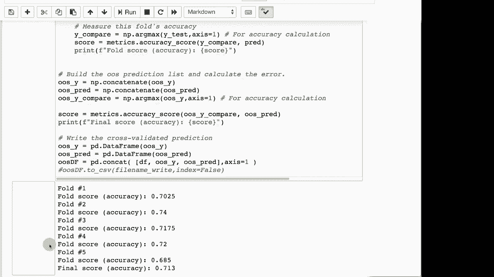

# T81-558 ｜ 深度神经网络应用 - P30：L5.4 - 使用Dropout减少过拟合 🛡️

在本节课中，我们将学习一种名为 **Dropout** 的神经网络正则化技术。我们将了解它的工作原理、如何在Keras中实现它，以及它如何帮助减少模型过拟合，从而提升模型的泛化能力。

## 概述

Dropout是一种在训练神经网络时使用的正则化方法。它通过在每个训练步骤中随机“丢弃”（即暂时禁用）网络中的一部分神经元，来防止网络对训练数据中的特定模式产生过度依赖。这有助于提高模型在未见数据上的表现。

## Dropout的工作原理

上一节我们介绍了L1和L2正则化，本节中我们来看看Dropout。它的核心思想是在训练过程中，随机让网络中的某些神经元失效。


具体来说，Dropout是逐层添加的。你可以为每一层指定一个百分比，例如50%。在每一个训练步骤（或批次）中，该层会有指定比例的神经元被随机选择并临时“关闭”。这些被关闭的神经元在本次前向传播和反向传播中不参与计算，其权重被保留但输出被置零。

**核心概念**：Dropout在训练时随机屏蔽神经元，在预测时使用完整的网络。

这个过程可以类比为一个团队：如果每天公司的CEO随机让一半的员工回家，那么剩下的员工必须学会更灵活地协作，不能过度依赖某个人的专长。这增强了整个团队的鲁棒性。同样，Dropout迫使网络不依赖于任何单个神经元，从而学习到更稳健的特征。

此外，由于每次被丢弃的神经元组合都不同，这相当于在每次迭代中训练了一个略有不同的“子网络”。从效果上看，这类似于训练了多个神经网络并将它们的预测结果进行集成（Ensemble），有助于降低模型输出的方差。

## 在Keras中实现Dropout

在Keras中，实现Dropout非常简单。它通过添加一个专门的 `Dropout` 层来实现，该层作用于其前一层的输出。

以下是实现Dropout的步骤：

1.  导入必要的库。
2.  构建模型架构。
3.  在需要应用Dropout的层之后，添加 `Dropout` 层。
4.  指定丢弃率（dropout rate），例如0.5表示丢弃50%的神经元。

以下是一个代码示例：

```python
from tensorflow.keras.models import Sequential
from tensorflow.keras.layers import Dense, Dropout

model = Sequential()
model.add(Dense(128, activation='relu', input_shape=(input_dim,)))
model.add(Dropout(0.5))  # 在第一个隐藏层后添加Dropout，丢弃50%的神经元
model.add(Dense(64, activation='relu'))
# 通常不建议在最后的隐藏层或输出层之前添加Dropout
model.add(Dense(num_classes, activation='softmax'))
```

**注意**：常见的实践是**不在最后一个隐藏层（紧邻输出层的层）之前添加Dropout**，以确保网络在输出前能整合所有高级特征。Dropout层只在模型训练时生效，在模型评估（验证或测试）和预测时会被自动关闭，使用完整的网络。

## Dropout的效果与注意事项

运行添加了Dropout的模型后，你可能会观察到模型在验证集上的准确率变得更加稳定。例如，在一次运行中得到70%的准确率，再次运行时可能得到71%。虽然Dropout不能完全消除因随机权重初始化带来的结果波动，但它能有效减少这种方差，使模型性能更可靠。

Dropout率（如0.3, 0.5）是一个需要调整的**超参数**。过高的丢弃率可能导致网络欠学习，而过低的丢弃率则可能无法有效防止过拟合。

与L1、L2正则化不同，Dropout提供了一种结构上的、动态的正则化方式。在实际应用中，可以结合使用这些技术来获得最佳效果。

## 总结

本节课中我们一起学习了Dropout正则化技术。我们了解了它通过随机丢弃神经元来防止过拟合的基本原理，学习了如何在Keras中使用 `Dropout()` 层来轻松实现它，并讨论了其使用的最佳实践和效果。

关键要点：
*   Dropout是一种在**训练期间**随机禁用神经元的技术。
*   它在Keras中以**层**的形式实现，作用于前一层的输出。
*   Dropout有助于降低神经元之间的协同适应，增强模型的**泛化能力**。
*   它通常**不应用在网络的最后一层**之前。
*   Dropout率是一个重要的、需要优化的超参数。



在接下来的课程中，我们将对比L1、L2和Dropout等正则化方法，帮助你理解在何种场景下应选择何种技术。