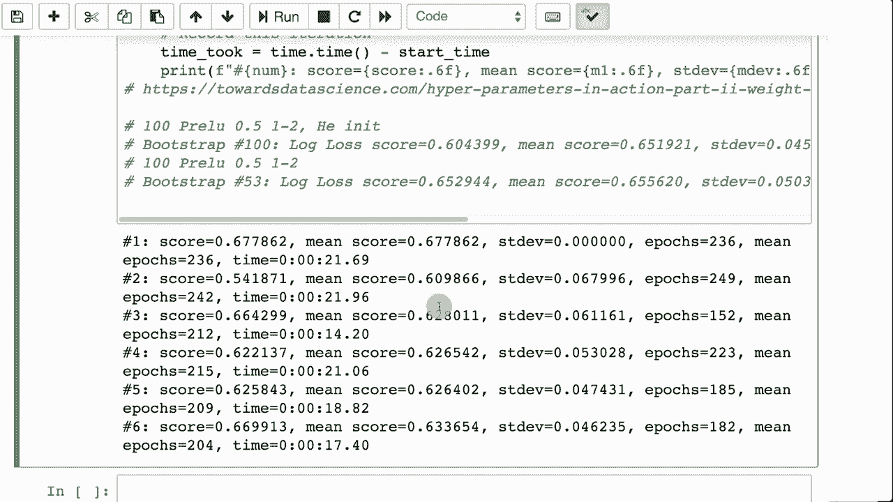

# T81-558 ｜ 深度神经网络应用 - P31：L5.5 - Bootstrapping与基准超参数 📊

在本节课中，我们将学习如何使用Bootstrapping技术来评估神经网络超参数设置的有效性，并建立一个基准测试流程。我们将通过回归和分类两个具体例子，演示如何计算平均性能指标及其标准差，从而判断超参数调整是否真正带来了改进。


## 概述

设计神经网络涉及众多超参数，例如层数、每层神经元数量、激活函数、Dropout比例以及L1/L2正则化值。调整这些参数会影响模型性能，但由于神经网络训练本身存在随机性，准确率或RMSE等指标会自然波动。这使得我们难以判断性能变化是源于参数调整，还是随机波动所致。Bootstrapping技术可以帮助我们更可靠地评估超参数的效果。

## Bootstrapping技术简介

上一节我们介绍了神经网络超参数的种类。本节中，我们来看看如何使用Bootstrapping来评估它们。

Bootstrapping类似于交叉验证，也是一种划分训练集和验证集的技术。其不同之处在于，它不固定折叠数量，而是通过有放回抽样，不断从原始数据集中重新生成训练集和验证集。“有放回”意味着每次抽样后，样本会被放回原数据集，因此同一样本可能出现在多次抽样的不同集合中。

我们将通过多次运行，计算所有运行的平均准确率或均方根误差，以获得神经网络的平均性能。随着运行次数增加，平均误差会逐渐收敛到一个稳定值。我们还将结合早停法，以报告训练所需的平均轮次。

## 回归任务中的Bootstrapping示例

以下是进行回归任务Bootstrapping评估的核心步骤。

```python
# 定义Bootstrapping运行次数
n_splits = 50
# 定义验证集比例
test_size = 0.1
# 设置随机种子以保证可重复性
random_state = 42

# 使用ShuffleSplit进行数据划分
cv = ShuffleSplit(n_splits=n_splits, test_size=test_size, random_state=random_state)

# 初始化列表，用于记录每次运行的误差和训练轮数
scores = []
epochs_needed = []

for train_idx, val_idx in cv.split(X):
    # 划分训练集和验证集
    X_train, X_val = X[train_idx], X[val_idx]
    y_train, y_val = y[train_idx], y[val_idx]

    # 构建并编译神经网络模型
    model = create_model(...) # 包含待评估的超参数
    model.compile(...)

    # 使用早停法进行训练
    history = model.fit(..., validation_data=(X_val, y_val), callbacks=[EarlyStopping(...)])

    # 在验证集上进行预测并计算误差（如RMSE）
    y_pred = model.predict(X_val)
    score = calculate_rmse(y_val, y_pred)
    scores.append(score)
    epochs_needed.append(len(history.history['loss']))

# 计算平均误差、误差标准差和平均所需训练轮数
mean_score = np.mean(scores)
std_score = np.std(scores)
mean_epochs = np.mean(epochs_needed)
```

运行此过程后，我们可以观察平均分数和标准差随运行次数的变化。例如，在运行约36次后，平均RMSE可能收敛在0.74-0.75之间，标准差约为±0.18，平均所需训练轮数收敛在117-118轮左右。这为我们提供了该组超参数下模型性能的可靠估计。

## 分类任务中的Bootstrapping示例

对于分类任务，流程与回归类似，但需要注意保持类别平衡。

以下是关键的不同点：

```python
# 对于分类任务，使用分层抽样以保持验证集中的类别比例
from sklearn.model_selection import StratifiedShuffleSplit

cv = StratifiedShuffleSplit(n_splits=100, test_size=0.1, random_state=42)

# 在划分数据时，需要传入标签y以确保分层
for train_idx, val_idx in cv.split(X, y):
    # ... 后续步骤（构建模型、训练、评估）与回归示例相同
    # 评估指标通常使用对数损失（log loss）或准确率
    score = log_loss(y_val, y_pred_proba)
```

在分类示例中，我们可能使用PReLU等现代激活函数，并在某些层设置Dropout。通过运行足够多次（例如100次），平均对数损失可能收敛到约0.65，并得到一个较低的标准差，这表明Dropout有助于稳定模型性能。

## 建立基准测试流程

为了系统性地比较不同超参数组合，我们需要建立一个基准测试流程。

以下是建立基准测试的步骤：

1.  **定义评估指标**：根据任务类型（回归或分类）确定主要评估指标，如RMSE或对数损失。
2.  **固定数据与划分方法**：使用相同的数据集和Bootstrapping参数（如`n_splits`, `test_size`），确保比较的公平性。
3.  **运行基准模型**：使用一组初始超参数（作为基线）运行完整的Bootstrapping评估，记录平均性能 `mean_score_baseline` 和标准差 `std_score_baseline`。
4.  **调整与对比**：更改一个或一组超参数，再次运行评估，得到新的 `mean_score_new` 和 `std_score_new`。
5.  **结果分析**：比较新参数组与基线模型的平均性能。如果 `mean_score_new` 显著优于 `mean_score_baseline`（例如，考虑标准差范围后仍有提升），则可以认为该调整是有效的。

这个过程可能需要大量计算时间。可以利用本地计算机和云资源（如Google Colab）并行处理不同超参数的测试任务以提高效率。

## 总结



本节课中我们一起学习了Bootstrapping技术在神经网络超参数评估中的应用。我们了解到，由于训练过程的随机性，单次运行的性能指标并不可靠。通过Bootstrapping进行多次有放回抽样运行，并计算平均性能及其标准差，我们可以更稳健地评估一组超参数的有效性。我们还分别演示了在回归和分类任务中实施Bootstrapping评估的代码流程，并介绍了如何以此为基础建立基准测试，从而科学地比较和优化超参数设置。

随着课程深入，我们将接触到更多复杂的模型和数据类型（如图像、时间序列），但系统化评估模型性能的思想始终是核心。