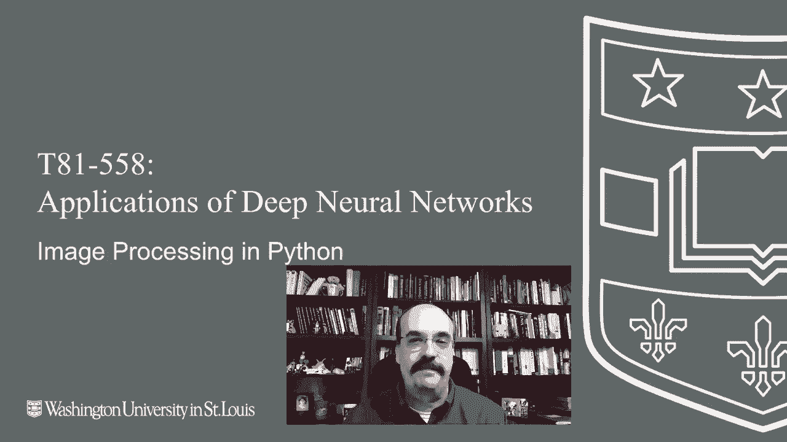
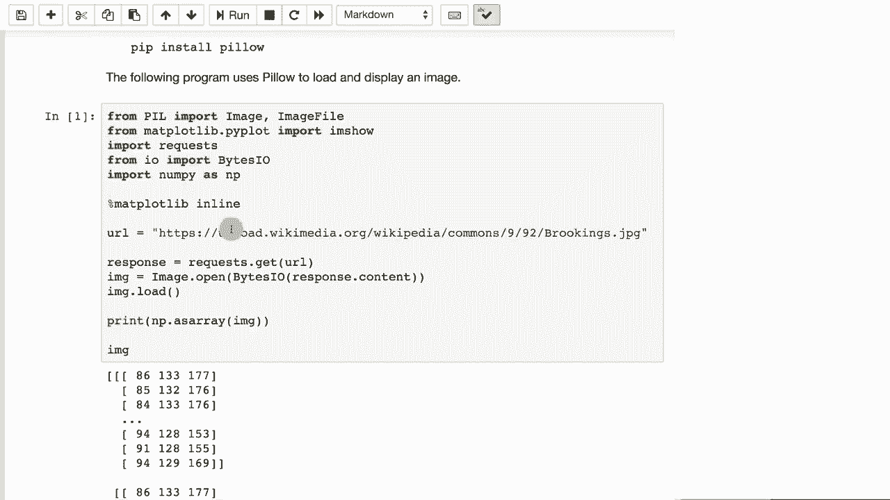
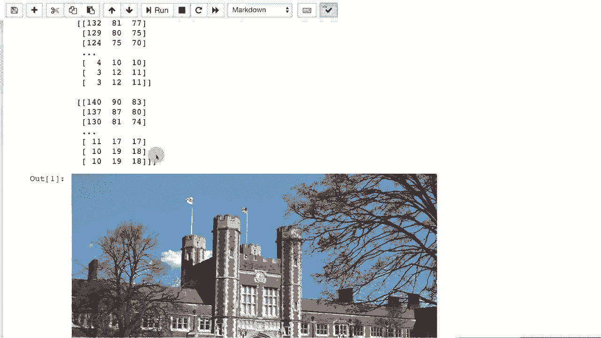
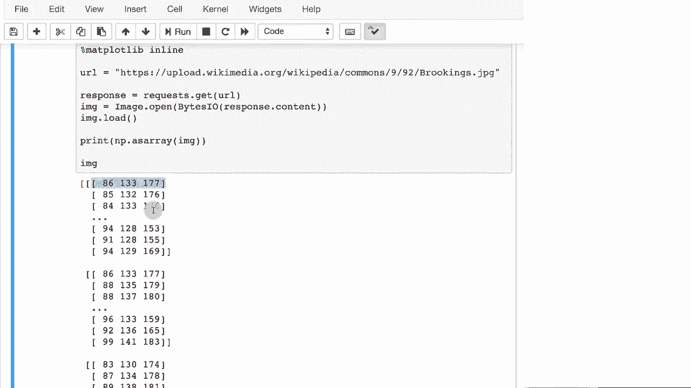
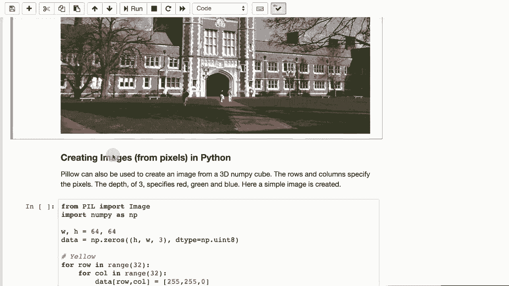
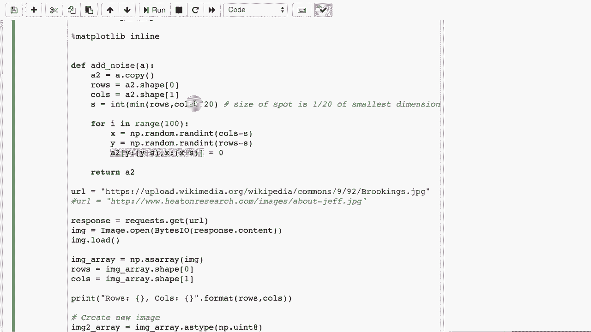

# T81-558 ｜ 深度神经网络应用 - P32：L6.1 - 基于Keras神经网络建模需要的图像处理 📸

在本节课中，我们将学习计算机视觉的基础：如何使用Python处理图像。我们将从加载图像开始，逐步学习如何调整、转换、标准化图像，以及如何为图像添加噪声，为后续的神经网络建模做好准备。

## 概述与工具准备



我们将使用`pillow`包来处理图像。安装过程很简单，只需执行`pip install pillow`。这个包已经包含在课程初始安装列表和Google Colab中。Python中还有其他图像处理包，例如OpenCV，但它的安装更复杂，且我们暂时不需要其高级视频功能，因此我们坚持使用`pillow`。

## 加载与查看图像

首先，我们需要知道如何将图像（如JPEG和PNG格式）加载到Python环境中。`pillow`包允许我们直接加载图像，它来自`PIL`模块。我们可以使用`matplotlib`来查看图像及其变换结果。

以下是从一个URL加载图像的示例代码：

```python
import requests
from PIL import Image
from io import BytesIO
import matplotlib.pyplot as plt

# 从URL获取图像
url = ‘你的图片URL’
response = requests.get(url)
img = Image.open(BytesIO(response.content))

# 显示图像
plt.imshow(img)
plt.show()
```



运行上述代码，你可以看到图像的视觉形式。同时，你也可以查看图像的数值形式，它通常是一个由红、绿、蓝（RGB）三通道值组成的数组。



## 从零创建图像

除了加载，我们还可以从零开始创建图像。这意味着我们可以通过编程方式生成像素数据，然后将其转换为图像。

以下代码创建了一个64x64像素、类似棋盘格的红绿蓝黄四色图像：



```python
import numpy as np
from PIL import Image



height = 64
width = 64
# 创建一个三维数组（高度，宽度，RGB三通道）
data = np.zeros((height, width, 3), dtype=np.uint8)

# 定义每个色块的大小
block_size = 32
# 填充红色块（左上）
data[0:block_size, 0:block_size] = [255, 0, 0]  # 红色
# 填充绿色块（左下）
data[block_size:, 0:block_size] = [0, 255, 0]   # 绿色
# 填充蓝色块（右上）
data[0:block_size, block_size:] = [0, 0, 255]   # 蓝色
# 填充黄色块（右下）
data[block_size:, block_size:] = [255, 255, 0]  # 黄色

# 从数组创建图像
img = Image.fromarray(data, ‘RGB’)
img.show()
```

这段代码通过循环遍历像素位置并分配RGB颜色值，构建了一幅简单的图像。

## 图像转换：转换为灰度图

在实际应用中，我们经常需要对图像进行转换，例如裁剪、调整大小或转换为灰度图。这是在像素级别进行的操作。

以下是将彩色图像转换为灰度图的示例。我们通过计算每个像素红、绿、蓝三通道的平均值来实现：

```python
from PIL import Image
import numpy as np
import matplotlib.pyplot as plt

# 加载图像（假设img已加载）
# 获取图像尺寸
rows, cols = img.height, img.width
# 创建一个新的二维数组用于存储灰度值
gray_data = np.zeros((rows, cols), dtype=np.uint8)

# 遍历每个像素
for row in range(rows):
    for col in range(cols):
        # 获取RGB值
        r, g, b = img.getpixel((col, row))  # 注意：PIL是(宽, 高)
        # 计算平均值作为灰度值
        gray_value = (r + g + b) // 3
        gray_data[row, col] = gray_value

# 从数组创建灰度图像
gray_img = Image.fromarray(gray_data, ‘L’)  # ‘L’ 表示灰度模式
plt.imshow(gray_img, cmap=‘gray’)
plt.show()
```

请注意，使用双重循环逐个像素处理在高分辨率图像上会较慢。更高效的方法是使用NumPy的向量化操作。

## 图像标准化：调整尺寸与归一化

为了让不同尺寸的图像能够输入到神经网络，我们需要对它们进行标准化。这通常包括两个步骤：调整到统一尺寸（如正方形），以及对像素值进行归一化。

以下是标准化图像的步骤：

1.  **调整为正方形**：通过裁剪使图像的长宽相等。
2.  **调整到目标尺寸**：例如，统一调整为128x128像素。
3.  **像素值归一化**：将像素值从0-255的范围转换到-1到1之间（或以0为中心）。

以下是实现代码示例：

```python
def make_square(img):
    """将图像裁剪为正方形"""
    width, height = img.size
    # 计算裁剪区域
    if width > height:
        left = (width - height) / 2
        top = 0
        right = left + height
        bottom = height
    else:
        left = 0
        top = (height - width) / 2
        right = width
        bottom = top + width
    return img.crop((left, top, right, bottom))

# 假设我们有一个图像列表 ‘image_list’
target_size = (128, 128)
normalized_images = []

for img in image_list:
    # 1. 调整为正方形
    square_img = make_square(img)
    # 2. 调整到目标尺寸
    resized_img = square_img.resize(target_size)
    # 3. 转换为数组并归一化
    img_array = np.array(resized_img, dtype=np.float32)
    # 归一化到 [-1, 1]
    img_normalized = (img_array - 128.0) / 128.0
    # 4. 展平数组（可选，取决于网络输入要求）
    flattened = img_normalized.flatten()
    normalized_images.append(flattened)
```

通过以上步骤，我们得到了尺寸统一且数值范围标准化的图像数据，可以直接用于神经网络训练。

## 为图像添加噪声 🎲

在深度学习中，我们有时需要人为地为图像添加噪声，例如用于训练去噪自编码器。添加噪声可以模拟真实世界中的图像退化。

以下是为图像添加随机方块噪声的示例：

```python
import random

def add_noise(img, num_boxes=100):
    """为图像添加随机方块噪声"""
    img_noisy = img.copy()  # 创建副本
    width, height = img.size
    # 计算噪声方块的大小（例如图像最小边长的1/120）
    s = min(width, height) // 120
    pixels = img_noisy.load()  # 获取像素访问对象

    for _ in range(num_boxes):
        # 随机生成方块左上角坐标
        x = random.randint(0, width - s - 1)
        y = random.randint(0, height - s - 1)
        # 随机生成颜色
        r = random.randint(0, 255)
        g = random.randint(0, 255)
        b = random.randint(0, 255)
        # 在方块区域内填充随机颜色
        for i in range(s):
            for j in range(s):
                if x + i < width and y + j < height:
                    pixels[x + i, y + j] = (r, g, b)
    return img_noisy

# 使用示例
noisy_img = add_noise(original_img)
plt.imshow(noisy_img)
plt.show()
```

运行代码后，你将看到原图上叠加了许多彩色小方块，这就是我们添加的噪声。

## 总结

本节课我们一起学习了基于Keras进行神经网络建模前所需的图像处理基础。我们涵盖了以下核心内容：

1.  使用`pillow`包加载和查看图像。
2.  从零开始创建图像，理解图像的RGB数据结构。
3.  将彩色图像转换为灰度图。
4.  对图像进行标准化处理，包括调整尺寸和归一化像素值。
5.  为图像添加随机噪声，为后续的去噪任务做准备。



掌握这些图像处理技能是进入计算机视觉和深度学习领域的重要第一步。在下一节课中，我们将把这些处理好的图像数据输入到卷积神经网络中，开始探索更强大的模型。