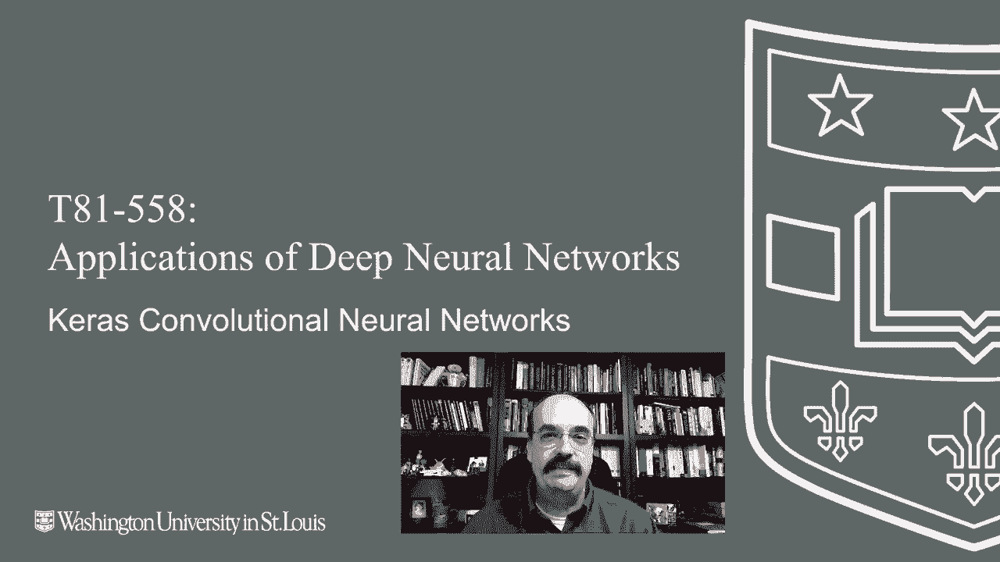
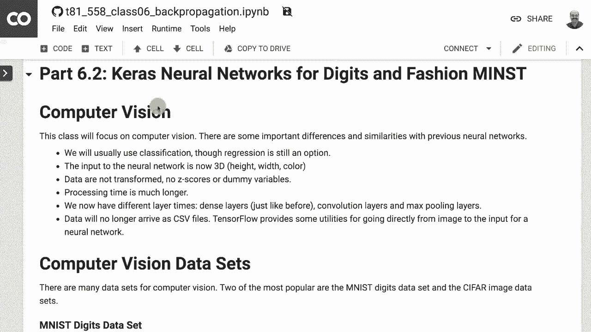
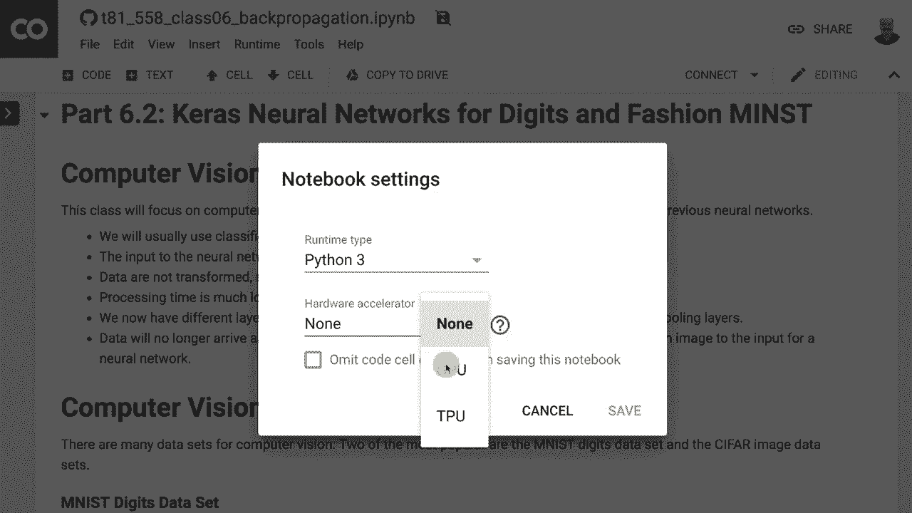
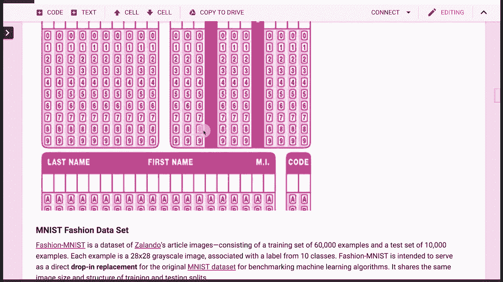
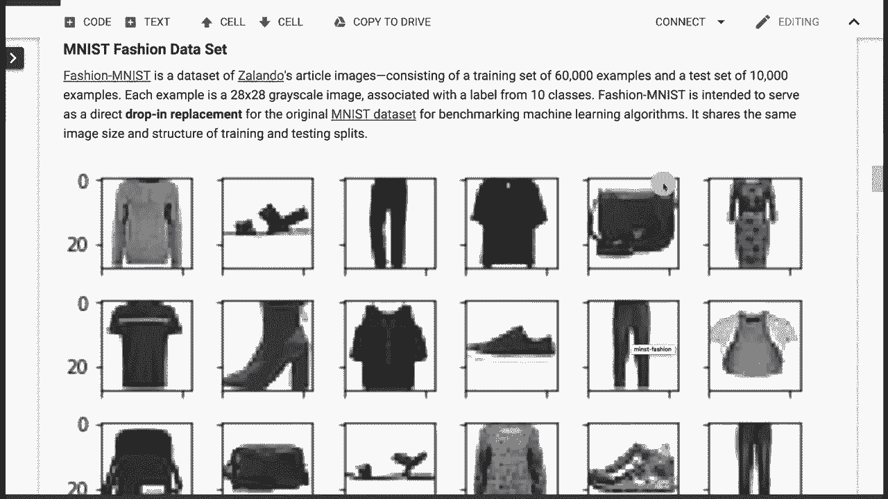
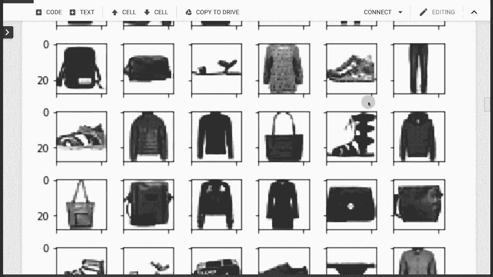
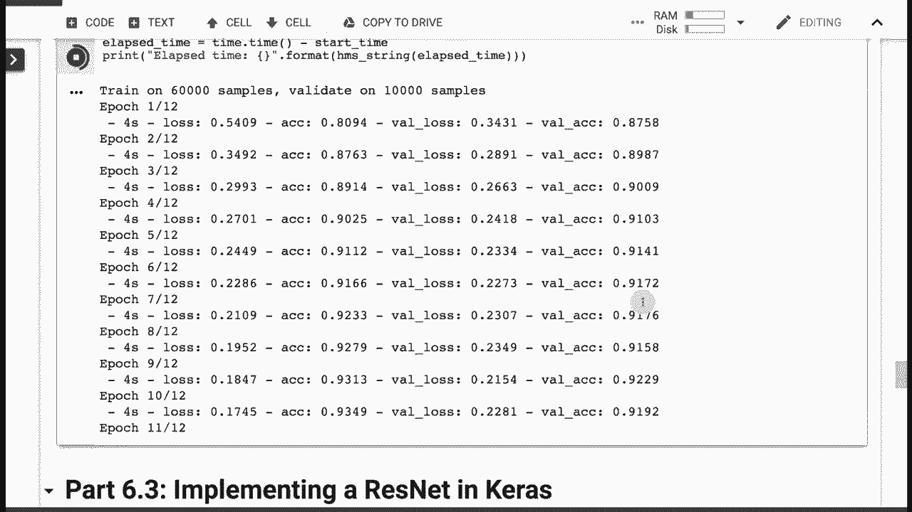

# T81-558 ｜ 深度神经网络应用 - P33：L6.2 - 用于MNIST和Fashion-MNIST的Keras卷积神经网络 🧠

## 概述
在本节课中，我们将学习如何使用Keras构建卷积神经网络（CNN），并将其应用于两个经典的计算机视觉数据集：MNIST手写数字数据集和Fashion-MNIST时尚物品数据集。我们将从加载数据开始，逐步构建、训练和评估一个CNN模型，并理解其核心组件的工作原理。



---

## 1. 环境设置与GPU加速 ⚙️

上一节我们介绍了课程背景，本节中我们来看看运行代码所需的环境设置。为了高效训练卷积神经网络，使用GPU加速至关重要。



我们将使用Google Colab来运行代码，因为它提供了免费的GPU资源。如果不使用GPU，训练过程可能会非常缓慢。

以下是设置Google Colab运行环境的关键步骤：



1.  将运行时类型更改为使用GPU。
2.  连接到课程在GitHub上的代码仓库。
3.  确保Python环境配置正确。

在Colab中，你可以通过菜单栏的 `运行时` -> `更改运行时类型`，然后选择 `GPU` 作为硬件加速器。

---

## 2. 认识数据集：MNIST与Fashion-MNIST 📊

在构建模型之前，我们需要了解将要使用的数据。本节我们将介绍两个结构相似但内容不同的数据集。

MNIST是一个包含28x28像素手写数字图像的数据集，常被视为计算机视觉的“Hello World”程序。它包含60,000个训练样本和10,000个测试样本。



Fashion-MNIST是MNIST的一个替代数据集，格式完全相同（28x28像素，10个类别），但内容换成了10类时尚单品（如T恤、裤子、鞋子等）。它为机器学习模型提供了更具挑战性的任务。



两个数据集都可以通过Keras内置的实用函数方便地加载，无需自行处理原始图像文件。



```python
from tensorflow.keras.datasets import mnist, fashion_mnist

# 加载MNIST数据集
(train_images, train_labels), (test_images, test_labels) = mnist.load_data()
# 加载Fashion-MNIST数据集
(train_images_fashion, train_labels_fashion), (test_images_fashion, test_labels_fashion) = fashion_mnist.load_data()
```

---

## 3. 卷积神经网络（CNN）基础 🏗️

在深入代码之前，我们需要理解卷积神经网络的核心概念。与传统全连接神经网络相比，CNN引入了新的层类型，专门用于处理图像数据。

一个典型的CNN结构包含以下几种层：

*   **卷积层（Convolutional Layer）**：使用过滤器（或称为卷积核）在图像上滑动扫描，学习局部特征（如边缘、角落）。其关键参数包括过滤器数量、过滤器大小（如3x3）、步长和填充方式。
    *   **公式/概念**：特征图 = 输入图像 * 卷积核 + 偏置
*   **池化层（Pooling Layer）**：通常跟在卷积层之后，用于降低特征图的空间尺寸（下采样），减少计算量并增强特征的空间不变性。最大池化（Max Pooling）是最常用的方式。
*   **扁平层（Flatten Layer）**：将多维的特征图数据“压平”成一维向量，以便连接后续的全连接层。
*   **全连接层（Dense Layer）**：与传统神经网络中的隐藏层和输出层相同，用于最终的分类或回归。

CNN通过这种结构，能够分层提取特征：底层学习简单特征（如线条），高层组合这些简单特征形成更复杂的抽象概念（如数字形状或衣物部件）。

---

## 4. 数据预处理 🔧

神经网络对输入数据的尺度很敏感。在将数据送入模型之前，必须进行预处理。

对于MNIST和Fashion-MNIST，每个像素的灰度值范围是0到255。常见的预处理步骤是将其归一化到0到1之间，这有助于模型更快、更稳定地收敛。

```python
# 将图像数据归一化到 [0, 1] 范围
train_images = train_images.astype('float32') / 255
test_images = test_images.astype('float32') / 255

# 对于彩色图像，有时会进行“零中心化”，即减去均值。但对此灰度数据集，归一化已足够。
```

此外，需要将图像数据调整形状，以符合Keras卷积层的输入要求：`(样本数, 高度, 宽度, 通道数)`。对于灰度图，通道数为1。

```python
# 为图像数据添加一个通道维度
train_images = train_images.reshape((60000, 28, 28, 1))
test_images = test_images.reshape((10000, 28, 28, 1))
```

---

## 5. 构建CNN模型 🧩

现在，我们将使用Keras Sequential API来构建一个用于MNIST分类的CNN模型。以下是构建模型的关键步骤和代码。

以下是构建一个简单CNN模型的代码示例：

```python
from tensorflow.keras import models, layers

model = models.Sequential([
    # 第一个卷积块
    layers.Conv2D(32, (3, 3), activation='relu', input_shape=(28, 28, 1)),
    layers.MaxPooling2D((2, 2)),
    # 第二个卷积块
    layers.Conv2D(64, (3, 3), activation='relu'),
    layers.MaxPooling2D((2, 2)),
    # 第三个卷积块
    layers.Conv2D(64, (3, 3), activation='relu'),
    # 将3D特征图转换为1D向量
    layers.Flatten(),
    # 全连接层
    layers.Dense(64, activation='relu'),
    # 输出层，10个类别
    layers.Dense(10, activation='softmax')
])

model.compile(optimizer='adam',
              loss='sparse_categorical_crossentropy',
              metrics=['accuracy'])
```

**模型结构解读：**
1.  输入是形状为 `(28, 28, 1)` 的图像。
2.  经过两个 `Conv2D` + `MaxPooling2D` 的组合，逐步提取特征并降低空间维度。
3.  第三个 `Conv2D` 层进一步提取特征。
4.  `Flatten` 层将数据展平。
5.  一个具有64个神经元的 `Dense` 层进行高级特征处理。
6.  输出层使用 `softmax` 激活函数，输出10个类别的概率分布。

---

## 6. 训练与评估模型 📈

模型构建完成后，我们就可以开始训练了。使用GPU可以显著缩短训练时间。

```python
# 训练模型
history = model.fit(train_images, train_labels,
                    epochs=5,
                    batch_size=64,
                    validation_split=0.2) # 从训练集中划分一部分作为验证集

# 在测试集上评估模型
test_loss, test_acc = model.evaluate(test_images, test_labels, verbose=2)
print(f‘\n测试准确率：{test_acc}’)
```

对于MNIST数据集，一个简单的CNN模型通常能轻松达到99%以上的测试准确率。这也正是Fashion-MNIST被引入的原因——它提供了更具挑战性的基准，模型准确率通常在90%左右，为算法改进留下了更多空间。

**注意**：如果需要对大量数据进行预测（评分），可能会遇到GPU内存不足的问题。解决方案是分批进行预测，或者将预测任务切换到CPU上执行。

---

## 7. 应用于Fashion-MNIST 👗

将上述为MNIST构建的模型应用于Fashion-MNIST数据集非常简单，几乎不需要修改。

只需将加载数据和训练部分的数据变量替换为Fashion-MNIST的数据即可。模型结构、编译和训练过程完全不变。

```python
# 使用Fashion-MNIST数据训练同一个模型结构
history_fashion = model.fit(train_images_fashion, train_labels_fashion,
                            epochs=10, # Fashion-MNIST可能需要更多轮次
                            batch_size=64,
                            validation_split=0.2)
```

你会发现，在Fashion-MNIST上达到高准确率比在MNIST上要困难，这证明了后者作为基准数据集的挑战性。

---

## 总结

本节课中，我们一起学习了卷积神经网络（CNN）的基本原理及其在Keras中的实现。我们主要完成了以下内容：



1.  **设置了GPU加速环境**，认识到GPU对深度学习训练效率的巨大提升。
2.  **认识了MNIST和Fashion-MNIST数据集**，理解了后者作为更复杂基准的意义。
3.  **理解了CNN的核心层**：卷积层、池化层、扁平层和全连接层各自的作用。
4.  **完成了数据预处理**，包括归一化和形状调整。
5.  **使用Keras Sequential API构建了一个完整的CNN模型**，并理解了每一层的含义。
6.  **训练并评估了模型**，在MNIST上获得了极高准确率，并尝试将其应用于Fashion-MNIST。

通过本课的学习，你已经掌握了使用Keras构建和运行基本卷积神经网络来处理图像分类任务的技能。在接下来的课程中，我们将探索更高级的CNN架构，如残差网络（ResNet），以处理更复杂的图像数据。