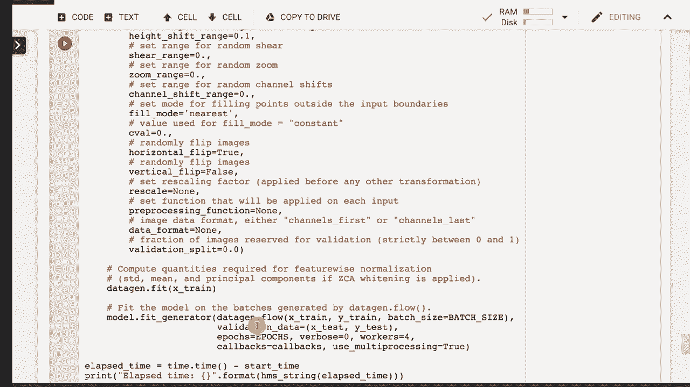

# T81-558 ｜ 深度神经网络应用 - P34：L6.3 - 在 Keras 中实现 ResNet 🧠

在本节课中，我们将学习如何在 Keras 中实现残差网络（ResNet）。ResNet 是一种利用跳跃连接（或称残差连接）的深度神经网络架构，它在图像分类等任务中取得了突破性的成果。我们将了解其核心概念、结构，并逐步解析实现代码。

## 概述

ResNet 的核心创新在于引入了“跳跃连接”，这使得网络能够有效地训练非常深的层次。本节课将首先解释残差块的概念，然后展示如何在 Keras 中构建自定义的 ResNet 层，最后使用 CIFAR-10 数据集进行训练和评估。

---

## 什么是残差网络（ResNet）？

残差网络，或称 ResNet，其独特之处在于使用了跳跃连接。跳跃连接允许数据从某一层直接“跳过”后续的一层或多层，传递到更深的层中。

**核心公式**：一个残差块的基本操作可以表示为：
`输出 = F(x) + x`
其中，`x` 是块的输入，`F(x)` 是经过两层或多层加权和非线性变换后的结果。

这种结构解决了深度神经网络中常见的梯度消失问题，使得训练成百上千层的网络成为可能。

---

## ResNet 的网络结构

上一节我们介绍了残差的概念，本节中我们来看看 ResNet 的具体架构。经典的 ResNet（如 ResNet-34）由多个残差块堆叠而成。

以下是 ResNet-34 的一个简化结构描述：

*   输入层
*   初始卷积与池化层
*   多个由残差块组成的阶段（每个阶段可能包含多个残差块，且卷积滤波器数量递增）
*   全局平均池化层
*   全连接输出层

论文中的实验表明，随着网络深度增加，传统网络的性能会下降，而 ResNet 的性能则可以持续提升。

---

## 在 Keras 中实现 ResNet

现在，我们来看看如何在 Keras 中具体实现一个 ResNet 模型。Keras 本身没有内置的 ResNet 层，但我们可以灵活地自定义构建。

### 数据准备与参数设置

首先，我们需要准备数据和设置训练参数。以下代码展示了如何使用 CIFAR-10 数据集并进行基本设置。

```python
# 示例参数设置
epochs = 200
batch_size = 32
num_classes = 10
# 图像尺寸和通道数
input_shape = (32, 32, 3)
# 像素均值中心化，有助于提升训练效果
subtract_pixel_mean = True
```

### 构建残差块

残差块是 ResNet 的基石。一个基本的残差块包含两个卷积层，以及一个将原始输入与卷积输出相加的跳跃连接。

以下是构建一个残差块（ResNet v1 风格）的关键步骤：

1.  对输入 `x` 进行第一次卷积、批量归一化和 ReLU 激活。
2.  进行第二次卷积和批量归一化。
3.  如果输入 `x` 的维度与第二步输出的维度不匹配，则对 `x` 进行一个 `1x1` 卷积来调整维度（快捷连接投影）。
4.  将调整后的 `x`（或原始 `x`）与第二步的输出相加。
5.  对相加的结果应用 ReLU 激活。

### 学习率调度器

在深度网络训练中，动态调整学习率非常重要。我们通常使用学习率调度器在训练过程中逐步降低学习率。

以下是一个常用的学习率衰减策略示例：

```python
def lr_schedule(epoch):
    lr = 1e-3
    if epoch > 180:
        lr *= 0.5e-3
    elif epoch > 160:
        lr *= 1e-3
    elif epoch > 120:
        lr *= 1e-2
    elif epoch > 80:
        lr *= 1e-1
    return lr
```

### 图像增强

为了防止模型过拟合训练数据，我们通常使用图像增强技术。这会在训练过程中对图像进行随机变换（如翻转、平移、旋转），生成新的训练样本。

Keras 的 `ImageDataGenerator` 可以方便地实现这一功能。

```python
from tensorflow.keras.preprocessing.image import ImageDataGenerator
datagen = ImageDataGenerator(
    rotation_range=15,
    width_shift_range=0.1,
    height_shift_range=0.1,
    horizontal_flip=True,
)
```

---

## ResNet v1 与 v2

我们主要讨论了 ResNet v1 的实现。ResNet v2 是它的一个改进版本，两者主要区别在于批量归一化层的位置。

*   **ResNet v1**：卷积 -> 批量归一化 -> 激活函数。
*   **ResNet v2**：批量归一化 -> 激活函数 -> 卷积。

这种“预激活”的结构被证明能使信息在前向和反向传播中更顺畅地流动，通常能带来更好的性能。

---

## 模型训练与总结

将上述所有部分组合起来：构建模型、编译模型、准备数据、应用图像增强，最后开始训练。由于 ResNet 较深，即使在 GPU 上训练也可能需要数小时。

训练完成后，模型可以在测试集上进行评估，以验证其泛化能力。

---

## 总结

本节课中我们一起学习了残差网络（ResNet）的核心思想与 Keras 实现。我们了解到：

1.  ResNet 通过 **跳跃连接** 解决了深度网络的梯度消失难题。
2.  其核心单元是 **残差块**，执行 `F(x) + x` 的操作。
3.  在 Keras 中，我们可以通过自定义层来灵活构建 ResNet。
4.  成功的训练还需要配合 **学习率调度** 和 **图像增强** 等技术。
5.  ResNet 有 v1 和 v2 等变体，它们在结构细节上有所不同。



通过本教程，你应该能够理解 ResNet 的基本原理，并具备在 Keras 中搭建和训练一个 ResNet 模型的实践基础。