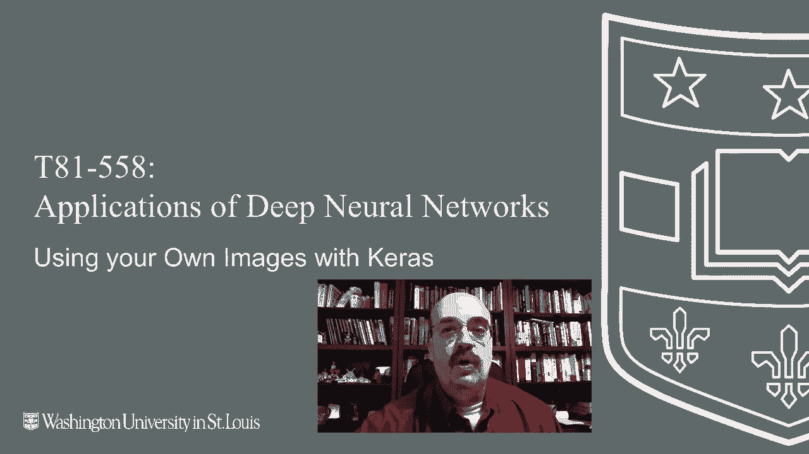
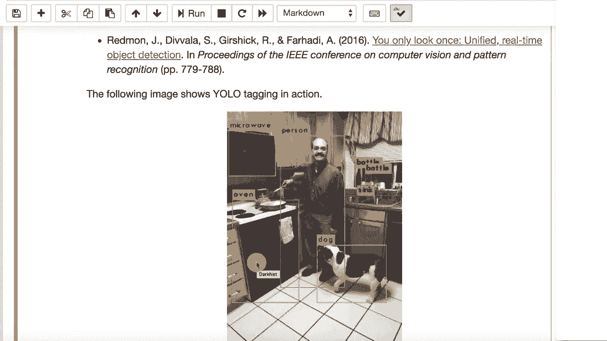

# T81-558 ｜ 深度神经网络应用 - P35：L6.4 - 在 Keras 中使用自己的图像数据 🖼️

在本节课中，我们将学习如何将你自己的图像数据（如JPEG或PNG文件）导入到Keras项目中，并进行预处理，使其能够用于训练神经网络。我们将从理解Keras内置数据集的格式开始，逐步过渡到处理原始图像文件。



## 概述：从内置数据集到原始图像

到目前为止，我们看到的图像示例（如MNIST和CIFAR）都是使用Keras提供的便捷方法加载的。这简化了代码，但了解如何处理原始图像至关重要。原始的JPEG和PNG文件可以导入到你自己的项目中，本节将详细介绍这个过程。

## 理解Keras内置数据集的格式

上一节我们提到了便捷的数据加载方法。本节中，我们来看看这些内置数据集的具体结构，以便为处理自定义图像建立参考。

例如，使用`tensorflow.keras.datasets.cifar10.load_data()`可以加载CIFAR-10数据集。Keras会为你自动拆分好训练集和测试集，以确保实验结果的可比性。

```python
from tensorflow.keras.datasets import cifar10
(x_train, y_train), (x_test, y_test) = cifar10.load_data()
```

查看训练数据的形状，我们可以理解Keras期望的输入格式：

```python
print(x_train.shape)  # 输出: (50000, 32, 32, 3)
```

这里的形状表示：
*   `50000`: 训练样本的数量。
*   `32, 32`: 每张图像的高度和宽度（像素）。
*   `3`: 颜色通道数（RGB）。

这是一个四维张量，也是你需要将自己的图像数据转换成的目标格式。图像像素值通常在0到255之间，但为了获得更好的训练效果，我们通常将其归一化到0-1或-1到1的范围。

## 处理自定义图像的步骤

理解了目标格式后，现在我们来学习如何将一堆大小不一的JPEG/PNG文件转换成Keras可用的张量。这个过程主要涉及图像读取、尺寸调整和数值归一化。

以下是处理自定义图像的核心步骤：

1.  **读取图像**：使用`PIL.Image`或类似库从文件或URL加载图像。
2.  **统一尺寸**：神经网络要求输入尺寸一致。你需要将所有图像调整为相同的高度和宽度。
3.  **转换格式**：将PIL图像对象转换为NumPy数组。
4.  **数值归一化**：将像素值从0-255缩放到例如-1到1的范围。
5.  **堆叠数据**：将所有处理好的单个图像数组堆叠成一个四维张量 `(样本数, 高, 宽, 通道数)`。

### 一个简单的图像预处理函数示例

以下是一个将图像调整为正方形并归一化的函数示例：

```python
from PIL import Image
import numpy as np

def preprocess_image(image_path, target_size=(32, 32)):
    # 1. 打开图像
    img = Image.open(image_path)
    # 2. 转换为RGB（确保通道数为3）
    img = img.convert(‘RGB’)
    # 3. 调整大小为目标尺寸
    img = img.resize(target_size, Image.ANTIALIAS)
    # 4. 转换为NumPy数组
    img_array = np.array(img)
    # 5. 归一化到 [-1, 1] 范围
    img_array = (img_array / 127.5) - 1
    return img_array

# 假设 image_list 是图像路径列表
processed_images = [preprocess_image(path) for path in image_list]
# 6. 堆叠成四维张量
x_train_custom = np.stack(processed_images, axis=0)
print(x_train_custom.shape)  # 例如: (1000, 32, 32, 3)
```

## 保存与加载预处理后的数据

处理大量图像可能耗时。因此，将预处理好的数据保存到磁盘，以便后续快速加载，是一个好习惯。

我们可以使用NumPy的`.npy`格式来保存和加载数据：

```python
# 保存数据
np.save(‘my_processed_data.npy‘, x_train_custom)
np.save(‘my_labels.npy‘, y_train_custom)

# 加载数据
x_train_loaded = np.load(‘my_processed_data.npy‘)
y_train_loaded = np.load(‘my_labels.npy‘)
```

## 总结

本节课中，我们一起学习了如何在Keras中使用自己的图像数据。我们从分析内置数据集的张量格式出发，明确了目标数据结构。然后，我们逐步拆解了处理自定义图像的流程：包括读取、统一尺寸、格式转换、数值归一化以及最终的数据堆叠。最后，我们还介绍了如何保存预处理结果以提高效率。掌握这些步骤后，你就可以让神经网络处理任何你感兴趣的图像了，这为进行个性化的图像分类、目标检测等任务打开了大门。



---
**课程预告**：在接下来的内容中，我们将利用本节课学到的知识，在具体的项目中使用自定义图像数据，例如训练一个识别特定物体的分类器。