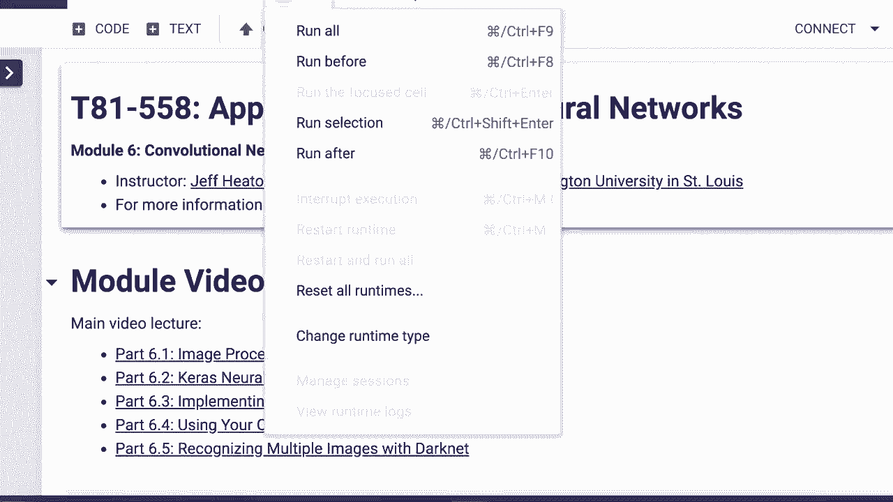
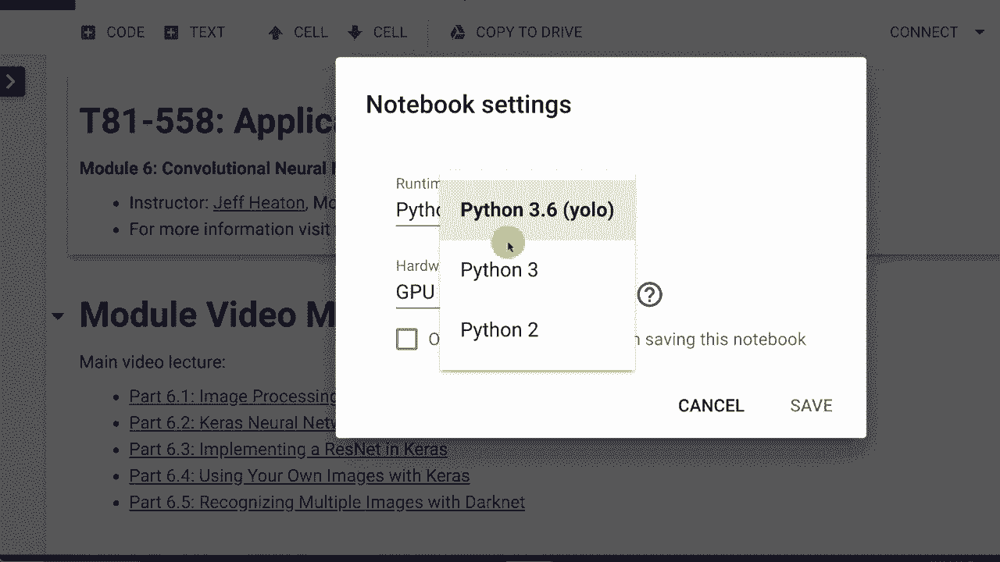
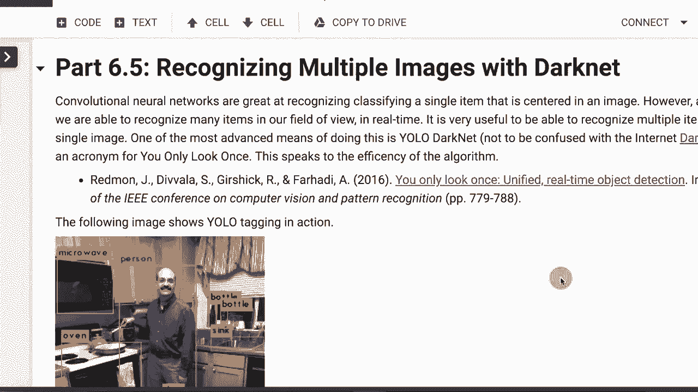
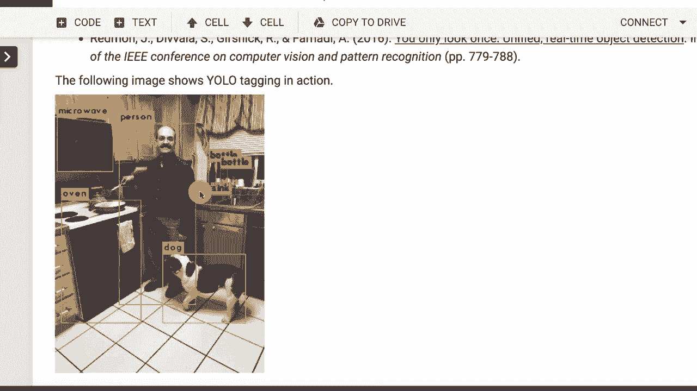
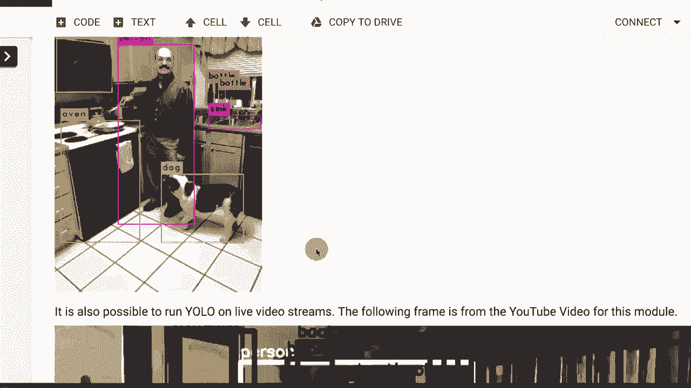
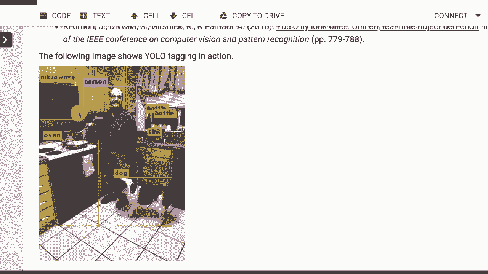
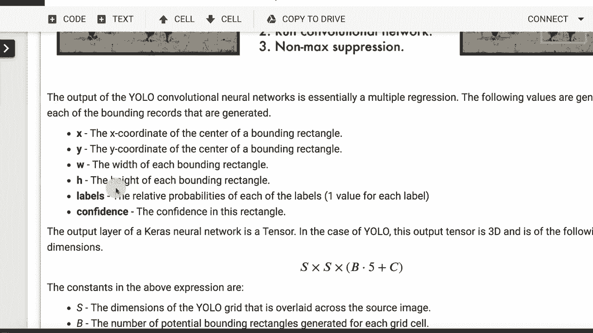
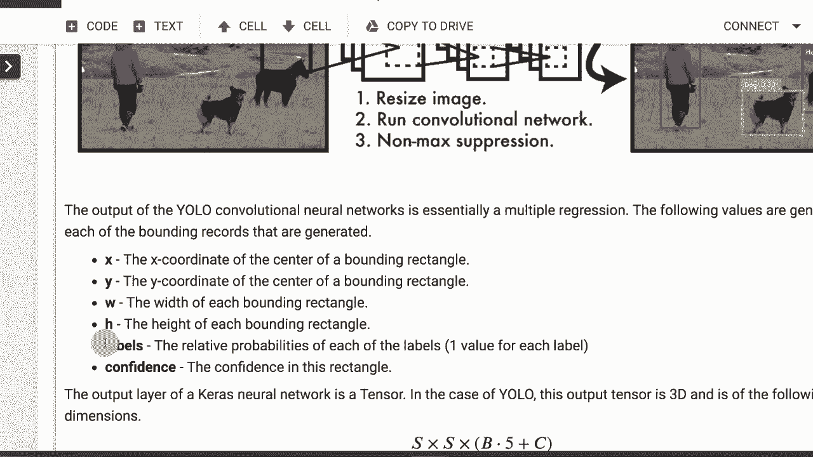
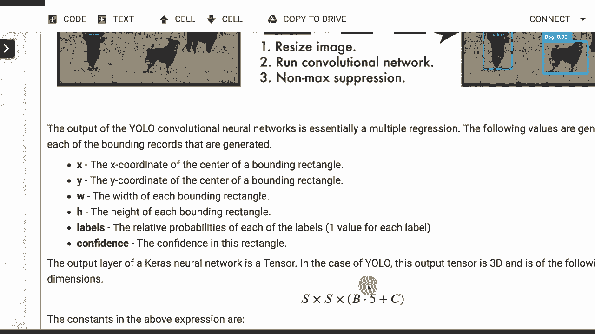
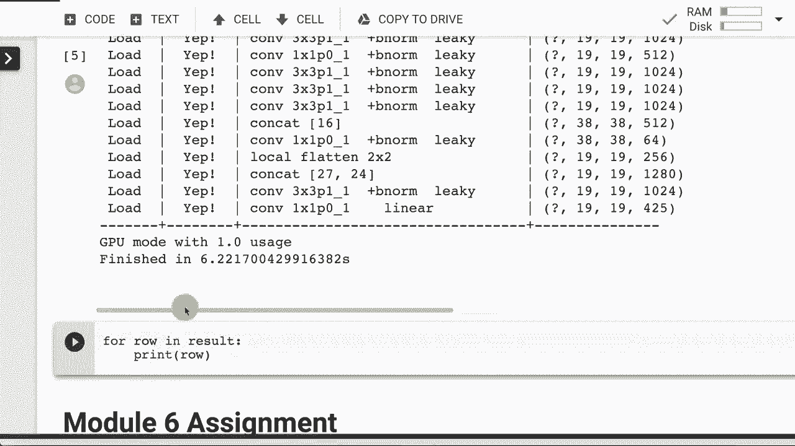

# T81-558 ｜ 深度神经网络应用 - P36：L6.5 - 使用YOLO/Darknet识别多个图像 🖼️🔍

在本节课中，我们将学习如何使用YOLO（You Only Look Once）和Darknet技术，通过一个卷积神经网络来识别图像中的多个物体。我们将了解其工作原理，并学习如何在Python环境中使用TensorFlow和Darkflow库来实现它。

---





## 概述



上一节我们介绍了卷积神经网络的基本应用。本节中，我们将看看如何扩展这种网络，使其能够同时检测和定位图像中的多个不同物体。这项技术被称为YOLO，它通过一个复杂的输出层，在一次前向传播中完成所有检测。

---

## YOLO技术简介





YOLO代表“你只看一次”。这项技术的优势在于，它使用单个卷积神经网络，配合一个相当复杂的输出层。这不仅仅是简单的图像分类，还包含了回归任务。

神经网络可以输出几乎任何你想要的信息。在本例中，输出层会发送多个边界矩形框，以及它认为每个框内包含的物体类别。

在后续模块中，我们将研究生成对抗网络（GANs），它甚至可以输出一张完整的图像。卷积神经网络的输入和输出都可以是图像，这展示了其多功能性。

---

## YOLO的工作原理

YOLO也是一个卷积神经网络，其架构与我们之前看到的类似。它的核心思想是将输入图像划分为一个S x S的网格。网格尺寸通常不会太大，一般在十几的范围内。

神经网络会为每个网格单元预测多个边界框。这些潜在的边界框被称为预测，但大多数预测的置信度不够高，会被丢弃。我们通过设定一个阈值，只保留那些高于该阈值的、相对确定的预测。

你可以调节这个阈值来控制检测的敏感度。

---



## 输出层解析

之前展示的神经网络主要用于分类或回归。YOLO的输出层则兼具两者功能。从技术上讲，原论文称之为回归。

输出层会返回大量边界框。神经网络的输出层是固定长度的，除非是生成式神经网络。YOLO返回的边界框总数是固定的，它是一个张量。





输出层实际上是一个3D张量。你可以将其视为S x S的网格。对于每个网格单元，网络会预测B个可能的边界矩形。

以下是输出层中每个边界框所包含的信息：



*   **中心坐标 (x, y)**：边界框中心的坐标。
*   **宽度和高度 (w, h)**：边界框的尺寸。
*   **置信度 (confidence)**：一个指示该位置是否存在物体的概率值。
*   **类别概率 (class probabilities)**：一个独热编码向量，表示该边界框属于各个类别的概率。标签数量可能很多，例如“人”、“狗”、“房子”等。

对于每个预测框，网络会输出这组值。最终，我们只保留那些置信度高且类别概率最高的预测结果。

输出张量的维度计算公式如下：
`S x S x (B * 5 + C)`
其中，5代表`(x, y, w, h, confidence)`，C是类别的总数。

---

## 网络架构与局限性

YOLO的卷积神经网络包含典型的卷积层、最大池化层和密集连接层，与之前学过的网络没有本质区别。

唯一的区别在于输出层。例如，在原论文中，输入图像被调整为448x448，经过一系列卷积和池化后，输出是一个`7x7x30`的张量。

这项技术也存在一些局限性：
*   识别非常小的物体时存在困难。
*   对于高密度聚集的物体群体（如远处的一群鸟），识别效果可能不佳。

---

## 在Python中使用YOLO

我们将使用Darkflow库在Python中运行YOLO。我们不从头开始训练网络，而是使用论文作者提供的、已经在大规模数据集上训练好的权重文件。这利用了“迁移学习”的思想，我们将在后续课程中详细讨论。

你需要准备三个文件来运行YOLO：
1.  权重文件（`.weights`）
2.  配置文件（`.cfg`）
3.  标签文件（`.names`）

以下是在Google Colab环境中设置和运行Darkflow的步骤概要：

1.  **安装Darkflow**：从GitHub克隆仓库并进行pip安装。
    ```bash
    !git clone https://github.com/thtrieu/darkflow.git
    !cd darkflow && pip install .
    ```
2.  **挂载Google Drive并准备文件**：将预训练好的权重、配置和标签文件上传到Google Drive的特定目录。
3.  **加载模型并运行检测**：在代码中指定模型路径、是否使用GPU，然后对输入图像进行检测。
    ```python
    from darkflow.net.build import TFNet
    import cv2

    options = {"model": "cfg/yolo.cfg", "load": "bin/yolo.weights", "threshold": 0.1, "gpu": 1.0}
    tfnet = TFNet(options)

    img = cv2.imread('your_image.jpg')
    result = tfnet.return_predict(img)
    print(result)
    ```
运行后，程序会输出一个列表，其中包含检测到的每个物体的标签、置信度以及其边界框的坐标。

---

## 总结

本节课中，我们一起学习了YOLO多物体检测技术。我们了解了YOLO如何通过单个卷积神经网络和复杂的输出层，高效地同时识别图像中的多个物体及其位置。我们还实践了如何使用Darkflow库加载预训练模型，在Python环境中实现这一功能。



这项技术是计算机视觉领域的前沿应用之一，可以用于安防监控、自动驾驶、智能家居等多种场景。在下一节课中，我们将开始探索生成对抗网络（GANs），看看神经网络如何创造全新的图像。