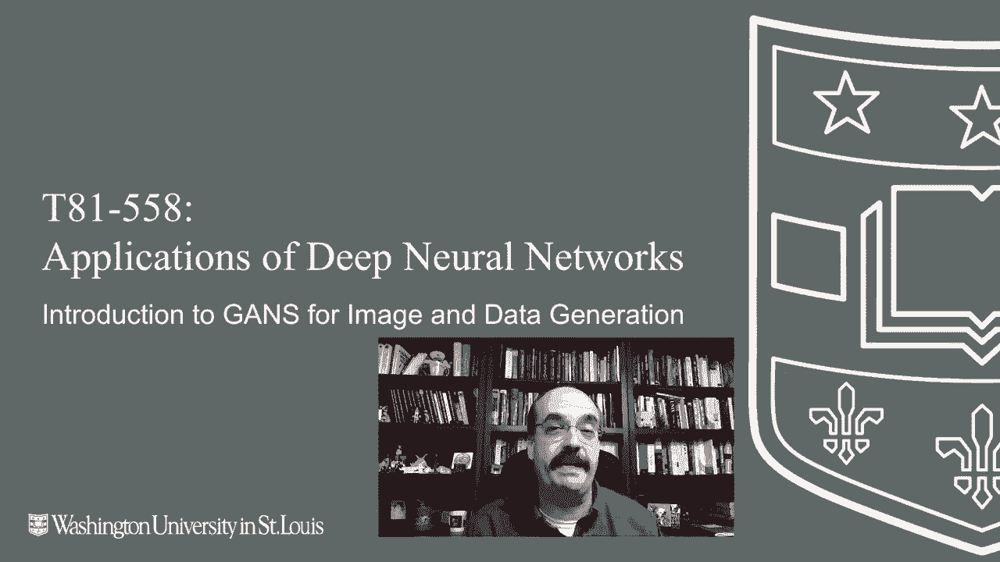
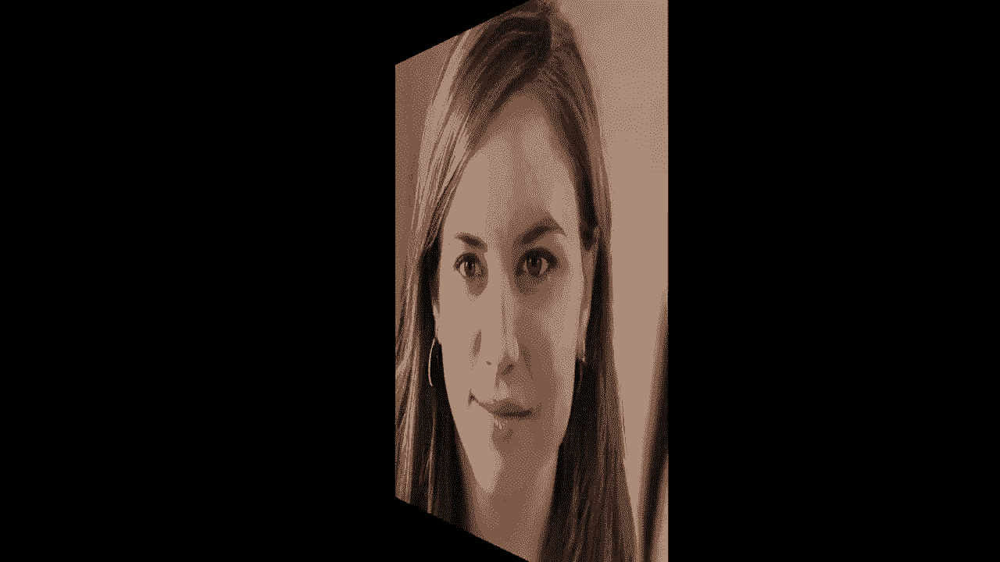
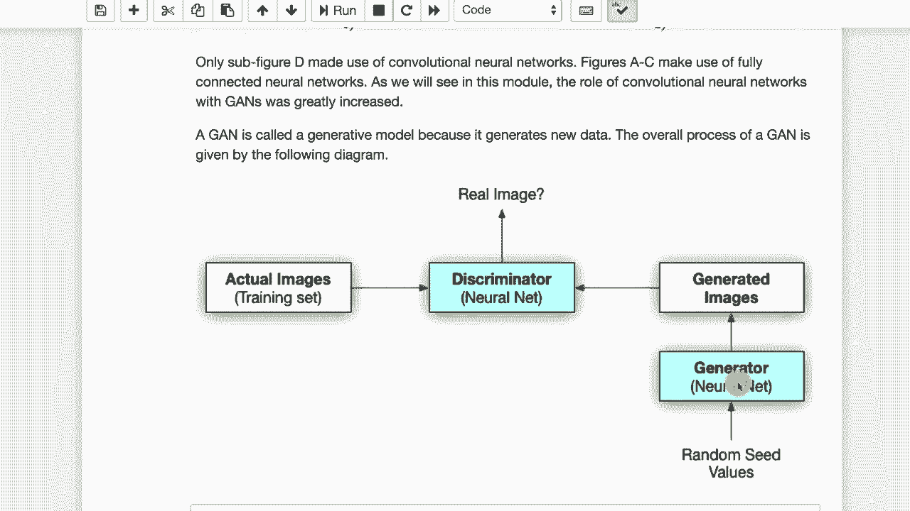

# T81-558 ｜ 深度神经网络应用 - P37：L7.1 - 生成对抗神经网络(GAN)简介 🎭

在本节课中，我们将要学习生成对抗神经网络（GAN）的基本概念。GAN是一种由两个神经网络组成的强大技术，它们相互对抗以生成高度逼真的数据，例如图像。

## 概述

生成对抗神经网络（GAN）由两个协同工作的神经网络组成。一个网络负责生成数据，另一个网络则负责判断数据的真伪。这项技术由伊恩·古德费洛于2014年提出，并迅速成为深度学习领域的热点。

## GAN的基本原理

上一节我们介绍了GAN的总体概念，本节中我们来看看它的核心工作原理。

GAN是“生成对抗神经网络”的缩写。它包含两个关键组件：
*   **生成器 (Generator)**：学习生成能够欺骗判别器的数据。
*   **判别器 (Discriminator)**：学习识别数据是真实的还是由生成器伪造的。

这两个模型处于一种持续的“军备竞赛”中。判别器试图更准确地检测假数据，而生成器则试图生成更逼真的数据来骗过判别器。训练完成后，通常会保留生成器用于生成新数据。

## GAN的应用实例：生成人脸

以下是GAN在生成人脸图像方面的著名应用。

图中显示的人脸是完全由GAN生成的虚拟人物，并不真实存在。这项技术可以通过访问 `thispersondoesnotexist.com` 等网站体验。生成高度逼真的人脸是GAN的突出能力之一。

## 如何识别GAN生成的图像

尽管GAN生成的图像非常逼真，但仍有一些特征可以帮助我们进行识别。

观察图像时，可以关注以下几点：
1.  **背景**：背景可能看起来超现实或不自然，存在强烈的、不合理的渐变或纹理。
2.  **身体部位**：肩部、脖子与头部的连接处可能不自然或不对齐。
3.  **对称性**：耳朵等对称部位可能不完全一致，例如两边的耳环可能完全不同。
4.  **细节融合**：头发等细节可能与背景有异常的融合，像多余的丝线延伸到背景中。

早期的GAN（如2014年论文中所示）生成的面孔相对简单，而现代技术（如StyleGAN）已经能生成极其逼真的图像。

## GAN的训练与组件

现在，我们来深入了解GAN两个核心组件的训练目标。

在训练过程中：
*   判别器的目标是最大化正确分类真实数据和生成数据的能力。其损失函数可以简化为区分“真”与“假”的二分类问题。
*   生成器的目标是最小化判别器做出正确判断的概率，即让判别器将生成的数据误判为“真”。其目标是欺骗判别器。

最终，我们通常得到一个强大的生成器。然而，判别器在半监督学习等场景中也有其价值，我们将在本模块后续部分探讨。

## 本模块内容规划

接下来，我们将在本模块中逐步深入GAN的各个方面。

本模块将涵盖以下几个部分：
1.  **GAN概述与原理**（本节内容）：介绍基本概念和工作方式。
2.  **从头构建GAN**：学习如何构建判别器和生成器模型，并使用随机输入生成数据。
3.  **使用先进GAN模型**：探索如何使用类似NVIDIA StyleGAN的技术生成高质量图像。
4.  **GAN用于非图像数据**：了解如何将GAN应用于生成其他类型的数据以补充数据集。
5.  **GAN研究新方向**：简要介绍GAN领域当前的一些前沿进展。

训练GAN通常需要GPU资源，但我们可以利用Google Colab等工具进行学习和实验。

## 总结

本节课中，我们一起学习了生成对抗神经网络（GAN）的基本概念。我们了解到GAN由生成器和判别器两个神经网络组成，通过对抗训练来生成逼真的数据。我们看到了它在图像生成，特别是人脸生成上的惊人效果，也学习了识别生成图像的一些技巧。最后，我们预览了本课程后续将深入探讨的实践与高级主题。

感谢观看。在下一个视频中，我们将开始动手实现一个简单的GAN。

