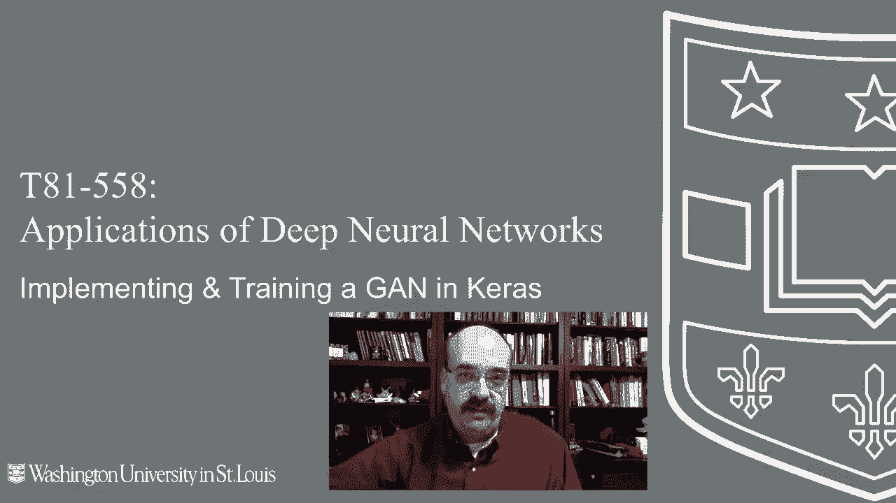
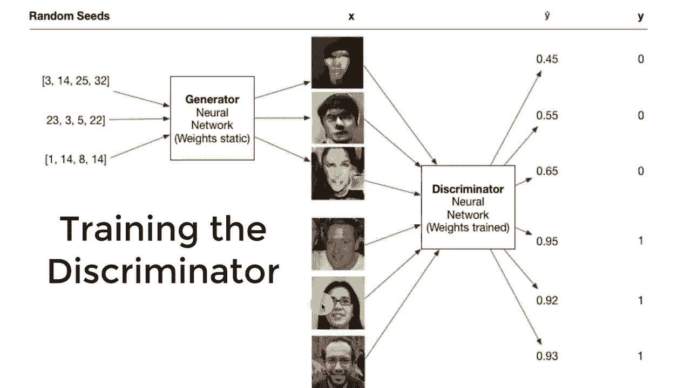
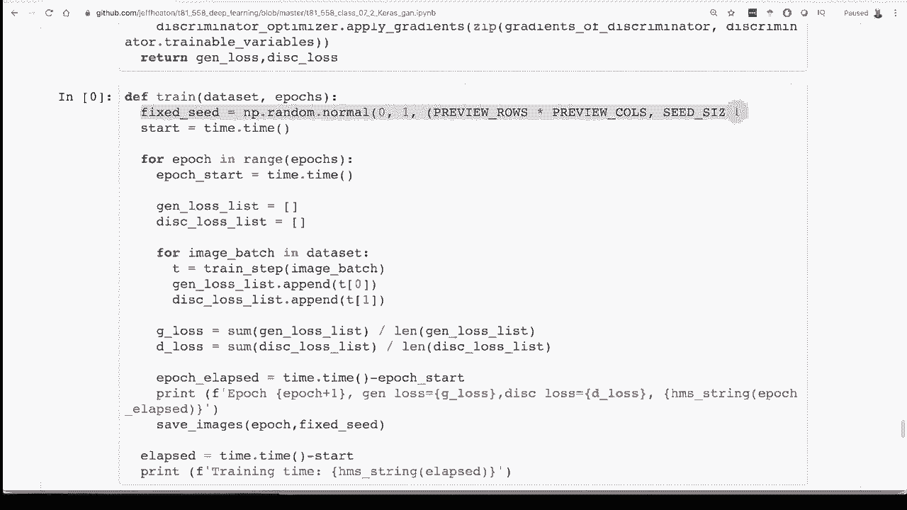

# T81-558 ｜ 深度神经网络应用 - P38：L7.2 - 在Keras/TensorFlow 2.0中使用生成对抗网络(GAN)生成人脸 👨‍💻

在本节课中，我们将学习生成对抗网络（GAN）的基本原理，并从头开始构建一个能够生成人脸的GAN模型。我们将使用Keras和TensorFlow 2.0来实现，并理解其核心的训练机制。

## 概述 🎯




生成对抗网络（GAN）是一种能够生成逼真数据的神经网络架构。它由两个相互对抗的神经网络组成：生成器和判别器。生成器负责从随机种子生成数据（如人脸图像），而判别器则负责判断输入数据是真实的还是生成的。通过这种对抗训练，生成器逐渐学会生成越来越逼真的数据。

## GAN的核心概念 🤖

理解GAN的关键在于区分生成器和判别器这两个神经网络的不同角色。

### 生成器 (Generator)

生成器的任务是从一个随机种子（通常是一个向量）生成一张图像。它从未见过真实的训练数据，其目标是生成能够“欺骗”判别器的图像。

*   **输入**：一个随机种子向量，例如维度为100的数组。
*   **输出**：一张生成的人脸图像（一个3D张量：高度、宽度、颜色通道）。

### 判别器 (Discriminator)

判别器的任务是对输入的图像进行分类，判断它是真实的（来自训练集）还是虚假的（由生成器生成）。

*   **输入**：一张图像（真实或生成）。
*   **输出**：一个单一的概率值（例如0.97），表示该图像是真实图像的概率。

## GAN的训练机制 ⚙️

GAN的训练过程是交替进行的，一次只更新一个网络的权重，以保持对抗的公平性。

### 训练生成器

上一节我们介绍了生成器的目标，本节中我们来看看如何训练它。训练生成器时，我们固定判别器的权重。

以下是训练生成器的步骤：
1.  生成器接收一批随机种子，生成一批虚假图像。
2.  将这些虚假图像输入到判别器中，得到判别器对它们的预测概率（`y_hat`）。
3.  我们希望判别器将这些虚假图像误判为真实图像，因此我们的目标标签（`y`）始终设为1。
4.  计算生成器的损失（例如，交叉熵损失），目标是让判别器的输出`y_hat`尽可能接近1。
5.  通过反向传播，仅更新生成器的权重。

**核心思想**：生成器的损失函数是“欺骗判别器”的能力。它通过不断优化自身，使生成的图像越来越逼真，从而提高判别器将其误判为真的概率。

### 训练判别器

现在，让我们看看如何训练判别器。训练判别器时，我们固定生成器的权重。

以下是训练判别器的步骤：
1.  准备一个批次的数据，其中一半是来自训练集的真实图像，另一半是由生成器生成的虚假图像。
2.  将这些混合图像输入判别器，得到预测概率（`y_hat`）。
3.  对于真实图像，目标标签（`y`）为1；对于虚假图像，目标标签为0。
4.  计算判别器的损失（例如，交叉熵损失），目标是让判别器正确区分真假图像。
5.  通过反向传播，仅更新判别器的权重。

**核心思想**：判别器需要成为一个优秀的“鉴定师”，能够准确识别真假。它的损失函数衡量了其分类的准确性。

## 代码实现 🖥️

让我们看看在Keras/TensorFlow 2.0中如何实现上述训练逻辑。关键点在于使用`GradientTape`来分别计算和应用两个网络的梯度，避免权重更新交叉。

### 损失函数定义



```python
# 判别器损失：需要同时处理真实和虚假样本
def discriminator_loss(real_output, fake_output):
    real_loss = cross_entropy(tf.ones_like(real_output), real_output)
    fake_loss = cross_entropy(tf.zeros_like(fake_output), fake_output)
    total_loss = real_loss + fake_loss
    return total_loss

# 生成器损失：目标是让判别器对虚假样本输出1
def generator_loss(fake_output):
    return cross_entropy(tf.ones_like(fake_output), fake_output)
```

### 单步训练过程

```python
@tf.function
def train_step(images):
    # 生成随机噪声（种子）
    noise = tf.random.normal([BATCH_SIZE, noise_dim])

    # 使用 GradientTape 记录计算过程以进行自动微分
    with tf.GradientTape() as gen_tape, tf.GradientTape() as disc_tape:
        # 生成器生成图像
        generated_images = generator(noise, training=True)

        # 判别器对真实图像和生成图像进行判断
        real_output = discriminator(images, training=True)
        fake_output = discriminator(generated_images, training=True)

        # 计算损失
        gen_loss = generator_loss(fake_output)
        disc_loss = discriminator_loss(real_output, fake_output)

    # 计算梯度（分别针对生成器和判别器）
    gradients_of_generator = gen_tape.gradient(gen_loss, generator.trainable_variables)
    gradients_of_discriminator = disc_tape.gradient(disc_loss, discriminator.trainable_variables)

    # 应用梯度，更新权重（使用优化器，如Adam）
    generator_optimizer.apply_gradients(zip(gradients_of_generator, generator.trainable_variables))
    discriminator_optimizer.apply_gradients(zip(gradients_of_discriminator, discriminator.trainable_variables))
```

### 训练循环

在训练循环中，我们遍历整个数据集（划分为多个批次），并反复调用`train_step`函数。为了观察生成质量的演变，我们可以使用一组固定的随机种子，在每个训练周期后生成图像，从而看到同一批种子对应的图像是如何逐渐变得逼真的。



## 总结 📝

本节课中我们一起学习了生成对抗网络（GAN）的基本原理和实现方法。

*   **GAN由两个网络组成**：生成器负责创造数据，判别器负责鉴别数据真伪。
*   **对抗训练**：两个网络在训练过程中相互竞争、共同进化。生成器努力生成更逼真的数据以欺骗判别器，而判别器则努力提升自己的鉴别能力。
*   **训练关键**：必须交替训练两个网络，每次只更新一个网络的权重，并使用`GradientTape`来精确控制梯度计算和应用。
*   **从简单开始**：我们构建的模型是理解GAN的起点。要生成高分辨率、极其逼真的图像（如StyleGAN所展示的），需要更复杂的网络结构、大量的计算资源和精细的调参。

通过本教程，你已经掌握了构建基础GAN模型的能力。你可以尝试修改网络结构、调整超参数或更换数据集，来生成不同类型的图像。在后续课程中，我们将探索如何使用预训练的高级模型（如StyleGAN）进行迁移学习，以快速生成高质量图像。