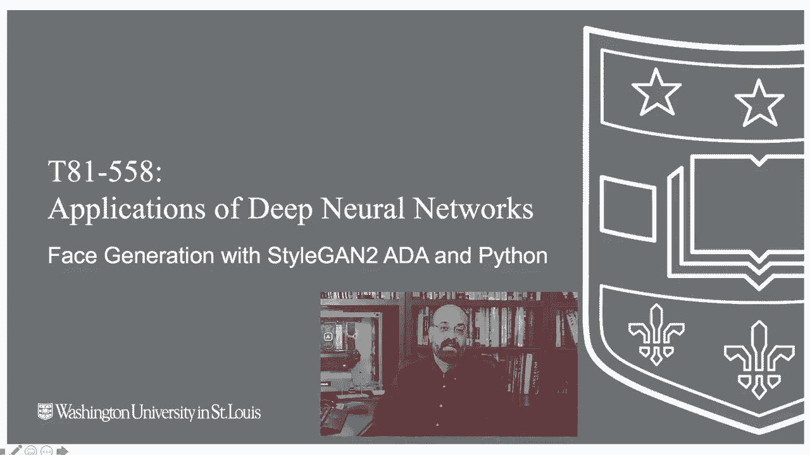
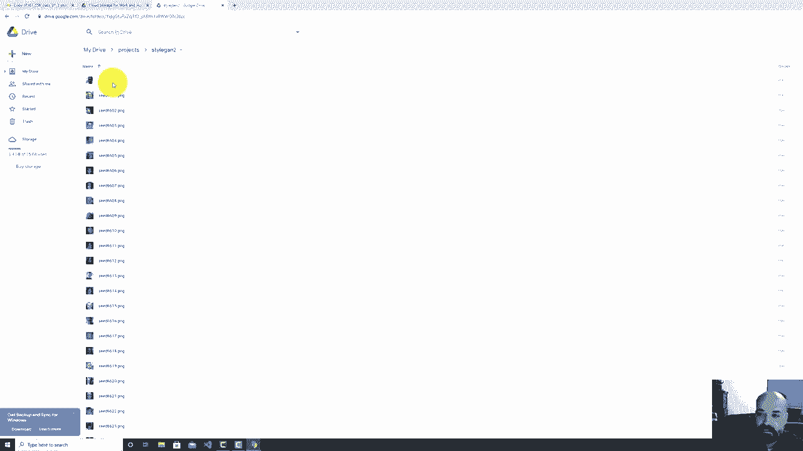
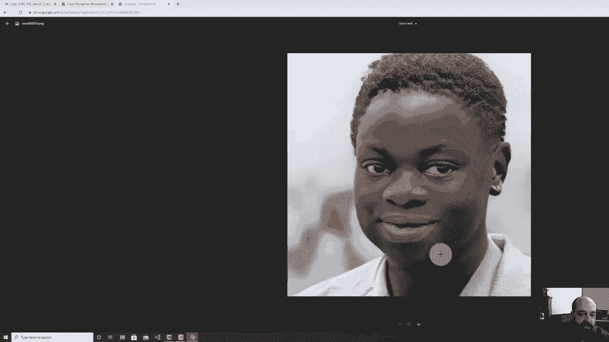
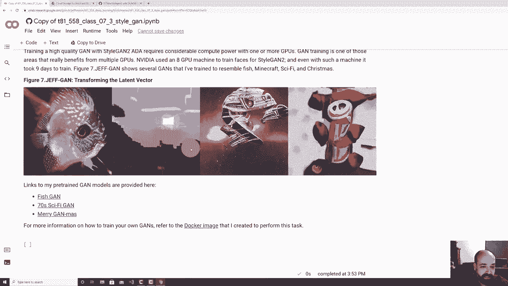

# T81-558 ｜ 深度神经网络应用 - P39：L7.3 - 使用 NVIDIA StyleGAN2-ADA、PyTorch 和 Python3 生成人脸 👨‍💻

在本节课中，我们将学习如何使用 NVIDIA 的 StyleGAN2-ADA 模型，配合 PyTorch 框架，生成高质量的人脸图像。我们将从环境配置开始，逐步讲解如何加载预训练模型、生成图像，并探索潜在向量的操作。



---

## 概述 📋

StyleGAN2-ADA 是当前生成对抗网络领域的前沿技术，能够生成极其逼真的人脸图像。与之前我们接触过的自定义生成对抗网络相比，它需要更强大的计算资源和更精妙的算法。本节课将指导你使用 PyTorch 版本的 StyleGAN2-ADA 来生成人脸，并理解其背后的核心概念。

---

## 环境与库准备 🛠️

上一节我们介绍了课程目标，本节中我们来看看运行代码所需的环境。运行 StyleGAN2-ADA 需要 PyTorch 环境。本课程大部分内容基于 TensorFlow，但本部分和强化学习部分使用了 PyTorch，这是因为相关的重要库已转向 PyTorch。

以下是运行所需的关键步骤：

1.  **安装 PyTorch**：Colab 环境通常已预装 PyTorch。
2.  **克隆仓库**：需要从 GitHub 克隆 StyleGAN2-ADA-PyTorch 的代码库。
3.  **安装 Ninja**：Ninja 是 NVIDIA 用于加速 PyTorch 构建的工具。
4.  **挂载 Google 云端硬盘**：用于保存生成的图像。

运行以下代码块来完成环境设置：

```python
# 挂载 Google Drive 以便保存结果
from google.colab import drive
drive.mount('/content/drive')

# 克隆 StyleGAN2-ADA-PyTorch 仓库
!git clone https://github.com/NVlabs/stylegan2-ada-pytorch.git

# 进入项目目录
%cd stylegan2-ada-pytorch

# 安装 ninja（用于构建自定义 CUDA 内核）
!pip install ninja
```

**注意**：由于该模型依赖自定义 CUDA 内核，因此必须在 GPU 环境下运行。Colab 提供的免费 GPU 可以用于生成图像，但训练模型则需要如 Colab Pro 或更高端的 GPU 资源。

---

## 加载预训练模型与生成图像 🖼️

环境准备好后，我们就可以加载预训练的人脸生成模型了。StyleGAN2-ADA 使用一个由 512 个数字组成的**潜在向量**来生成图像。每个数字都控制着图像的某些特征。

以下是生成图像的基本流程：

1.  **选择预训练模型**：我们将使用在 FFHQ 数据集上预训练的模型来生成人脸。
2.  **设置随机种子**：种子决定了潜在向量的初始值，相同的种子会产生相同的图像。
3.  **生成图像**：模型将潜在向量解码为一张人脸图片。

让我们运行代码来生成一些图像。我们将使用种子 6600 到 6625。

```python
import torch
import legacy

# 加载预训练模型（FFHQ人脸模型）
network_pkl = ‘https://nvlabs-fi-cdn.nvidia.com/stylegan2-ada-pytorch/pretrained/ffhq.pkl’
with dnnlib.util.open_url(network_pkl) as f:
    G = legacy.load_network_pkl(f)[‘G_ema’].to(device) # 加载生成器并移至GPU

# 生成图像的函数
def generate_image(seed):
    # 根据种子生成潜在向量 z
    z = torch.from_numpy(np.random.RandomState(seed).randn(1, G.z_dim)).to(device)
    # 生成图像
    img = G(z, None, truncation_psi=0.7, noise_mode=‘const’)
    img = (img.permute(0, 2, 3, 1) * 127.5 + 128).clamp(0, 255).to(torch.uint8)
    return img[0].cpu().numpy()

# 生成并保存一系列图像
for seed in range(6600, 6626):
    img = generate_image(seed)
    # 保存 img 到文件，例如使用 PIL.Image
```

生成的图像将保存到指定目录。你可以将它们复制到 Google 云端硬盘进行永久存储。

---

## 理解生成结果与局限性 🔍

虽然生成的图像非常逼真，但仔细观察仍能发现一些非自然的痕迹。了解这些局限性有助于你更好地理解和应用生成模型。

以下是生成图像中常见的一些特征和瑕疵：

*   **背景异常**：背景往往显得模糊、抽象或不自然，这是判断图像是否为生成结果的一个明显线索。
*   **配饰问题**：耳环、眼镜等配饰可能不对称或形状怪异。衣领、纽扣等细节也可能处理不当。
*   **多面孔或扭曲**：偶尔会出现一张脸上重叠多个面孔，或面部结构严重扭曲的情况。
*   **手部与复杂物体**：手部、帽子等复杂结构的生成质量通常较低。
*   **眼睛位置固定**：由于训练数据预处理时围绕眼睛居中裁剪，生成的人脸眼睛位置相对固定。

这些局限性源于训练数据的分布、模型容量以及 GAN 训练本身的挑战。

---





## 操作潜在向量与创建过渡视频 🎬

潜在向量是控制生成图像的关键。通过线性插值改变潜在向量，我们可以创建一张人脸逐渐转变为另一张人脸的平滑视频。

上一节我们看到了静态图像，本节中我们来看看如何让图像“动”起来。其核心思想是在两个种子对应的潜在向量之间进行线性插值。

以下是创建过渡视频的步骤：

1.  **获取两个潜在向量**：分别对应起始种子和结束种子。
2.  **计算插值步长**：将两个向量的差值除以总帧数，得到每一步的变化量。
3.  **生成序列帧**：从起始向量开始，逐步加上步长向量，生成一系列中间图像。
4.  **合成视频**：使用工具（如 FFmpeg）将图像序列编码成视频文件。

```python
import numpy as np

def interpolate_seeds(seed1, seed2, steps):
    # 生成两个潜在向量 z1, z2
    z1 = torch.from_numpy(np.random.RandomState(seed1).randn(1, G.z_dim)).to(device)
    z2 = torch.from_numpy(np.random.RandomState(seed2).randn(1, G.z_dim)).to(device)

    frames = []
    for i in range(steps):
        # 线性插值： z = z1 + (i / (steps-1)) * (z2 - z1)
        ratio = i / (steps - 1)
        z = z1 * (1 - ratio) + z2 * ratio
        img = G(z, None, truncation_psi=0.7, noise_mode=‘const’)
        # 处理并保存 img 到 frames 列表
        frames.append(process_image(img))
    return frames

# 生成从种子1000到1003的100帧过渡图像
frames = interpolate_seeds(1000, 1003, 100)
# 使用 frames 列表创建视频
```

运行此代码后，你将得到一个展示人脸渐变效果的视频文件。

---

## 加载与使用自定义训练模型 🐟

StyleGAN2-ADA 的强大之处在于其通用性。除了人脸，你还可以加载在其他数据集上训练的模型，例如鱼类、特定风格的画作或游戏截图。

以下是如何加载和使用一个自定义训练的模型（以鱼类生成模型为例）：

1.  **获取模型文件**：确保你拥有训练好的 `.pkl` 模型文件。
2.  **加载模型**：使用与加载预训练模型相同的方式加载你的自定义模型。
3.  **生成图像**：使用新的模型生成特定领域的图像。

```python
# 加载自定义模型（例如一个在鱼类图片上训练的模型）
custom_pkl = ‘/content/drive/MyDrive/stylegan2/models/fishgan.pkl’
with open(custom_pkl, ‘rb’) as f:
    G_custom = legacy.load_network_pkl(f)[‘G_ema’].to(device)

# 使用自定义模型生成图像
fish_seeds = range(1000, 1004)
for seed in fish_seeds:
    z = torch.from_numpy(np.random.RandomState(seed).randn(1, G_custom.z_dim)).to(device)
    img = G_custom(z, None, truncation_psi=0.7, noise_mode=‘const’)
    # 保存生成的鱼类图像
```

通过这种方式，你可以探索各种有趣的主题，生成诸如科幻场景、像素艺术或抽象图案等图像。

---

## 总结 🎯

本节课中我们一起学习了如何使用 NVIDIA 的 StyleGAN2-ADA 模型生成高质量图像。我们从配置 PyTorch 环境开始，学习了如何加载预训练的人脸模型并生成图像。我们探讨了生成结果的逼真度及其存在的典型局限性。接着，我们深入了解了潜在向量的概念，并学会了如何通过操作它来创建人脸渐变视频。最后，我们还演示了如何加载和使用在其他数据集上训练的自定义模型，拓展了生成模型的应用范围。



关键要点在于，**潜在向量 `z`** 是图像生成的“密码”，其公式表示为：
`图像 = G(z, 标签, 截断系数, 噪声模式)`
通过控制 `z`，我们就能控制生成图像的内容与风格。尽管生成图像已高度逼真，但理解其局限性对于实际应用至关重要。