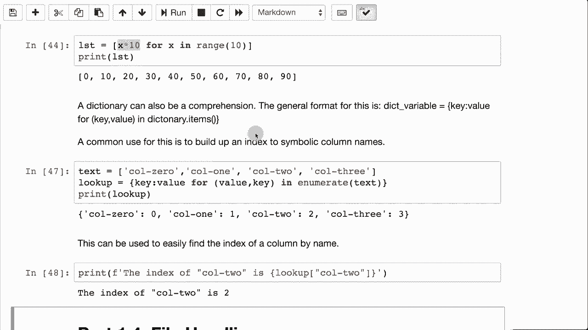

# T81-558 ｜ 深度神经网络应用-P4：L1.3- Python 列表、字典、集合和 JSON 📚

在本节课中，我们将深入学习 Python 编程语言中的核心数据结构：列表、字典、集合，以及它们与 JSON 格式的紧密联系。掌握这些知识对于构建复杂的数据结构，特别是在处理神经网络数据时至关重要。

Python 处理这些数据结构的方式与 JavaScript 非常相似。实际上，构成这些结构的代码通常就是有效的 JSON 语法。这意味着你可以像在 JavaScript 中一样，在 Python 中轻松构建复杂的数据结构。


---

## 列表（List）📋

像大多数编程语言一样，Python 有数组或列表的概念。Python 的列表非常灵活，与某些语言中固定大小的数组不同，Python 列表可以动态地添加或移除元素。

定义一个列表的代码如下：
```python
c = ['a', 'b', 'c']
```
当你打印一个列表时，它会显示为用方括号括起来的一系列值。

以下是列表的一些基本操作：

*   **遍历列表**：你可以使用 `for` 循环来遍历列表中的每个元素。
    ```python
    for value in c:
        print(value)
    ```
*   **使用枚举（enumerate）**：如果你需要同时获取元素的索引和值，可以使用 `enumerate` 函数，这比手动维护一个索引变量更方便。
    ```python
    for i, value in enumerate(c):
        print(f"Index {i}: {value}")
    ```
*   **添加和移除元素**：你可以使用 `insert` 方法在指定位置插入元素，或使用 `remove` 方法删除特定值的元素。
    ```python
    c.insert(0, 'a0')  # 在索引0处插入‘a0’
    c.remove('b')      # 移除第一个值为‘b’的元素
    ```

---

## 集合（Set）🔗

上一节我们介绍了可以包含重复值的列表。本节中我们来看看集合，它是一种不允许重复元素的数据结构。

要定义一个集合，你可以使用 `set()` 函数或花括号 `{}`（注意空集合必须用 `set()` 创建）。集合在打印时也使用花括号，但它的内部机制与字典不同。

以下是集合的一个关键特性：

*   **自动去重**：当你向集合中添加已存在的元素时，该操作不会产生任何效果。这在需要确保元素唯一性时非常有用。
    ```python
    my_set = set(['a', 'b', 'c', 'c'])
    print(my_set)  # 输出: {'a', 'b', 'c'}
    ```

---

## 字典（Dictionary）📖

列表和集合用于存储一系列值。本节我们将探讨字典，它用于存储键值对（key-value pairs），类似于一本书，你可以通过“键”（词条）来查找其对应的“值”（定义）。

字典、映射（Map）或哈希表（Hash Table）这些术语在大多数情况下可以互换使用。在Python中，字典用花括号 `{}` 定义，键和值之间用冒号 `:` 分隔。

以下是字典的基本用法：

*   **定义与访问**：
    ```python
    d = {'name': 'Jeff', 'address': '123 Main St'}
    print(d['name'])  # 输出: Jeff
    ```
*   **检查键是否存在**：尝试访问不存在的键会导致错误。安全的做法是使用 `get` 方法并提供默认值。
    ```python
    print(d.get('age', 'No age provided'))  # 输出: No age provided
    ```
*   **获取所有键和值**：你可以分别获取字典中所有的键和所有的值。
    ```python
    keys = d.keys()    # 获取所有键
    values = d.values() # 获取所有值
    ```

---

## 复杂数据结构与 JSON 🧩

掌握了列表和字典后，我们就可以将它们组合起来，创建更复杂、嵌套的数据结构。这种结构化的方式与 JSON（JavaScript Object Notation）格式天然兼容。

以下是一个包含客户信息的复杂数据结构示例：
```python
customers = [
    {
        "name": "Jeff Heaton",
        "pets": ["Winton", "Lakota", "Hickory"]
    },
    {
        "name": "John Smith",
        "pets": ["Rover"]
    },
    {
        "name": "J Doe",
        "pets": []
    }
]
```
你可以遍历这个列表来处理每个客户的信息，例如计算每个人拥有的宠物数量。

---

## 其他实用技巧 ⚙️

除了基本操作，Python 还提供了一些强大的工具来高效地处理列表和字典。

以下是两个非常实用的技巧：

*   **列表推导式（List Comprehension）**：这是一种快速创建新列表的简洁语法。例如，将一个列表中的所有元素乘以10：
    ```python
    original = [1, 2, 3, 4, 5]
    multiplied = [x * 10 for x in original]
    # 结果: [10, 20, 30, 40, 50]
    ```
*   **动态创建字典**：在处理像CSV文件这样的数据时，经常需要根据表头动态创建字典来映射列名和索引。
    ```python
    headers = ["name", "age", "address"]
    lookup = {name: index for index, name in enumerate(headers)}
    # 结果: {'name': 0, 'age': 1, 'address': 2}
    # 现在可以通过 lookup['address'] 快速找到‘address’列的索引
    ```

---

## 总结 📝



本节课中我们一起学习了 Python 中四种重要的数据结构：**列表**用于存储有序的元素序列；**集合**用于存储唯一的元素；**字典**用于存储键值对，便于快速查找。我们还看到了如何将它们组合成复杂的、类似 **JSON** 的嵌套结构，这对于组织数据至关重要。最后，我们介绍了一些高效的工具，如**列表推导式**和**动态字典创建**，它们能让你的代码更简洁、更健壮。掌握这些基础知识，将为后续在深度神经网络中处理和准备数据打下坚实的基础。