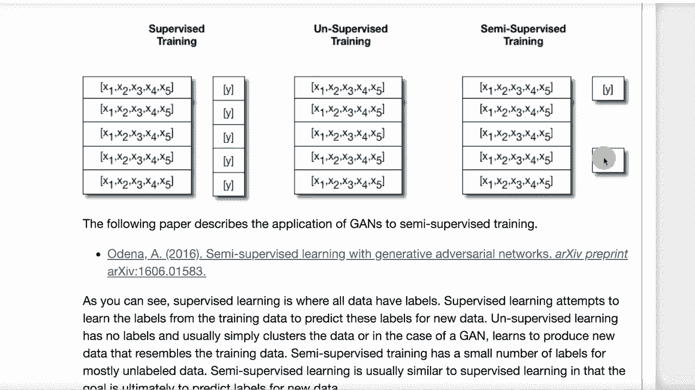
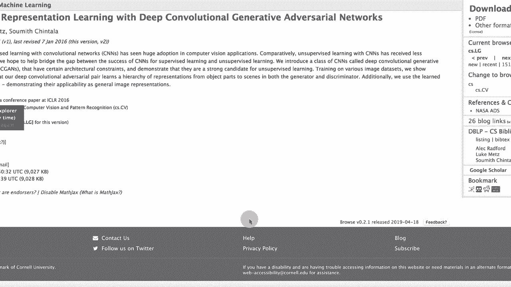

# T81-558 ｜ 深度神经网络应用-P40：L7.4- 在Keras中用于半监督学习的GANs 🧠

在本节课中，我们将要学习如何使用生成对抗网络（GAN）来辅助半监督学习，特别是在数据标签不完整的情况下生成额外的训练数据或提升分类器性能。

---

## 概述

生成对抗网络（GAN）用途广泛，不仅限于生成逼真的面部图像，也能处理表格数据等其他类型的数据。其核心在于让一个生成器网络生成数据，同时让一个判别器网络区分生成数据与真实数据。我们将探讨如何利用GAN进行半监督训练，这是一种介于监督学习和无监督学习之间的方法，能有效利用大量未标记数据。

---

## 监督训练与无监督训练

在深入半监督学习之前，我们先回顾两种基础的机器学习范式。

### 监督训练

本课程绝大部分内容都属于监督学习的范畴。在监督训练中，我们拥有输入数据 **X**（例如表格数据或图像）和对应的已知正确输出 **Y**。模型的目标是学习从 **X** 到 **Y** 的映射关系。训练完成后，模型可以对新的、未知 **Y** 的 **X** 做出预测。

**公式表示**：学习函数 **f**，使得 **Y ≈ f(X)**。

### 无监督训练

在无监督训练中，我们只有输入数据 **X**，没有对应的标签 **Y**。模型的目标通常是发现数据中的内在结构或模式，例如将相似的数据点聚在一起。传统上，神经网络较少用于纯无监督任务，更多使用如K均值聚类等方法。

**核心任务**：对输入 **X** 进行聚类或降维。

---

## 什么是半监督训练？ 🤔

上一节我们介绍了监督和无监督训练，本节中我们来看看半监督训练。半监督训练更接近监督训练，它同时利用少量有标签数据和大量无标签数据进行学习。

在半监督训练中，我们拥有数据集 **X**，但并非每个样本都有对应的标签 **Y**。可能只有一小部分数据被标记。传统监督学习会忽略未标记的数据，因为无法直接用于计算损失。一种朴素的方法是先在有标签数据上训练模型，然后用模型预测未标记数据的伪标签，再混合伪标签和真实标签重新训练模型，但这种方法在实践中往往效果有限。



GAN为半监督学习提供了新的思路。想象一个孩子学习识别交通工具：他长期观察街上各种未标记的车辆（无标签数据），积累了关于形状、颜色等特征的认知。后来，当有人告诉他“这是汽车，那是公交车”（有标签数据）时，他就能利用之前积累的认知快速学会分类。这个过程就是半监督学习——利用大量无标签数据学习数据的内在结构，再结合少量有标签数据完成特定任务。


---

## 标准GAN结构回顾

为了理解GAN如何用于半监督学习，我们先快速回顾标准（用于图像生成的）GAN的基本结构。

以下是标准GAN的结构示意图：


其工作流程如下：
1.  **真实图像**输入到判别器。
2.  **生成器**接收一个随机噪声向量，并生成一张伪造图像。
3.  生成图像也输入到同一个判别器。
4.  判别器的目标是正确区分“真实图像”与“生成图像”。
5.  生成器的目标是生成足以“欺骗”判别器、让其误认为是真实图像的图片。

**代码描述核心对抗过程**：
```python
# 伪代码示意
判别器损失 = 判别器对真实图像的识别损失 + 判别器对生成图像的识别损失
生成器损失 = 判别器将生成图像误判为真实图像的损失
```
训练完成后，我们通常保留能生成高质量数据的生成器，而判别器则完成了它的“陪练”使命。

---

## 用于半监督学习的GAN结构

现在，我们来看GAN结构如何为半监督学习服务。关键在于，我们的关注点从生成器转移到了判别器。

以下是用于半监督学习的GAN结构示意图：


与标准GAN不同，在半监督学习设置中：
1.  判别器不再仅仅进行“真/假”二分类。
2.  判别器被训练成一个 **（K+1）类** 的分类器，其中 **K** 是我们真实数据中的类别数量，额外的一个类别代表“生成（虚假）数据”。
3.  因此，判别器同时学习：（a）区分真实数据的类别；（b）识别出生成器产生的假数据。

**以医疗记录表格数据为例**：
*   假设我们有四种真实的健康状态（K=4）。
*   判别器现在需要做五分类：健康状态A、B、C、D，以及“虚假记录”。
*   生成器不断生成逼假的医疗记录。
*   判别器通过鉴别真实记录类别和识别假记录来提升自身作为分类器的能力。

训练结束后，**生成器可以被丢弃**，而我们得到了一个强大的、利用了未标记数据信息的 **判别器**，它可以直接用作我们需要的分类模型。

---

## 扩展到回归任务

上述思路同样可以扩展到回归任务（预测连续值）。

**结构变化**：
判别器被设计成一个**多输出神经网络**。
*   输出1：执行我们关心的回归任务（例如，预测患者的健康评分）。
*   输出2：判断输入数据是“真实”还是“生成”的概率。

**训练过程**：
*   对于有标签的真实数据，我们根据回归输出与真实标签的误差（如均方误差）来惩罚模型。
*   对于所有数据（无论有标签与否）以及生成数据，我们都根据其“真/假”判断的准确性来惩罚模型。
*   同样，训练完成后，生成器被丢弃，这个多输出的判别器就成为我们可用于预测的半监督回归模型。

---

## 实战示例与资源

如果你想深入了解这种技术，可以参考以下资源。一个经典的图像数据集示例是街景门牌号数据集。

以下是该数据集的示例图片：



**关于该数据集**：
*   它包含从街景中截取的门牌号图像。
*   可用于多种任务：识别单个数字、识别整个门牌号序列等。
*   非常适合模拟半监督学习场景（假设大部分图片没有数字标签）。

**推荐阅读**：
*   研究论文《用于无监督表示学习的深度卷积生成对抗网络》是这一领域的开创性工作之一。
*   该领域研究活跃，不断有新的进展。

---

## 总结


本节课中，我们一起学习了如何将生成对抗网络（GAN）应用于半监督学习：
1.  我们回顾了监督学习与无监督学习的区别。
2.  我们介绍了半监督学习的概念及其价值。
3.  我们分析了标准GAN的结构及其在图像生成中的应用。
4.  我们重点讲解了如何改造GAN，使其判别器成为一个（K+1）类分类器，从而利用未标记数据提升分类性能。
5.  我们探讨了将此框架扩展到回归任务的方法。
6.  最后，我们提供了相关的实战数据集和研究论文作为进一步学习的资源。

通过这种半监督的GAN，我们能够在只有少量标签的数据集上，训练出更加强大和鲁棒的深度学习模型。