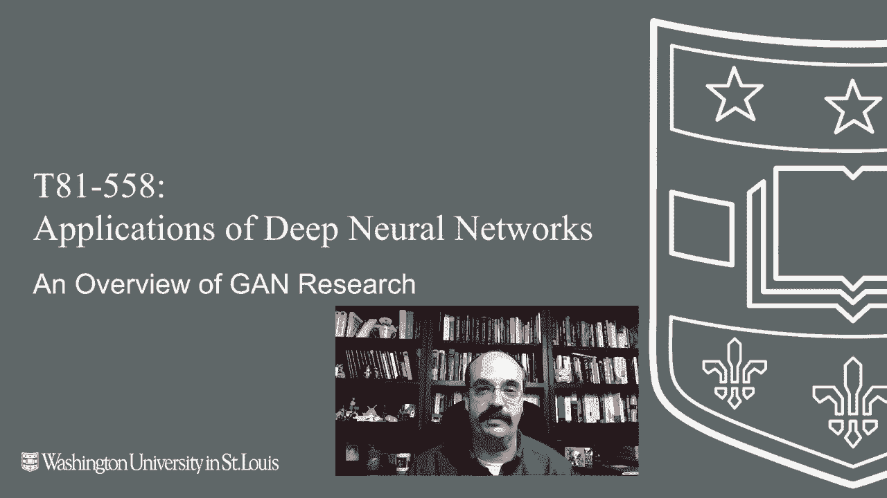
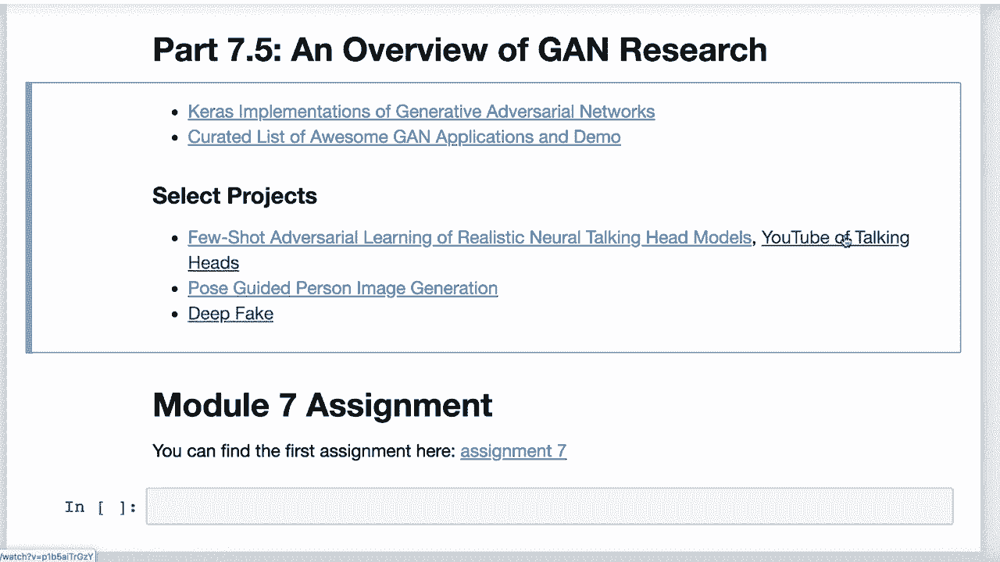
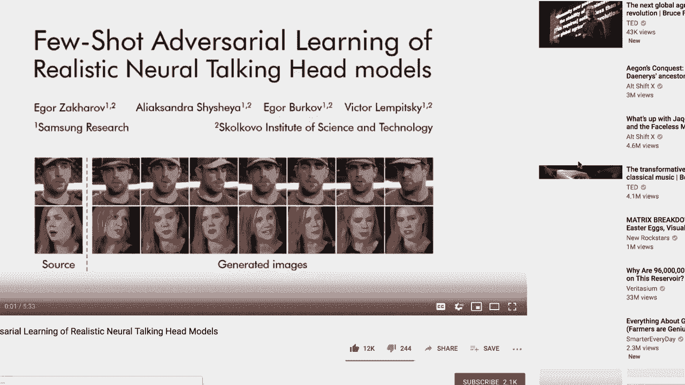
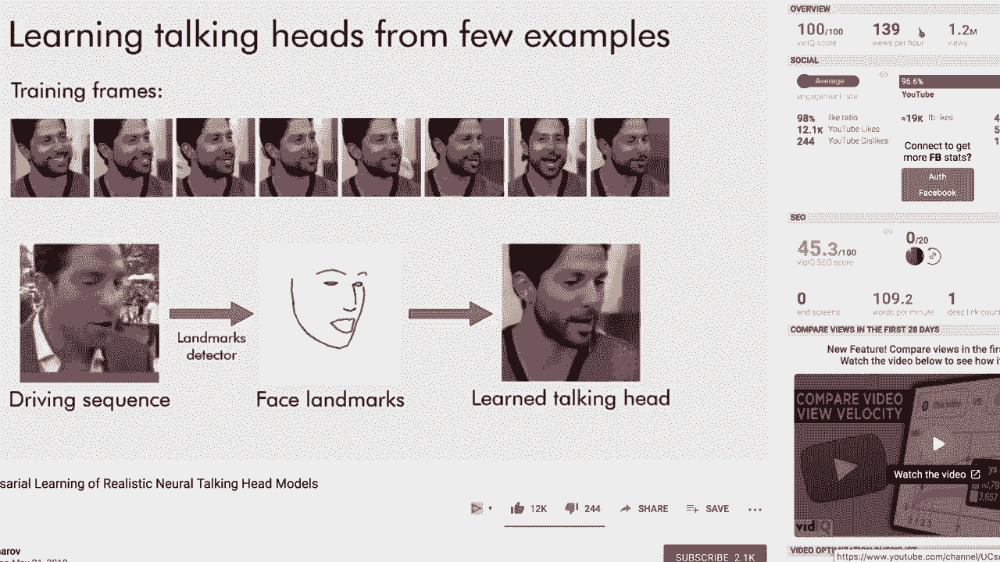
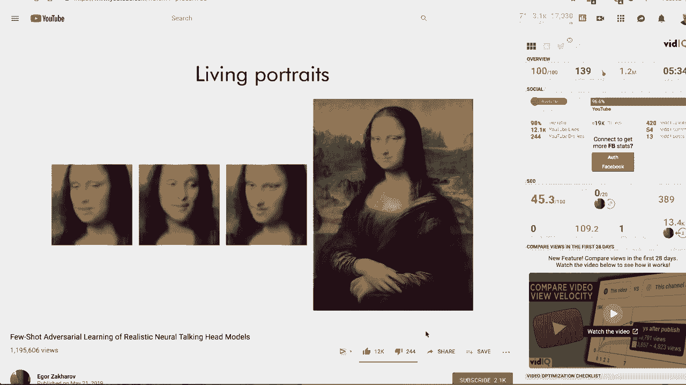
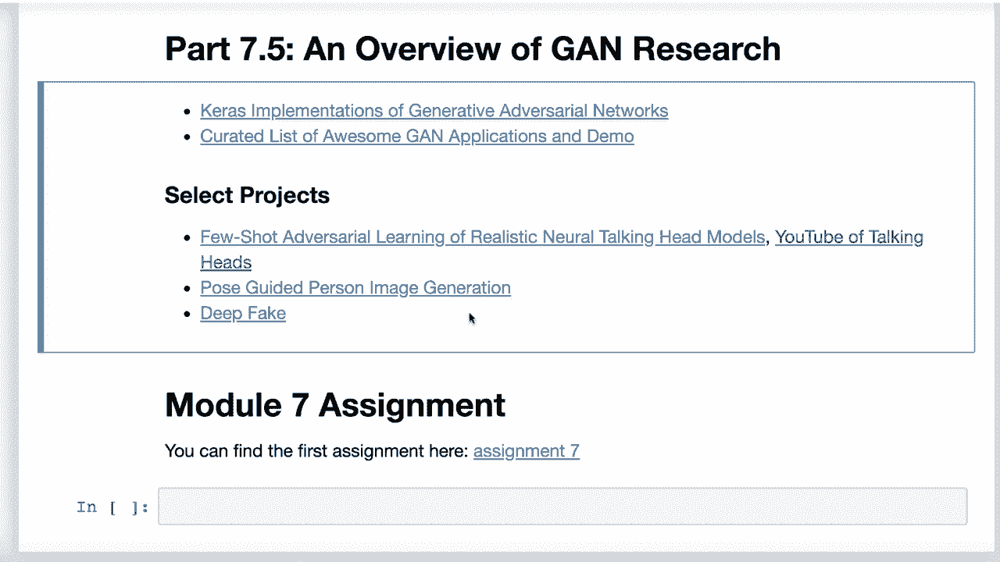

# T81-558 ｜ 深度神经网络应用 - P41：L7.5- 生成对抗网络(GAN)研究领域的一些新主题 🚀

在本节课中，我们将探讨生成对抗网络（GAN）领域的一些最新研究主题，了解这种令人兴奋的神经网络技术正在实现哪些有趣的应用。我们将从一些实用的资源库开始，然后深入几个具体的研究方向，包括字体生成、图像超分辨率以及备受关注的深度伪造技术。

## 概述与资源 📚



上一节我们介绍了GAN的基本原理和经典应用。本节中，我们来看看GAN研究前沿的一些具体项目。首先，我想分享两个非常有用的资源。

第一个是GitHub上的一个项目，它实现了许多GAN相关论文中的模型。这个网站为我准备本课程中的一些例子提供了宝贵的资料。

```
# 这是一个非常有用的资源库链接示例
# https://github.com/nashory/gans-awesome-applications
```

第二个资源是一个精心整理的列表，展示了GAN的各种精彩应用和演示。这些项目能帮助我们直观地理解GAN的能力边界。

## 有趣的GAN应用案例 🎨

以下是几个展示了GAN多样化能力的项目案例。

*   **中文书法字体生成**：这个项目能够使用GAN生成风格各异的中文书法字体。
*   **动漫角色生成**：类似于生成真实人脸的GAN，但这个项目专门用于生成动漫风格的角色面孔。
*   **人脸老化模拟**：这个应用能够模拟人脸随时间老化的过程，让人们预览一个人年老时可能的样子。
*   **图像超分辨率**：这是一个将低分辨率图像提升至高分辨率的过程。这项技术广泛应用于大屏电视的视频增强和老款电子游戏的画面修复中。

## 深度伪造：机遇与挑战 ⚠️

在众多项目中，深度伪造技术因其巨大的社会影响力而显得尤为突出。随着2020年美国大选的临近，我们进入了一个新时代：技术可能被用于制造任何人说任何话的虚假视频，即使他们从未说过那些话。这是一个充满潜在危险的时期。



深度伪造技术通过提取源视频中的人脸图像，并将其与目标音频结合，从而创造出以假乱真的“说话头”视频。目前，一种名为“Few-Shot Adversarial Learning of Realistic Neural Talking Head Models”（基于少量对抗学习的真实神经说话头模型）的新方法正在兴起。这种方法仅需少量目标人物的图像，就能学习并生成其逼真的说话视频。



你最近可能在媒体上看到过类似的应用，例如让名画《蒙娜丽莎》动起来并“说话”。

值得注意的是，这类模型有时对输入图像的几何特征（如标志、眼镜的位置）非常敏感。目前大多数处理仍集中在面部区域。





## 全身图像生成 🤖



GAN的研究并未止步于面部。最新的进展已经扩展到全身图像的生成与操控。


一篇相关论文展示了一个系统，能够生成完整的人体图像，并根据用户指定的关键点来调整人物的姿势。这意味着我们现在可以利用GAN的智能来生成各种姿态的全身像。

## 总结

本节课中，我们一起探索了生成对抗网络（GAN）在多个前沿领域的新应用。我们从实用的代码资源库出发，了解了GAN在艺术创作（如字体和动漫生成）、图像增强（如超分辨率）方面的能力。随后，我们深入探讨了具有重大社会影响的深度伪造技术，认识到其创造力的同时也必须警惕其被滥用的风险。最后，我们看到了GAN从面部生成向更复杂的全身图像生成与姿态控制的发展。这些案例表明，GAN作为一种强大的生成模型，其应用边界仍在不断拓展，持续推动着人工智能在视觉内容创作领域的发展。