# T81-558 ｜ 深度神经网络应用 - P42：L8.1 Kaggle简介 🏆

在本节课中，我们将学习Kaggle平台。Kaggle是数据科学领域最重要的竞赛平台之一，被誉为数据科学界的“世界杯”。我们将了解Kaggle的基本结构、竞赛类型、评分机制以及如何参与其中。本课程的一个主要项目就是参与一个Kaggle课堂竞赛。

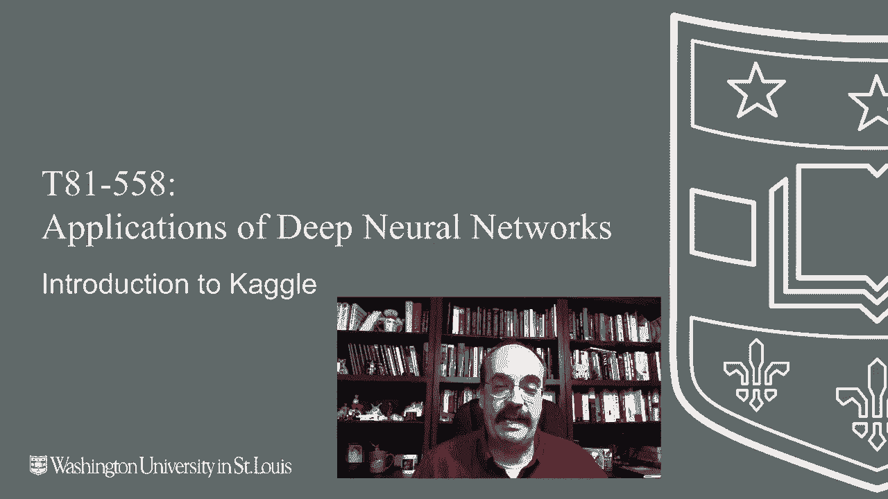

---

## Kaggle的重要性与课堂竞赛

Kaggle在数据科学界扮演着核心角色。数据科学家们在此平台上相互竞争，以提升自己的Kaggle排名。Kaggle有多种排名体系，我们稍后会详细讨论。

对于本课程，你将参与的是一个**Kaggle课堂竞赛**。这是一个特殊区域，并非与成千上万的数据科学家竞争的真实完整竞赛，但它使用了与Kaggle完全相同的界面。这能让你熟悉Kaggle竞赛并学习如何处理相关数据集。

我们将概述Kaggle，并学习如何向Kaggle提交内容。本课程的主要项目是一个向当前学期学生以及互联网开放的Kaggle竞赛。通常，一些非华盛顿大学课堂的学生也会参与，这非常有趣。我有时甚至会看到往届学生回来参加后续学期的竞赛。有些学生在课堂竞赛中表现出色，甚至在实际Kaggle竞赛中进入了前5%，成绩超过了我，这非常酷。我们稍后会讨论这些百分比排名的具体含义。

---

## Kaggle社区与个人资料

现在让我们看看Kaggle社区。你可以查看顶级Kaggle用户，这只是Kaggle网站的一个链接。虽然我的个人资料可能显示在顶部，但这只是因为我是我本人，我绝对不是Kaggle的顶级排名者。这些是Kaggle上排名最高的数据科学家。

你可以点击进入他们的个人资料页面，了解更多信息。有时他们会链接到Github和LinkedIn，有时则没有。Kaggle偶尔会采访这些顶尖选手，以便大家学习。

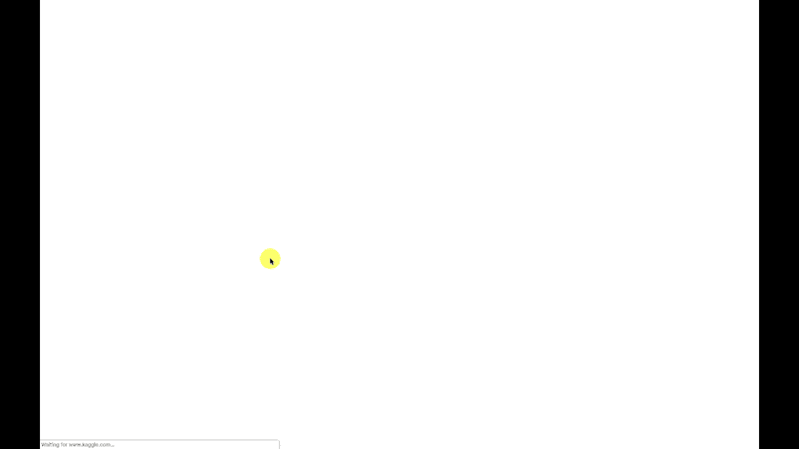

以下是我的Kaggle个人资料页面，展示了我的活动。它显示了我当前的排名：**比赛专家**。这意味着我完成了两场比赛并获得了铜牌，这是成为比赛专家的最低要求。下一个级别是**Kaggle大师**，甚至是**Kaggle宗师**，这需要获得更高级别的奖牌。

获得铜牌通常意味着在Kaggle竞赛中进入前10%。我最好的两场比赛成绩分别是前10%和前7%，这足以让我成为比赛专家。不过，我已经大约两年没有参加Kaggle比赛了，因为这与我的日常工作一样需要投入大量时间。

---

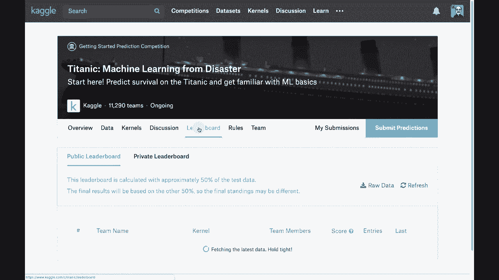

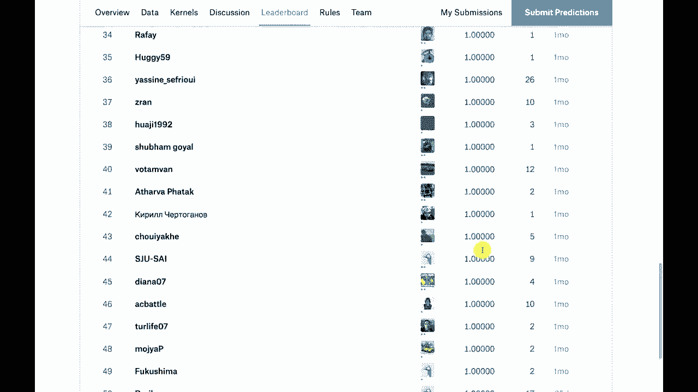

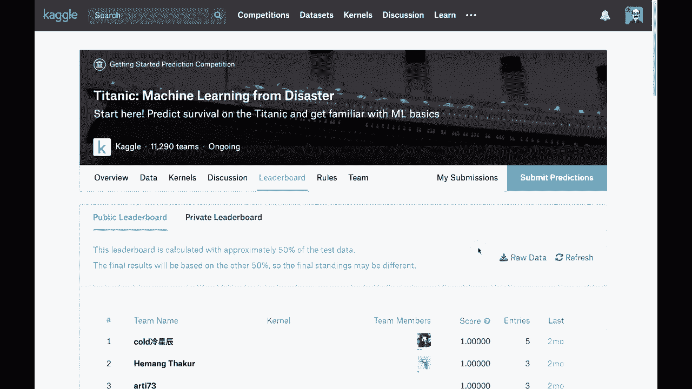

## 典型Kaggle竞赛：以泰坦尼克号为例

大多数Kaggle竞赛都有其结构。让我们以经典的**泰坦尼克号竞赛**为例。Kaggle将网站划分为多个竞赛，泰坦尼克号竞赛是一个教程性质的比赛，任何人都可以参与。

从参与团队数量（近12,000个）可以看出，这是一个非常大的比赛。通常，大型比赛会有1000到2000个团队。赢得泰坦尼克号竞赛的概念是独特的，因为它是持续进行的，没有真正的截止日期。组织者通常会将截止日期设定在当年年底，并逐年顺延。

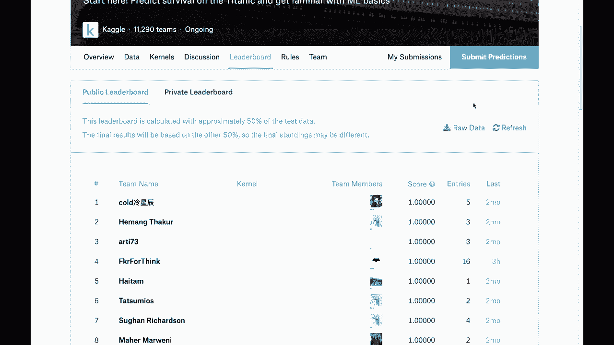

泰坦尼克号数据集基于那艘在大西洋沉没的邮轮。有些人幸存，有些人没有。你可以在维基百科上查到幸存者名单，因此理论上可以获得完美的预测得分。

**排行榜**显示了参与者的排名。在这个教程比赛中，有很多**1.0**的完美准确率得分，这意味着他们可能直接复制了已知结果。在泰坦尼克号数据集上获得0%的得分几乎是不可能的，但获得100%也意味着可能存在过拟合问题。这是一个关于**过拟合**的完美示例：有几个本应幸存（年轻女性）的个体并未幸存，原因未知。这提醒我们模型可能过于依赖训练数据中的模式。

---

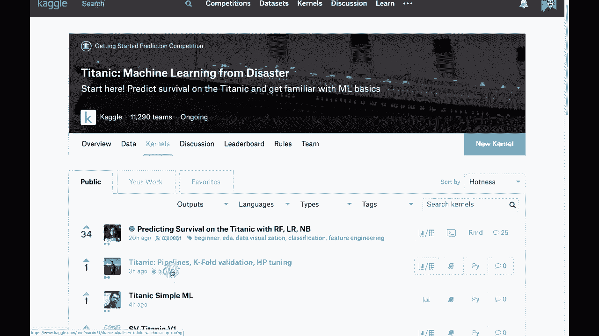

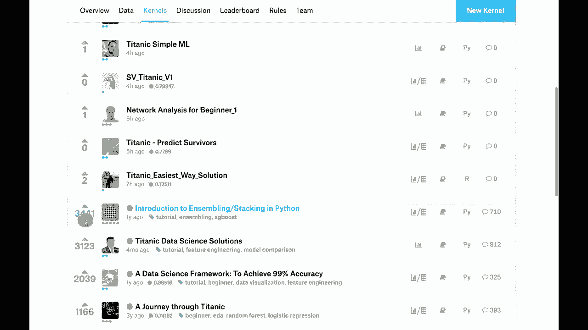

## 竞赛页面与数据

**数据页面**对竞赛至关重要。在模块结束时，我会带你了解本学期的具体比赛。数据页面展示了训练集和测试集的样子，并提供了数据字典。

例如，泰坦尼克号数据集包含以下变量：
*   `Survived`: 是否幸存（是/否）
*   `Pclass`: 票类（一、二、三等舱）
*   `Sex`: 性别
*   `Age`: 年龄
*   `SibSp`: 兄弟姐妹数量
*   `Parch`: 父母/子女数量
*   `Ticket`: 票号
*   `Fare`: 票价
*   `Cabin`: 舱位号
*   `Embarked`: 登船地点（欧洲三个城市）

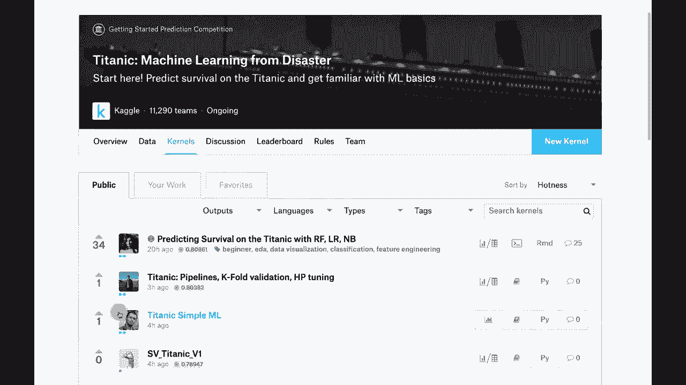

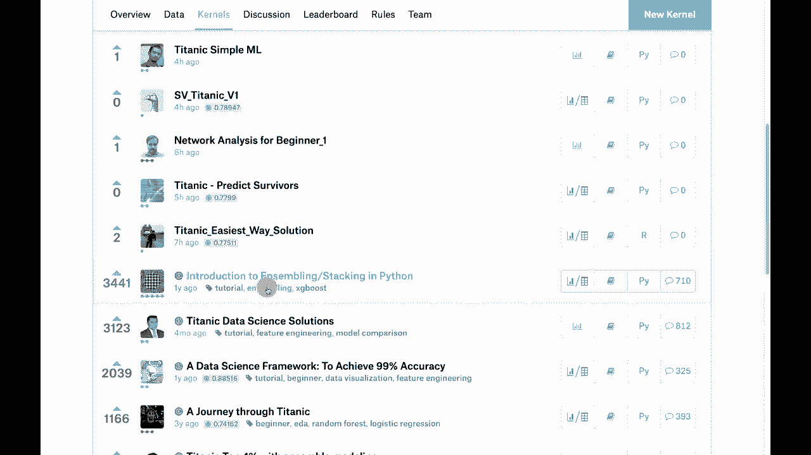

在这些变量中，**性别**可能是最具预测性的，因为遵循“妇女儿童优先”原则。**票类**可能是第二重要的因素，因为它与社会经济地位和舱位位置相关。**年龄**对于男性和女性都是重要的第二因素，因为儿童会被优先考虑。

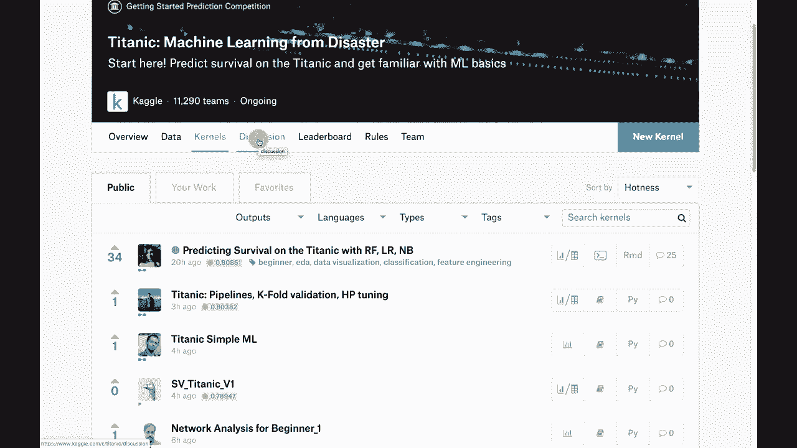

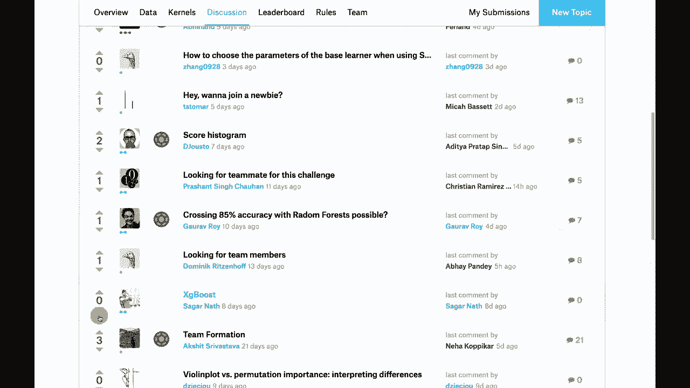

---

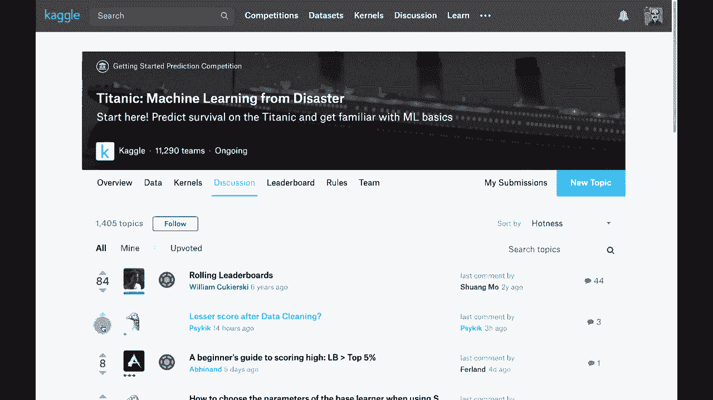

## Kaggle的声望体系：比赛、内核与讨论

在Kaggle中，你可以通过三种主要方式获得声望：

1.  **赢得比赛或在比赛中名列前茅**：这是最具声望的方式。
2.  **提交高质量的内核**：内核是共享的代码片段。即使你没有赢得比赛，如果你的代码被其他Kaggle用户高度评价，也能获得声望。例如，一些关于集成、堆叠和Python的教程内核评价很高。这可能是你本学期可以考虑的一个项目方向。
3.  **积极参与讨论**：我从Kaggle讨论中学到了很多。发布持续获得高排名的讨论帖可以帮助你获得“讨论大师”等称号，从而提升整体排名。

在Kaggle比赛中，通常允许组队。你会看到团队图标，表示这是团队竞赛。你可以创建最多五人的团队。

你还会注意到用户资料旁的小点，它们表示用户的Kaggle水平：
*   **一个绿点**：全新、未参与过比赛的用户。
*   **两个点**：参加过比赛，但尚未达到专家水平（即获得两枚铜牌）。
*   **三个点**：**Kaggle专家**（如我目前的状态）。
*   **四个点**：**Kaggle大师**。
*   **五个点**：**Kaggle宗师**。

---

## Kaggle竞赛的评分与提交

Kaggle比赛的评分方式很有趣。通常，你不需要提交代码，只需提交对测试数据的预测结果。

竞赛提供完整的数据集。我知道所有数据的结果。我会将数据拆分为**训练集**（包含目标值Y）和**测试集**（不包含Y，约占20%）。两个数据集都包含ID列。

你得分的方法是提交一个预测文件。该文件应包含测试集中每个ID编号对应的预测Y值。文件格式通常很简单，类似于：
```csv
PassengerId,Survived
892,0
893,1
894,0
...
```

在你提交后，评分分为两部分：
*   **公共排行榜**：基于一部分测试数据（你不知道是哪部分）进行评分。这是你实时看到的排名。
*   **私人排行榜**：基于剩余的测试数据评分，在比赛结束后才公布。

这种机制是为了防止**过拟合公共排行榜**。如果你不断调整模型以提升公共排行榜分数，可能会在私人排行榜公布时遭遇排名大幅下滑。许多Kaggle竞争者都有过这样的经历。因此，公共排行榜只是你最终排名的粗略估计。

---

## 有趣的Kaggle竞赛案例

最后，让我们看一些我发现特别有趣的Kaggle竞赛案例：

*   **Otto Group挑战赛**：这是我参与的第一个比赛，很幸运进入了前10%。这是一个多类别产品分类问题，有93个特征和20万行数据。我使用了深度学习和XGBoost。我强烈建议你了解**XGBoost**和**LightGBM**技术，它们在Kaggle中非常流行，可能有助于提升你本学期的作业分数。

*   **银河动物园**：这是一个使用XGBoost对星系类型进行分类的计算机视觉案例，推动了XGBoost的普及。

*   **实践融合竞赛**：这是一个提供关系数据库的早期医疗数据竞赛，涉及预测生物反应。数据集有3700行和1777列，是一个具有挑战性的二分类问题。我稍后会用它来演示**集成学习**（将多个模型结合，如随机森林与神经网络）。

*   **糖尿病视网膜病变检测**：通过眼底照片预测糖尿病，是计算机视觉在医疗领域的应用。

*   **猫狗识别**：一个经典的计算机视觉问题，现代模型准确率可达99%以上。

*   **州立农场分心驾驶检测**：使用计算机视觉检测驾驶行为，是物联网在保险行业的应用。

*   **鲸鱼检测挑战**：处理声音文件的时间序列数据，常用LSTM和卷积时间序列技术。

*   **帮助圣诞老人**：一个优化问题，旨在制定最佳的圣诞礼物配送路线，虽然超出神经网络核心范围，但很有趣。

---

## 总结

本节课中，我们一起学习了Kaggle平台。我们了解了Kaggle作为数据科学竞赛社区的重要性，探讨了其竞赛结构、评分机制（公共与私人排行榜）以及声望体系。我们还以泰坦尼克号竞赛为例，详细分析了数据页面和关键变量，并浏览了几个有趣的真实竞赛案例。

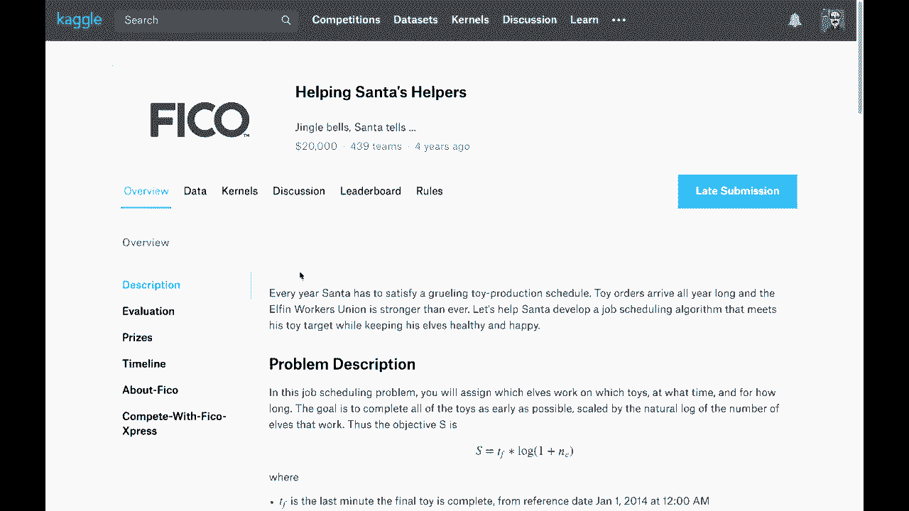

在下一个视频中，我们将探讨**集成学习**，学习如何将神经网络与其他Scikit-learn类型的模型结合，以构建预测能力更强的结构。这在Kaggle竞赛中是一种非常常见且有效的技术。