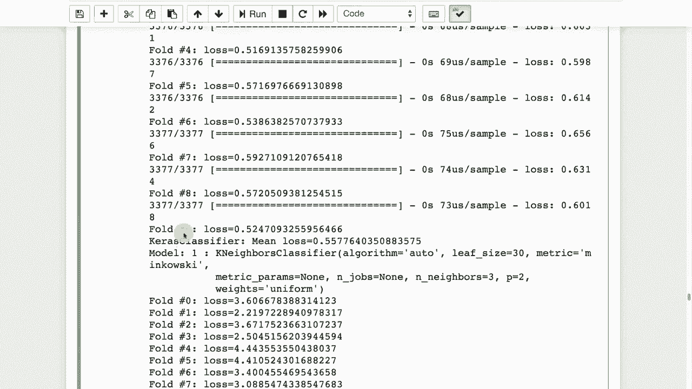

# T81-558 ｜ 深度神经网络应用 - P43：L8.2 - 使用Scikit-Learn和Keras构建集成模型 🧠🤖


在本节课中，我们将学习集成方法。我们将重点关注异构集成，这种方法允许你将不同类型的机器学习模型组合起来，以获得更强大的预测结果。这对于提升模型性能，尤其是在Kaggle等数据科学竞赛中，非常有帮助。


## 概述 📋

集成学习是机器学习中的一个重要概念。同质集成（如随机森林）组合了多个相同类型的模型。本节课我们将探讨异构集成，它结合了不同类型的模型（例如神经网络、随机森林、梯度提升等）。我们还将学习一种评估特征重要性的技术——特征扰动排名，并演示如何构建一个实际的集成模型。

## 特征重要性评估 🔍

上一节我们介绍了集成学习的概念。本节中，我们来看看如何评估模型中各个特征（输入变量）的重要性。这对于理解模型决策和进行特征选择至关重要。

特征扰动排名是一种流行且通用的技术，可用于任何回归或分类算法。它不依赖于模型内部结构，而是通过“破坏”某一列数据并观察模型性能的变化来评估该特征的重要性。

以下是特征扰动排名的基本步骤：

1.  使用原始数据训练一个模型，并记录其基准性能（如准确率、均方误差或对数损失）。
2.  对于数据集中的每一列（特征）：
    *   复制该列数据。
    *   随机打乱（扰动）该列的值，这相当于“摧毁”了该特征包含的信息。
    *   使用扰动后的数据集，用同一个模型进行预测，并计算新的性能分数。
    *   将原始列数据恢复回去。
3.  比较每一列被扰动后模型性能的下降程度。导致性能下降最严重的列，就是最重要的特征。

其核心思想可以表示为以下伪代码逻辑：

```python
基准误差 = evaluate_model(原始数据)
for 每一列 in 所有特征列:
    备份列数据 = 数据[列].copy()
    数据[列] = 随机打乱(数据[列]) # 扰动该特征
    新误差 = evaluate_model(扰动后数据)
    重要性分数[列] = 新误差 - 基准误差 # 误差增加越多，重要性越高
    数据[列] = 备份列数据 # 恢复数据
```

接下来，我们将这个技术应用于两个经典数据集。

### 在鸢尾花数据集上的应用 🌸

我们首先在一个简单的分类任务——鸢尾花数据集上演示特征扰动排名。

运行代码后，我们可以得到各个特征的重要性排名。例如，结果显示“花萼长度”是预测鸢尾花种类最重要的特征，其重要性得分被归一化为1.0，其他特征的重要性则按比例降低。这为我们提供了清晰的**特征重要性排序**。

### 在回归任务上的应用 🚗

同样，我们可以将特征扰动排名应用于回归问题，例如预测汽车的每加仑英里数（MPG）。

分析结果显示，对于预测MPG的神经网络模型，“排量”是最重要的特征，其次是“马力”、“重量”和“年份”等。大多数特征的重要性相对接近，这符合我们的直观认知。

## 构建异构集成模型 🧩

了解了如何评估特征后，我们进入本节课的核心：构建一个异构集成模型。我们将使用一个真实的Kaggle竞赛数据集（生物响应数据集）作为例子。该数据集具有近1700个特征和约3000行，是一个具有挑战性的分类问题。

单独使用一个神经网络模型在该数据集上取得了约76%的验证准确率，仍有提升空间。集成方法在这里至关重要。

以下是构建集成模型的主要步骤：

1.  **准备多个基学习器**：我们选择几种不同类型的模型，例如：
    *   人工神经网络（使用Keras构建）
    *   随机森林分类器
    *   极端随机树
    *   梯度提升机
2.  **生成预测**：使用K折交叉验证（这里采用分层K折以保证类别平衡）训练每个基学习器。对于每一折，用训练好的模型对验证集进行预测。最终，每个模型都会在整个数据集上生成一组“样本外”预测。
3.  **构建元特征**：将所有基学习器的预测结果作为新的特征（元特征），拼接成一个新的数据集。这个新数据集的每一行对应一个原始样本，每一列对应一个基学习器的预测概率。
4.  **训练元学习器**：在这个由预测结果构成的新数据集上，使用一个简单的模型（如逻辑回归）进行训练。这个元学习器的任务是学习如何最佳地**加权组合**各个基学习器的预测。
5.  **生成最终预测**：用训练好的元学习器对测试集进行预测，得到最终的集成预测结果。

这个过程可以用以下公式简要表示：
**最终预测 = 元学习器( 模型1的预测， 模型2的预测， ...， 模型N的预测 )**

通过这种方式，我们利用了不同模型捕捉数据模式能力的多样性，让元学习器（如逻辑回归）来决定如何信任和组合每个模型的输出，从而通常能获得比任何单一模型都更稳健、更准确的预测。

## 总结 🎯

本节课中，我们一起学习了两个关键内容：

1.  **特征扰动排名**：一种模型无关的特征重要性评估方法，通过打乱特征值并观察模型性能变化来排序特征重要性。
2.  **构建异构集成模型**：通过组合多种不同类型模型（如神经网络、随机森林）的预测，并训练一个元学习器来整合它们，从而提升整体模型的预测性能。这是数据科学竞赛中取得优异成绩的常用策略。



掌握这些技术将帮助你更好地理解模型、优化特征，并构建出更强大的预测系统。