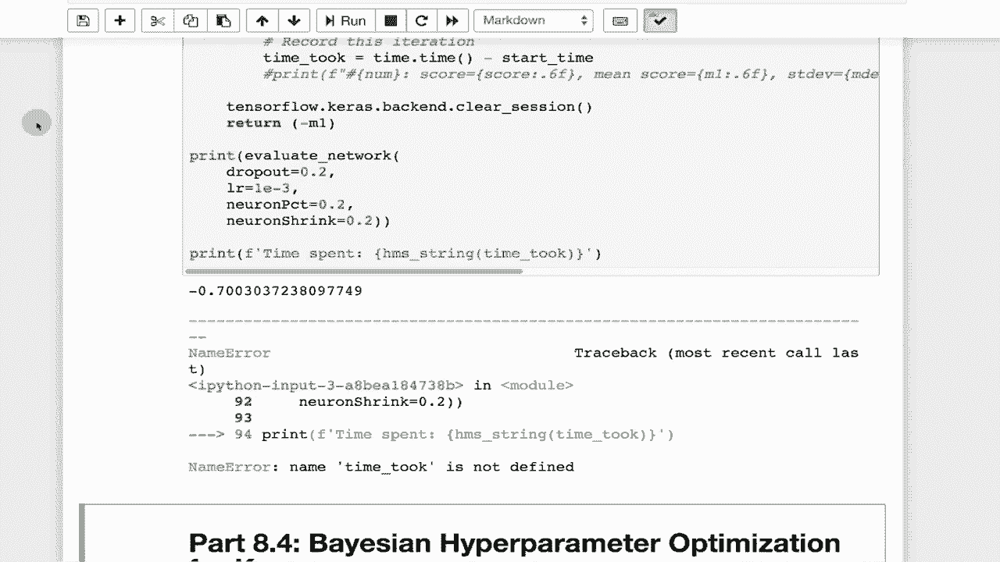

# T81-558 ｜ 深度神经网络应用 - P44：L8.3 - Keras神经网络结构搭建细节与超参数 🧠

在本节课中，我们将深入探讨如何决定神经网络的层数和神经元数量，并系统性地梳理Keras中可用的主要层类型、激活函数和超参数。理解这些构建模块是设计高效神经网络模型的基础。

## 概述 📋


构建神经网络时，一个核心挑战是确定其结构：使用多少层、每层多少个神经元，以及选择哪些激活函数和正则化方法。这些选择并非由模型训练自动学习，而是由从业者指定的**超参数**。本节课将详细介绍Keras中用于搭建网络的核心组件，并解释关键超参数的作用，为后续学习自动化超参数调优打下基础。

## 神经网络超参数简介

决定神经网络结构（如层数和神经元数量）是一个复杂的问题，没有简单的答案。神经网络包含许多可调整的部分，例如层类型、激活函数和正则化方法。

神经网络的**权重**是在训练过程中学习的。然而，**超参数**并非由训练过程决定，而是需要由神经网络从业者预先指定。这包括选择激活函数、正则化策略等。在后续课程中，我们将介绍使用**贝叶斯优化**等方法来辅助微调这些超参数。

即便如此，从业者仍需决定优化哪些超参数以及如何优化。本节将带您回顾目前讨论过的主要超参数和层类型。

## Keras核心层类型详解

在Keras中构建神经网络时，您会向序列模型中添加各种层。以下是构建模型时可用的主要层类型及其简要说明。

### 激活与正则化相关层

*   **`Activation`层**：此层允许您指定激活函数。通常，更常见的做法是将激活函数作为`Dense`等层的一个参数来指定，但也可以单独使用此层。
*   **`ActivityRegularization`层**：此层允许您在层之外添加L1和L2正则化。同样，L1/L2正则化通常作为特定层（如`Dense`层）的参数添加，但此层提供了另一种选择。

### 核心网络层

*   **`Dense`层（全连接层）**：这是处理**表格数据**的主力层。它构成了神经网络的基本结构。在处理图像或其他数据时，最终通常也会连接到`Dense`层。
*   **`Dropout`层**：此层用于实现**丢弃正则化**。您需要指定一个相对较低的百分比（如5%，10%，20%），代表在训练期间随机禁用该层神经元的比例。在模型实际预测（推理）时，丢弃不起作用。丢弃率是一个需要在构建网络时指定的超参数，不可学习。
*   **`Flatten`层**：此层通常用在`Dense`层之前或输出层之前，用于将多维张量（如矩阵、立方体）**压缩**成一维向量，以便传递给不处理多维输入的层。
*   **`Input`层**：此层定义了数据进入神经网络的入口。它也可以作为`Dense`等层的一个参数来指定。

### 数据变换与结构层

*   **`Lambda`层**：此层允许您通过一个Python Lambda函数对数据进行自定义转换。
*   **`Masking`层**：此层用于处理时间序列数据中的缺失时间步，在处理循环神经网络（如LSTM）时可能有用。
*   **`Permute`层**：此层用于按照给定模式**重新排列**张量的维度。它类似于`Reshape`，但更侧重于维度的顺序而非形状。例如，当RGB通道顺序与网络预期不符时，`Permute`可能是一个好选择。
*   **`RepeatVector`层**：此层用于复制向量。
*   **`Reshape`层**：此层非常常用，用于在数据处理过程中**改变张量的结构形状**。
*   **`SpatialDropout1D/2D/3D`层**：这些是专门为卷积层设计的丢弃正则化变体。

## 激活函数选择指南 🎛️

激活函数是神经网络中的关键组成部分。历史上出现了许多激活函数，其中一些在现代深度学习中已不常用。

以下是Keras中提供的主要激活函数：

*   **`softmax`**：通常用于**多类别分类**问题的输出层。它确保所有输出值之和为1，因此可以解释为概率分布。对于多类分类，通常都会使用它。
*   **`elu` (指数线性单元)** 和 **`selu` (缩放指数线性单元)**：在一些论文中显示出理论优势。`selu`是`elu`的缩放版本，缩放因子是一个需要指定的超参数。
*   **`softplus`**, **`softsign`**：历史函数，在现代论文中不常见。
*   **`relu` (修正线性单元)**：现代深度学习的**主力激活函数**，广泛应用于隐藏层。
*   **`tanh` (双曲正切)**：在ReLU流行之前，常用于隐藏层。现在仍见于LSTM等结构中。
*   **`sigmoid`**：在经典神经网络的隐藏层中常见，但在现代网络隐藏层中不常用。然而，它仍然是**二分类**逻辑回归输出层的标准选择。
*   **`hard_sigmoid`**：是`sigmoid`的计算近似，计算开销更小，可能在移动设备上有用。
*   **`linear` (线性)**：通常用于**回归**问题的输出层。在隐藏层中很少使用。
*   **`leaky_relu`**：ReLU的变体，允许很小的负梯度，有助于缓解“神经元死亡”问题。它包含一个`alpha`参数，通常需要指定。
*   **`prelu` (参数化ReLU)**：`leaky_relu`的进阶版，其`alpha`参数可以**在训练中学习**，通常能取得不错的效果。

## 正则化与优化关键参数

上一节我们介绍了各种层和激活函数，本节我们来看看影响训练稳定性和效果的关键超参数。

*   **L1/L2正则化与Dropout**：在深度学习中，**Dropout**是使用最广泛的正则化技术。L2正则化也有一定应用，而L1正则化（尤其在视觉网络中）使用较少。Dropout的百分比可以通过贝叶斯优化等技术来确定。
*   **批量归一化 (`BatchNormalization`)**：该层在实践中非常有用。它通常允许使用比平时更高的学习率，而不会导致训练不稳定。它也是缓解**梯度消失**问题的一种方法。
*   **批量大小 (`batch_size`)**：在深度学习中，使用**小批量**进行训练非常流行。通常批量大小设置为32或更小。
*   **学习率 (`learning_rate`)**：这是最重要的超参数之一。学习率过小会导致模型无法学习；学习率过高则会导致训练不稳定，误差函数可能出现`NaN`（非数字）值，使训练崩溃。**如果看到误差报告为`NaN`，通常是因为学习率太高。** 初始学习率常设置为`1e-3`（0.001）或更小。当使用批量归一化时，可以尝试使用稍大的学习率。

## 超参数调优实践示例

理解了这些超参数后，我们如何系统地调整它们呢？以下是一个简单的实践思路。

以下是一个将复杂神经网络超参数编码为向量的示例方法，便于进行自动化搜索（如贝叶斯优化）：

```python
# 示例：定义超参数搜索空间
hyperparam_vector = [
    dropout_rate,      # 丢弃率，如 0.1, 0.2
    learning_rate,     # 学习率，如 1e-3, 1e-4
    neuron_pct,        # 首层神经元数占基准的百分比，如 0.8 (80%)
    neuron_shrink      # 后续每层神经元收缩因子，如 0.8
]
```

在这个示例中：
1.  `dropout_rate`控制正则化强度。
2.  `learning_rate`控制优化步长。
3.  `neuron_pct`和`neuron_shrink`共同定义了网络每层的宽度结构。例如，从`neuron_pct`定义的基数开始，每新增一层，神经元数量就乘以`neuron_shrink`因子，直到低于某个阈值（如10个神经元）。

通过将超参数转化为这样的数值向量，我们可以利用**贝叶斯超参数优化**等算法，让机器自动寻找较优的组合，从而减轻手动调参的负担。在后续课程中，我们将具体实现这一过程。

## 总结 🎯

本节课我们一起学习了构建Keras神经网络的核心细节与超参数。



我们首先明确了**超参数**（如层数、神经元数、激活函数）需要由人工设定，而**权重**由模型训练得到。接着，我们系统回顾了Keras中的主要**层类型**（如`Dense`, `Dropout`, `Flatten`）和**激活函数**（如`relu`, `softmax`, `sigmoid`），并了解了它们适用的场景。最后，我们讨论了**学习率**、**批量大小**、**正则化**等关键训练超参数的重要性，并介绍了将超参数向量化以便进行自动化调优的基本思路。

掌握这些基础知识是有效设计和调整神经网络模型的前提。在下一节课中，我们将利用这些概念，探索如何使用贝叶斯优化来自动化超参数调优过程。