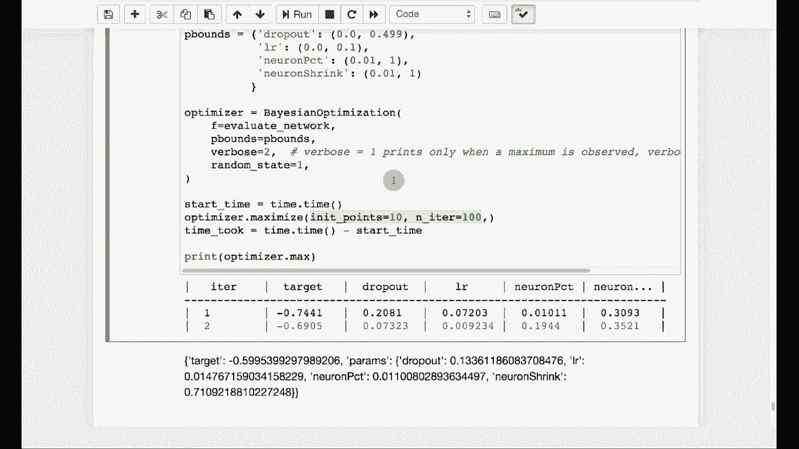

# T81-558 ｜ 深度神经网络应用 - P45：L8.4 - 基于Keras的贝叶斯超参数优化 🎯


在本节课中，我们将学习如何使用贝叶斯优化方法，自动地为神经网络寻找最佳的超参数配置。这对于提升模型性能，尤其是在Kaggle等数据科学竞赛中，至关重要。


## 概述 📋

超参数是模型训练前需要手动设定的参数，例如神经网络的层数、每层神经元数量、学习率等。与模型权重不同，它们无法通过反向传播等基于梯度的方法自动优化。本节课将介绍如何将贝叶斯优化应用于超参数调优，以高效地找到性能更佳的模型配置。

## 超参数与参数的区别

上一节我们介绍了超参数的基本概念，本节中我们来看看它与模型参数的核心区别。

*   **参数**：模型在训练过程中**自动学习**的变量，例如神经网络的权重（`W`）和偏置（`b`）。它们通过优化算法（如反向传播）进行调整，以最小化损失函数。
    *   **公式表示**：`损失函数 L = f(参数 W, b; 数据 X, y)`
*   **超参数**：模型训练前**手动设定**的配置项，用于控制训练过程本身和模型结构。反向传播无法优化它们。
    *   **常见示例**：学习率（`learning_rate`）、隐藏层数量、Dropout比率（`dropout_rate`）、优化器类型等。

因此，我们需要在可微分的参数优化（如反向传播）之上，使用不可微分的优化方法（如贝叶斯优化）来寻找最佳超参数。

## 构建可优化的超参数向量

为了应用优化算法，我们需要将各种超参数编码成一个统一的数值向量。以下是构建该向量的一个示例方法。

我们将定义一个函数，它接收一个代表超参数的向量，并据此构建和评估一个神经网络。

```python
def create_and_evaluate_network(hyperparam_vector):
    # hyperparam_vector 可能包含：[dropout_rate, learning_rate, neuron_percent, neuron_reduction]
    dropout_rate = hyperparam_vector[0]
    learning_rate = hyperparam_vector[1]
    neuron_percent = hyperparam_vector[2] # 最大神经元数的百分比
    neuron_reduction = hyperparam_vector[3] # 层间神经元缩减率

    # 根据向量计算实际神经元数量
    max_neurons = 5000 # 预设的最大神经元数，本身也是一个超参数
    first_layer_neurons = int(max_neurons * neuron_percent)

    # 以金字塔结构构建网络层
    layers = []
    current_neurons = first_layer_neurons
    layer_id = 1
    while current_neurons >= 25 and layer_id <= 10: # 至少25个神经元，最多10层
        layers.append(current_neurons)
        current_neurons = int(current_neurons * neuron_reduction)
        layer_id += 1

    # 使用 layers, dropout_rate, learning_rate 构建和训练Keras模型
    # ...
    # 评估模型性能，例如计算对数损失（log loss）
    model_performance = evaluate_model(...)
    return -model_performance # 返回负值，因为优化器通常用于最大化目标
```

**代码说明**：
*   `neuron_percent` 和 `neuron_reduction` 是创造性地将网络结构（层数和每层大小）编码为少数几个可优化变量的方法。
*   函数最终返回 `-model_performance`。因为大多数优化器旨在**最大化**目标函数，而对数损失是越小越好，取负值后，最大化负损失就等价于最小化原始损失。

## 实施贝叶斯优化

现在，我们将使用贝叶斯优化库来寻找最佳的超参数向量。贝叶斯优化的优势在于，它能在相对较少的目标函数评估次数内找到较优解，这对于训练耗时很长的神经网络评估来说非常高效。

首先，需要定义每个超参数的搜索空间（边界）。

```python
from bayes_opt import BayesianOptimization

# 定义超参数边界
pbounds = {
    'dropout_rate': (0, 0.499),      # Dropout比率范围
    'learning_rate': (0.0, 0.1),     # 学习率范围
    'neuron_percent': (0.01, 1.0),   # 神经元百分比范围 (1% 到 100%)
    'neuron_reduction': (0.01, 1.0)  # 神经元缩减率范围
}
```

接下来，初始化贝叶斯优化器并开始搜索。优化过程平衡了“探索”（尝试新区域）和“利用”（在表现好的区域深入搜索）。

```python
# 初始化优化器
optimizer = BayesianOptimization(
    f=create_and_evaluate_network, # 目标函数
    pbounds=pbounds,               # 参数边界
    verbose=2,                     # 输出详细程度
    random_state=42                # 随机种子，确保结果可复现
)

# 执行优化
# init_points: 初始随机探索的点数（探索阶段）
# n_iter: 在探索之后，基于模型进行优化的迭代次数（利用阶段）
optimizer.maximize(init_points=10, n_iter=100)
```

**过程解释**：
优化器会先进行10次随机评估（`init_points=10`），以初步探索搜索空间。然后，基于这些结果构建一个概率模型，指导后续100次评估（`n_iter=100`）更集中在可能产生高回报的区域。这类似于“多臂老虎机”问题中在尝试新机器和专注玩当前最好的机器之间取得平衡。

## 结果解析与应用

优化完成后，我们可以查看找到的最佳超参数组合及其对应的模型性能。

```python
# 打印最佳结果
print(optimizer.max)
```

输出可能类似于：
```
{'target': -59.123, 'params': {'dropout_rate': 0.13, 'learning_rate': 0.01, 'neuron_percent': 0.15, 'neuron_reduction': 0.7}}
```
这表明，当Dropout比率为13%、学习率为0.01、使用最大神经元数的15%作为第一层、且每层神经元数以30%的速率缩减时，模型取得了约59.12的对数损失（因为目标是负值）。这个结果可能比手动调参的效果更好。

此方法不仅适用于神经网络，也可用于其他具有超参数的机器学习模型（如XGBoost、随机森林）。关键在于如何将模型的配置有效地编码成一个可优化的向量。

## 总结 🎓

本节课中我们一起学习了贝叶斯超参数优化的核心流程。

1.  **明确区别**：我们首先区分了模型参数（可自动学习）和超参数（需手动或自动调优）。
2.  **向量化编码**：我们学习了如何将复杂的网络结构（如层数、神经元数）和其他超参数（学习率、Dropout）编码成一个统一的数值向量，以便被优化算法处理。
3.  **应用贝叶斯优化**：我们介绍了如何使用贝叶斯优化库，通过定义搜索边界和设置探索/利用策略，高效地寻找最佳超参数组合。
4.  **解析结果**：我们查看了优化输出，并将其解释为具体的模型配置建议。

通过自动化超参数调优，我们可以节省大量时间，并有望发现超出人工直觉范围的、性能更优的模型配置。



