# T81-558 ｜ 深度神经网络应用-P46：L8.5- 2020年春季Kaggle深度学习应用竞赛 👓

在本节课中，我们将介绍2020年春季学期Kaggle深度学习应用竞赛。本次竞赛的主题是计算机视觉，具体任务是判断生成的人脸图像是否佩戴眼镜。我们将了解竞赛的目标、数据、评估方式以及一些重要的规则和技巧。


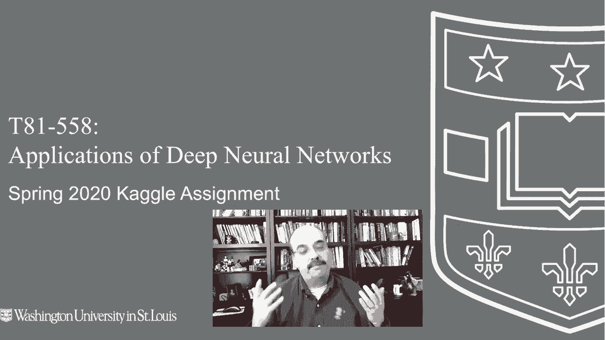


## 竞赛概述 🎯

我是Jeff Heaton，欢迎来到华盛顿大学深度神经网络应用课程。本次2020年春季Kaggle竞赛将围绕计算机视觉展开。这是我们课程中首次涉及计算机视觉任务，因此令人兴奋。

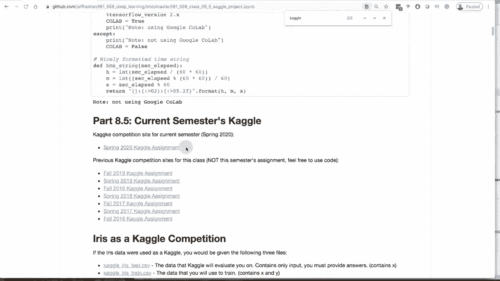

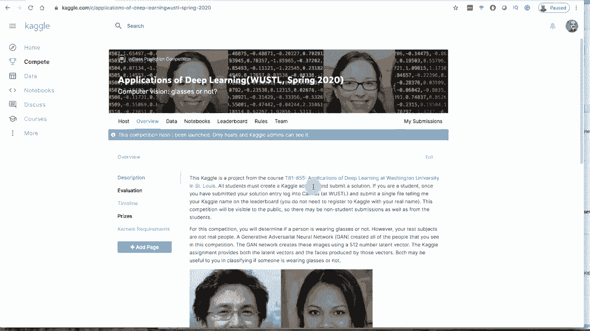


上一节我们介绍了自然语言处理，这是一种强大的深度学习应用技术。本节中，我们将关注人脸图像，并尝试检测其中是否包含眼镜。请注意，本次竞赛使用的所有图像均由生成对抗网络（GAN）生成。

## 竞赛数据与任务 📊

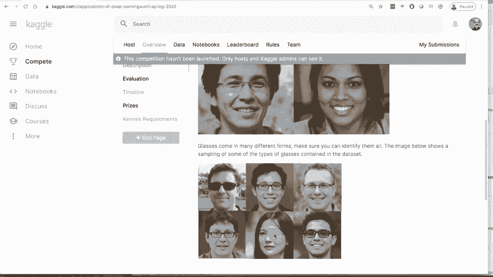


以下是本次竞赛的核心任务与数据描述。

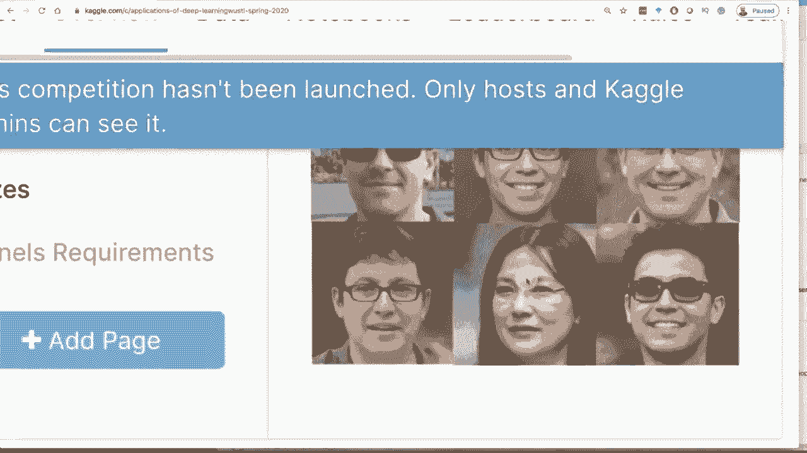

### 核心任务
竞赛的目标是预测一张生成的人脸图像中的人物是否佩戴眼镜。你需要提交一个概率值，表示你认为该图像中人物戴眼镜的可能性。

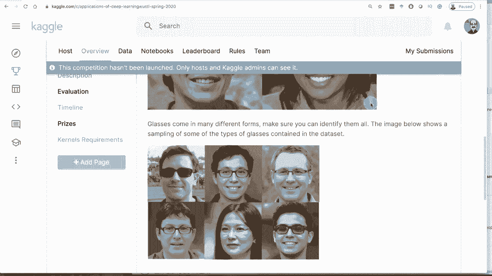

**公式表示**：
对于每张图像，模型需要输出一个概率值 `P(glasses=1)`。提交格式为图像ID和对应的预测概率。

### 数据来源
数据集中包含约5000张由GAN生成的人脸图像。图像中人物的眼镜样式多样，包括太阳镜、厚框眼镜、薄框眼镜等，有些眼镜甚至非常不明显。

**数据文件说明**：
数据集包含一个约6GB的压缩文件，内含所有图像。此外，每张图像还对应一个512维的潜在向量（GAN latent vector），该向量用于生成这张人脸。

**代码示例（数据列表示例）**：
```
id, vec_1, vec_2, ..., vec_512, glasses
1, 0.123, -0.456, ..., 0.789, 1
2, -0.234, 0.567, ..., -0.890, 0
...
```

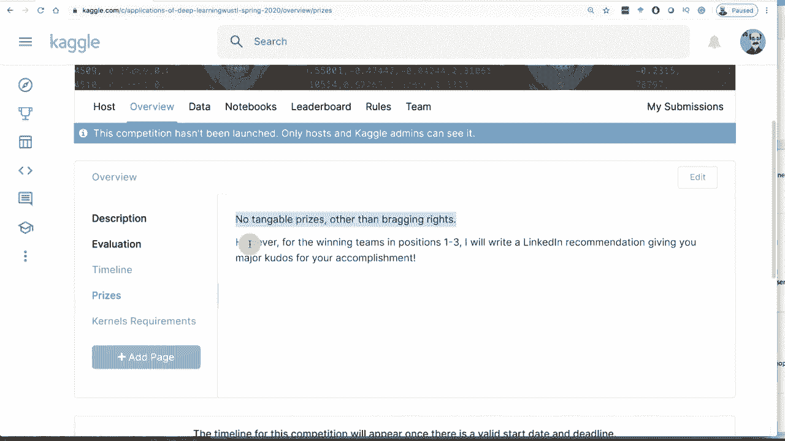

## 评估方式与规则 ⚖️

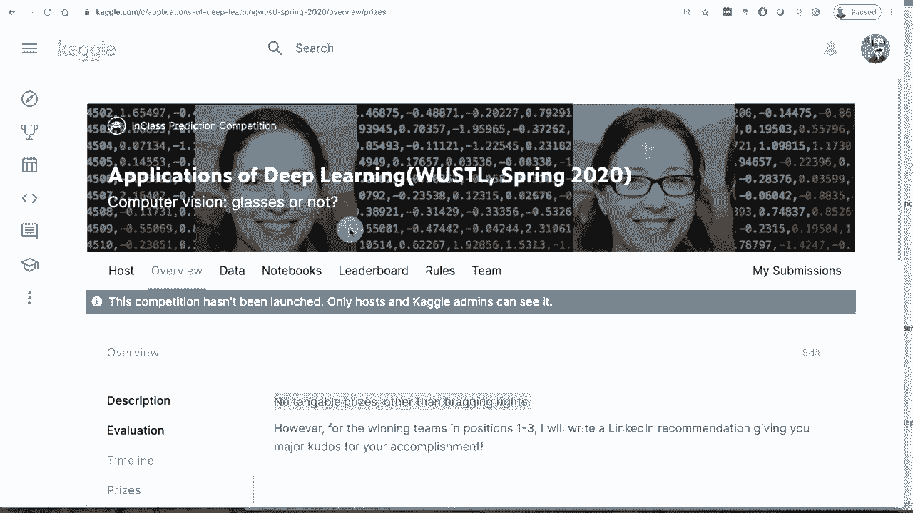

上一节我们了解了任务和数据，本节中我们来看看如何评估模型性能以及必须遵守的规则。

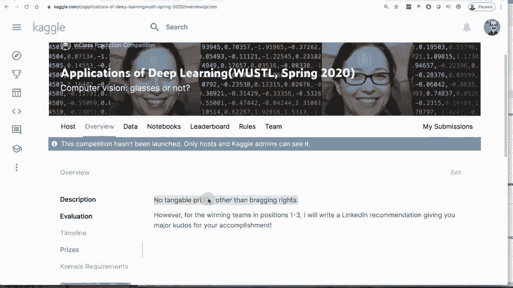

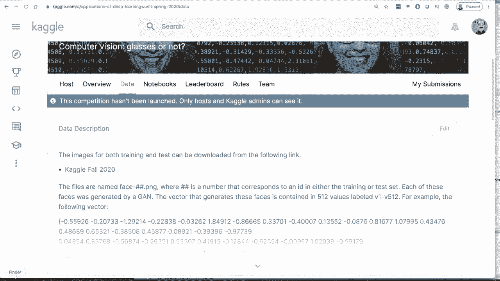

### 评估指标
模型将根据**对数损失（Log Loss）**进行评估。你需要为测试集中的每张图像提交一个戴眼镜的概率值（介于0和1之间），系统会根据真实标签计算对数损失。

**公式**：
对数损失公式为：
`Log Loss = -1/N * Σ [y_i * log(p_i) + (1-y_i) * log(1-p_i)]`
其中，`y_i`是真实标签（1表示戴眼镜，0表示不戴），`p_i`是预测概率，`N`是样本总数。

### 重要规则
以下是参赛必须遵守的规则列表：
1.  **禁止人工标注**：不允许人工查看测试集图像并直接标注。必须使用构建的模型进行预测。
2.  **团队规模**：最多可以组建5人的团队。
3.  **提交要求**：需要提交预测结果文件。对于华盛顿大学的学生，还需要提交源代码。
4.  **数据噪声**：请注意，训练数据标签并非100%准确，因为其由算法生成。这意味着即使完美预测了图像内容，也可能因标签噪声而无法获得完美的对数损失分数。

## 技术方法与建议 💡

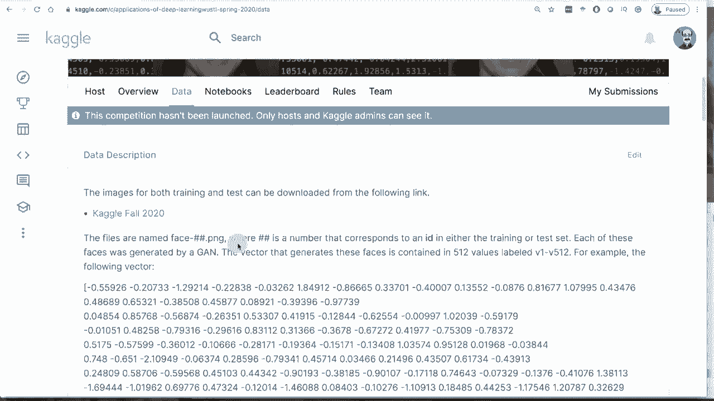

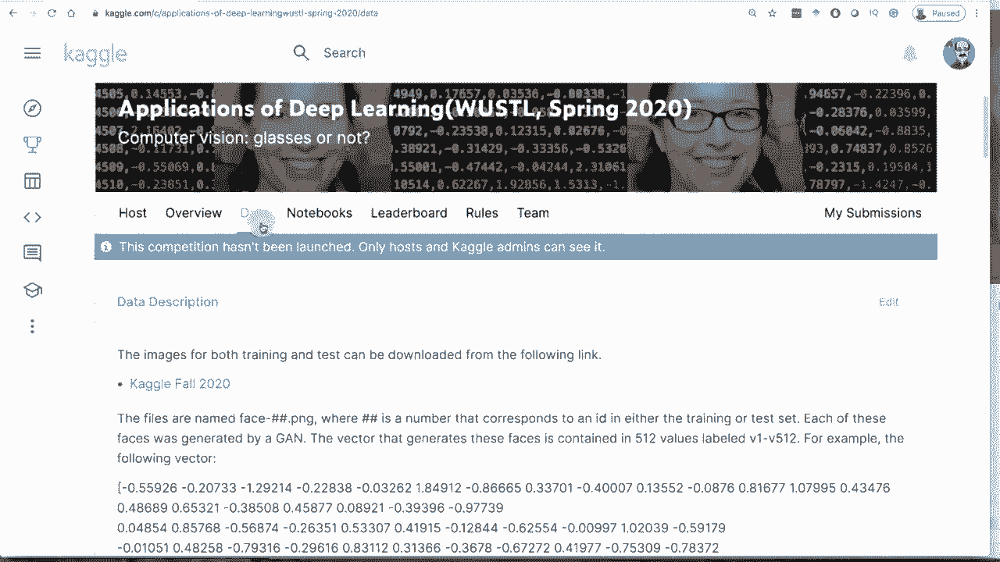

了解了规则后，我们来看看可以尝试哪些技术方法来构建模型。

### 可用的方法
你有两种主要的数据输入方式可供选择：
1.  **使用原始图像**：直接以人脸图像作为输入。
2.  **使用潜在向量**：使用生成该图像的512维GAN潜在向量作为输入。

### 方法建议
以下是针对不同输入方式的一些技术建议：
*   **对于图像输入**：强烈建议使用**迁移学习**。利用在大型数据集（如ImageNet）上预训练好的模型（如ResNet, VGG），在其基础上针对本任务进行微调，这通常是高效且有效的方法。
*   **对于向量输入**：可以尝试构建一个传统的机器学习模型（如全连接神经网络、梯度提升树等）直接对512维向量进行分类。如果能仅凭向量高精度预测，将是一个有趣的发现。
*   **探索性思路**：你也可以尝试使用目标检测模型（如YOLO）来检测图像中的“眼镜”物体，但这不一定是最直接的解决方案。


### 关于数据噪声的挑战
数据中存在标签噪声，这为竞赛增加了一个额外挑战。一个潜在的进阶思路是：分析潜在向量的空间分布，通过聚类等方法尝试识别并修正可能的错误标签。这可能需要结合图像和向量信息进行深入分析。

## 总结与后续步骤 🏁

本节课中我们一起学习了2020年春季Kaggle竞赛的详细内容。我们明确了竞赛任务是进行二分类（是否戴眼镜），了解了由GAN生成的图像和潜在向量构成的数据集，掌握了以对数损失为评估标准，并记住了禁止人工标注的核心规则。

在技术层面，我们讨论了使用图像进行迁移学习或使用潜在向量构建模型两种主要路径，并指出了数据标签噪声带来的挑战与潜在的高级解决思路。

接下来，你可以访问课程GitHub仓库或Kaggle竞赛页面获取数据，开始组建团队并探索不同的建模方案。祝你在竞赛中取得好成绩！

---
**请注意**：本次竞赛对华盛顿大学选课学生和外部参与者同时开放。除了荣誉排名，优胜团队可能获得额外的认可（如推荐信）。如果你对GAN、计算机视觉或本次竞赛有更多疑问，可以参考课程的其他相关视频资料。