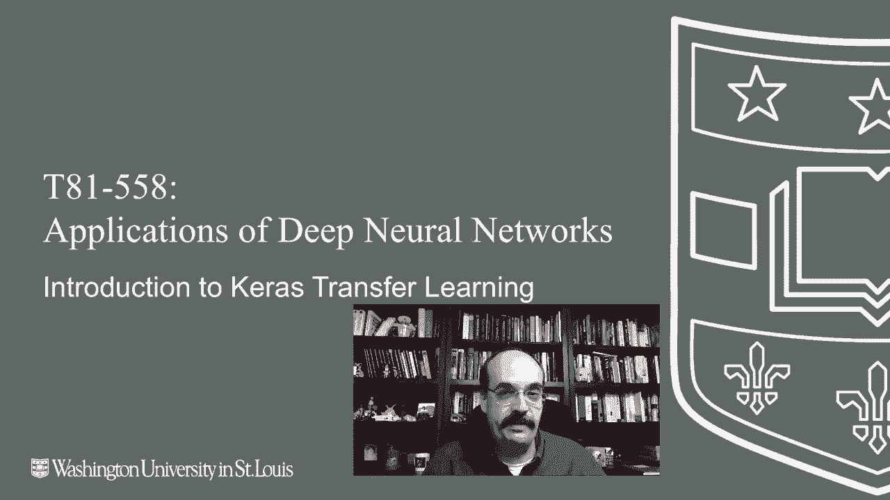
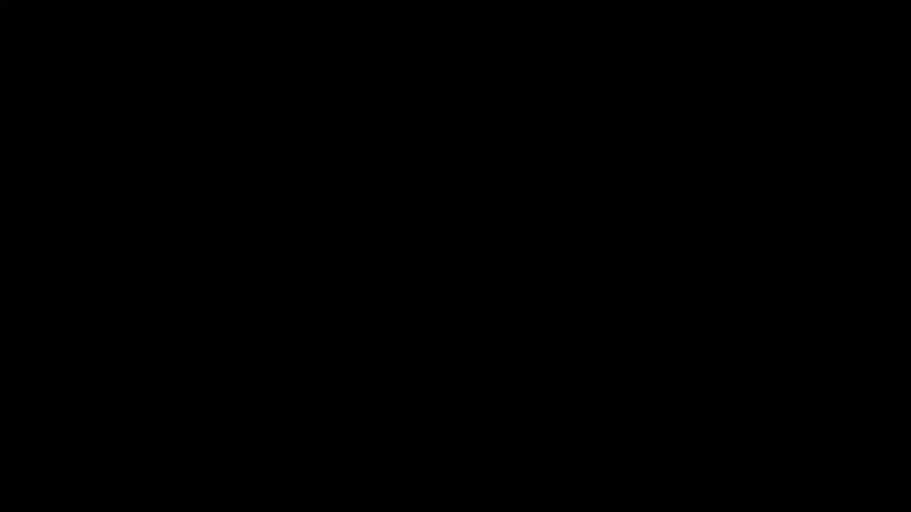
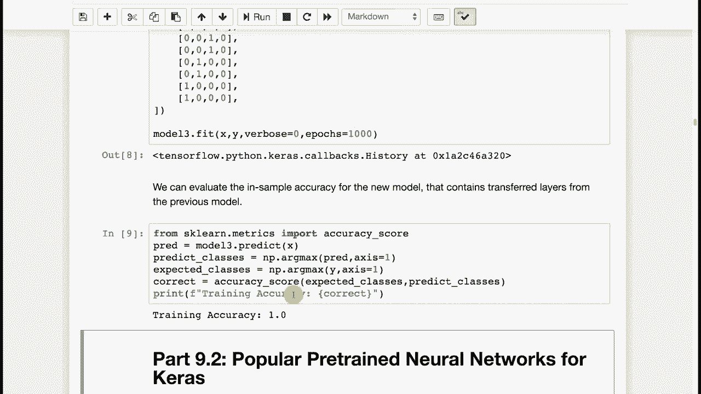

# T81-558 ｜ 深度神经网络应用 - P47：L9.1 - Keras迁移学习简介 🧠➡️📚


我是杰夫·希顿，欢迎来到华盛顿大学的深度神经网络应用课程。在本节课中，我们将要学习迁移学习的概念及其在Keras中的实现。训练一个神经网络需要大量工作和计算时间，尤其是在没有高端GPU的情况下。迁移学习允许我们利用他人已训练好的神经网络作为起点，从而节省时间和资源。







## 概述

迁移学习是深度学习中的一个核心概念。它之所以重要，是因为训练先进的神经网络（尤其是在计算机视觉和自然语言处理领域）需要耗费大量的时间、计算资源和金钱。

在表格数据领域，迁移学习并不常见，因为针对此类数据的预训练神经网络较少。表格数据集通常差异很大。相比之下，计算机视觉任务之间往往存在许多共性，例如边缘、轮子、眼睛等基础特征。因此，我们可以将谷歌、微软等大公司训练好的神经网络知识迁移过来，作为我们自己模型的基础。

如果你想让神经网络识别几种特定的图像类型，完全从头开始训练可能并非最佳选择。你可以迁移一个已在ImageNet等通用数据集上训练好的神经网络的权重。

## 迁移学习的工作原理

迁移学习的典型工作流程是：首先找到一个预训练的神经网络，它包含多层结构。通常，我们会**移除预训练网络的顶层（分类头）**，然后**冻结这些底层网络的权重**（使其不可训练）。最后，**为我们自己的任务添加并训练新的顶层**。

这样，底层网络就充当了**特征工程**的角色，它们提取的特征对于许多视觉任务都是通用的。只有我们新添加的顶层会根据我们的特定数据进行训练。

其核心思想可以用以下伪代码表示：
```python
# 1. 加载预训练模型（不含顶层）
base_model = VGG16(weights='imagenet', include_top=False)
# 2. 冻结基础模型权重
base_model.trainable = False
# 3. 添加新的自定义顶层
model = Sequential([
    base_model,
    Flatten(),
    Dense(256, activation='relu'),
    Dense(num_classes, activation='softmax')
])
# 4. 仅训练新添加的层
model.compile(...)
model.fit(new_data, new_labels, ...)
```

## 一个简单的迁移学习示例

为了清晰地理解整个过程，我们先看一个使用表格数据（鸢尾花数据集）的简单示例。虽然实践中较少见，但它能帮助我们看清所有步骤。

首先，我们将创建并训练一个基础的神经网络，模拟“大公司”花费资源训练出的模型。

以下是加载数据、构建和训练初始模型的步骤：

1.  加载鸢尾花训练数据。
2.  构建一个顺序模型，包含几个全连接层。
3.  编译并训练该模型，使其能准确分类三种鸢尾花。
4.  评估模型，其准确率约为98%。
5.  使用 `model.summary()` 查看模型结构，例如各层神经元数为50、25和3。

现在，我们有了一个训练好的基础模型。接下来，我们将演示如何迁移这个模型。

首先，我们进行一个完整性检查：直接复制整个模型。
```python
# 创建新模型并复制原模型所有层
model2 = Sequential()
for layer in original_model.layers:
    model2.add(layer)
# 评估复制后的模型，准确率应与原模型一致
model2.evaluate(test_data, test_labels)
```
这得到了一个与原模型功能完全相同的副本，但本身并不产生新价值。

迁移学习真正发挥作用是在我们想处理新任务时。假设我们现在想分类四种新的“假想”花卉。

以下是迁移学习应用于新任务的关键步骤：

1.  **移除原模型的输出层**：我们只保留原模型的前面几层作为特征提取器。
2.  **冻结这些迁移来的层**：设置 `layer.trainable = False`，防止在后续训练中更新它们的权重。
3.  **添加新的输出层**：添加一个适合新任务（4分类）的新的全连接层。
4.  **仅训练新添加的层**：使用新的小规模数据集进行训练。

```python
# 创建新模型，仅包含原模型的前两层（特征提取器）
model3 = Sequential()
for layer in original_model.layers[:-1]: # 移除最后一层
    model3.add(layer)
    layer.trainable = False # 冻结权重

# 为新的4分类任务添加新的输出层
model3.add(Dense(4, activation='softmax'))

# 编译模型，注意现在只有新层的参数是可训练的
model3.compile(optimizer='adam', loss='categorical_crossentropy', metrics=['accuracy'])

# 使用新的小数据集（例如，每种花仅2个样本）训练模型
model3.fit(new_X_train, new_y_train_one_hot, epochs=50, verbose=0)
```
运行后，模型在新任务上可能达到约88%甚至更高的准确率。这证明了通过迁移学习，我们可以用极少的训练样本和计算成本，让模型快速适应新任务。

## 总结

本节课中，我们一起学习了Keras中迁移学习的基本概念和操作流程。

我们了解到，迁移学习通过**复用预训练模型的特征提取能力**，并**针对新任务定制输出层**，可以显著降低训练成本，并能在小数据集上取得良好效果。关键步骤包括：选择预训练模型、冻结基础层、添加和训练新的顶层。

在接下来的课程中，我们将不再自己创建基础模型，而是学习如何作为“消费者”，去查找并使用他人发布的先进预训练模型（如VGG16、ResNet等）来解决实际问题。



迁移学习的内容和可用模型库在不断更新，请持续关注以获取最新知识。