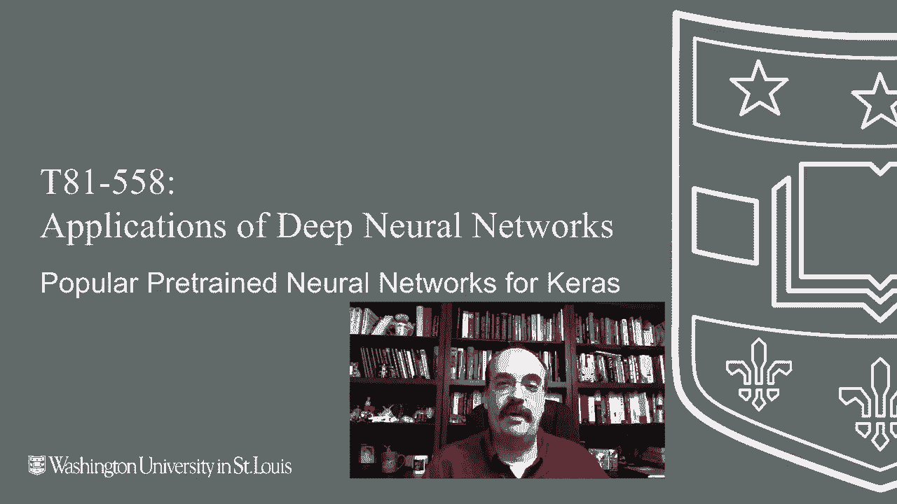
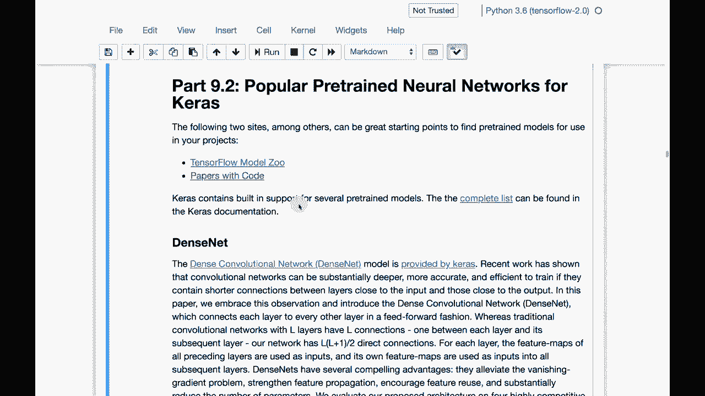
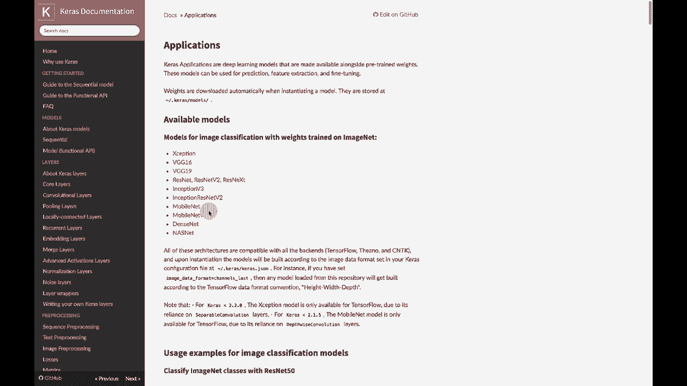
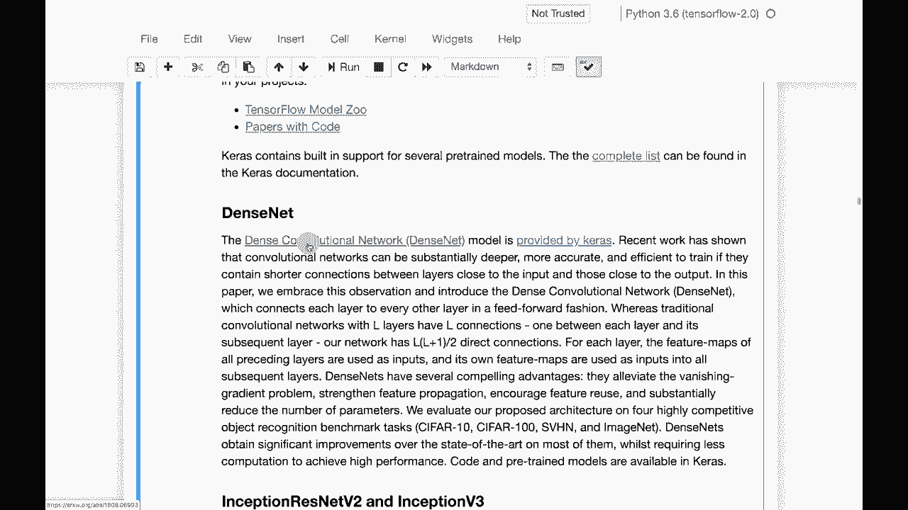
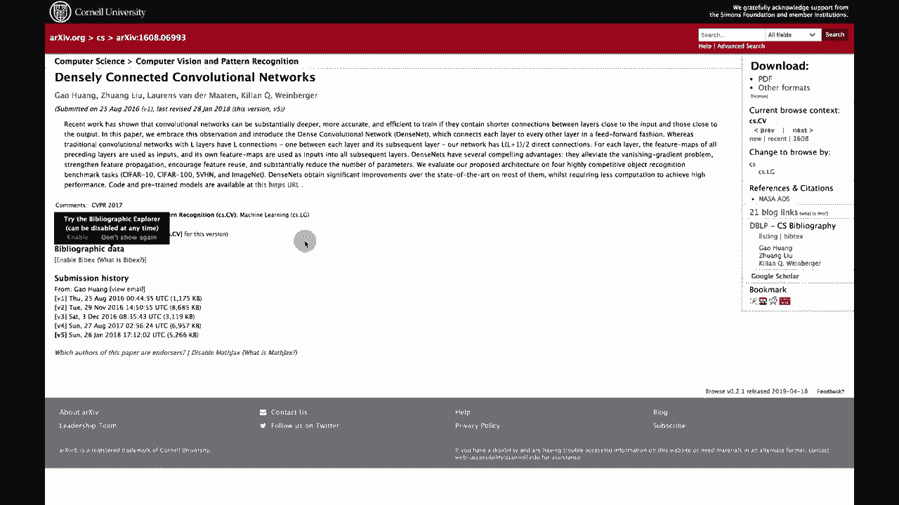
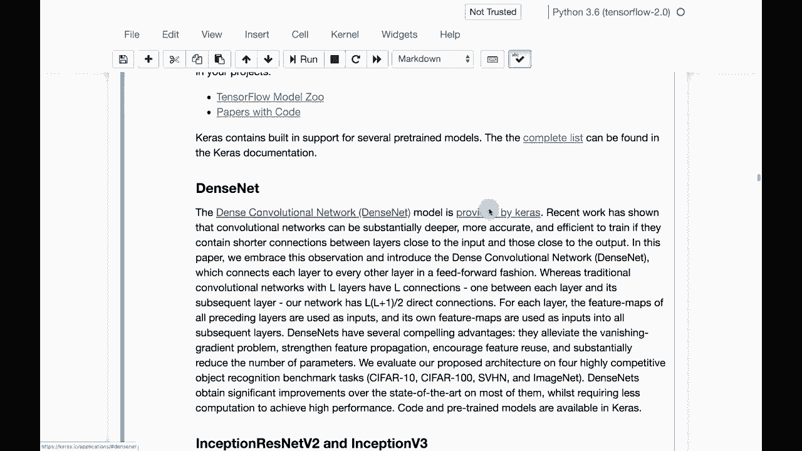
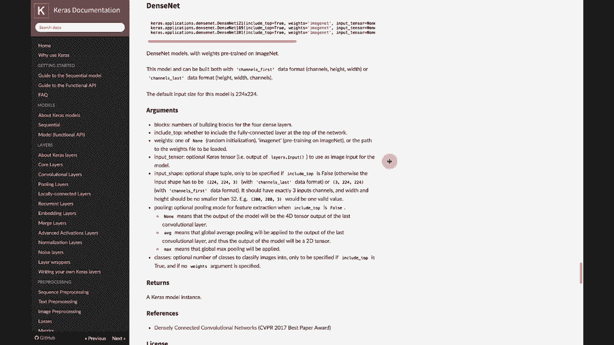
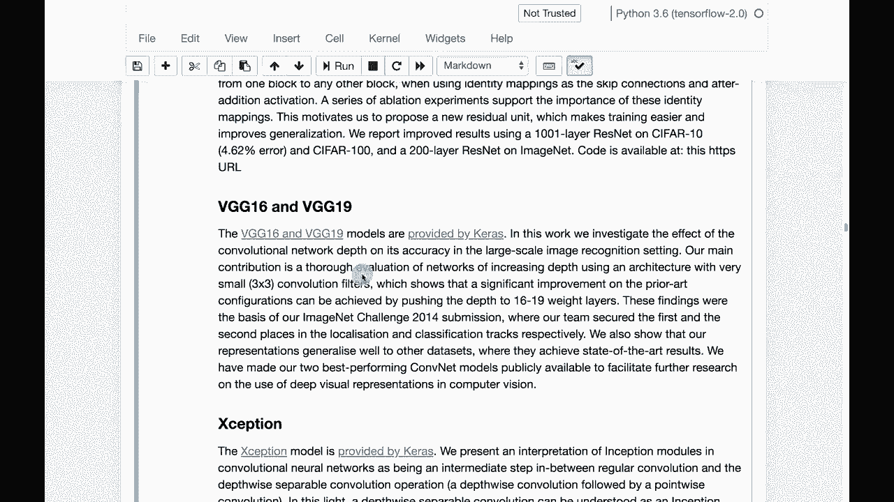

# T81-558 ｜ 深度神经网络应用 - P48：L9.2 - 流行的Keras预训练神经网络 🔍



在本节课中，我们将学习如何寻找和利用流行的预训练神经网络模型，特别是Keras内置的模型，以及如何通过外部资源获取更多模型。这是进行迁移学习的关键第一步。

## 概述

迁移学习允许我们将已有的知识融入新的神经网络。但首先，我们需要知道从哪里获取这些高质量的预训练模型。本节将介绍Keras内置的模型库以及两个重要的外部资源网站。

## Keras内置模型

Keras框架内置了许多可以直接加载和使用的预训练模型。这些模型由研究者开发，并在大型数据集上进行了训练，为我们提供了强大的基础。

以下是Keras中可用的一些主要预训练模型列表：

*   MobileNet
*   DenseNet
*   ResNet (多个版本)
*   VGG
*   NASNet
*   Inception V3

这些模型各有特点。例如，**MobileNet** 专为移动和嵌入式设备设计，计算需求相对较低。**ResNet** 通过残差连接解决了深层网络训练难题，能提供非常先进的特征识别能力。

**重要提示**：安装Keras时并不会自动下载这些模型的权重文件。当你首次在代码中调用某个模型（如 `tf.keras.applications.MobileNetV2`）时，系统会自动从云端下载对应的权重文件。

```python
# 示例：加载预训练的MobileNetV2模型
from tensorflow.keras.applications import MobileNetV2
model = MobileNetV2(weights='imagenet')
```





## 外部模型资源





除了Keras内置的模型，我们还可以从外部获取优秀的预训练模型。上一节我们介绍了Keras内置的资源，本节中我们来看看两个非常重要的外部网站。



以下是两个极具价值的资源网站：

1.  **TensorFlow Model Garden (TensorFlow模型库)**：这个网站提供了大量由TensorFlow团队和社区维护的先进模型，涵盖计算机视觉、自然语言处理等多个领域。你可以通过“星星”数量了解模型的受欢迎程度。
2.  **Papers With Code**：这个网站收集了众多人工智能学术论文及其对应的开源代码。当研究者发表一篇新论文时，他们或社区成员常会在此发布实现代码，是寻找前沿模型和技术的绝佳场所。

## 模型选择与应用



面对众多选择，如何为你的项目挑选合适的模型呢？通常，你需要根据任务需求（如精度、速度、设备限制）来权衡。例如，对于移动端应用，MobileNet是理想选择；而对于追求最高精度的服务器端应用，可能需要考虑更复杂的模型如ResNet或EfficientNet。

许多顶尖模型，如YOLO（用于目标检测）和StyleGAN（用于图像生成），最初并非来自Keras，但我们可以将其“迁移”到自己的项目中。这些模型通常已经过充分优化，直接使用或在其基础上进行微调（Fine-tuning）是常见的做法。

## 总结



本节课我们一起学习了如何为迁移学习寻找预训练神经网络。我们介绍了Keras内置的模型库，探索了TensorFlow Model Garden和Papers With Code这两个外部宝藏网站，并讨论了根据应用场景选择合适模型的基本思路。掌握这些资源，你就拥有了利用现有强大模型解决新问题的钥匙。

在下一个视频中，我们将动手实践，利用这些优秀的预训练模型来构建我们自己的应用。