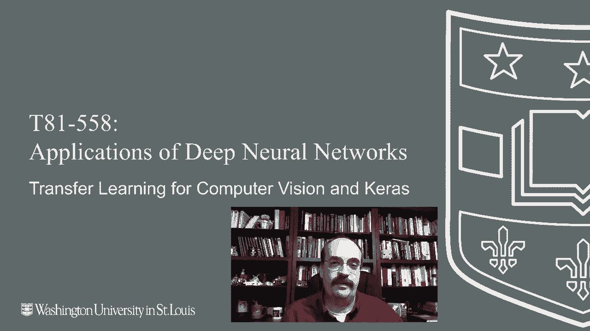
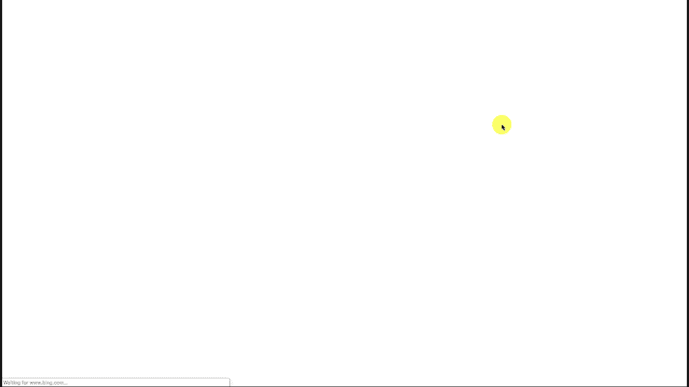
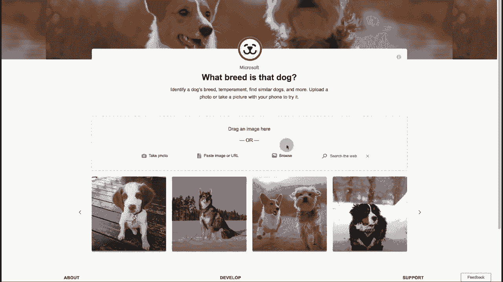
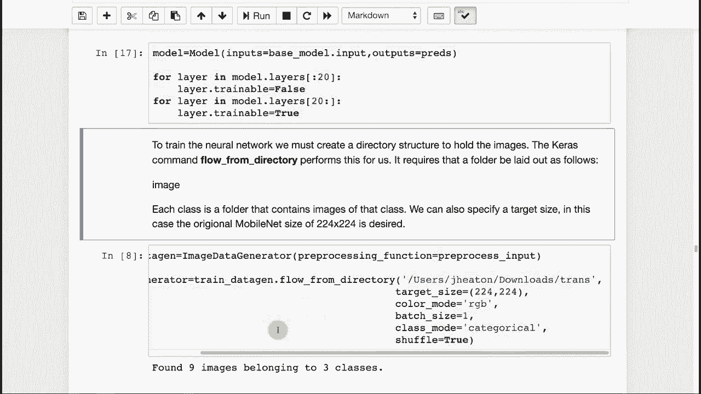
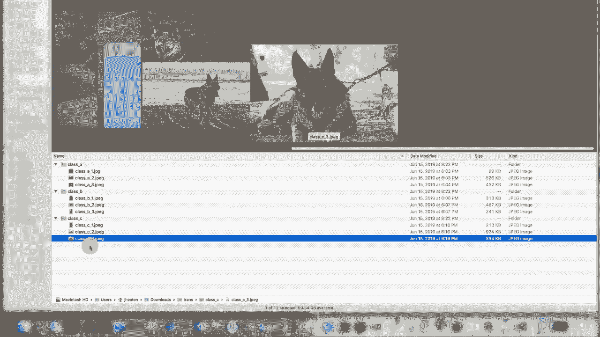
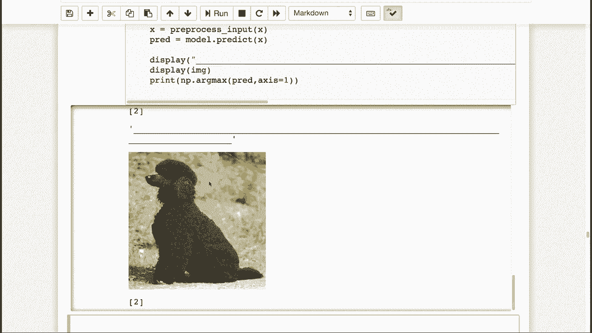

# T81-558 ｜ 深度神经网络应用 - P49：L9.3 - 计算机视觉和Keras的迁移学习 🧠➡️🚗

## 概述

在本节课中，我们将学习迁移学习的概念，并实践如何将一个为通用计算机视觉任务（如ImageNet）预训练的神经网络（MobileNet）迁移到特定的汽车领域应用。我们将通过Keras实现一个简单的迁移学习模型，用于识别不同的图像类别，并尝试扩展其能力以识别几种不同的犬种。



---

## 加载与运行预训练模型

上一节我们介绍了迁移学习的基本概念。本节中，我们来看看如何加载并运行一个预训练的MobileNet模型。





首先，我们需要导入必要的库并加载预训练的MobileNet模型及其在ImageNet数据集上训练好的权重。

```python
from tensorflow.keras.applications import MobileNet
from tensorflow.keras.applications.mobilenet import preprocess_input, decode_predictions
from tensorflow.keras.preprocessing import image
import numpy as np
import matplotlib.pyplot as plt
import requests
from io import BytesIO
from PIL import Image

# 加载MobileNet模型，包含顶部的全连接层（用于1000类ImageNet分类）
model = MobileNet(weights='imagenet')
```

执行此代码时，如果是首次运行，系统会下载MobileNet模型。加载完成后，我们可以查看模型结构摘要，了解其层数、滤波器数量等信息。这个模型使用了批量归一化等技术，其顶层是用于分类1000种不同图像的全连接层。

接下来，我们使用一些从网络获取的图像来测试模型的分类效果。

以下是测试步骤：
1.  从URL加载图像。
2.  将图像调整为模型要求的尺寸（224x224）。
3.  将图像转换为数组并进行预处理。
4.  使用模型进行预测并解码结果。

测试表明，模型对常见物体（如足球、皮卡车）的分类非常准确。然而，对于一些特定或模糊的图像（如特定犬种的特写），模型的分类可能不准确，这引出了我们进行迁移学习的必要性。

---

## 实施迁移学习

上一节我们成功运行了预训练模型。本节中，我们将实施迁移学习，对模型进行微调，使其适应新的分类任务（例如识别特定犬种）。

首先，我们重新加载MobileNet模型，但这次移除其顶部的分类层（`include_top=False`），只保留用于特征提取的卷积基。

```python
# 加载MobileNet的卷积基，不包含顶部分类层
base_model = MobileNet(weights='imagenet', include_top=False, input_shape=(224, 224, 3))
# 将卷积基的参数设置为不可训练（冻结）
base_model.trainable = False
```

然后，我们在冻结的卷积基之上，添加新的可训练层，以构建我们的新模型。

```python
from tensorflow.keras import layers, models

# 在卷积基上添加新的分类层
x = layers.GlobalAveragePooling2D()(base_model.output)
x = layers.Dense(1024, activation='relu')(x)
x = layers.Dense(1024, activation='relu')(x)
# 假设我们有3个新类别（例如3种犬种）
predictions = layers.Dense(3, activation='softmax')(x)

# 构建新模型
model = models.Model(inputs=base_model.input, outputs=predictions)
```

为了训练这个新模型，我们需要准备按类别组织的图像数据。Keras提供了便捷的`ImageDataGenerator`和`flow_from_directory`方法。

以下是数据准备的关键点：
*   创建一个主目录（例如`transfer_learning_data`）。
*   在主目录下为每个类别创建一个子文件夹（例如`class_a`, `class_b`, `class_c`）。
*   将对应类别的图像放入各自的文件夹中，图像格式可以是JPEG或PNG。

```python
from tensorflow.keras.preprocessing.image import ImageDataGenerator

train_datagen = ImageDataGenerator(preprocessing_function=preprocess_input)



train_generator = train_datagen.flow_from_directory(
    'path/to/your/transfer_learning_data',  # 替换为你的数据目录路径
    target_size=(224, 224),
    batch_size=32,
    class_mode='categorical'
)
```



数据准备就绪后，我们就可以编译并训练模型了。由于卷积基被冻结，训练将只更新我们新添加的层，速度较快。

```python
model.compile(optimizer='adam', loss='categorical_crossentropy', metrics=['accuracy'])

history = model.fit(
    train_generator,
    steps_per_epoch=len(train_generator),
    epochs=5  # 可根据需要调整轮数
)
```

训练完成后，我们可以使用新的模型对图像进行分类。实践表明，由于本例中每个类别的训练图像数量较少，模型性能可能有限。要获得更好的效果，需要为每个类别收集更多（例如50-100张）图像。

---

## 总结



本节课中我们一起学习了迁移学习的完整流程。
我们首先加载并测试了预训练的MobileNet模型。
接着，我们通过冻结其卷积基并添加新的可训练层，将该模型迁移到一个新的图像分类任务上。
最后，我们使用按类别组织的文件夹结构来准备数据、训练模型并进行预测。
记住，成功迁移学习的关键在于拥有足够多且高质量的新任务数据。通过这种方法，我们可以利用在大规模数据集上预训练的强大模型，快速为特定应用构建有效的解决方案。