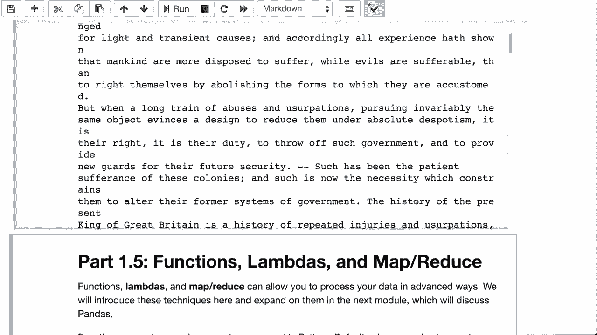

# T81-558 ｜ 深度神经网络应用 - P5：L1.4 - 深度学习的 Python 文件处理 📁

在本节课中，我们将学习如何在 Python 中处理文件。这是为后续在 Keras 和 TensorFlow 中进行更复杂的深度学习操作做准备。我们将重点介绍如何处理文本文件和图像文件，因为它们是本课程中主要处理的文件类型。

## 课程中处理的文件类型

在深度神经网络课程中，我们主要处理三种类型的文件：CSV 文件、图像文件和文本文件。

*   **CSV 文件**：通常带有 `.csv` 扩展名，可以将其理解为类似 Microsoft Excel 表格的数据文件。在大多数计算机上，双击 CSV 文件会使用 Excel 打开。
*   **图像文件**：主要是 PNG、JPEG 或 GIF 格式。图像是神经网络特别擅长处理的内容，本课程中将频繁使用。
*   **文本文件**：通常带有 `.txt` 扩展名，包含原始文本数据，常与自然语言处理任务相关。

此外，我们也会简要接触其他类型的文件，如 JSON 和 H5。


## 文件来源

这些文件主要来自三个位置：你的本地硬盘、网络 URL 以及云端环境（如 Google Colab）。

*   **Windows 路径示例**：`C:\Users\YourName\Documents\file.csv`
*   **Mac/Linux 路径示例**：`/Users/YourName/Documents/file.csv`
*   **Google Colab**：路径风格类似于 Mac，但通常需要挂载 Google Drive 或直接从网络读取。

对于本课程，许多 CSV 文件将直接从网络地址（如 `data.heatonresearch.com`）加载，以确保在不同平台上都能顺利运行。

## 读取 CSV 文件

CSV 文件可以使用 pandas 库方便地读取。pandas 将在后续课程中大量使用。

以下是直接从网络加载经典数据集“Fisher‘s Iris Dataset”的示例：

```python
import pandas as pd

df = pd.read_csv("https://data.heatonresearch.com/data/t81-558/iris.csv")
print(df.head())
```

这段代码会加载鸢尾花数据集，并显示前五条记录。该数据集包含花朵的四个测量值及其对应的物种，是一个经典的分类问题数据集。

## 读取图像文件

读取图像文件需要使用 PIL（Python Imaging Library）库。其操作方式与读取其他文件类似。

以下是从 URL 加载一张 JPEG 图像的示例：

```python
from PIL import Image
import requests
from io import BytesIO

response = requests.get("https://.../image.jpg") # 替换为实际图片URL
img = Image.open(BytesIO(response.content))
img.show()
```

在后续的练习中，我们将会处理大量图像。如果你使用 Google Colab，通常需要将图像文件上传到你的 Google Drive 的特定文件夹中，然后进行挂载和访问。利用 Google Colab 的 GPU 资源对于图像处理任务非常必要。

## 流式处理大型 CSV 文件

对于非常大的 CSV 文件，一次性加载到内存可能效率低下。此时可以采用流式处理的方式，逐行读取并处理数据。

以下是一个流式处理鸢尾花数据集并计算四个特征值平均数的示例：

```python
import numpy as np

sum_array = np.array([0.0, 0.0, 0.0, 0.0])
count = 0

with open('iris.csv', 'r') as file:
    for line in file:
        parts = line.strip().split(',')
        if len(parts) >= 5:  # 确保行有足够的数据
            try:
                # 提取前四个数值特征（忽略物种列）
                values = np.array(parts[0:4], dtype=float)
                sum_array += values  # 向量加法
                count += 1
            except ValueError:
                continue  # 跳过无法转换为数字的行

if count > 0:
    average_array = sum_array / count  # 向量除法
    print("平均值:", average_array)
```

这段代码逐行读取文件，将每行的前四个值转换为 NumPy 数组并进行累加，最后通过除以总行数得到平均值。**向量化运算**（如 `sum_array += values`）是深度学习中的高效操作，因为它允许对整个数组（或张量）执行数学运算。

## 读取文本文件

读取纯文本文件相对直接。以下是从 URL 读取《美国独立宣言》文本的示例：

```python
import requests

response = requests.get("https://.../declaration.txt") # 替换为实际文本URL
text = response.text
print(text[:500])  # 打印前500个字符
```

这段代码会获取指定 URL 的文本内容并将其打印出来。

## 总结

本节课我们一起学习了 Python 中的基础文件处理操作，为深度学习中的数据准备打下了基础。我们介绍了三种主要文件类型（CSV、图像、文本）的读取方法，了解了文件的不同来源，并演示了如何使用 pandas 读取 CSV、使用 PIL 读取图像、以及如何流式处理大型文件以避免内存问题。掌握这些技能对于高效加载和处理训练数据至关重要。



在下一个视频中，我们将探讨 Python 的函数式编程特性，如 Lambda 表达式和 `map`/`reduce`，这些工具在数据预处理中也非常有用。