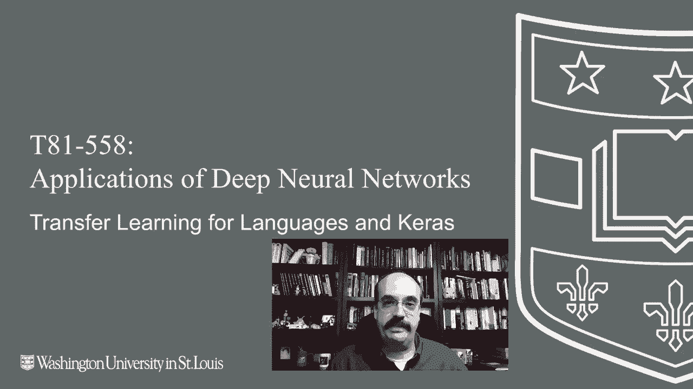
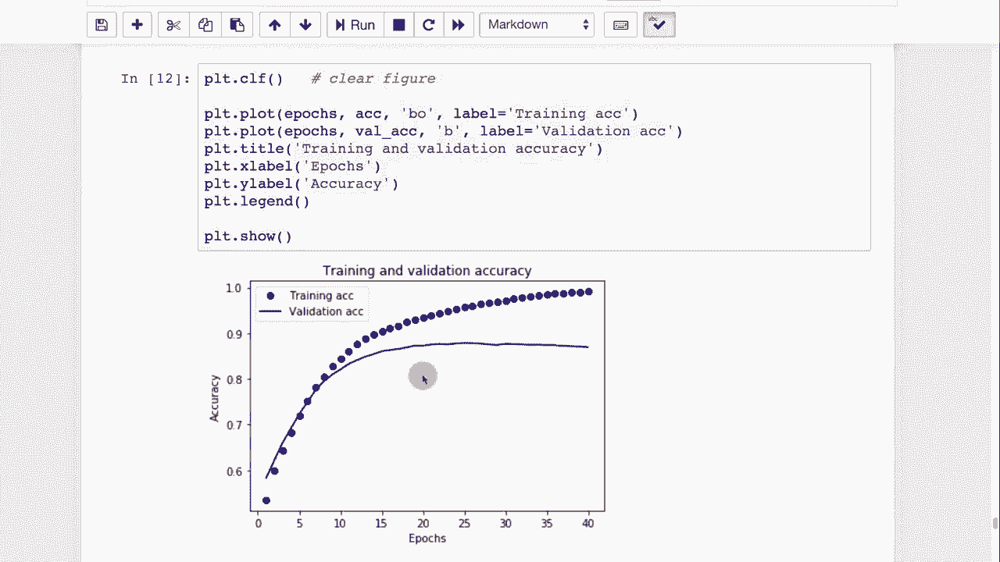

# T81-558 ｜ 深度神经网络应用 - P50：L9.4 - 自然语言处理和Keras的迁移学习 🧠📚

在本节课中，我们将学习如何将迁移学习应用于自然语言处理任务。具体来说，我们将了解如何使用预训练的文本嵌入层，并将其集成到Keras神经网络中，以完成一个情感分析项目——预测电影评论的情感倾向。

---

## 概述

迁移学习不仅适用于计算机视觉，在自然语言处理领域同样应用广泛。本节课将简要介绍NLP中的迁移学习核心概念：**文本嵌入层**。我们将通过一个实战示例，展示如何加载预训练的嵌入模型，处理原始文本数据，并构建一个神经网络来分类IMDb电影评论的情感。

---

## 什么是文本嵌入层？🔤



上一节我们介绍了迁移学习的通用概念，本节中我们来看看它在自然语言处理中的具体应用。

在NLP中使用迁移学习时，通常是在神经网络中添加一个**嵌入层**。该层的作用是将原始文本（例如句子）编码成固定长度的数值向量，以便输入到后续的神经网络层中进行处理。

**公式/代码描述：**
`嵌入层(原始文本) -> 数值向量`

原始句子的单词数量是可变的，而神经网络需要固定维度的输入。嵌入层解决了这个问题，它生成的向量可以被神经网络有效地预测和处理。

---

## 实战：IMDb电影评论情感分析 🎬

现在，让我们通过一个具体的例子来实践。我们将使用TensorFlow Hub提供的预训练嵌入模型，对互联网电影数据库的评论进行情感分析，判断其是正面还是负面。

### 环境与数据准备

以下是开始本项目所需的准备工作：

1.  **安装必要的库**：需要安装 `tensorflow-hub` 和 `tensorflow-datasets`。
    ```python
    !pip install tensorflow-hub
    !pip install tensorflow-datasets
    ```
    （注意：在如Google Colab这样的环境中，每次重启后都需要重新运行安装命令。）

2.  **加载数据集**：我们将使用IMDb电影评论数据集。该数据集包含多条电影评论，每条评论都有对应的情感标签（正面或负面）。
    ```python
    import tensorflow_datasets as tfds
    # 加载IMDb评论数据集
    ```

### 使用预训练嵌入模型

接下来，我们将引入迁移学习的核心——预训练的文本嵌入模型。

我们将使用一个名为 **`google/tf2-preview/gnews-swivel-20dim`** 的模型。这是一个相对轻量级的嵌入编码器，将每个单词或句子映射为一个20维的向量。

**代码描述：加载嵌入层**
```python
import tensorflow_hub as hub
embed = hub.load("https://tfhub.dev/google/tf2-preview/gnews-swivel-20dim/1")
```

加载此层后，我们就可以将原始评论文本转换为向量。例如，查看前三条评论的向量表示：
```python
# 原始文本示例
# 1. "This film was just brilliant..."
# 2. "Absolutely fantastic..."
# 3. "A waste of time..."

# 转换为向量后（示例，非真实值）
# 向量1: [0.12, -0.45, ..., 0.78] # 20个数字
# 向量2: [0.09, -0.41, ..., 0.81]
# 向量3: [-0.33, 0.67, ..., -0.12]
```
现在，非结构化的文本数据变成了结构化的数值向量，这极大简化了神经网络的处理过程。向量之间的几何距离（如余弦距离）通常能反映文本语义的相似度。

### 构建与训练神经网络

有了处理好的向量数据，我们就可以构建分类模型了。

以下是构建神经网络的步骤：

1.  **模型结构**：在Keras Sequential模型中，我们首先添加从TensorFlow Hub迁移过来的嵌入层（`hub.KerasLayer`），然后添加一个全连接层，最后使用Sigmoid激活函数输出一个概率值（0到1之间），代表评论为正面的可能性。
    ```python
    model = tf.keras.Sequential([
        hub.KerasLayer(embed, input_shape=[], dtype=tf.string, trainable=True),
        tf.keras.layers.Dense(16, activation='relu'),
        tf.keras.layers.Dense(1, activation='sigmoid')
    ])
    ```

2.  **编译模型**：这是一个二分类问题，因此我们使用二元交叉熵作为损失函数，并选择Adam优化器。
    ```python
    model.compile(optimizer='adam',
                  loss='binary_crossentropy',
                  metrics=['accuracy'])
    ```

3.  **训练模型**：我们将数据分为训练集和测试集，使用较大的批量大小进行训练，并保存训练历史以便分析。
    ```python
    history = model.fit(train_data.shuffle(10000).batch(512),
                        epochs=20,
                        validation_data=test_data.batch(512),
                        verbose=1)
    ```

### 评估与结果分析

训练完成后，我们可以在测试集上评估模型的性能。

```python
results = model.evaluate(test_data.batch(512), verbose=2)
print(f'测试损失：{results[0]}, 测试准确率：{results[1]}')
```
在这个示例中，模型达到了约 **85%** 的准确率。

通过绘制训练过程中的损失和准确率曲线，我们可以直观地看到模型的学习情况：
- **训练损失**持续下降。
- **验证损失**先下降后趋于平稳甚至上升。
- **验证准确率**同样先上升后平稳。

这清晰地展示了**过拟合**现象：模型在训练集上表现越来越好，但在未见过的验证集上性能停止提升。这正是实践中需要使用**早停法**等正则化技术的原因。

---

## 总结

本节课中我们一起学习了自然语言处理中的迁移学习。我们了解到：



1.  **文本嵌入层**是将可变长度文本转换为固定长度向量的关键工具。
2.  可以轻松利用 **TensorFlow Hub** 上的预训练嵌入模型（如 `gnews-swivel-20dim`）来快速获得文本的数值表示。
3.  将这些预训练层集成到Keras模型中，可以高效地构建文本分类器（如情感分析模型）。
4.  在训练过程中，监控训练集和验证集的性能差异对于识别和防止**过拟合**至关重要。

通过本教程，你掌握了将强大的预训练NLP模型迁移到自己项目中的基本流程，为处理更复杂的文本任务打下了基础。