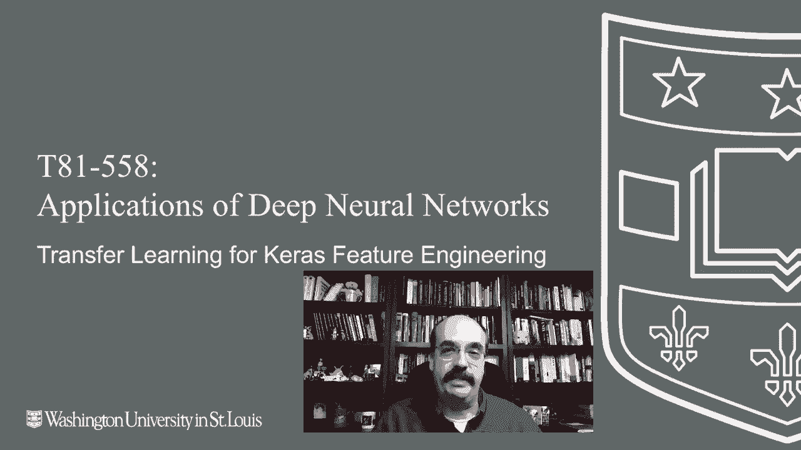
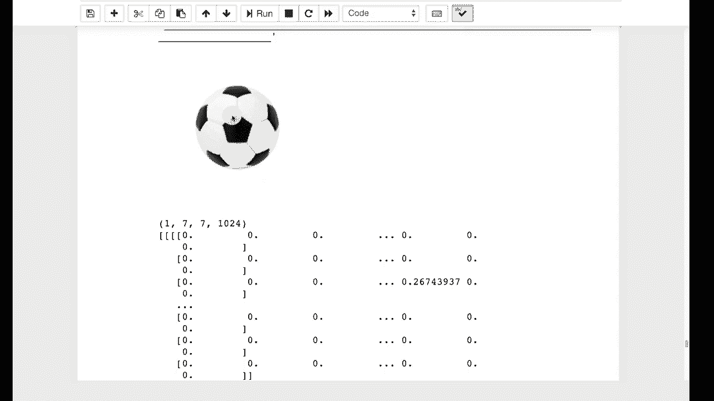

# T81-558 ｜ 深度神经网络应用 - P51：L9.5 - Keras特征工程的迁移学习 🧠➡️🔧

在本节课中，我们将学习如何利用预训练的深度神经网络进行特征工程。我们将看到如何移除网络的顶层，使用其底层学习到的特征表示，作为我们自定义模型的输入，从而处理包含图像和其他类型数据的复杂任务。

---

上一节我们介绍了迁移学习的基本概念，本节中我们来看看如何具体应用迁移学习进行特征工程。

迁移学习也可用于特征工程。例如，你需要对图像进行分类，但任务不仅仅是图像分类。假设你需要处理一个人的图像，同时还需要结合其他统计信息，比如年龄和性别。

以及其他信息，这样神经网络最终可能给出一个健康评估。以人寿保险行业为例，这就是我日常工作的内容。在这里，我们将简要了解如何移除你通常用于迁移学习的神经网络的顶层，并使用其下面的部分进行特征工程。

我将继续运行这段介绍性代码。这段代码与之前类似，我正在加载一张足球的图像。我显示这张足球图像，并且保留神经网络，但不包括其输出层。

这类似于我们准备进行迁移学习的步骤。不同之处在于，我将继续显示模型的结构摘要。如果我运行这段代码，现在可以看到，对于一张224x224的输入图像，经过所有层处理后，网络最终输出的不是一个包含1000个类别的分类结果（这是此类神经网络原本的图像分类类别），而是其训练好的最后一层，恰好是一个1024维的向量。

所以，你基本上可以看到这里就是那个1024维的向量。它相对稀疏，这有点意思。这些基本上是最后的全连接层学习到的、用于识别和分类的特征类型。

你可以简单地提取这些特征，作为你工程化特征的一部分，构成你的特征向量。因此，对于任何你分类的图像，你都会得到1024个值。网络并不是将其直接分类为“足球”，而是分类为所有这些独立的特征，这些特征是全连接层用来判断“这是一个足球”的依据。

因此，你得到的是由卷积神经网络为你生成的、经过原始特征工程处理的输入。这可以作为编码图像的一种方式。或者，就像我们在最后一部分看到的那样，你可以做类似的事情，使用嵌入层来编码自然语言处理中的字符串值。

---

本节课中我们一起学习了如何利用Keras和预训练模型进行特征工程。我们了解了如何移除分类顶层，提取出深度、抽象的特征表示（例如一个1024维的向量），并将这些特征作为新模型的输入，以处理更复杂的、多模态的数据任务。这是一种强大的技术，可以充分利用在大数据集上预训练模型的知识。

感谢观看这个视频。在接下来的模块中，我们将开始研究时间序列分析。这个领域的内容经常更新，因此请订阅频道，以便及时了解本课程及其他人工智能主题的最新动态。😊