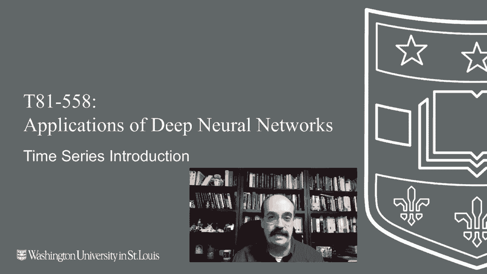
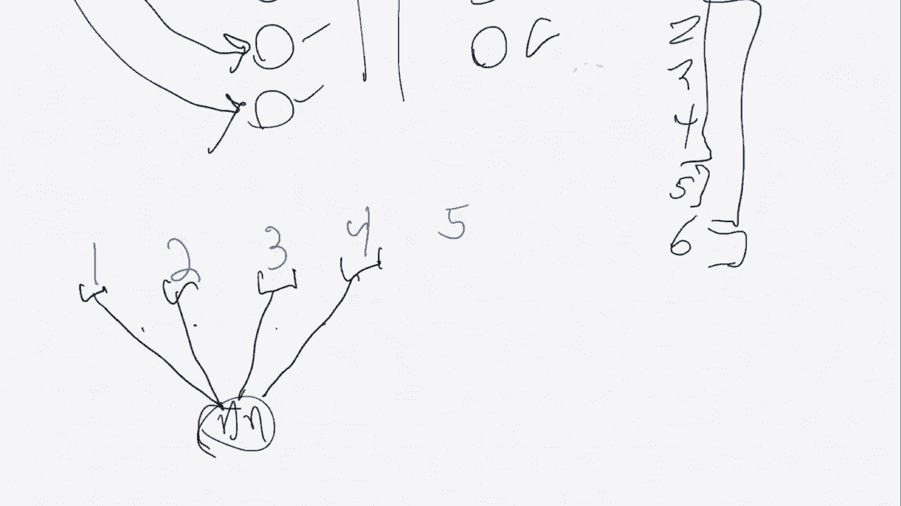
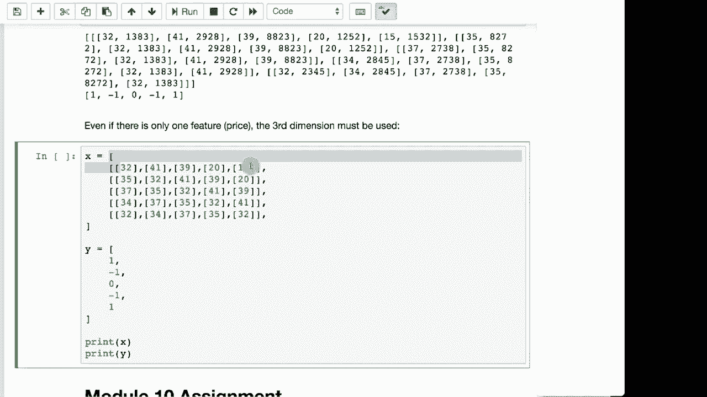

# T81-558 ｜ 深度神经网络应用-P52：L10.1- 深度学习、TensorFlow和Keras的时间序列数据编码 📊

在本节课中，我们将学习如何为深度学习模型（特别是LSTM和时序卷积神经网络）准备和编码时间序列数据。理解数据格式是构建有效预测模型的第一步。



---

## 时间序列与表格数据的区别

上一节我们介绍了典型的表格数据。本节中我们来看看时间序列数据有何不同。

考虑一个经典的表格数据集，例如汽车数据集。每一行代表一辆独立的汽车，包含多个特征（如加速度、每加仑英里数、重量）和一个目标（如汽车品牌）。一个传统的全连接神经网络会为每个特征设置一个输入神经元，直接预测目标。

然而，时间序列数据关注的是**顺序**。例如，我们不再预测单辆车的品牌，而是根据一个汽车经销商**连续售出的多辆汽车**的序列，来预测**下一辆**可能售出的车型。这就引入了“序列”的概念。

---

## 序列与滑动窗口

在引入LSTM等高级模型之前，处理时间序列的传统方法是使用**滑动窗口**。

以下是滑动窗口的工作原理：
*   假设你销售了汽车1、2、3、4、5。
*   设置一个大小为4的窗口。
*   第一个窗口包含汽车[1, 2, 3, 4]，用于预测下一个目标：汽车5。
*   然后窗口滑动一步，第二个窗口包含汽车[2, 3, 4, 5]，用于预测汽车6，依此类推。

在这种方法中，**序列中的每个元素本身可能是一个包含多个特征（如加速度、重量等）的向量**。随着序列长度增加，输入神经元的数量也会线性增加，这在大序列上会带来计算复杂度的挑战。

---

## 递归神经网络（RNN/LSTM）的处理方式

上一节我们看到了传统方法的局限。本节中我们来看看LSTM这类递归神经网络如何以不同方式处理序列。

LSTM的关键在于**保持内部状态**。你不需要为序列的每个时间步添加新的输入神经元。相反，你有一个固定数量的输入神经元（对应每个时间步的特征数量）。

以下是处理流程：
1.  你将序列的第一个时间步（例如，第一辆车的特征向量）输入网络，网络产生一个输出并更新其内部状态。
2.  接着，你将第二个时间步输入**同一个网络**，此时网络的预测会受到第一步状态的影响。
3.  重复此过程，直到处理完整个序列（例如，连续售出的五辆车），最终基于累积的序列信息做出预测。

**核心公式/概念**：神经网络的输出不仅取决于当前输入 `X_t`，还取决于之前的隐藏状态 `h_{t-1}`。
`h_t = f(W * X_t + U * h_{t-1} + b)`
其中 `f` 是激活函数，`W` 和 `U` 是权重矩阵，`b` 是偏置。

这种机制使得LSTM能够捕捉时间上的依赖关系。需要注意的是，神经网络的内部状态通常在**每个独立序列的开始和结束时重置**。

---

## 时间序列数据的张量形状



理解了LSTM的原理后，我们需要知道如何在实际代码中组织数据。时间序列数据在深度学习中通常表示为三维张量。

以下是三维张量的三个轴及其含义：
1.  **样本轴（Samples）**：数据集中独立序列的数量。例如，你有1000个不同的股票历史片段。
2.  **时间步轴（Time Steps）**：每个序列的长度。例如，你选择用过去50天的数据来预测下一天。
3.  **特征轴（Features）**：每个时间步观测到的变量数量。例如，每天你可能记录股价和交易量两个特征。

**代码表示**：一个形状为 `(1000, 50, 2)` 的张量，表示有1000个序列，每个序列有50个时间步，每个时间步有2个特征。

这与二维表格数据 `(行, 列)` 有本质区别。即使你只有一个特征（如股价），也需要将其表示为三维形状 `(样本数, 时间步长, 1)`。

---

## 一个具体的编码示例

让我们通过一个简单的股票预测例子，将上述概念具体化。

假设我们有一系列股价：`[32, 41, 32, 20, 15]`，我们想基于过去3天的价格，预测操作是买入(1)、卖出(-1)还是持有(0)。

如果我们设置序列大小（时间步长）为3，并只有一个特征（价格），那么我们需要构建以下数据：

**输入数据 X (三维)**：
*   样本1（时间步1-3）：`[[32], [41], [32]]` -> 对应目标：`20` 的操作（假设为卖出 `-1`）
*   样本2（时间步2-4）：`[[41], [32], [20]]` -> 对应目标：`15` 的操作

**代码示意**：
```python
import numpy as np
# 原始数据
prices = [32, 41, 32, 20, 15]
sequence_length = 3

# 构建X和y
X = []
y = []
for i in range(len(prices) - sequence_length):
    X.append(prices[i:i+sequence_length]) # 获取一个序列窗口
    y.append(prices[i+sequence_length])   # 获取下一个值作为目标

# 转换为NumPy数组并调整形状为 (样本数, 时间步长, 特征数)
X = np.array(X).reshape(-1, sequence_length, 1)
y = np.array(y)
print("X shape:", X.shape) # 例如 (2, 3, 1)
print("y shape:", y.shape) # 例如 (2,)
```

如果增加一个特征（如交易量），那么每个时间步就变成一个包含`[价格， 交易量]`的向量，最终X的形状会变成 `(样本数, 3, 2)`。

---

## 总结

本节课中我们一起学习了时间序列数据在深度学习中的编码方式。
*   我们比较了时间序列与表格数据的根本区别，即对**顺序**的依赖。
*   我们解释了**滑动窗口**的传统方法及其局限性。
*   我们探讨了**LSTM等递归神经网络**如何通过保持内部状态来处理变长序列，而无需增加输入维度。
*   我们明确了用于时间序列深度学习的数据标准格式是**三维张量**，其维度分别代表**样本、时间步和特征**。
*   最后，我们通过一个简单的代码示例演示了如何将一维序列数据转换为模型可用的三维格式。



正确理解和编码数据是构建任何成功的时间序列预测模型的基石。在接下来的课程中，我们将利用这种数据格式来实际训练LSTM模型。